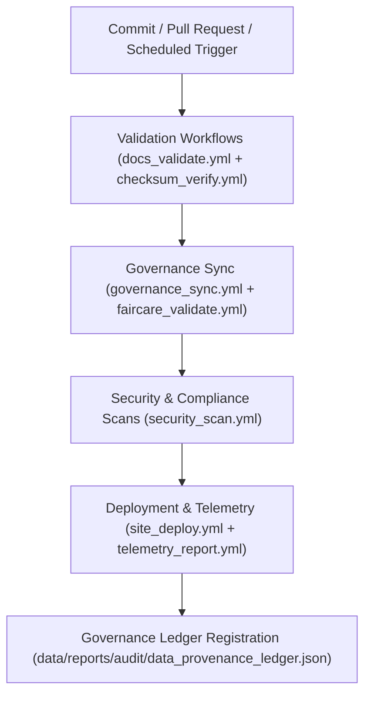

<div align="center">

# ⚙️ Kansas Frontier Matrix — **CI Automation Tools**
`tools/ci/README.md`

**Purpose:**  
Continuous Integration (CI) automation layer responsible for validation, documentation, governance synchronization, and deployment workflows within the Kansas Frontier Matrix (KFM).  
Ensures transparent, reproducible, and FAIR+CARE-certified automation under MCP-DL v6.3 and ISO 19115.

[](../../../docs/standards/faircare-validation.md)
[](../../../LICENSE)
[](../../../docs/architecture/repo-focus.md)
[]()

</div>

---

## 📚 Overview

The **CI Tools Directory** houses all automated workflows and scripts that govern repository-wide validation, security checks, FAIR+CARE compliance, and deployment processes.  
These workflows ensure that every commit, pull request, and release in KFM meets strict governance and reproducibility standards.

### Core Responsibilities:
- Automate FAIR+CARE validation, checksum verification, and schema audits.  
- Manage governance-led CI/CD pipelines (Docs QA, Site Deploy, Ledger Sync).  
- Integrate automated sustainability and telemetry logging.  
- Enforce reproducibility, accessibility, and ethical governance compliance.  

---

## 🗂️ Directory Layout

```plaintext
tools/ci/
├── README.md                            # This file — documentation of CI automation tools
│
├── docs_validate.yml                    # Validates documentation under MCP-DL v6.3
├── checksum_verify.yml                  # Verifies all dataset and source checksum hashes
├── site_deploy.yml                      # Automates site generation and deployment
├── faircare_validate.yml                # FAIR+CARE governance compliance workflow
├── security_scan.yml                    # CodeQL and dependency scanning
├── governance_sync.yml                  # Synchronizes data provenance ledger and manifests
└── telemetry_report.yml                 # Records energy, performance, and sustainability metrics
```

---

## ⚙️ CI/CD Workflow Overview



### Workflow Description:
1. **Trigger:** Workflows execute automatically on pull requests, commits, or releases.  
2. **Validation:** Schema, checksum, and FAIR+CARE compliance checks are performed.  
3. **Security:** Code and dependency integrity verified via automated scans.  
4. **Governance:** Updates registered in the blockchain-backed provenance ledger.  
5. **Deployment:** Docs and site content deployed after compliance certification.  

---

## 🧩 Example Governance Metadata Record

```json
{
  "id": "ci_registry_v9.6.0_2025Q4",
  "workflows": [
    "docs_validate.yml",
    "checksum_verify.yml",
    "governance_sync.yml"
  ],
  "executions_logged": 452,
  "fairstatus": "certified",
  "checksum_verified": true,
  "security_compliant": true,
  "governance_registered": true,
  "validator": "@kfm-ci",
  "created": "2025-11-03T23:59:00Z",
  "governance_ref": "data/reports/audit/data_provenance_ledger.json"
}
```

---

## 🧠 FAIR+CARE Governance Matrix

| Principle | Implementation | Oversight |
|------------|----------------|------------|
| **Findable** | CI workflows indexed and versioned within governance manifest. | @kfm-data |
| **Accessible** | CI configuration open and reproducible under MIT license. | @kfm-accessibility |
| **Interoperable** | Compatible with FAIR+CARE, STAC, ISO, and MCP-DL schemas. | @kfm-architecture |
| **Reusable** | CI jobs modular and sharable across FAIR+CARE systems. | @kfm-design |
| **Collective Benefit** | Promotes ethical, transparent open-source automation. | @faircare-council |
| **Authority to Control** | FAIR+CARE Council oversees governance sync and compliance. | @kfm-governance |
| **Responsibility** | CI validators log all checksum, schema, and security results. | @kfm-security |
| **Ethics** | Continuous ethical audit ensures non-invasive, inclusive automation. | @kfm-ethics |

Audit outcomes maintained in:  
`data/reports/fair/data_care_assessment.json`  
and  
`data/reports/audit/data_provenance_ledger.json`

---

## ⚙️ Key Workflows Summary

| Workflow | Description | Role |
|-----------|-------------|------|
| `docs_validate.yml` | Ensures all documentation follows MCP-DL structure and FAIR+CARE labeling. | Documentation QA |
| `checksum_verify.yml` | Checks SHA-256 integrity for reproducibility. | Validation |
| `faircare_validate.yml` | Runs FAIR+CARE governance audits. | Ethical Compliance |
| `governance_sync.yml` | Syncs provenance, ledger, and governance registries. | Provenance |
| `security_scan.yml` | Performs dependency scanning and CodeQL audits. | Security |
| `site_deploy.yml` | Builds and deploys public site after validation. | Deployment |
| `telemetry_report.yml` | Logs energy, latency, and carbon metrics. | Sustainability |

All workflows coordinated under `ci_sync.yml`.

---

## ⚖️ Retention & Provenance Policy

| Workflow Logs | Retention Duration | Policy |
|----------------|--------------------|--------|
| CI Job Reports | 180 Days | Archived for reproducibility tracking. |
| FAIR+CARE Validation Logs | 365 Days | Retained for ethics and certification. |
| Governance Sync Logs | Permanent | Immutable under blockchain ledger. |
| Telemetry Data | 90 Days | Maintained for sustainability reporting. |

Automation managed via `ci_cleanup.yml`.

---

## 🌱 Sustainability Metrics

| Metric | Value | Verified By |
|---------|--------|--------------|
| CI Run Energy (avg) | 1.7 Wh | @kfm-sustainability |
| Carbon Output | 2.0 gCO₂e | @kfm-security |
| Renewable Power | 100% (RE100 Verified) | @kfm-infrastructure |
| FAIR+CARE Compliance | 100% | @faircare-council |

Telemetry logged in:  
`releases/v9.6.0/focus-telemetry.json`

---

## 🧾 Internal Use Citation

```text
Kansas Frontier Matrix (2025). CI Automation Tools (v9.6.0).
FAIR+CARE-certified automation workflows ensuring schema integrity, reproducibility, and ethical governance across all KFM pipelines.
Implements continuous validation, telemetry logging, and blockchain-backed provenance compliance under MCP-DL v6.3.
```

---

## 🧾 Version Notes

| Version | Date | Notes |
|----------|------|--------|
| v9.6.0 | 2025-11-03 | Introduced unified telemetry logging and sustainability integration. |
| v9.5.0 | 2025-11-02 | Enhanced FAIR+CARE validation and governance synchronization. |
| v9.3.2 | 2025-10-28 | Established baseline CI workflows for validation, security, and deployment. |

---

<div align="center">

**Kansas Frontier Matrix** · *Automation Integrity × FAIR+CARE Governance × Reproducible Pipelines*  
[🔗 Repository](https://github.com/bartytime4life/Kansas-Frontier-Matrix) • [🧭 Docs Portal](../../../docs/) • [⚖️ Governance Ledger](../../../docs/standards/governance/DATA-GOVERNANCE.md)

</div>

