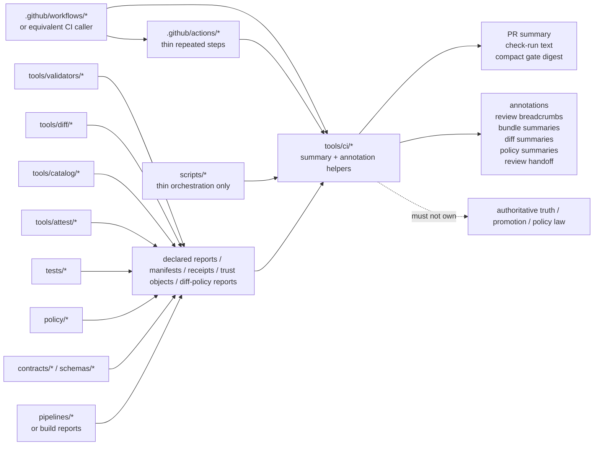

<!-- [KFM_META_BLOCK_V2]
doc_id: kfm://doc/NEEDS_VERIFICATION_UUID
title: ci
type: standard
version: v1
status: draft
owners: @bartytime4life
created: NEEDS_VERIFICATION_DATE
updated: 2026-04-16
policy_label: public
related: [../README.md, ../../README.md, ../../.github/README.md, ../../.github/CODEOWNERS, ../../.github/workflows/README.md, ../../.github/actions/README.md, ../../scripts/README.md, ../../contracts/README.md, ../../contracts/promotion_review_handoff.md, ../../schemas/README.md, ../../policy/README.md, ../../tests/README.md, ../../tests/ci/README.md, ../validators/promotion_gate/README.md, ../attest/README.md, ../diff/README.md, ../docs/README.md]
tags: [kfm, tools, ci, summaries, annotations, reviewer-output, promotion, diff, policy-summary, handoff]
notes: [Updated to reflect the documented renderer thin slice for promotion bundle, diff, bundle diff-policy, and composed promotion review handoff artifacts. doc_id, created date, narrower lane ownership, exact mounted-branch parity, and platform settings remain NEEDS VERIFICATION.]
[/KFM_META_BLOCK_V2] -->

<a id="top"></a>

# ci

Reusable CI-facing helpers for reviewer-readable summaries, annotations, and compact gate output over already-governed artifacts.


> [!IMPORTANT]
> **Status:** experimental  
> **Owners:** `@bartytime4life` *(surfaced documentation ties current ownership to broad `/tools/` coverage in `CODEOWNERS`; a narrower `/tools/ci/` rule remains **NEEDS VERIFICATION**)*  
> **Path:** `tools/ci/README.md`  
> **Repo fit:** child lane of [`../README.md`](../README.md); orchestration boundary in [`../../.github/workflows/README.md`](../../.github/workflows/README.md), [`../../.github/actions/README.md`](../../.github/actions/README.md), and [`../../scripts/README.md`](../../scripts/README.md); canonical law remains upstream in [`../../contracts/README.md`](../../contracts/README.md), [`../../schemas/README.md`](../../schemas/README.md), [`../../policy/README.md`](../../policy/README.md), and [`../../tests/README.md`](../../tests/README.md)  
> **Accepted inputs:** declared validator outputs, promotion bundles, stable diff reports, bundle diff-policy reports, attestation visibility surfaces, manifests, receipts, and other small machine-readable artifacts already produced upstream  
> **Exclusions:** policy authority, diff computation, signing or verification law, promotion decisions, workflow YAML, large orchestration scripts, and durable proof objects  
> **Quick jumps:** [Scope](#scope) · [Repo fit](#repo-fit) · [Inputs](#inputs) · [Exclusions](#exclusions) · [Current documented snapshot](#current-documented-snapshot) · [Directory tree](#directory-tree) · [Quickstart](#quickstart) · [Usage](#usage) · [Diagram](#diagram) · [Helper matrix](#helper-matrix) · [Definition of done](#definition-of-done) · [FAQ](#faq) · [Appendix](#appendix)

> [!NOTE]
> `tools/ci/` is the reusable helper boundary for **rendering** governed outputs, not the authority boundary for **deciding** them. If a change would redefine policy, promotion, diff, attestation, or release truth, it belongs upstream.

> [!TIP]
> **Current documented thin slice**
>
> Surfaced repo-facing documentation describes this lane as including:
>
> - `tools/ci/render_promotion_summary.py`
> - `tools/ci/render_promotion_bundle_summary.py`
> - `tools/ci/render_diff_summary.py`
> - `tools/ci/render_bundle_diff_policy_summary.py`
> - `tools/ci/render_promotion_review_handoff.py`
> - `tools/ci/render_json_io.py` (shared JSON input helper used by renderer entrypoints)
> - `tools/ci/verify_baseline.sh` (baseline repository inventory verifier used by `.github/workflows/verification-baseline.yml`)
> - `tools/ci/check_python_syntax.sh` (syntax gate for repository Python files; optional targeted mode via `tools/ci/python_syntax_targets.txt`)
> - `tools/ci/validate_policy_runtime_fixtures.py` (runtime policy fixture and finite-outcome smoke checks used by the baseline wrapper)
> - `tools/ci/validate_renderer_fixtures.py` (renderer fixture/schema contract checks used by the baseline wrapper)
> - `tools/ci/report_placeholder_markers.py` (placeholder marker count reporter for weekly scorecard observability)
>
> Surfaced proof surfaces for the same thin slice include:
>
> - `tests/ci/test_render_diff_summary.py`
> - `tests/ci/test_render_bundle_diff_policy_summary.py`
> - `tests/ci/test_render_promotion_summary.py`
> - `tests/ci/test_render_promotion_bundle_summary.py`
> - `tests/ci/test_render_promotion_review_handoff.py`
> - `tests/ci/test_render_missing_input_paths.py`
> - `tests/ci/test_render_json_io.py`
> - `tests/ci/test_validate_policy_runtime_fixtures.py`
> - `tests/ci/test_validate_renderer_fixtures.py`
> - `tests/ci/test_report_placeholder_markers.py`
> - `tools/ci/test_check_python_syntax.sh`
>
> Active-branch parity, additional callers, and platform wiring still need direct verification.

---

## Scope

`tools/ci/` is the KFM helper lane for turning already-produced machine artifacts into stable, reviewer-readable CI output.

Use this lane when the job is to:

- summarize validator, test, policy, docs, diff, or bundle output for a pull request or check run
- normalize noisy machine output into a compact, review-friendly shape
- emit annotations, Markdown summaries, or compact gate digests
- attach evidence, receipt, proof-pack, or artifact links to CI output
- render governed trust bundles into concise reviewer or auditor summaries
- compose several already-governed review artifacts into one steward-facing handoff document

Do **not** use this lane when the job is to:

- define canonical policy or contract law
- compute diff meaning
- classify policy meaning
- sign or verify trust objects
- mutate release state, promotion state, or authoritative data
- replace workflow orchestration with hidden shell logic
- hide business meaning inside “just CI glue”

### Truth labels used here

| Label | Meaning in this README |
| --- | --- |
| **CONFIRMED** | Supported by surfaced repo-facing documentation or attached KFM doctrine |
| **INFERRED** | Conservative reading of neighboring surfaces that is useful but not proven as current branch fact |
| **PROPOSED** | Recommended landing shape or future helper coverage consistent with KFM doctrine |
| **UNKNOWN** | Not verified strongly enough to present as current repo fact |
| **NEEDS VERIFICATION** | Placeholder detail that should be rechecked against the mounted branch or platform settings before merge |

[Back to top](#top)

---

## Repo fit

`tools/ci/` sits downstream of machine-significant lanes and upstream of human review. It should make the trust story easier to read without quietly becoming the trust story.

| Direction | Surface | Why it matters |
| --- | --- | --- |
| Parent lane | [`../README.md`](../README.md) | `tools/` is the umbrella for helper lanes with explicit boundaries. |
| Orchestration boundary | [`../../.github/workflows/README.md`](../../.github/workflows/README.md) | Job ordering, triggers, permissions, and artifact upload belong there. |
| Repeated step wrappers | [`../../.github/actions/README.md`](../../.github/actions/README.md) | Shared GitHub-specific step logic belongs there, not in helper internals. |
| Thin script seam | [`../../scripts/README.md`](../../scripts/README.md) | Shell entrypoints and one-off orchestration stay thin and explicit. |
| Diff authority | [`../diff/README.md`](../diff/README.md) | Diff computation and canonical drift logic stay upstream. |
| Promotion authority | [`../validators/promotion_gate/README.md`](../validators/promotion_gate/README.md) | Machine-readable promotion decisions and gate law stay upstream. |
| Attestation / verification | [`../attest/README.md`](../attest/README.md) | Signing and verification meaning belong outside this renderer lane. |
| Proof surfaces | [`../../tests/ci/README.md`](../../tests/ci/README.md) | The helper lane should remain paired with deterministic proof. |
| Contract boundary | [`../../contracts/promotion_review_handoff.md`](../../contracts/promotion_review_handoff.md) | The rendered handoff stays subordinate to its contract note and upstream machine artifacts. |

[Back to top](#top)

---

## Inputs

Use `tools/ci/` for small, declared inputs whose meaning already exists elsewhere.

| Input class | Examples | Why it belongs here |
| --- | --- | --- |
| Promotion decision context | `decision.json`, promotion verifier output | Helper can render review state without redefining decision law. |
| Governed bundle context | `promotion-bundle.json` | Helper can summarize bundle identity and artifact visibility. |
| Diff reports | `promotion-bundle-diff.json` | Helper can render reviewer-facing drift summaries without recomputing drift. |
| Diff-policy reports | `promotion-bundle-diff-policy.json` | Helper can render classified drift status without reinterpreting policy. |
| Attestation visibility | verify/sign result surfaces or bundle visibility fields | Helper can expose trust visibility inside reviewer output. |
| Compact manifests / receipts | report indexes, artifact manifests, link sets | Helper can improve navigability for reviewers. |
| Stable failures | malformed or incomplete report files | Helper can fail clearly instead of inventing a summary. |

---

## Exclusions

The fastest way to weaken this lane is to let it quietly absorb upstream authority.

| Does **not** belong here | Put it here instead |
| --- | --- |
| Diff computation | [`../diff/README.md`](../diff/README.md) |
| Policy classification or blocking law | [`../../policy/README.md`](../../policy/README.md) and [`../validators/promotion_gate/README.md`](../validators/promotion_gate/README.md) |
| Signing / verification authority | [`../attest/README.md`](../attest/README.md) |
| Workflow triggers, permissions, artifact upload steps | [`../../.github/workflows/README.md`](../../.github/workflows/README.md) |
| GitHub-only step wrappers | [`../../.github/actions/README.md`](../../.github/actions/README.md) |
| Release mutation or promotion state changes | validator / release lanes upstream |
| Canonical machine contracts and schemas | [`../../contracts/README.md`](../../contracts/README.md) and [`../../schemas/README.md`](../../schemas/README.md) |

---

## Current documented snapshot

This README intentionally distinguishes the **documented thin slice** from broader possible growth.

| Item | Status | Consequence for this README |
| --- | --- | --- |
| Older public-facing snapshots treated `tools/ci/` as a README-first lane | **CONFIRMED historical snapshot** | Preserve the lane contract and avoid pretending every family is already mounted. |
| The current documented thin slice includes promotion summary, bundle summary, diff summary, bundle diff-policy summary, and composed promotion review handoff renderers | **CONFIRMED** | The README documents these helpers as the current thin slice. |
| The adjacent proof lane explicitly documents `test_render_diff_summary.py`, `test_render_bundle_diff_policy_summary.py`, and `test_render_promotion_review_handoff.py` | **CONFIRMED** | Keep testing visible in quickstart, tree, and definition-of-done sections. |
| Additional helper families such as richer annotations, normalizers, and broader compaction helpers | **PROPOSED** | Show them as growth shape, not as mounted fact. |
| Exact workflow callers, runner wiring, platform-only annotation tests, and branch-protection settings | **UNKNOWN / NEEDS VERIFICATION** | Keep these claims bounded and do not imply enforcement depth not yet proven. |

[Back to top](#top)

---

## Directory tree

### Current documented lane shape

```text
tools/ci/
├── README.md
├── check_readme_paths.sh
├── readme_required_paths.txt
├── test_check_readme_paths.sh
├── verify_baseline.sh
├── test_verify_baseline.sh
├── check_python_syntax.sh
├── test_check_python_syntax.sh
├── python_syntax_targets.txt
├── validate_policy_runtime_fixtures.py
├── validate_renderer_fixtures.py
├── report_placeholder_markers.py
├── run_repo_baseline_local.sh
├── render_json_io.py
├── render_promotion_summary.py
├── render_promotion_bundle_summary.py
├── render_diff_summary.py
├── render_bundle_diff_policy_summary.py
└── render_promotion_review_handoff.py

tests/ci/
├── README.md
├── test_render_diff_summary.py
├── test_render_bundle_diff_policy_summary.py
├── test_render_json_io.py
├── test_render_promotion_summary.py
├── test_render_promotion_bundle_summary.py
├── test_render_promotion_review_handoff.py
├── test_render_missing_input_paths.py
├── test_validate_policy_runtime_fixtures.py
├── test_validate_renderer_fixtures.py
├── test_report_placeholder_markers.py
├── test_end_to_end_diff_summary.py
├── test_end_to_end_diff_policy_summary.py
├── test_end_to_end_promotion_summary.py
├── test_end_to_end_promotion_bundle_summary.py
├── test_end_to_end_review_handoff.py
├── fixtures/
└── golden/
```

> [!WARNING]
> The tree above is the **documented current thin slice**, not a substitute for rechecking the mounted branch before merge.

<details>
<summary><strong>Possible stable growth shape</strong> (<strong>PROPOSED</strong>)</summary>

```text
tools/ci/
├── README.md
├── render_promotion_summary.py
├── render_promotion_bundle_summary.py
├── render_diff_summary.py
├── render_bundle_diff_policy_summary.py
├── render_promotion_review_handoff.py
├── render_annotations.py
└── compact_gate_digest.py

tests/ci/
├── README.md
├── test_render_diff_summary.py
├── test_render_bundle_diff_policy_summary.py
├── test_render_promotion_review_handoff.py
├── test_render_promotion_summary.py
├── test_render_promotion_bundle_summary.py
├── fixtures/
│   ├── diff/
│   ├── diff_policy/
│   ├── review_handoff/
│   ├── promotion/
│   └── promotion_bundle/
└── golden/
    ├── diff/
    ├── diff_policy/
    ├── review_handoff/
    ├── promotion/
    └── promotion_bundle/
```

Keep the lane small. Add only the helpers and fixtures needed to prove a contract clearly.

</details>

---

## Quickstart

Recheck what is actually mounted before you extend the lane.

```bash
# Inspect the lane and adjacent documented surfaces
ls -la tools/ci 2>/dev/null || true
sed -n '1,320p' tools/ci/README.md 2>/dev/null || true
sed -n '1,260p' tools/README.md 2>/dev/null || true
sed -n '1,260p' .github/workflows/README.md 2>/dev/null || true
sed -n '1,260p' tools/diff/README.md 2>/dev/null || true
sed -n '1,260p' tools/validators/promotion_gate/README.md 2>/dev/null || true

# Inspect adjacent proof surfaces if present
sed -n '1,220p' tests/ci/test_render_diff_summary.py 2>/dev/null || true
sed -n '1,220p' tests/ci/test_render_bundle_diff_policy_summary.py 2>/dev/null || true
sed -n '1,220p' tests/ci/test_render_promotion_review_handoff.py 2>/dev/null || true

# Reconfirm references before widening claims
git grep -n "render_diff_summary\|render_bundle_diff_policy_summary\|render_promotion_review_handoff\|render_promotion_summary\|render_promotion_bundle_summary\|verify_baseline\|tests/ci" -- . || true
```

For baseline repository inventory verification (used by `.github/workflows/verification-baseline.yml`):

```bash
sh ./tools/ci/verify_baseline.sh baseline-report.txt
cat baseline-report.txt
sh ./tools/ci/test_verify_baseline.sh
sh ./tools/ci/test_check_readme_paths.sh
sh ./tools/ci/check_readme_paths.sh
python3 ./tools/ci/validate_policy_runtime_fixtures.py --root .
python3 ./tools/ci/validate_renderer_fixtures.py --root .
python3 -m pytest -q tests/ci/test_render_json_io.py
sh ./tools/ci/run_repo_baseline_local.sh
```

When the checked-out branch uses `pytest` for this lane, the documented thin slice should remain runnable locally as well as in CI:

```bash
python3 -m pytest -q tests/ci
```

[Back to top](#top)

---

## Usage

### Recommended operating model

A good `tools/ci/` helper follows this shape:

1. **Receive** declared artifacts and run metadata.
2. **Normalize** them into a compact internal status model where needed.
3. **Render** human-facing and machine-facing outputs separately.
4. **Exit** with helper-status semantics, not hidden policy semantics.

### Choose the right boundary

| Surface | Primary job | Good fit | Do **not** hide here |
| --- | --- | --- | --- |
| `.github/workflows/` | job ordering, triggers, permissions, required gates | orchestration and artifact publication | business meaning or diff/policy law |
| `.github/actions/` | shared repeated CI steps | thin GitHub-specific wrapper logic | helper internals or contract semantics |
| `scripts/` | thin local/CI entrypoints | lightweight orchestration | durable lane logic |
| `tools/ci/` | reviewer-facing summaries, annotations, compact digests, composed handoffs | rendering already-governed artifacts | diff computation, policy classification, release authority |
| `tools/diff/` | deterministic comparison | canonical prior/current drift logic | reviewer prose |
| `tools/validators/promotion_gate/` | machine-readable finite decisions | gate law and downstream requirements | convenience Markdown summaries |
| `policy/` | checked-in classification rules | blocking/review logic | derived human-facing renderers |

### Current thin-slice invocation patterns

```bash
python tools/ci/render_promotion_summary.py \
  decision.json \
  --output promotion-summary.md
```

```bash
python tools/ci/render_promotion_bundle_summary.py \
  promotion-bundle.json \
  --output promotion-bundle-summary.md
```

```bash
python tools/ci/render_diff_summary.py \
  promotion-bundle-diff.json \
  --output promotion-bundle-diff-summary.md
```

```bash
python tools/ci/render_bundle_diff_policy_summary.py \
  promotion-bundle-diff-policy.json \
  --output promotion-bundle-diff-policy-summary.md
```

```bash
python tools/ci/render_promotion_review_handoff.py \
  --bundle promotion-bundle.json \
  --diff promotion-bundle-diff.json \
  --diff-policy promotion-bundle-diff-policy.json \
  --output promotion-review-handoff.md
```

### Thin-slice diff rendering behavior

`render_diff_summary.py` currently renders:

- diff status
- blocking state
- added / removed / changed key counts
- explicit key lists where present
- reviewer-facing Markdown suitable for CI step summaries

It does **not** compute the diff itself. That stays in `tools/diff/stable_diff.py`.

### Thin-slice policy-summary rendering behavior

`render_bundle_diff_policy_summary.py` currently renders:

- policy status
- blocking state
- review-required state
- added / removed / changed key counts
- per-key classification table
- reviewer-facing Markdown suitable for CI step summaries

It does **not** classify keys itself. That stays in checked-in policy and validator surfaces.

### Thin-slice review-handoff rendering behavior

`render_promotion_review_handoff.py` currently renders:

- promotion bundle identity
- attestation visibility
- artifact inventory
- prior/current diff summary
- diff-policy status and assessments
- one reviewer-facing conclusion block

It does **not** replace the underlying bundle, diff report, or diff-policy report. It composes them into one steward-facing handoff document.

### Review artifact ordering note

When publishing all current thin-slice promotion review artifacts together, keep the output order stable:

1. `promotion-bundle-summary.md`
2. `promotion-bundle-diff-summary.md`
3. `promotion-bundle-diff-policy-summary.md`
4. `promotion-review-handoff.md`

Why this order works:

- the reviewer sees the governed bundle first
- then the prior/current change surface
- then the policy interpretation of those changes
- then the composed final handoff

That sequence helps prevent the final handoff document from being mistaken for the authoritative machine source.

### Minimal downstream chain

| Step | Primary artifact | Primary owner |
| --- | --- | --- |
| validator decision | validator result / broader `DecisionEnvelope` | `tools/validators/promotion_gate/` |
| prior/current comparison | `promotion-bundle-diff.json` | `tools/diff/` |
| drift interpretation | `promotion-bundle-diff-policy.json` | validator / policy path |
| reviewer-facing summaries | `promotion-bundle-diff-summary.md`, `promotion-bundle-diff-policy-summary.md` | `tools/ci/` |
| composed steward handoff | `promotion-review-handoff.md` | `tools/ci/` |

> [!IMPORTANT]
> **Non-substitution rule**  
> The presence of `promotion-review-handoff.md` must never be treated as proof that the underlying machine artifacts can be omitted.

> [!TIP]
> **PROPOSED first proof-file expectation for `render_bundle_diff_policy_summary.py`**  
> The first renderer proof should consume an already-produced bundle diff-policy report and assert only reviewer-facing rendering behavior for:
>
> - policy status
> - blocking state
> - review-required state
> - added / removed / changed counts
> - per-key classification visibility
>
> It should **not** recompute bundle drift, reinterpret policy authority, or replace validator law.

[Back to top](#top)

---

## Diagram


```mermaid
flowchart LR
    WF[".github/workflows/*<br/>or equivalent CI caller"]
    AC[".github/actions/*<br/>thin repeated steps"]
    SC["scripts/*<br/>thin orchestration only"]

    VA["tools/validators/*"]
    DF["tools/diff/*"]
    CA["tools/catalog/*"]
    AT["tools/attest/*"]
    TS["tests/*"]
    PO["policy/*"]
    CO["contracts/* / schemas/*"]
    PI["pipelines/*<br/>or build reports"]

    IN1["declared reports / manifests / receipts / trust objects / diff-policy reports"]
    CI["tools/ci/*<br/>summary + annotation helpers"]
    OUT1["PR summary<br/>check-run text<br/>compact gate digest"]
    OUT2["annotations<br/>review breadcrumbs<br/>bundle summaries<br/>diff summaries<br/>policy summaries<br/>review handoff"]
    NO["authoritative truth / promotion / policy law"]

    WF --> AC
    WF --> CI
    AC --> CI
    SC --> CI

    VA --> IN1
    DF --> IN1
    CA --> IN1
    AT --> IN1
    TS --> IN1
    PO --> IN1
    CO --> IN1
    PI --> IN1

    IN1 --> CI
    CI --> OUT1
    CI --> OUT2

    CI -. must not own .-> NO
```

[Back to top](#top)

---

## Helper matrix

| Helper family | Primary job | Typical inputs | Typical outputs | Status |
| --- | --- | --- | --- | --- |
| Summary helpers | Produce reviewer-readable run summaries | structured validator / test / policy / docs / diff outputs | Markdown or plain-text summaries | **Thin-slice active** |
| Annotation helpers | Surface file- or line-scoped problems | structured failures with file context | platform-specific annotations | **PROPOSED** |
| Gate-compaction helpers | Collapse many checks into one small digest | multiple report files | compact JSON or terse status blocks | **PROPOSED** |
| Linkage helpers | Attach receipts, proof-pack, or artifact links to CI output | manifests, receipts, artifact indexes | link bundles for review surfaces | **PROPOSED** |
| Normalizers | Convert tool-specific output into a stable CI-facing shape | raw tool output | normalized intermediate artifacts | **PROPOSED** |
| Bundle renderers | Render governed trust bundles for reviewer or auditor handoff | promotion bundle manifests, verification state | one-page Markdown summaries | **Thin-slice active** |
| Diff renderers | Render stable diff reports for reviewer-facing CI output | stable diff JSON reports | Markdown summaries with counts and key lists | **Thin-slice active** |
| Policy-summary renderers | Render checked-in classification outputs for reviewer-facing CI output | bundle diff-policy JSON reports | Markdown summaries with status, counts, and per-key classification tables | **Thin-slice active** |
| Review handoff composers | Combine multiple governed review artifacts into one steward-facing document | promotion bundle, diff report, diff-policy report, attestation visibility | one composed Markdown handoff | **Thin-slice active** |

[Back to top](#top)

---

## Definition of done

> [!WARNING]
> Keep the checked items below synchronized with the mounted branch. If a helper, test, or caller is not actually present, downgrade the checkbox instead of leaving stale certainty behind.

### Definition of done for the documented current thin slice

- [x] `render_diff_summary.py` thin slice documented
- [x] `render_bundle_diff_policy_summary.py` thin slice documented
- [x] `render_promotion_review_handoff.py` thin slice documented
- [x] `tests/ci/test_render_diff_summary.py` documented as proof surface
- [x] `tests/ci/test_render_bundle_diff_policy_summary.py` documented as proof surface
- [x] `tests/ci/test_render_promotion_review_handoff.py` documented as proof surface
- [x] review artifact ordering is explicit
- [x] non-substitution rule is explicit
- [ ] exact mounted caller inventory beyond the thin slice rechecked before widening lane claims

### Definition of done for any new `tools/ci/` helper

1. The helper consumes declared inputs rather than hidden platform state.
2. Its boundary is explicit about what stays upstream.
3. A deterministic proof surface exists in `tests/ci/` or a closer fit lane.
4. The helper emits reviewer-facing output without replacing machine-significant artifacts.
5. README docs, adjacent test docs, and any contract note stay aligned.
6. Rollback is obvious: remove the helper, its tests, and its docs without damaging authoritative lanes.

[Back to top](#top)

---

## FAQ

### Why doesn’t `tools/ci/` own policy?

Because KFM keeps authority visible. Policy classification belongs in checked-in policy and validator surfaces; `tools/ci/` renders the already-produced result for reviewers.

### Why is `promotion-review-handoff.md` derived instead of authoritative?

Because the handoff is a convenience surface composed from already-governed machine artifacts. It improves review ergonomics but must not replace the underlying bundle, diff report, or diff-policy report.

### Where do GitHub-specific wrappers belong?

In `.github/workflows/` for orchestration and `.github/actions/` for repeated wrapper steps. `tools/ci/` should remain platform-light and reusable.

### When should a helper fail non-zero?

When declared input contracts are broken, required fields are missing, or rendering cannot be completed honestly. A helper should not smuggle policy decisions into its exit status.

[Back to top](#top)

---

## Appendix

<details>
<summary><strong>Historical note and verification boundary</strong></summary>

Earlier surfaced snapshots treated `tools/ci/` as a README-first lane. Later surfaced revisions expanded the documented thin slice to include diff summary rendering, bundle diff-policy summary rendering, composed promotion review handoff rendering, and explicit artifact ordering. This README preserves both truths:

- the lane contract matters even when helper inventory is still being verified
- the current documented thin slice is broader than the older README-only snapshot

Keep both visible so the README stays useful without overstating mounted-branch certainty.

</details>

<details>
<summary><strong>What should trigger a README update?</strong></summary>

Update this file when any of the following change materially:

- helper names or CLI signatures
- proof surface filenames under `tests/ci/`
- the stable review artifact order
- boundary ownership between `tools/ci/`, `tools/diff/`, validators, and policy
- the list of currently documented thin-slice helpers
- non-substitution or authority notes for review handoff output

</details>

[Back to top](#top)
