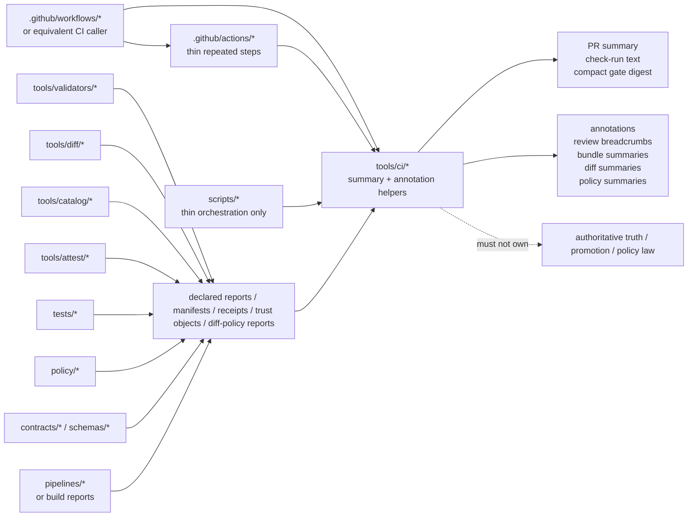

<!-- [KFM_META_BLOCK_V2]
doc_id: kfm://doc/NEEDS_VERIFICATION_UUID
title: ci
type: standard
version: v1
status: draft
owners: @bartytime4life
created: NEEDS_VERIFICATION_DATE
updated: 2026-04-13
policy_label: public
related: [../README.md, ../../README.md, ../../.github/README.md, ../../.github/CODEOWNERS, ../../.github/workflows/README.md, ../../.github/actions/README.md, ../../scripts/README.md, ../../contracts/README.md, ../../schemas/README.md, ../../policy/README.md, ../../tests/README.md, ../../tools/validators/promotion_gate/README.md, ../../tools/attest/README.md, ../../tools/diff/README.md]
tags: [kfm, tools, ci, summaries, annotations, reviewer-output, promotion, diff, policy-summary]
notes: [Updated to reflect render_bundle_diff_policy_summary.py in addition to the promotion-oriented and diff-oriented renderer thin slice. README-like lane contract; hidden metadata uses placeholders where current repo evidence does not confirm a stable document record.]
[/KFM_META_BLOCK_V2] -->

# ci

Reusable CI-facing helpers for reviewer-readable summaries, annotations, and compact gate output over already-governed artifacts.

> **Status:** experimental  
> **Owners:** `@bartytime4life` *(via current public `/tools/` coverage in [`../../.github/CODEOWNERS`](../../.github/CODEOWNERS); no narrower `/tools/ci/` rule directly verified)*  
> **Path:** [`tools/ci/README.md`](./README.md)  
> **Repo fit:** child lane of [`../README.md`](../README.md); workflow orchestration boundary in [`../../.github/workflows/README.md`](../../.github/workflows/README.md); adjacent step-level reuse seam in [`../../.github/actions/README.md`](../../.github/actions/README.md); thin orchestration in [`../../scripts/README.md`](../../scripts/README.md); canonical law stays upstream in [`../../contracts/README.md`](../../contracts/README.md), [`../../schemas/README.md`](../../schemas/README.md), [`../../policy/README.md`](../../policy/README.md), and [`../../tests/README.md`](../../tests/README.md)  
> **Evidence posture:** doctrine-grounded · repo-grounded for the current thin-slice lane shape plus broader public-tree context · exact additional helper inventory, live callers, rulesets, and platform settings remain bounded  
> **Current lane snapshot:** `tools/ci/` now has a documented renderer thin slice that includes promotion decision summaries, promotion bundle summaries, diff summaries, and bundle diff-policy summaries. Broader helper families remain bounded and explicitly marked `PROPOSED`, `UNKNOWN`, or `NEEDS VERIFICATION`.  
> **Badges:** [](./README.md) [](../../.github/CODEOWNERS) [](../README.md) [](../../README.md) [](./README.md) [](./README.md)  
> **Quick jumps:** [Scope](#scope) · [Repo fit](#repo-fit) · [Inputs](#inputs) · [Exclusions](#exclusions) · [Current verified snapshot](#current-verified-snapshot) · [Directory tree](#directory-tree) · [Quickstart](#quickstart) · [Usage](#usage) · [Diagram](#diagram) · [Helper matrix](#helper-matrix) · [Definition of done](#definition-of-done) · [FAQ](#faq) · [Appendix](#appendix)

> [!IMPORTANT]
> `tools/ci/` is the reusable helper boundary for **rendering** gate results, not the authority boundary for **deciding** them. Workflow orchestration belongs in [`../../.github/workflows/`](../../.github/workflows/) or [`../../scripts/`](../../scripts/). Canonical schema, policy, release, and truth-bearing logic remain upstream.

> [!TIP]
> **Current executable snapshot (thin slice)**  
> The current documented thin slice for this lane includes reviewer-facing renderers:
>
> **Reviewer / auditor summary helpers**
> - `tools/ci/render_promotion_summary.py`
> - `tools/ci/render_promotion_bundle_summary.py`
> - `tools/ci/render_diff_summary.py`
> - `tools/ci/render_bundle_diff_policy_summary.py`
>
> `render_diff_summary.py` renders:
>
> - diff status
> - blocking state
> - added / removed / changed key counts
> - reviewer-facing Markdown for stable diff reports
>
> `render_bundle_diff_policy_summary.py` renders:
>
> - policy status
> - blocking / review-required state
> - added / removed / changed key counts
> - per-key classification table
> - reviewer-facing Markdown for bundle diff-policy reports
>
> **Primary downstream trust surfaces**
> - `decision.json`
> - `promotion-record.json`
> - `promotion-bundle.json`
> - stable diff JSON reports such as `promotion-bundle-diff.json`
> - bundle diff-policy reports such as `promotion-bundle-diff-policy.json`
>
> **Primary adjacent lanes**
> - `tools/validators/promotion_gate/`
> - `tools/attest/`
> - `tools/diff/`
>
> Expected proof surfaces:
>
> - `tests/ci/test_render_diff_summary.py`
> - renderer tests for promotion summaries and bundle summaries where mounted
> - tests for `render_bundle_diff_policy_summary.py` where mounted
>
> These helpers are intended to render already-governed outputs into:
>
> - CI step summaries
> - reviewer-readable Markdown
> - compact auditor-facing bundle summaries
> - reviewer-facing diff summaries
> - reviewer-facing policy summaries for bundle drift
>
> They must not silently redefine policy, promotion law, diff law, or release truth.

> [!NOTE]
> On some older public snapshots this directory may still appear README-led or inventory-light. This README now reflects a real renderer thin slice while keeping broader family claims bounded.

> [!WARNING]
> Helpers in `tools/ci/` should be deterministic, read-only by default, and safe to print in logs. Never leak tokens, unpublished evidence, policy-review internals, or trust-bearing state changes through convenience output.

---

## Scope

`tools/ci/` is for small, reusable helpers that turn already-produced machine output into review-friendly CI surfaces.

Use this lane when the job is to:

- summarize validator, policy, docs, geospatial, diff, or test output for a pull request or check run
- normalize noisy tool output into a compact, stable intermediate format
- emit annotations, markdown summaries, or compact gate digests
- attach evidence, proof-pack, receipt, or artifact links to reviewer-facing output
- render trust-object bundles into concise reviewer or auditor summaries
- render structured diff outputs into reviewer-facing Markdown without recomputing comparison law
- render checked-in policy classifications into reviewer-facing Markdown without recomputing policy authority

Do **not** use this lane when the job is to:

- define canonical policy or contract law
- mutate release state, promotion state, or authoritative data
- replace workflow orchestration with hidden shell logic
- smuggle business meaning into “just CI glue”
- become the only place where diff, validation, attestation, or policy meaning exists

### Truth labels used here

| Label | Meaning in this file |
| --- | --- |
| **CONFIRMED** | Directly supported by the current repo tree, checked-in Markdown, or adjacent KFM doctrine |
| **INFERRED** | Conservative interpretation of adjacent repo evidence or repeated doctrine, but not proven as broader checked-in helper reality |
| **PROPOSED** | Recommended landing shape or operating rule consistent with KFM doctrine |
| **UNKNOWN** | Not verified strongly enough to present as current repo fact |
| **NEEDS VERIFICATION** | Explicit placeholder that should be checked against the working branch or platform settings before merge |

[Back to top](#ci)

## Repo fit

| Direction | Surface | Why it matters |
| --- | --- | --- |
| Parent lane | [`../README.md`](../README.md) | Defines the overall `tools/` contract and family boundaries. |
| Root posture | [`../../README.md`](../../README.md) | Sets the repo-wide evidence-first, map-first, trust-visible identity. |
| Ownership | [`../../.github/CODEOWNERS`](../../.github/CODEOWNERS) | Current public owner coverage for `/tools/` flows through here. |
| Workflow boundary | [`../../.github/workflows/README.md`](../../.github/workflows/README.md) | Workflow YAML should stay thin and call stable helpers instead of embedding large scripts. |
| Step-level reuse seam | [`../../.github/actions/README.md`](../../.github/actions/README.md) | Repo-local actions are the step-wrapper surface; `tools/ci/` should not duplicate action metadata or orchestration. |
| Thin orchestration | [`../../scripts/README.md`](../../scripts/README.md) | Local/operator entrypoints may call `tools/ci` helpers, but reusable review rendering should not be buried in `scripts/`. |
| Upstream truth law | [`../../contracts/README.md`](../../contracts/README.md), [`../../schemas/README.md`](../../schemas/README.md), [`../../policy/README.md`](../../policy/README.md), [`../../tests/README.md`](../../tests/README.md) | Canonical machine-checkable rules, fixtures, and proof burdens live here, not in CI presentation helpers. |
| Neighbor lanes | [`../validators/README.md`](../validators/README.md), [`../diff/README.md`](../diff/README.md), [`../attest/README.md`](../attest/README.md), [`../docs/README.md`](../docs/README.md), [`../probes/README.md`](../probes/README.md), [`../catalog/README.md`](../catalog/README.md) | Adjacent reusable helpers may feed inputs into `tools/ci/` summaries. |
| Promotion consumer | [`../../tools/validators/promotion_gate/README.md`](../../tools/validators/promotion_gate/README.md) | Current reviewer summaries are clearest in the promotion flow. |
| Attestation consumer | [`../../tools/attest/README.md`](../../tools/attest/README.md) | Verification state may need reviewer-facing rendering in CI surfaces. |
| Diff consumer | [`../../tools/diff/README.md`](../../tools/diff/README.md) | Stable diff outputs are now a direct renderer input for this lane. |
| Policy-summary consumer | [`../../tools/validators/promotion_gate/README.md`](../../tools/validators/promotion_gate/README.md) | Bundle diff-policy reports now flow into reviewer-facing CI rendering through this lane. |
| Downstream consumers | pull request reviews, check summaries, compact merge-gate output, release-review breadcrumbs | These are the human-facing or gate-facing surfaces this lane is meant to improve. |

---

## Inputs

### Accepted inputs

| Input class | Examples | Why it belongs here |
| --- | --- | --- |
| Structured check results | contract validation, policy evaluation, docs/accessibility checks, geospatial validation, unit/contract/policy/e2e results | `tools/ci/` is the right place to compact and present these for reviewers. |
| Receipts and manifests | candidate summaries, release manifests, proof-pack indexes, correction or rollback receipts | Reviewer-facing CI often needs links and short context around trust objects. |
| Diff context | changed files, affected packages, affected route families, doc surfaces touched | Helps render “what changed” without re-implementing git or policy logic. |
| Run metadata | branch, SHA, job name, run ID, artifact locations | Needed for traceability and stable review output. |
| Normalized intermediate artifacts | compact JSON or line-oriented status files created upstream | Prefer consuming declared, structured artifacts over scraping raw logs. |
| Promotion trust objects | `decision.json`, `promotion-record.json`, `promotion-bundle.json` | Current thin-slice promotion renderers operate over these governed artifacts. |
| Verification state | sign/verify result refs, attestation verification booleans | Reviewer surfaces increasingly need trust visibility, not just pass/fail text. |
| Stable diff reports | `stable_diff.py` JSON outputs such as `promotion-bundle-diff.json` | Current diff renderer consumes these directly without redoing comparison logic. |
| Bundle diff-policy reports | `evaluate_bundle_diff_policy.py` JSON outputs such as `promotion-bundle-diff-policy.json` | Current policy-summary renderer consumes these directly without redoing policy classification logic. |

### Input rules

1. Prefer declared file inputs over implicit environment scraping.
2. Prefer structured formats over free-form log parsing.
3. Keep helper-specific contracts small and explicit.
4. Refuse undeclared or malformed inputs clearly and early.
5. Render what upstream lanes already decided, measured, or classified; do not silently re-decide it here.

---

## Exclusions

| Does **not** belong here | Put it here instead | Why |
| --- | --- | --- |
| Workflow orchestration YAML | [`../../.github/workflows/`](../../.github/workflows/) | Workflow sequencing, permissions, and trigger logic should stay visible at the workflow boundary. |
| Repo-local composite action metadata or workflow-step wrappers | [`../../.github/actions/`](../../.github/actions/) | Step-wrapper contracts belong in the gatehouse action lane; `tools/ci/` should stay as reusable helper surface callable locally and from CI. |
| Large orchestration scripts, retries, or state transitions | [`../../scripts/`](../../scripts/) | `scripts/` is the better home for orchestration; `tools/ci/` should stay reusable and narrow. |
| Canonical JSON Schema and OpenAPI truth | [`../../contracts/`](../../contracts/) and [`../../schemas/`](../../schemas/) | CI helpers may report on contract law, but must not become its hidden home. |
| Machine-readable policy bundles or decision grammar | [`../../policy/`](../../policy/) | Deny-by-default logic belongs in policy assets and tests, not summary renderers. |
| Trust-bearing domain logic | packages, pipelines, or workers under the repo’s main implementation structure | Business meaning should not hide inside “utility” helpers. |
| Durable proof objects, releases, or authoritative outputs | the repo’s release / data / proof surfaces | CI summaries may link to proof objects; they should not silently become them. |
| Long-form runbooks and doctrine | [`../../docs/`](../../docs/) | Keep this lane focused on executable CI support rather than narrative documentation. |
| Signature generation or verification | [`../attest/README.md`](../attest/README.md) | `tools/ci/` may display verification state, but signing and verifying stay in `tools/attest/`. |
| Promotion decisions | [`../validators/README.md`](../validators/README.md) and `promotion_gate/` | `tools/ci/` renders decisions; it does not author them. |
| Diff computation | [`../diff/README.md`](../diff/README.md) | `tools/ci/` renders stable diff results; it does not own comparison law. |
| Policy classification | `policy/` plus validator lanes | `tools/ci/` renders checked-in classifications; it does not decide them. |

---

## Current verified snapshot

| Evidence item | Status | CI-lane consequence |
| --- | --- | --- |
| `tools/ci/` was README-only on older public snapshots | **CONFIRMED historical snapshot** | This lane contract must not imply older snapshots already had landed helpers. |
| Parent `tools/` exposes `attest/`, `catalog/`, `ci/`, `diff/`, `docs/`, `probes/`, `validators/`, and `README.md` | **CONFIRMED** | `ci/` is one of seven visible helper families, not an ad hoc directory. |
| Current `/tools/` ownership flows through broad `/tools/` coverage in `CODEOWNERS` | **CONFIRMED** | Owner wording should stay conservative until a narrower `/tools/ci/` rule exists. |
| `.github/workflows/` evidence remains bounded | **CONFIRMED bounded workflow evidence** | Checked-in workflow caller inventory remains bounded unless directly re-verified. |
| `.github/actions/` is visible and placeholder-heavy on current surfaces | **CONFIRMED** | Step-level reuse exists as a neighboring lane, but direct `tools/ci` caller maturity is not yet fully proven. |
| Current repo root visibly includes `scripts/`, `tests/`, `contracts/`, `schemas/`, `policy/`, `tools/`, and `pipelines/` | **CONFIRMED** | `tools/ci` helpers should expect upstream artifacts from several governed lanes, not just workflow YAML. |
| Promotion Gate documentation names `render_promotion_summary.py` and `render_promotion_bundle_summary.py` as thin-slice CI surfaces | **CONFIRMED via adjacent documentation** | This lane has concrete promotion renderer identities to document. |
| `tools/ci/render_diff_summary.py` is the current diff-oriented thin-slice executable helper | **CONFIRMED** | This lane documents a concrete diff renderer in addition to promotion renderers. |
| `tests/ci/test_render_diff_summary.py` is the current thin-slice proof surface for diff rendering | **CONFIRMED** | The diff renderer lands with explicit test coverage. |
| `tools/ci/render_bundle_diff_policy_summary.py` is part of the current promotion bundle diff-policy review path | **CONFIRMED via adjacent implementation updates** | This lane now explicitly includes a policy-summary renderer in the thin slice. |
| Exact additional helper inventory, live callers, artifact upload wiring, and platform-only settings beyond the thin slice | **UNKNOWN** | Keep broader platform claims out of this README unless re-verified against live settings. |

[Back to top](#ci)

## Directory tree

### Current lane shape

```text
tools/ci/
├── README.md
├── render_promotion_summary.py
├── render_promotion_bundle_summary.py
├── render_diff_summary.py
└── render_bundle_diff_policy_summary.py

tests/ci/
├── test_render_diff_summary.py
└── test_render_bundle_diff_policy_summary.py   # if mounted; otherwise verify exact path on active branch
```

> [!NOTE]
> The lane now has a real renderer thin slice. That does **not** yet prove every broader family helper or workflow caller below.

<details>
<summary>Possible stable growth shape (<strong>PROPOSED</strong>)</summary>

```text
tools/ci/
├── README.md
├── emit-pr-summary
├── emit-annotations
├── compact-gate-output
├── normalize-check-output
├── render_promotion_summary.py
├── render_promotion_bundle_summary.py
├── render_diff_summary.py
├── render_bundle_diff_policy_summary.py
└── templates/
```

Use the smallest useful set. Resist the temptation to turn `tools/ci/` into a second `scripts/` directory.

</details>

---

## Quickstart

Start with inventory, not invention.

```bash
# Inspect the current lane and the adjacent contracts that define it
ls -la tools/ci
sed -n '1,260p' tools/README.md
sed -n '1,260p' .github/workflows/README.md
sed -n '1,260p' .github/actions/README.md
sed -n '1,220p' .github/CODEOWNERS
sed -n '1,220p' scripts/README.md
sed -n '1,260p' tools/validators/promotion_gate/README.md
sed -n '1,260p' tools/attest/README.md
sed -n '1,260p' tools/diff/README.md

# Find existing references before adding a helper
git grep -n "tools/ci" -- . || true
git grep -n "annotation\|summary\|proof-pack\|contract\|policy\|geospatial\|diff-summary\|policy-summary\|GITHUB_STEP_SUMMARY\|promotion-bundle" -- .github scripts tests tools docs || true

# Inspect likely producers of CI-facing artifacts
find .github/actions tools scripts tests -maxdepth 3 -type f | sort
```

Before adding a helper, answer four questions:

1. What single review problem does it solve?
2. What declared inputs does it consume?
3. What exact outputs does it emit?
4. Why does this belong in `tools/ci/` instead of `scripts/`, `.github/actions/`, `policy/`, `contracts/`, or a package?

### Exercise the current thin-slice renderers

```bash
python tools/ci/render_promotion_summary.py \
  decision.json \
  --output promotion-summary.md

python tools/ci/render_promotion_bundle_summary.py \
  promotion-bundle.json \
  --output promotion-bundle-summary.md

python tools/ci/render_diff_summary.py \
  diff-report.json \
  --output diff-summary.md

python tools/ci/render_bundle_diff_policy_summary.py \
  promotion-bundle-diff-policy.json \
  --output promotion-bundle-diff-policy-summary.md
```

### Thin-slice test runs

```bash
pytest -q tests/ci/test_render_diff_summary.py
pytest -q tests/ci/test_render_bundle_diff_policy_summary.py
```

> [!NOTE]
> Verify the exact mounted test path for `render_bundle_diff_policy_summary.py` on the active branch if it differs from the expected thin-slice test naming shown here.

---

## Usage

### Recommended operating model

A good `tools/ci/` helper follows this shape:

1. **Receive** declared artifacts and run metadata.
2. **Normalize** them into a compact internal status model where needed.
3. **Render** human-facing and machine-facing outputs separately.
4. **Exit** with helper-status semantics, not hidden policy semantics.

### Choose the right boundary

| Surface | Primary job | Good fit | Do **not** hide here |
| --- | --- | --- | --- |
| `.github/workflows/` | job ordering, triggers, permissions, required gates | orchestration, sequencing, blocking review flow | reusable helper internals |
| `.github/actions/` | repeated workflow steps with stable inputs/outputs | thin step wrappers | whole reviewer-summary families |
| `../../scripts/` | local/operator entrypoints and staged orchestration | sequencing, convenience wrappers, operator-safe entrypoints | canonical decisions or buried reusable renderers |
| `tools/ci/` | reviewer-readable summaries, annotations, compact digests | rendering already-produced artifacts for humans and CI | policy law, schema law, release authority |

### Practical rules

- One helper, one responsibility.
- Render results; do not invent authority.
- Stay read-only by default.
- Emit concise logs and stable outputs.
- Keep platform-specific behavior shallow and explicit.
- Make local invocation and CI invocation as close as possible.

### Recommended exit-code rule

Use non-zero exit codes when the helper itself is broken or its declared input contract is violated.

Do **not** hide gate meaning inside an opaque crash. If a check found failures, the helper should still be able to render that result cleanly and let the caller decide how to enforce it.

### Current thin-slice invocation patterns

```bash
python tools/ci/render_promotion_summary.py \
  decision.json \
  --output promotion-summary.md
```

```bash
python tools/ci/render_promotion_bundle_summary.py \
  promotion-bundle.json \
  --output promotion-bundle-summary.md
```

```bash
python tools/ci/render_diff_summary.py \
  promotion-bundle-diff.json \
  --output promotion-bundle-diff-summary.md
```

```bash
python tools/ci/render_bundle_diff_policy_summary.py \
  promotion-bundle-diff-policy.json \
  --output promotion-bundle-diff-policy-summary.md
```

### Thin-slice diff rendering behavior

`render_diff_summary.py` currently renders:

- diff status
- blocking state
- added / removed / changed key counts
- explicit key lists where present
- reviewer-facing Markdown suitable for CI step summaries

It does **not** compute the diff itself. That stays in `tools/diff/stable_diff.py`.

### Thin-slice policy-summary rendering behavior

`render_bundle_diff_policy_summary.py` currently renders:

- policy status
- blocking state
- review-required state
- added / removed / changed key counts
- per-key classification table
- reviewer-facing Markdown suitable for CI step summaries

It does **not** classify keys itself. That stays in the checked-in policy surface plus `evaluate_bundle_diff_policy.py`.

---

## Diagram


```mermaid
flowchart LR
    WF[".github/workflows/*<br/>or equivalent CI caller"]
    AC[".github/actions/*<br/>thin repeated steps"]
    SC["scripts/*<br/>thin orchestration only"]

    VA["tools/validators/*"]
    DF["tools/diff/*"]
    CA["tools/catalog/*"]
    AT["tools/attest/*"]
    TS["tests/*"]
    PO["policy/*"]
    CO["contracts/* / schemas/*"]
    PI["pipelines/*<br/>or build reports"]

    IN1["declared reports / manifests / receipts / trust objects / diff-policy reports"]
    CI["tools/ci/*<br/>summary + annotation helpers"]
    OUT1["PR summary<br/>check-run text<br/>compact gate digest"]
    OUT2["annotations<br/>review breadcrumbs<br/>bundle summaries<br/>diff summaries<br/>policy summaries"]
    NO["authoritative truth / promotion / policy law"]

    WF --> AC
    WF --> CI
    AC --> CI
    SC --> CI

    VA --> IN1
    DF --> IN1
    CA --> IN1
    AT --> IN1
    TS --> IN1
    PO --> IN1
    CO --> IN1
    PI --> IN1

    IN1 --> CI
    CI --> OUT1
    CI --> OUT2

    CI -. must not own .-> NO
```

[Back to top](#ci)

## Helper matrix

| Helper family | Primary job | Typical inputs | Typical outputs | Status |
| --- | --- | --- | --- | --- |
| Summary helpers | Produce reviewer-readable run summaries | structured validator / test / policy / docs / diff outputs | Markdown or plain-text summaries | **Thin-slice active** |
| Annotation helpers | Surface file- or line-scoped problems | structured failures with file context | platform-specific annotations | **PROPOSED** |
| Gate-compaction helpers | Collapse many checks into one small digest | multiple report files | compact JSON or terse status blocks | **PROPOSED** |
| Linkage helpers | Attach receipts, proof-pack, or artifact links to CI output | manifests, receipts, artifact indexes | link bundles for review surfaces | **PROPOSED** |
| Normalizers | Convert tool-specific output into a stable CI-facing shape | raw tool output | normalized intermediate artifacts | **PROPOSED** |
| Bundle renderers | Render full governed trust bundles for reviewer/auditor handoff | promotion bundle manifests, verification state | one-page Markdown summaries | **Thin-slice active** |
| Diff renderers | Render stable diff reports for reviewer-facing CI output | stable diff JSON reports | Markdown summaries with change counts and key lists | **Thin-slice active** |
| Policy-summary renderers | Render checked-in classification outputs for reviewer-facing CI output | bundle diff-policy JSON reports | Markdown summaries with status, counts, and per-key classification tables | **Thin-slice active** |

> [!TIP]
> The lane itself is real. The helper families above are intentionally distinguished between current thin-slice use and broader proposed growth so the README stays useful without overstating current branch contents.

---

## Definition of done

Use this checklist when adding or revising a `tools/ci/` helper.

### Definition of done for the current thin slice

- [x] `render_diff_summary.py` thin slice implemented
- [x] `render_bundle_diff_policy_summary.py` thin slice implemented
- [x] diff renderer tests added
- [x] renderer inputs are documented and machine-readable
- [x] outputs are deterministic and usable by both humans and CI
- [x] helper remains read-only by default
- [x] failure semantics are explicit: helper failure is different from diff/change meaning or policy classification meaning

### Next sensible expansions

- [ ] add direct integration examples for `stable_diff.py` caller flows
- [ ] add direct integration examples for bundle diff-policy reviewer flows
- [ ] add promotion-bundle-specific diff summary wording if needed
- [ ] add optional compact mode for PR comment rendering
- [ ] document specific workflow or script callers once mounted and verified
- [ ] add richer annotation helpers separately instead of overloading summary renderers

---

## FAQ

### Why is this not `.github/workflows/`?

Because workflow YAML is orchestration. `tools/ci/` is for reusable helpers that workflows call. Keeping that boundary visible makes review easier and reduces hidden logic in workflow files.

### Why is this not `.github/actions/`?

Because repo-local actions are the thin step-wrapper seam inside the `.github` gatehouse. `tools/ci/` helpers should remain runnable outside GitHub Actions and should not require `action.yml` metadata just to render a summary or emit annotations.

### Why is this not `scripts/`?

Because `scripts/` is the more natural home for orchestration, sequencing, and operator-facing entrypoints. `tools/ci/` should stay small, reusable, and CI-facing.

### Does this README claim helpers already exist?

Yes, now in a bounded thin-slice sense. This lane currently documents promotion-oriented renderers, a diff-summary renderer, and a bundle diff-policy summary renderer. Broader inventory still requires verification where evidence is bounded.

### Can a `tools/ci/` helper publish, promote, or correct artifacts?

It should not own those trust-bearing actions. It may summarize evidence about them, but the authoritative action belongs in governed policy, review, release, and runtime lanes.

### Where should tests and fixtures live?

Prefer the repo’s shared test surfaces so helper behavior stays reviewable beside broader contract, policy, and regression evidence.

### Can `tools/ci/` render attestation verification state?

Yes — that is a good fit. But the signing and verification themselves belong in `tools/attest/`; `tools/ci/` should only render the already-produced state.

### Can `tools/ci/` render diff results?

Yes. That is now part of the current thin slice. But the diff computation itself still belongs in `tools/diff/`.

### Can `tools/ci/` render policy classification results?

Yes. That is now also part of the current thin slice. But the checked-in policy data and its evaluation remain outside this lane.

[Back to top](#ci)

## Appendix

<details>
<summary>Illustrative output shapes (<strong>PROPOSED except where noted</strong>)</summary>

### Example markdown summary

```md
## Contract and policy gate

- Contracts checked: 12
- Policy bundles evaluated: 4
- Failures: 1
- Review links:
  - proof-pack: `build/proof/proof-pack.json`
  - policy log: `build/policy/decision-log.json`

### Blocking items
- `contracts/runtime/runtime_response_envelope.schema.json` failed validation
```

### Example compact gate JSON

```json
{
  "kind": "ci_gate_summary",
  "schema_version": "0.1.0",
  "sha": "abc123",
  "run_id": "123456789",
  "status": "fail",
  "checks": {
    "contracts": "fail",
    "policy": "pass",
    "docs": "pass",
    "tests": "pass"
  },
  "artifacts": {
    "proof_pack": "build/proof/proof-pack.json",
    "summary_md": "build/ci/pr-summary.md"
  }
}
```

### Example current diff-summary shape

```md
# Diff Summary

**Tool:** `stable-diff`  
**Status:** 📝 `changed`  
**Blocking:** `True`  
**Left:** `old.json`  
**Right:** `new.json`  

## Change Counts

- Added keys: `1`
- Removed keys: `1`
- Changed keys: `1`
```

### Example current bundle diff-policy summary shape

```md
# Promotion Bundle Diff Policy Summary

**Status:** ⛔ `block`  
**Blocking:** `True`  
**Review required:** `True`  
**Policy path:** `policy/promotion_bundle_diff_policy.json`  
**Policy version:** `v1`
```

Keep these shapes small, boring, and stable. Reviewer trust is helped more by consistency than by cleverness.

</details>

<details>
<summary>Illustrative promotion summary role (<strong>thin-slice aligned</strong>)</summary>

A promotion-oriented CI renderer may take a machine-readable decision or bundle and emit:

- candidate identity
- finite decision outcome
- gate or bundle health table
- attestation verification visibility
- compact artifact index
- one short reviewer / auditor conclusion block

That is a rendering concern, not a decision-authority concern.

</details>

<details>
<summary>Illustrative diff summary role (<strong>thin-slice aligned</strong>)</summary>

A diff-oriented CI renderer may take a stable diff JSON report and emit:

- diff status
- blocking state
- added / removed / changed counts
- explicit changed-key lists
- one short reviewer-facing conclusion block

That is also a rendering concern, not comparison-law authority.

</details>

<details>
<summary>Illustrative policy-summary role (<strong>thin-slice aligned</strong>)</summary>

A policy-summary renderer may take a checked-in policy evaluation result and emit:

- policy status
- blocking / review-required state
- changed-key counts
- per-key classification table
- one short reviewer-facing conclusion block

That is a rendering concern, not policy authority.

</details>

[Back to top](#ci)
