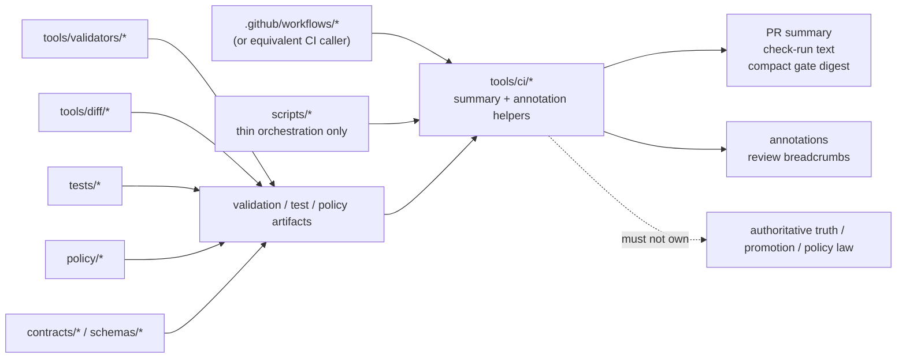

# ci

Reusable CI-facing helpers for reviewer-readable summaries, annotations, and compact gate output over already-governed artifacts.

> **Status:** experimental  
> **Owners:** inherited from [`/tools/` ownership in `../../.github/CODEOWNERS`](../../.github/CODEOWNERS)  
> **Path:** [`tools/ci/README.md`](./README.md)  
> **Repo fit:** child lane of [`../README.md`](../README.md); intended callers are workflow definitions in [`../../.github/workflows/README.md`](../../.github/workflows/README.md) and thin orchestration in [`../../scripts/`](../../scripts/); canonical law stays upstream in [`../../contracts/`](../../contracts/), [`../../schemas/`](../../schemas/), [`../../policy/`](../../policy/), and [`../../tests/`](../../tests/)  
> **Current public snapshot:** `tools/ci/` is **README-only** on the current public tree; this document defines the lane contract and growth rules without pretending a helper inventory is already present  
> **Badges:** [](./README.md) [](../../.github/CODEOWNERS) [](../README.md) [](./README.md)  
> **Quick jumps:** [Scope](#scope) · [Repo fit](#repo-fit) · [Inputs](#inputs) · [Exclusions](#exclusions) · [Directory tree](#directory-tree) · [Quickstart](#quickstart) · [Usage](#usage) · [Diagram](#diagram) · [Helper matrix](#helper-matrix) · [Definition of done](#definition-of-done) · [FAQ](#faq) · [Appendix](#appendix)

> [!IMPORTANT]
> `tools/ci/` is the reusable helper boundary for **rendering** gate results, not the authority boundary for **deciding** them. Workflow orchestration belongs in [`../../.github/workflows/`](../../.github/workflows/) or [`../../scripts/`](../../scripts/). Canonical schema, policy, release, and truth-bearing logic remain upstream.

> [!NOTE]
> On the current public branch this directory exposes only this README. That is intentional in this file: the lane contract is stronger than the currently surfaced helper inventory so later additions do not become a miscellaneous CI junk drawer.

> [!WARNING]
> Helpers in `tools/ci/` should be deterministic, read-only by default, and safe to print in logs. Never leak tokens, unpublished evidence, policy-review internals, or trust-bearing state changes through convenience output.

## Scope

`tools/ci/` is for small, reusable helpers that turn already-produced machine output into review-friendly CI surfaces.

Use this lane when the job is to:

- summarize validator, policy, docs, geospatial, or test output for a pull request or check run
- normalize noisy tool output into a compact, stable intermediate format
- emit annotations, markdown summaries, or compact gate digests
- attach evidence, proof-pack, receipt, or artifact links to reviewer-facing output

Do **not** use this lane when the job is to:

- define canonical policy or contract law
- mutate release state, promotion state, or authoritative data
- replace workflow orchestration with hidden shell logic
- smuggle business meaning into “just CI glue”

[Back to top](#ci)

## Repo fit

| Direction | Path / surface | Why it matters |
|---|---|---|
| Parent | [`../README.md`](../README.md) | Defines the overall `tools/` contract and family boundaries. |
| Ownership | [`../../.github/CODEOWNERS`](../../.github/CODEOWNERS) | Review ownership for `/tools/` flows through here. |
| Workflow boundary | [`../../.github/workflows/README.md`](../../.github/workflows/README.md) | Workflow YAML should stay thin and call stable helpers instead of embedding large scripts. |
| Likely callers | [`../../scripts/`](../../scripts/), [`../../tests/`](../../tests/), [`../../.github/workflows/`](../../.github/workflows/) | These surfaces typically produce or invoke the artifacts that `tools/ci/` renders. |
| Upstream truth law | [`../../contracts/`](../../contracts/), [`../../schemas/`](../../schemas/), [`../../policy/`](../../policy/) | Canonical machine-checkable rules live here, not in CI presentation helpers. |
| Neighbor lanes | [`../validators/`](../validators/), [`../diff/`](../diff/), [`../attest/`](../attest/), [`../docs/`](../docs/), [`../probes/`](../probes/), [`../catalog/`](../catalog/) | Adjacent reusable helpers may feed inputs into `tools/ci/` summaries. |
| Downstream consumers | Pull request reviews, check summaries, compact merge-gate output, release-review breadcrumbs | These are the human-facing or gate-facing surfaces this lane is meant to improve. |

## Inputs

### Accepted inputs

| Input class | Examples | Why it belongs here |
|---|---|---|
| Structured check results | contract validation, policy evaluation, docs/accessibility checks, geospatial validation, unit/contract/policy/e2e results | `tools/ci/` is the right place to compact and present these for reviewers. |
| Receipts and manifests | candidate summaries, release manifests, proof-pack indexes, correction or rollback receipts | Reviewer-facing CI often needs links and short context around trust objects. |
| Diff context | changed files, affected packages, affected route families, doc surfaces touched | Helps render “what changed” without re-implementing git or policy logic. |
| Run metadata | branch, SHA, job name, run ID, artifact locations | Needed for traceability and stable review output. |
| Normalized intermediate artifacts | compact JSON or line-oriented status files created upstream | Prefer consuming declared, structured artifacts over scraping raw logs. |

### Input rules

1. Prefer declared file inputs over implicit environment scraping.
2. Prefer structured formats over free-form log parsing.
3. Keep helper-specific contracts small and explicit.
4. Refuse undeclared or malformed inputs clearly and early.

## Exclusions

| Does **not** belong here | Put it here instead | Why |
|---|---|---|
| Workflow orchestration YAML | [`../../.github/workflows/`](../../.github/workflows/) | Workflow sequencing and trigger logic should stay visible at the workflow boundary. |
| Large orchestration scripts, retries, or state transitions | [`../../scripts/`](../../scripts/) | `scripts/` is the better home for orchestration; `tools/ci/` should stay reusable and narrow. |
| Canonical JSON Schema and OpenAPI truth | [`../../contracts/`](../../contracts/) and [`../../schemas/`](../../schemas/) | CI helpers may report on contract law, but must not become its hidden home. |
| Machine-readable policy bundles or decision grammar | [`../../policy/`](../../policy/) | Deny-by-default logic belongs in policy assets and tests, not summary renderers. |
| Trust-bearing domain logic | packages or workers under the repo’s main implementation structure | Business meaning should not hide inside “utility” helpers. |
| Durable proof objects, releases, or authoritative outputs | the repo’s release / data / proof surfaces | CI summaries may link to proof objects; they should not silently become them. |
| Long-form runbooks and doctrine | [`../../docs/`](../../docs/) | Keep this lane focused on executable CI support rather than narrative documentation. |

[Back to top](#ci)

## Directory tree

### Current public snapshot (**CONFIRMED**)

```text
tools/
└── ci/
    └── README.md
```

That snapshot should be read literally: this README is a lane contract, not proof of a landed helper inventory.

<details>
<summary>Possible stable growth shape (<strong>PROPOSED</strong>, not the current public tree)</summary>

```text
tools/
└── ci/
    ├── README.md
    ├── emit-pr-summary
    ├── emit-annotations
    ├── compact-gate-output
    ├── normalize-check-output
    └── templates/
```

Use the smallest useful set. Resist the temptation to turn `tools/ci/` into a second `scripts/` directory.

</details>

## Quickstart

Start with inventory, not invention.

```bash
# Inspect the current lane and the adjacent contracts that define it
ls -la tools/ci
sed -n '1,260p' tools/README.md
sed -n '1,260p' .github/workflows/README.md
sed -n '1,220p' .github/CODEOWNERS

# Find existing references before adding a helper
git grep -n "tools/ci" -- . || true
git grep -n "annotation\|summary\|proof-pack\|contract\|policy\|geospatial" -- .github scripts tests tools docs || true

# Inspect likely producers of CI-facing artifacts
find tests tools scripts -maxdepth 3 -type f | sort
```

Before adding a helper, answer four questions:

1. What single review problem does it solve?
2. What declared inputs does it consume?
3. What exact outputs does it emit?
4. Why does this belong in `tools/ci/` instead of `scripts/`, `policy/`, `contracts/`, or a package?

## Usage

### Recommended operating model

A good `tools/ci/` helper follows this shape:

1. **Receive** declared artifacts and run metadata.
2. **Normalize** them into a compact internal status model.
3. **Render** human-facing and machine-facing outputs separately.
4. **Exit** with helper-status semantics, not hidden policy semantics.

### Practical rules

- One helper, one responsibility.
- Render results; do not invent authority.
- Stay read-only by default.
- Emit concise logs and stable outputs.
- Keep platform-specific behavior shallow and explicit.
- Make local invocation and CI invocation as close as possible.

### Recommended exit-code rule

Use non-zero exit codes when the helper itself is broken or its declared input contract is violated.

Do **not** hide gate meaning inside an opaque crash. If a check found failures, the helper should still be able to render that result cleanly and let the caller decide how to enforce it.

### Illustrative invocation pattern

```bash
# Illustrative future entrypoint — not a claim that this helper exists today
tools/ci/emit-pr-summary \
  --input build/reports/contracts.json \
  --input build/reports/policy.json \
  --input build/reports/geospatial.json \
  --sha "$GITHUB_SHA" \
  --run-id "$GITHUB_RUN_ID" \
  --out build/ci/pr-summary.md
```

```bash
# Illustrative future entrypoint — not a claim that this helper exists today
tools/ci/emit-annotations \
  --input build/reports/contracts.json \
  --format github \
  --out build/ci/annotations.json
```

## Diagram


```mermaid
flowchart LR
    WF[".github/workflows/*<br/>(or equivalent CI caller)"]
    SC["scripts/*<br/>thin orchestration only"]
    VA["tools/validators/*"]
    DF["tools/diff/*"]
    TS["tests/*"]
    PO["policy/*"]
    CO["contracts/* / schemas/*"]

    IN1["validation / test / policy artifacts"]
    CI["tools/ci/*<br/>summary + annotation helpers"]
    OUT1["PR summary<br/>check-run text<br/>compact gate digest"]
    OUT2["annotations<br/>review breadcrumbs"]
    NO["authoritative truth / promotion / policy law"]

    WF --> CI
    SC --> CI

    VA --> IN1
    DF --> IN1
    TS --> IN1
    PO --> IN1
    CO --> IN1

    IN1 --> CI
    CI --> OUT1
    CI --> OUT2

    CI -. must not own .-> NO
```

[Back to top](#ci)

## Helper matrix

| Helper family | Primary job | Typical inputs | Typical outputs | Status |
|---|---|---|---|---|
| Summary helpers | Produce reviewer-readable run summaries | structured validator / test / policy / docs outputs | Markdown or plain-text summaries | **PROPOSED** |
| Annotation helpers | Surface file- or line-scoped problems | structured failures with file context | platform-specific annotations | **PROPOSED** |
| Gate-compaction helpers | Collapse many checks into one small digest | multiple report files | compact JSON or terse status blocks | **PROPOSED** |
| Linkage helpers | Attach receipts, proof-pack, or artifact links to CI output | manifests, receipts, artifact indexes | link bundles for review surfaces | **PROPOSED** |
| Normalizers | Convert tool-specific output into a stable CI-facing shape | raw tool output | normalized intermediate artifacts | **PROPOSED** |

> [!TIP]
> The lane itself is real; the helper families above are intentionally marked **PROPOSED** until files land. That keeps the README useful without overstating current branch contents.

## Definition of done

Use this checklist when adding or revising a `tools/ci/` helper.

- [ ] The helper has one clear job and one obvious caller.
- [ ] Its declared inputs are documented in this README or in a colocated help surface.
- [ ] Its outputs are deterministic and easy for both humans and CI to consume.
- [ ] It does **not** hide canonical policy, schema, release, or domain law.
- [ ] It is read-only by default.
- [ ] It does not leak secrets or unpublished evidence into logs.
- [ ] It can be run locally with the same contract used in CI.
- [ ] Its tests and fixtures live in the repo’s test surfaces, not in ad hoc scratch files.
- [ ] It links back to real artifacts, receipts, manifests, or reports where useful.
- [ ] Failure semantics are explicit: helper failure is different from gate failure.

## FAQ

### Why is this not `.github/workflows/`?

Because workflow YAML is orchestration. `tools/ci/` is for reusable helpers that workflows call. Keeping that boundary visible makes review easier and reduces hidden logic in workflow files.

### Why is this not `scripts/`?

Because `scripts/` is the more natural home for orchestration, sequencing, and operator-facing entrypoints. `tools/ci/` should stay small, reusable, and CI-facing.

### Does this README claim helpers already exist?

No. The current public subtree is README-only. This file defines the lane contract, usage rules, and growth discipline so future additions are easier to review.

### Can a `tools/ci/` helper publish, promote, or correct artifacts?

It should not own those trust-bearing actions. It may summarize evidence about them, but the authoritative action belongs in governed policy, review, release, and runtime lanes.

### Where should tests and fixtures live?

Prefer the repo’s shared test surfaces so helper behavior stays reviewable beside broader contract, policy, and regression evidence.

[Back to top](#ci)

## Appendix

<details>
<summary>Illustrative output shapes (<strong>PROPOSED</strong>)</summary>

### Example markdown summary

```md
## Contract and policy gate

- Contracts checked: 12
- Policy bundles evaluated: 4
- Failures: 1
- Review links:
  - proof-pack: `build/proof/proof-pack.json`
  - policy log: `build/policy/decision-log.json`

### Blocking items
- `contracts/runtime/runtime_response_envelope.schema.json` failed validation
```

### Example compact gate JSON

```json
{
  "kind": "ci_gate_summary",
  "schema_version": "0.1.0",
  "sha": "abc123",
  "run_id": "123456789",
  "status": "fail",
  "checks": {
    "contracts": "fail",
    "policy": "pass",
    "docs": "pass",
    "tests": "pass"
  },
  "artifacts": {
    "proof_pack": "build/proof/proof-pack.json",
    "summary_md": "build/ci/pr-summary.md"
  }
}
```

### Example annotation record

```json
{
  "path": "contracts/runtime/runtime_response_envelope.schema.json",
  "level": "error",
  "message": "Required property 'kind' missing in invalid fixture expectation block."
}
```

Keep these shapes small, boring, and stable. Reviewer trust is helped more by consistency than by cleverness.

</details>
