<div align="center">

# ⚙️ **Kansas Frontier Matrix — CI Automation Tools (v11)**  
`tools/ci/README.md`

**Purpose**  
Define the **canonical CI/CD automation layer** for the Kansas Frontier Matrix (KFM).  
These tools orchestrate validation, governance sync, security scanning, documentation QA, deployment, and telemetry export under:

- **MCP-DL v6.3** (documentation-first)  
- **KFM-MDP v11.2.2** (markdown + metadata rules)  
- **FAIR+CARE** (data & AI ethics, sovereignty)  
- **ISO 19115 / 50001 / 14064** (metadata & sustainability)  
- **Diamond⁹ Ω / Crown∞Ω** reliability and governance standards  

</div>

---

## 📘 1. Overview

The **CI Automation Tools** in `tools/ci/`:

- Run **all automated checks** on **every PR, commit, and release**  
- Enforce **schema, contract, checksum, FAIR+CARE, sovereignty, and security** gates  
- Drive **Docs → Validation → Governance → Deploy → Telemetry** loops  
- Log **energy, carbon, and performance** metrics for sustainability dashboards  
- Ensure that **no artifact** reaches a release without passing:

  1. Structural correctness  
  2. FAIR+CARE + sovereignty checks  
  3. Provenance & ledger registration  
  4. Telemetry + sustainability reporting  

They are the **entry point** for **Reliable Pipelines v11** gating logic.

---

## 🗂️ 2. Directory Layout (Emoji Style A)

```text
tools/ci/
├── 📄 README.md                    # This document
│
├── 📜 docs_validate.yml            # KFM-MDP v11 docs/guides/READMEs validation
├── 📜 checksum_verify.yml          # SBOM · manifest · dataset checksum integrity
├── 📜 site_deploy.yml              # Web/docs build & deploy after passing all gates
├── 📜 faircare_validate.yml        # FAIR+CARE + sovereignty CI enforcement
├── 🛡️ security_scan.yml            # CodeQL + dependency + container scanning
├── 🏛 governance_sync.yml          # Ledger + manifest + SBOM governance sync
└── 📡 telemetry_report.yml         # Telemetry export (latency, energy, CO₂e, errors)
```

Each workflow is:

- Versioned and referenced in `manifest_ref` and `sbom_ref`  
- Required for protected branches and releases  
- Designed to be deterministic and reproducible  

---

## 🧬 3. CI Architecture Flow (v11)

```mermaid
flowchart TD
    A["Commit / Pull Request / Scheduled Job"]
      --> B["📄 docs_validate.yml\nMarkdown · Front-Matter · Links"]
    B --> C["📜 checksum_verify.yml\nSBOM · Manifest · Checksums"]
    C --> D["⚖️ faircare_validate.yml\nFAIR+CARE · Sovereignty"]
    D --> E["🏛 governance_sync.yml\nLedgers · Manifests · SBOMs"]
    E --> F["🛡️ security_scan.yml\nCode · Dependencies · Images"]
    F --> G["📜 site_deploy.yml\nDocs/Web Deploy"]
    G --> H["📡 telemetry_report.yml\nTelemetry · Sustainability · Metrics"]
```



**Gating rules:**

- Any failure in **B–H** **blocks**:
  - PR merge into protected branches  
  - Release tagging  
  - Deployment jobs  

- `telemetry_report.yml` must still run (in a degraded mode) to record failure events where possible.

---

## ⚙️ 4. Workflow Responsibilities (Expanded v11.2.2)

### 4.1 `docs_validate.yml`

Validates:

- YAML front-matter (`title`, `path`, `version`, `last_updated`, etc.)  
- Markdown style & heading hierarchy  
- Directory trees and fences (no broken boxes)  
- Internal links (no broken relative URLs)  

Ensures every doc satisfies KFM-MDP v11.2.2 rules before merge.

---

### 4.2 `checksum_verify.yml`

Ensures:

- All release-critical artifacts (datasets, configs, standards) have SHA-256 checksums.  
- `sbom.spdx.json` and `manifest.zip` checksums match computed values.  
- STAC item `checksum:multihash` fields are consistent with on-disk assets.  

Writes a CI checksum summary to e.g.:

```text
data/reports/validation/checksums-ci.json
```

---

### 4.3 `faircare_validate.yml`

Enforces FAIR+CARE and sovereignty rules:

- CARE labels present and correct.  
- Sovereignty rules applied for Indigenous datasets (e.g., H3 generalization).  
- Licensing, attribution, and access constraints validated.  
- A11y metadata presence for affected UIs (where applicable).  

Outputs:

- FAIR+CARE summary JSON (`data/reports/fair/*`)  
- Annotations in the PR for governance reviewers.

---

### 4.4 `governance_sync.yml`

Responsibilities:

- Merge validation, FAIR+CARE, checksum, and AI audit logs into consolidated governance bundles.  
- Append to:
  - `data/reports/audit/data_provenance_ledger.json`  
  - `data/reports/audit/archive_integrity_log.json`  

- Update governance metadata in:
  - Releases  
  - Graph  
  - STAC/DCAT descriptors  

---

### 4.5 `security_scan.yml`

Runs:

- Static analysis (e.g., CodeQL)  
- Dependency vulnerability scanning  
- Optional container image scanning  

Blocks merges/releases on:

- CRITICAL and HIGH vulnerabilities without approved exceptions.

---

### 4.6 `site_deploy.yml`

Functions:

- Build static docs site and optionally the web frontend.  
- Push artifacts to the hosting target (e.g., Pages/Bucket/App).  

Constraints:

- Must depend on successful **docs**, **validation**, **governance**, and **security** checks.  
- Must publish a deployment status annotation back to the PR.

---

### 4.7 `telemetry_report.yml`

Role:

- Aggregate CI telemetry:
  - Job durations  
  - Pass/fail counts  
  - Numbers of warnings  
  - Energy/Carbon per run  
  - FAIR+CARE gating outcomes  

- Serialize into:
  - `focus-telemetry.json`  
  - `data/reports/telemetry/ci/*.json`  

Telemetry is used for:

- SLO and error-budget reporting.  
- Sustainability dashboards.  
- Governance & FAIR+CARE audits of CI practices.

---

## 📊 5. Example CI Telemetry & Governance Record

```json
{
  "id": "ci_registry_v11.2.2_2025-11-27_001",
  "branch": "main",
  "commit_sha": "<latest-commit-hash>",
  "workflows": [
    "docs_validate.yml",
    "checksum_verify.yml",
    "faircare_validate.yml",
    "governance_sync.yml",
    "security_scan.yml",
    "site_deploy.yml",
    "telemetry_report.yml"
  ],
  "schema_passed": true,
  "checksum_verified": true,
  "faircare_compliant": true,
  "security_compliant": true,
  "site_deployed": true,
  "governance_registered": true,
  "telemetry_logged": true,
  "energy_wh": 1.3,
  "carbon_gco2e": 1.7,
  "ci_runtime_sec": 312,
  "created_at": "2025-11-27T09:00:00Z",
  "validator": "@kfm-ci-core",
  "governance_ref": "data/reports/audit/data_provenance_ledger.json"
}
```

---

## 🧠 6. FAIR+CARE Governance Matrix (CI Tools)

| Principle               | Implementation                                                         | Oversight            |
|-------------------------|-------------------------------------------------------------------------|----------------------|
| **Findable**            | All workflows listed in manifest/SBOM and documented in root README.   | `@kfm-data`          |
| **Accessible**          | Workflows readable, MIT-licensed, with clear status checks.            | `@kfm-accessibility` |
| **Interoperable**       | CI metadata aligned with DCAT/ISO & telemetry schemas.                 | `@kfm-architecture`  |
| **Reusable**            | Reusable jobs/actions, pinned versions, and deterministic builds.      | `@kfm-design`        |
| **Collective Benefit**  | CI gating ensures public outputs are trustworthy and well-governed.    | `@faircare-council`  |
| **Authority to Control**| FAIR+CARE Council and Governance Board define gates/thresholds.        | `@kfm-governance`    |
| **Responsibility**      | Logs and telemetry retained to show who approved what and when.        | `@kfm-security`      |
| **Ethics**              | Prevents unethical datasets/outputs from shipping via mandatory checks.| `@kfm-ethics`        |

---

## 🌱 7. Sustainability & Observability

Every CI run should report:

- `energy_wh` — per-run energy estimate  
- `carbon_gco2e` — CO₂-equivalent per run  
- `ci_latency_ms` — total wall-clock runtime  
- `ci_failed_jobs` — number of failed jobs  
- `ci_retry_count` — number of retries  

Targets (example):

| Metric                    | Target                 |
|---------------------------|------------------------|
| Avg CI Run Energy         | ≤ 1.6 Wh              |
| Avg CI Run Carbon         | ≤ 1.9 gCO₂e           |
| Renewable Power Coverage  | 100% (RE100)          |
| FAIR+CARE Gate Pass Rate  | 100% for release runs |

These metrics populate:

```text
../../../releases/v11.2.2/focus-telemetry.json
docs/reports/telemetry/ci/*.json
```

---

## 🛡️ 8. Security & Privacy Baselines

CI workflows MUST:

- Avoid leaking secrets into logs.  
- Not print raw PII or sensitive content.  
- Support redaction and scrubbing of accidental sensitive output.  
- Fail “closed” on any governance or security violation — no partial deployments.  

Security scanning (dependency/image/code) is treated as a **hard gate** for releases.

---

## 🗃️ 9. Retention & Provenance Policy

| Artifact                | Retention | Notes                                      |
|-------------------------|-----------|--------------------------------------------|
| CI Logs                 | 90 days   | Rotated after aggregated summaries         |
| CI Reports (JSON)       | 180 days  | Used for reproducibility audits            |
| FAIR+CARE CI Logs       | 365 days  | Used for governance re-certification       |
| Governance Ledgers      | Permanent | Append-only, no hard deletions             |
| Telemetry Bundles       | Permanent | Versioned per release                      |

Rotation and compaction managed by CI cleanup jobs (e.g., `ci_cleanup.yml`).

---

## 🕰️ 10. Version History

| Version | Date       | Summary                                                                                                              |
|--------:|-----------:|----------------------------------------------------------------------------------------------------------------------|
| v11.2.2 | 2025-11-27 | Upgraded to KFM-MDP v11.2.2; applied emoji layout; expanded workflow descriptions; clarified FAIR+CARE & telemetry flows. |
| v11.0.0 | 2025-11-24 | v11 tools CI redesign; telemetry v4; FAIR+CARE & sovereignty gating; box-safe diagrams and directory layout.        |
| v10.2.2 | 2025-11-12 | JSON-LD exports, telemetry schema v2, sustainability logging, AI response checks.                                   |
| v10.0.0 | 2025-11-10 | Telemetry v2, SBOM sync, FIRST FAIR+CARE gating.                                                                    |
| v9.7.0  | 2025-11-05 | Governance sync + improved security scanning.                                                                       |
| v9.5.0  | 2025-11-02 | Initial FAIR+CARE-aware CI gating framework.                                                                        |

---

<div align="center">

© 2025 Kansas Frontier Matrix — MIT License  
**KFM CI Automation Tools v11.2.2**  
FAIR+CARE Certified · MCP-DL v6.3 · KFM-MDP v11.2.2 · Diamond⁹ Ω / Crown∞Ω  

[⬅️ Back to Tools Index](../README.md) · [🧱 Tools Architecture](../ARCHITECTURE.md) · [🛡 Governance Charter](../../../docs/standards/governance/ROOT-GOVERNANCE.md)

</div>