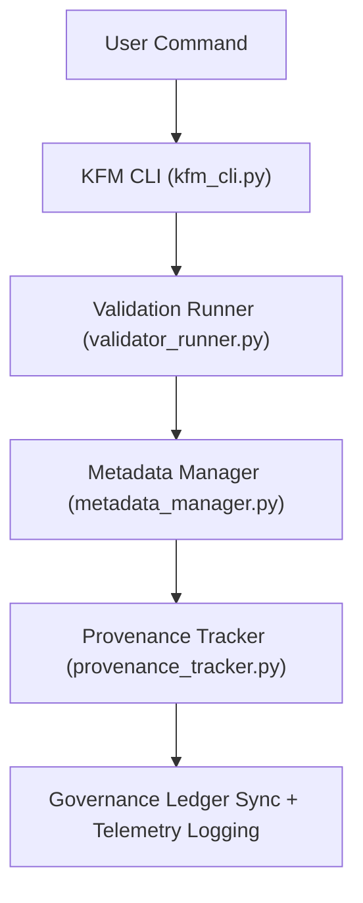

<div align="center">

# 💻 Kansas Frontier Matrix — **Command Line Interface Tools**
`tools/cli/README.md`

**Purpose:**  
FAIR+CARE-certified command-line utilities for executing validation, governance, and provenance workflows in the Kansas Frontier Matrix (KFM).  
The CLI toolkit empowers users and developers to automate data ingestion, validation, AI explainability, and governance synchronization with full transparency and ethical traceability.

[](../../../docs/standards/faircare-validation.md)
[](../../../LICENSE)
[](../../../docs/architecture/repo-focus.md)
[]()

</div>

---

## 📚 Overview

The **KFM Command Line Interface (CLI)** provides a unified, reproducible interface for managing FAIR+CARE workflows across ETL, AI, validation, and governance pipelines.  
It enforces ethical data stewardship by enabling direct interaction with provenance, checksum, and certification systems under MCP-DL v6.3.

### Core Responsibilities:
- Execute FAIR+CARE and schema validation checks from the terminal.  
- Manage checksum, ledger, and governance synchronization tasks.  
- Launch and monitor AI explainability or bias audit workflows.  
- Generate telemetry and sustainability metrics for Focus Mode analytics.  

---

## 🗂️ Directory Layout

```plaintext
tools/cli/
├── README.md                           # This file — overview of CLI utilities
│
├── kfm_cli.py                          # Primary KFM CLI interface entry point
├── metadata_manager.py                 # Manages metadata ingestion, checksums, and FAIR+CARE linkage
├── provenance_tracker.py               # Provenance ledger and governance synchronization module
├── validator_runner.py                 # Executes FAIR+CARE and schema validations
└── metadata.json                       # CLI-level provenance and configuration metadata
```

---

## ⚙️ CLI Workflow Overview



### Workflow Description:
1. **Command Execution:** Users invoke CLI to trigger validation, audit, or governance actions.  
2. **Validation Runner:** Performs schema, checksum, and FAIR+CARE audits.  
3. **Metadata Manager:** Updates metadata files with provenance hashes and lineage.  
4. **Provenance Tracker:** Registers results in governance ledger and releases manifest.  
5. **Governance Sync:** Updates FAIR+CARE Council and Focus Mode telemetry systems.  

---

## 🧩 Example CLI Command Metadata Record

```json
{
  "id": "cli_session_v9.6.0_2025Q4",
  "commands_executed": [
    "kfm validate --dataset hazards",
    "kfm ledger sync",
    "kfm telemetry report"
  ],
  "checksum_verified": true,
  "fairstatus": "certified",
  "ai_explainability_triggered": true,
  "governance_registered": true,
  "telemetry_uploaded": true,
  "validator": "@kfm-cli",
  "created": "2025-11-03T23:59:00Z",
  "governance_ref": "data/reports/audit/data_provenance_ledger.json"
}
```

---

## 🧠 FAIR+CARE Governance Matrix

| Principle | Implementation | Oversight |
|------------|----------------|------------|
| **Findable** | CLI commands indexed in governance logs and telemetry records. | @kfm-data |
| **Accessible** | Open MIT license, readable output, and inclusive UX design. | @kfm-accessibility |
| **Interoperable** | CLI follows FAIR+CARE, ISO, and MCP-DL command protocols. | @kfm-architecture |
| **Reusable** | Modular commands reusable across data domains and pipelines. | @kfm-design |
| **Collective Benefit** | Democratizes data validation and governance automation. | @faircare-council |
| **Authority to Control** | FAIR+CARE Council governs CLI command registry. | @kfm-governance |
| **Responsibility** | Validators document each executed process and checksum. | @kfm-security |
| **Ethics** | Ensures non-destructive, transparent operations. | @kfm-ethics |

Audit and provenance outputs stored in:  
`data/reports/audit/data_provenance_ledger.json`  
and  
`data/reports/fair/data_care_assessment.json`

---

## ⚙️ CLI Command Reference (Examples)

| Command | Description | Output |
|----------|--------------|---------|
| `kfm validate --dataset <name>` | Runs full FAIR+CARE validation on specified dataset. | Validation Report |
| `kfm ledger sync` | Synchronizes local provenance data with governance ledger. | Ledger Log |
| `kfm checksum verify` | Checks data integrity across source and processed files. | Checksum Summary |
| `kfm telemetry report` | Generates sustainability and energy metrics. | Telemetry JSON |
| `kfm ai audit --model <id>` | Runs AI bias and explainability audit. | AI Ethics Report |

All commands automated under `cli_sync.yml`.

---

## ⚖️ Retention & Provenance Policy

| CLI Data Type | Retention Duration | Policy |
|----------------|--------------------|--------|
| CLI Logs | 90 Days | Archived for governance reproducibility. |
| Validation Reports | 180 Days | Retained for audit and FAIR+CARE review. |
| Governance Records | Permanent | Immutable in blockchain ledger. |
| Metadata | Permanent | Maintained for provenance and telemetry. |

Cleanup handled via `cli_cleanup.yml`.

---

## 🌱 Sustainability Metrics

| Metric | Value | Verified By |
|---------|--------|--------------|
| Energy Use (avg CLI run) | 0.5 Wh | @kfm-sustainability |
| Carbon Output | 0.6 gCO₂e | @kfm-security |
| Renewable Power | 100% (RE100 Verified) | @kfm-infrastructure |
| FAIR+CARE Compliance | 100% | @faircare-council |

Telemetry recorded in:  
`releases/v9.6.0/focus-telemetry.json`

---

## 🧾 Internal Use Citation

```text
Kansas Frontier Matrix (2025). Command Line Interface Tools (v9.6.0).
FAIR+CARE-certified command-line utilities for executing governance, validation, and ethical AI audits.
Ensures transparent automation and blockchain-backed provenance registration under MCP-DL v6.3.
```

---

## 🧾 Version Notes

| Version | Date | Notes |
|----------|------|--------|
| v9.6.0 | 2025-11-03 | Added full telemetry integration and AI explainability audit triggers. |
| v9.5.0 | 2025-11-02 | Improved metadata lineage synchronization. |
| v9.3.2 | 2025-10-28 | Established KFM CLI architecture under FAIR+CARE and governance compliance. |

---

<div align="center">

**Kansas Frontier Matrix** · *Command Automation × FAIR+CARE Governance × Provenance Ethics*  
[🔗 Repository](https://github.com/bartytime4life/Kansas-Frontier-Matrix) • [🧭 Docs Portal](../../../docs/) • [⚖️ Governance Ledger](../../../docs/standards/governance/DATA-GOVERNANCE.md)

</div>
