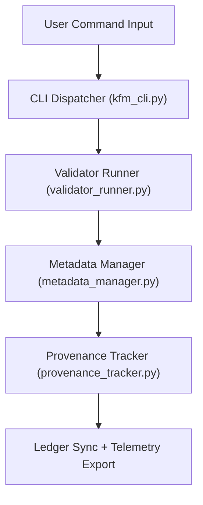

<div align="center">

# 💻 **Kansas Frontier Matrix — Command Line Interface Tools**  
`tools/cli/README.md`

**Purpose:**  
FAIR+CARE-certified command-line utilities that enable reproducible, ethical, and provenance-tracked automation across all Kansas Frontier Matrix (KFM) governance pipelines.  
These tools empower users to validate, audit, and synchronize datasets, AI explainability runs, and sustainability metrics under **MCP-DL v6.3** and **FAIR+CARE Council** standards.

[](../../../docs/README.md)
[](../../../LICENSE)
[](../../../docs/standards/faircare.md)
[]()

</div>

---

## 📘 Overview

The **Kansas Frontier Matrix CLI (kfm)** is the unified entry point for running validation, provenance synchronization, AI audits, and FAIR+CARE verification workflows.  
Every command promotes transparency, accessibility, and reproducibility — ensuring KFM remains an ethically governed open-data ecosystem.

**v10.2.2 Upgrades**
- JSON-LD provenance added to CLI metadata exports.  
- Batch launcher refactored with parallel workflow execution.  
- AI audit and governance sync hooks connected directly to telemetry schema v2.  
- Expanded sustainability logging (Wh and CO₂e metrics).

---

## 🗂️ Directory Layout

```
tools/cli/
├── README.md
│
├── kfm_cli.py               # Main KFM CLI entry point
├── metadata_manager.py      # Ingests metadata & registers provenance lineage
├── provenance_tracker.py    # Updates blockchain-backed governance ledger
├── validator_runner.py      # Executes FAIR+CARE, checksum, and schema validations
├── workflow_launcher.py     # Automates batch multi-command validation runs
└── metadata.json            # Governance & provenance metadata (JSON-LD)
```

---

## ⚙️ CLI Workflow



1. **Dispatch:** CLI parses and routes subcommands.  
2. **Validation:** Schema, checksum, and FAIR+CARE validation executed.  
3. **Metadata:** Updates dataset lineage, license, and checksum.  
4. **Ledger Sync:** Commits governance results to manifest and SBOM.  
5. **Telemetry:** Reports sustainability and reproducibility stats to `focus-telemetry.json`.

---

## 🧾 Example CLI Governance Record

```json
{
  "id": "cli_registry_v10.2.2",
  "commands_executed": [
    "kfm validate --dataset drought",
    "kfm ledger sync",
    "kfm ai audit --model focus_v7"
  ],
  "fairstatus": "certified",
  "checksum_verified": true,
  "ai_explainability_triggered": true,
  "telemetry_logged": true,
  "governance_registered": true,
  "validator": "@kfm-cli-tools",
  "created": "2025-11-12T12:00:00Z",
  "governance_ref": "docs/reports/audit/data_provenance_ledger.json"
}
```

---

## 🧠 FAIR+CARE Governance Matrix

| Principle | Implementation | Oversight |
|-----------|----------------|-----------|
| **Findable** | CLI metadata indexed in telemetry + governance ledgers. | @kfm-data |
| **Accessible** | MIT license; JSON + human-readable logs. | @kfm-accessibility |
| **Interoperable** | FAIR+CARE + ISO-aligned metadata and REST APIs. | @kfm-architecture |
| **Reusable** | Modular Python commands; reusable YAML workflows. | @kfm-design |
| **Collective Benefit** | Democratizes FAIR+CARE validation in command-line form. | @faircare-council |
| **Authority to Control** | Council certifies releases and CLI versions. | @kfm-governance |
| **Responsibility** | CLI logs maintained per audit and workflow execution. | @kfm-security |
| **Ethics** | Inclusive, transparent automation; open audit review. | @kfm-ethics |

Audit records stored in:  
`docs/reports/audit/data_provenance_ledger.json` · `docs/reports/fair/data_care_assessment.json`

---

## ⚙️ Key CLI Commands

| Command | Description | Output |
|----------|-------------|--------|
| `kfm validate --dataset <name>` | Runs FAIR+CARE, checksum, and schema validation. | Validation Report |
| `kfm ledger sync` | Syncs provenance and SBOM with governance ledger. | Ledger Log |
| `kfm checksum verify` | Verifies dataset/file integrity. | Checksum Report |
| `kfm ai audit --model <id>` | Executes AI fairness + explainability audit. | AI Audit Report |
| `kfm telemetry report` | Exports sustainability and performance metrics. | Telemetry JSON |
| `kfm workflow batch --file <yaml>` | Executes multi-step CLI tasks in batch mode. | Batch Report |

All automated through `cli_sync.yml`.

---

## ⚖️ Retention & Provenance Policy

| Record Type | Retention | Policy |
|--------------|-----------|--------|
| CLI Logs | 90 Days | Archived for reproducibility. |
| Validation Reports | 180 Days | Retained for re-certification. |
| Governance Records | Permanent | Immutable ledger storage. |
| Metadata | Permanent | Published with releases. |

Cleanup automated by `cli_cleanup.yml`.

---

## 🌱 Sustainability Metrics

| Metric | Target | Verified By |
|---------|--------|-------------|
| CLI Run Energy | ≤ 0.5 Wh | `telemetry_report.yml` |
| Carbon Output | ≤ 0.6 gCO₂e | `telemetry_report.yml` |
| Renewable Energy | 100% (RE100) | Infrastructure audit |
| FAIR+CARE Compliance | 100% | `faircare_validate.yml` |

Telemetry aggregated in:  
`../../../releases/v10.2.0/focus-telemetry.json`

---

## 🧾 Citation

```text
Kansas Frontier Matrix (2025). Command Line Interface Tools (v10.2.2).
Governance-grade CLI suite for FAIR+CARE validation, checksum verification, AI auditing, and ledger synchronization.
Aligned with MCP-DL v6.3, ISO 19115, and FAIR+CARE automation standards.
```

---

## 🕰️ Version History

| Version | Date | Summary | Maintainer |
|----------|------|----------|------------|
| v10.2.2 | 2025-11-12 | Aligned to v10.2: JSON-LD metadata export, sustainability logging, and AI audit linkage to telemetry schema v2. | CLI Governance Team |
| v10.0.0 | 2025-11-10 | Telemetry schema v2; batch launcher hardened; governance sync updated. | CLI Governance Team |
| v9.7.0 | 2025-11-05 | Added parallel batch execution & energy tracking. | CLI Governance Team |
| v9.6.0 | 2025-11-03 | Introduced explainability hooks and ledger lineage sync. | Design Systems Team |
| v9.5.0 | 2025-11-02 | Established CLI governance model with provenance tracking. | Governance Council |

---

<div align="center">

**Kansas Frontier Matrix** · *Command Automation × FAIR+CARE Governance × Provenance Ethics*  
© 2025 Kansas Frontier Matrix — MIT License  

[Back to Tools Index](../README.md) · [Docs Portal](../../../docs/) · [Governance Ledger](../../../docs/standards/governance/ROOT-GOVERNANCE.md)

</div>