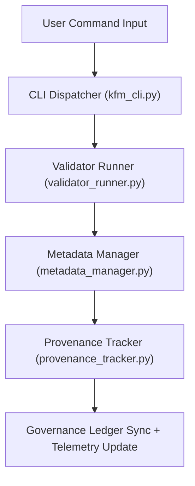

<div align="center">

# 💻 **Kansas Frontier Matrix — Command Line Interface Tools**
`tools/cli/README.md`

**Purpose:**  
FAIR+CARE-certified command-line utilities that enable reproducible, ethical, and provenance-tracked automation across all Kansas Frontier Matrix (KFM) governance pipelines.  
These tools empower users to validate, audit, and synchronize datasets, AI explainability runs, and sustainability metrics under MCP-DL v6.3 standards.

[](../../../docs/architecture/repo-focus.md)
[](../../../LICENSE)
[](../../../docs/standards/faircare-validation.md)
[]()

</div>

---

## 📘 Overview

The **Kansas Frontier Matrix CLI (kfm)** is the unified entry point for running validation, provenance synchronization, AI audits, and FAIR+CARE verification workflows from the terminal.  
Every command enforces transparency, accessibility, and reproducibility — ensuring KFM remains an ethically governed data ecosystem.

---

### Core Responsibilities:
- Execute FAIR+CARE and schema validation tasks.  
- Synchronize provenance and governance ledgers.  
- Manage AI explainability and bias audit pipelines.  
- Generate telemetry and sustainability metrics reports.  
- Enable automated dataset certification under open governance.  

---

## 🗂️ Directory Layout

```plaintext
tools/cli/
├── README.md
│
├── kfm_cli.py               # Main KFM CLI entry point
├── metadata_manager.py      # Ingests metadata and registers provenance lineage
├── provenance_tracker.py    # Updates blockchain-backed governance ledger
├── validator_runner.py      # Executes FAIR+CARE, checksum, and schema validations
├── workflow_launcher.py     # Automates multi-command batch validation runs
└── metadata.json            # Governance and provenance metadata for CLI utilities
```

---

## ⚙️ CLI Workflow



1. **Dispatch:** CLI parses and routes commands.  
2. **Validation:** Schema, checksum, and FAIR+CARE checks executed.  
3. **Metadata:** Updates asset lineage and licensing details.  
4. **Ledger Sync:** Commits results to governance manifest.  
5. **Telemetry:** Pushes sustainability and reproducibility stats.  

---

## 🧩 Example CLI Governance Record

```json
{
  "id": "cli_registry_v9.7.0",
  "commands_executed": [
    "kfm validate --dataset climate",
    "kfm ledger sync",
    "kfm ai audit --model focus_v5"
  ],
  "fairstatus": "certified",
  "checksum_verified": true,
  "ai_explainability_triggered": true,
  "telemetry_logged": true,
  "governance_registered": true,
  "validator": "@kfm-cli-tools",
  "created": "2025-11-05T12:00:00Z",
  "governance_ref": "data/reports/audit/data_provenance_ledger.json"
}
```

---

## 🧠 FAIR+CARE Governance Matrix

| Principle | Implementation | Oversight |
|-----------|----------------|-----------|
| **Findable** | CLI command metadata indexed in telemetry JSON and ledger. | @kfm-data |
| **Accessible** | MIT license; human-readable logs and outputs. | @kfm-accessibility |
| **Interoperable** | FAIR+CARE + ISO aligned metadata and APIs. | @kfm-architecture |
| **Reusable** | Modular Python command structure. | @kfm-design |
| **Collective Benefit** | Democratizes FAIR+CARE validation at the command level. | @faircare-council |
| **Authority to Control** | Council oversees release and certification. | @kfm-governance |
| **Responsibility** | CLI logs recorded for every validation and sync action. | @kfm-security |
| **Ethics** | Commands audited to ensure transparency and inclusivity. | @kfm-ethics |

Records stored in:  
`data/reports/audit/data_provenance_ledger.json`  
and  
`data/reports/fair/data_care_assessment.json`

---

## ⚙️ Key CLI Commands

| Command | Description | Output |
|---------|--------------|--------|
| `kfm validate --dataset <name>` | Performs FAIR+CARE, checksum, and schema validation. | Validation Report |
| `kfm ledger sync` | Syncs local provenance with global governance ledger. | Ledger Log |
| `kfm checksum verify` | Verifies data integrity and file immutability. | Checksum Report |
| `kfm ai audit --model <id>` | Runs bias + explainability analysis for specified AI model. | AI Audit Report |
| `kfm telemetry report` | Exports sustainability and performance metrics. | Telemetry JSON |
| `kfm workflow batch --file <path>` | Executes multiple CLI tasks in sequence. | Batch Summary |

All workflows coordinated via `cli_sync.yml`.

---

## ⚖️ Retention & Provenance Policy

| Record Type | Retention | Policy |
|-------------|-----------|--------|
| CLI Logs | 90 Days | Archived for audit reproducibility. |
| Validation Reports | 180 Days | Retained for FAIR+CARE revalidation. |
| Governance Records | Permanent | Stored immutably in provenance ledger. |
| Metadata | Permanent | Maintained for public governance traceability. |

Automation managed by `cli_cleanup.yml`.

---

## 🌱 Sustainability Metrics

| Metric | Value | Verified By |
|--------|------|-------------|
| Avg CLI Run Energy | 0.5 Wh | @kfm-sustainability |
| Carbon Output | 0.6 gCO₂e | @kfm-security |
| Renewable Energy | 100% (RE100 Certified) | @kfm-infrastructure |
| FAIR+CARE Compliance | 100% | @faircare-council |

Telemetry tracked in:  
`releases/v9.7.0/focus-telemetry.json`

---

## 🧾 Internal Use Citation

```text
Kansas Frontier Matrix (2025). Command Line Interface Tools (v9.7.0).
Governance-grade CLI for FAIR+CARE validation, checksum verification, AI auditing, and ledger synchronization.
Compliant with MCP-DL v6.3, ISO 19115, and open FAIR+CARE automation standards.
```

---

## 🕰️ Version History

| Version | Date | Summary | Maintainer |
|----------|------|----------|-------------|
| v9.7.0 | 2025-11-05 | Upgraded telemetry schema and integrated batch workflow automation. | CLI Governance Team |
| v9.6.0 | 2025-11-03 | Added explainability audit triggers and telemetry linkages. | Design Systems Team |
| v9.5.0 | 2025-11-02 | Introduced metadata lineage sync and provenance registry hooks. | Governance Council |
| v9.3.2 | 2025-10-28 | Established CLI framework for FAIR+CARE compliance. | Core Maintainers |

---

<div align="center">

**Kansas Frontier Matrix** · *Command Automation × FAIR+CARE Governance × Provenance Ethics*  
[🔗 Repository](../../) • [🧭 Docs Portal](../../../docs/) • [⚖️ Governance Ledger](../../../docs/standards/governance/ROOT-GOVERNANCE.md)

</div>