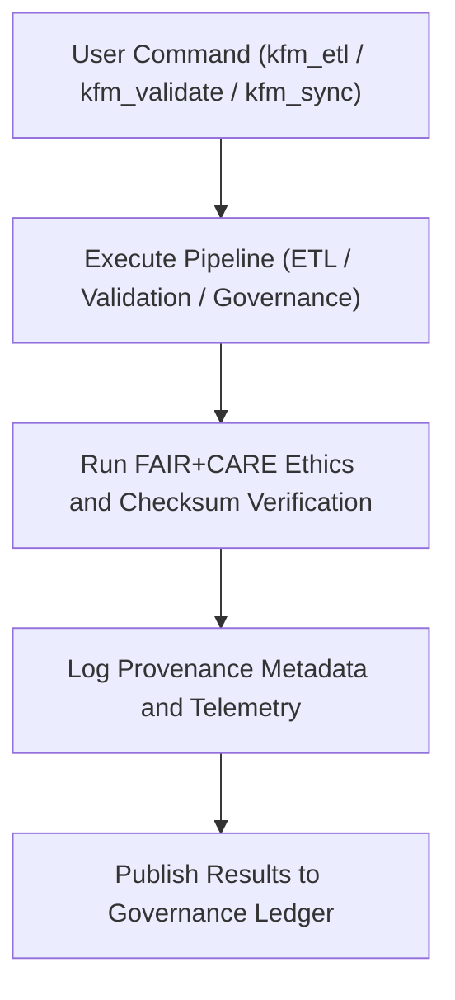

<div align="center">

# 💻 Kansas Frontier Matrix — **CLI Tools**
`tools/cli/README.md`

**Purpose:**  
FAIR+CARE-certified command-line toolset for managing **ETL operations, validation, FAIR+CARE governance, and system synchronization** within the Kansas Frontier Matrix (KFM).  
These tools empower developers, researchers, and governance engineers to automate complex data tasks with transparency, provenance, and reproducibility.

[](../../../docs/standards/faircare-validation.md)
[](../../../LICENSE)
[](../../../docs/architecture/repo-focus.md)

</div>

---

## 📚 Overview

The `tools/cli/` directory provides the **primary interface for executing ETL pipelines, validations, and governance syncs** within KFM.  
Each tool integrates with FAIR+CARE-certified pipelines, enabling reproducible workflows through checksum validation, ethics compliance, and automated governance logging.

### Core Responsibilities
- Execute ingestion and transformation workflows via command-line automation.  
- Validate schema, checksum, and FAIR+CARE ethics compliance.  
- Synchronize validation results and provenance metadata into governance ledgers.  
- Provide consistent, transparent execution across local and CI/CD environments.  

---

## 🗂️ Directory Layout

```plaintext
tools/cli/
├── README.md                              # This file — documentation for CLI Tools
│
├── kfm_etl.py                             # CLI entrypoint for running ETL pipelines
├── kfm_validate.py                        # Runs FAIR+CARE validation and checksum verification
├── kfm_sync.py                            # Synchronizes governance records, manifests, and telemetry
├── kfm_audit.py                           # Executes internal FAIR+CARE audit and ethics tests
├── kfm_ai.py                              # Manages AI explainability and drift detection operations
└── metadata.json                          # Provenance and governance linkage metadata
```

---

## ⚙️ CLI Workflow Overview



### Workflow Description
1. **Pipeline Execution:**  
   Users run ETL, validation, and governance operations directly from the CLI.  
2. **Ethics Validation:**  
   FAIR+CARE audits ensure all workflows meet ethical and accessibility standards.  
3. **Checksum Verification:**  
   Confirms reproducibility and data lineage across all stages.  
4. **Governance Logging:**  
   Automatically writes audit trails into KFM’s immutable ledger system.  
5. **Telemetry Sync:**  
   Pushes real-time status metrics to Focus Mode dashboards.

---

## 🧩 Example CLI Governance Record

```json
{
  "id": "cli_tools_v9.5.0_2025Q4",
  "commands_executed": [
    "kfm_etl.py --domain climate",
    "kfm_validate.py --scope hazards",
    "kfm_sync.py --update-ledger"
  ],
  "checksum_verified": true,
  "fairstatus": "certified",
  "ai_explainability_score": 0.991,
  "governance_registered": true,
  "telemetry_ref": "releases/v9.5.0/focus-telemetry.json",
  "governance_ref": "reports/audit/ai_cli_ledger.json",
  "created": "2025-11-02T23:59:00Z",
  "validator": "@kfm-cli"
}
```

---

## 🧠 FAIR+CARE Governance Matrix

| Principle | Implementation |
|------------|----------------|
| **Findable** | CLI runs logged with command history, timestamp, and checksum ID. |
| **Accessible** | Commands executed through open Python interfaces. |
| **Interoperable** | Aligned with FAIR+CARE, DCAT 3.0, and ISO 19115 standards. |
| **Reusable** | CLI operations documented and governed under MCP-DL v6.3. |
| **Collective Benefit** | Empowers ethical automation and transparent science. |
| **Authority to Control** | FAIR+CARE Council reviews CLI data operations and automation impacts. |
| **Responsibility** | CLI commands log validation and audit data to governance ledgers. |
| **Ethics** | All automated workflows adhere to ethical open data governance standards. |

Audit results maintained in:  
`reports/audit/ai_cli_ledger.json` • `reports/fair/cli_tools_summary.json`

---

## ⚙️ CLI Tools Summary

| Tool | Description | FAIR+CARE Function |
|------|--------------|--------------------|
| `kfm_etl.py` | Executes ingestion, transformation, and export pipelines. | FAIR+CARE-certified ETL automation |
| `kfm_validate.py` | Runs schema validation, checksum verification, and FAIR+CARE audits. | Governance and QA enforcement |
| `kfm_sync.py` | Updates manifests, telemetry, and governance ledgers. | Provenance linkage and transparency |
| `kfm_audit.py` | Conducts ethics and reproducibility testing for datasets. | FAIR+CARE audit certification |
| `kfm_ai.py` | Manages AI explainability, bias detection, and drift logging. | Ethical AI verification |

Automation governed by `cli_tools_sync.yml`.

---

## 🧾 Retention Policy

| Artifact Type | Retention Duration | Policy |
|----------------|--------------------|--------|
| CLI Logs | 90 days | Archived to governance system. |
| FAIR+CARE Reports | 365 days | Stored for audit reproducibility. |
| Metadata | Permanent | Maintained for lineage and compliance. |
| Governance Records | Permanent | Retained indefinitely for ethics certification. |

Cleanup automated via `cli_tools_cleanup.yml`.

---

## 🧾 Internal Use Citation

```text
Kansas Frontier Matrix (2025). CLI Tools (v9.5.0).
FAIR+CARE-certified command-line toolkit for executing ETL, validation, and governance workflows.
Ensures transparency, reproducibility, and ethical automation under MCP-DL v6.3 governance.
```

---

## 🧾 Version Notes

| Version | Date | Notes |
|----------|------|--------|
| v9.5.0 | 2025-11-02 | Introduced integrated AI management and governance synchronization commands. |
| v9.3.2 | 2025-10-28 | Enhanced checksum audit logging and Focus Telemetry integration. |
| v9.3.0 | 2025-10-26 | Established CLI tools suite for FAIR+CARE ETL and validation automation. |

---

<div align="center">

**Kansas Frontier Matrix** · *Automation Integrity × FAIR+CARE Ethics × Provenance Transparency*  
[🔗 Repository](https://github.com/bartytime4life/Kansas-Frontier-Matrix) • [🧭 Docs Portal](../../../docs/) • [⚖️ Governance Ledger](../../../docs/standards/governance/)

</div>