<div align="center">

# 💻 **Kansas Frontier Matrix — Command Line Interface Tools (v11)**  
`tools/cli/README.md`

**Purpose**  
Define the governed, FAIR+CARE-certified **Command Line Interface Platform** that powers KFM’s  
validation, governance, provenance, sustainability, dataset, and AI audit operations.

This suite is a **critical governance surface** — all dataset promotions, ledger updates,  
AI explainability audits, checksum verifications, sustainability exports, and Story Node  
validations MUST flow through a safe, deterministic CLI entrypoint.

[]() ·  
[]() ·  
[]() ·  
[]()

</div>

---

## 📘 1. Overview

The **KFM CLI Platform (kfm)** implements:

- Dataset validation (schema, FAIR+CARE, checksum, sovereignty)  
- Governance ledger synchronization (signed & append-only)  
- Release artifact metadata updates (manifest + SBOM alignment)  
- AI fairness, drift, and explainability audits (especially for Focus Mode v3)  
- Sustainability / carbon / energy telemetry export (ISO 50001 + 14064)  
- Batch pipeline runs and multi-step automation sequences  

It is designed for:

- **Operators**  
- **Data engineers**  
- **FAIR+CARE governance reviewers**  
- **Autonomous pipelines (LangGraph v11)**  
- **CI/CD workflows**  

Every CLI action produces:

- Structured JSON logs  
- Telemetry records  
- Governance ledger entries  
- Deterministic metadata artifacts  

---

## 🗂️ 2. Directory Layout (Emoji Style A)

```text
tools/cli/
├── 📄 README.md                     # This file
│
├── 💻 kfm_cli.py                    # Main CLI dispatcher
├── 🧾 metadata_manager.py           # Dataset + STAC/DCAT metadata governance
├── 🧭 provenance_tracker.py         # Signed ledger update & SLSA/SPDX linkages
├── ✅ validator_runner.py           # FAIR+CARE + schema + checksum validator harness
├── 🧱 workflow_launcher.py          # Batch orchestrator (YAML workflows)
└── 📑 metadata.json                 # JSON-LD lineage, config, CARE/sensitivity profiles
```

All CLI code:

- Must be deterministic where possible (`--dry-run` options strongly recommended).  
- Must obey CARE and sovereignty policies (no bypass flags).  
- Must emit logs, telemetry, and provenance in machine-readable formats.

---

## ⚙️ 3. CLI Architecture Flow

```mermaid
flowchart TD
    A["User / CI Command"] --> B["💻 kfm_cli.py\nDispatcher & Subcommand Router"]
    B --> C["✅ validator_runner.py\nSchema · FAIR+CARE · Checksums"]
    C --> D["🧾 metadata_manager.py\nMetadata · Licensing · Contracts"]
    D --> E["🧭 provenance_tracker.py\nSigned Ledger Update (PROV/SPDX/SLSA)"]
    E --> F["📡 Telemetry Export\nEnergy · Carbon · Runtime · CARE Flags"]
```



Key v11.2.2 constraints:

- **All** dataset promotions run through at least:
  - `kfm validate`  
  - a provenance update step  
  - telemetry export for the relevant run.  

- **All** AI audits run through:
  - `kfm ai audit` or equivalent alias.  

---

## 🧩 4. Core CLI Commands (v11)

| Command                                  | Purpose                                                         | Output                         |
|------------------------------------------|-----------------------------------------------------------------|--------------------------------|
| `kfm validate --dataset <id>`            | Runs schema, checksum, FAIR+CARE, sovereignty, A11y checks      | Validation report (JSON)       |
| `kfm ledger sync`                        | Sync governance manifests & append ledger entries               | Governance ledger delta        |
| `kfm ai audit --model <id>`              | Explainability + drift + fairness tests for a model             | AI audit report (JSON)         |
| `kfm checksum verify <path>`             | SHA-256 verification & provenance cross-check                   | Checksum result manifest       |
| `kfm metadata update --dataset <id>`     | Update STAC/DCAT metadata & data-contract links                 | Updated metadata JSON/JSON-LD  |
| `kfm workflow batch --file <workflow>`   | Execute multi-step YAML workflow (validation → governance → etc.) | Batch orchestration report   |
| `kfm telemetry report`                   | Export telemetry slice for this CLI execution                   | Telemetry JSON (for merge)     |

### Requirements

- All commands must support `--dry-run`.  
- Logs written as NDJSON (`run.jsonl` or similar) with:
  - `run_id`  
  - timestamps  
  - versioned CLI + tools metadata.  
- All commands honor exit codes:
  - `0` = success  
  - non-zero = typed error, suitable for CI gating.  

---

## 🧱 5. Integration with Tools Platform

The CLI is the **front door** to:

- `tools/validation` — for structural & FAIR+CARE checks  
- `tools/governance` — for ledger updates and governance manifests  
- `tools/telemetry` — for reliability and sustainability metrics  
- `tools/ai` — for bias and drift audits  

High-level pipeline:

```text
kfm_cli
  → validator_runner.py
  → metadata_manager.py
  → provenance_tracker.py
  → tools/telemetry/*
  → tools/ai/* (if AI-related)
```

---

## 📄 6. Example v11 Governance Record for CLI Run

```json
{
  "id": "cli_registry_v11.0.0",
  "commands_executed": [
    "kfm validate --dataset hydrology_streamflow",
    "kfm ai audit --model focus_transformer_v3",
    "kfm ledger sync"
  ],
  "schema_passed": true,
  "checksum_verified": true,
  "faircare_compliant": true,
  "sovereignty_clearance": "non-sensitive",
  "ai_audit_passed": true,
  "telemetry_logged": true,
  "governance_registered": true,
  "energy_wh": 0.44,
  "carbon_gco2e": 0.51,
  "timestamp": "2025-11-24T15:20:00Z",
  "validator": "@kfm-cli-core",
  "governance_ref": "docs/reports/audit/data_provenance_ledger.json"
}
```

This governance record is stored with the telemetry bundle and referenced by the audits.

---

## 🧠 7. FAIR+CARE Governance Matrix (v11 CLI Layer)

| Principle         | Enforcement via CLI                                        | Overseen By          |
|-------------------|------------------------------------------------------------|----------------------|
| **Findable**      | CLI actions tagged with IDs & graph URIs, logged in JSON   | `@kfm-data`          |
| **Accessible**    | MIT-licensed, well-documented CLIs with clear `--help`    | `@kfm-accessibility` |
| **Interoperable** | JSON-LD, STAC v1.x, DCAT v3.0, SPDX SBOMs                 | `@kfm-architecture`  |
| **Reusable**      | Deterministic workflows; reproducible configs & contracts | `@kfm-design`        |
| **Collective Benefit** | CLI used to enforce governance, not bypass it       | FAIR+CARE Council    |
| **Authority**     | consent, sovereignty & CARE checks run before promotions   | `@kfm-governance`    |
| **Responsibility**| CLI logs connect operations to validators & energy/carbon  | `@kfm-security`      |
| **Ethics**        | AI fairness + safety forced through `ai audit` pipelines   | `@kfm-ethics`        |

---

## ♻️ 8. Sustainability & Telemetry Requirements

Each CLI run should:

- Measure:
  - elapsed time  
  - CPU & memory footprint  
  - energy_wh, carbon_gco2e (via telemetry hooks)  
- Produce:
  - Telemetry record in `focus-telemetry.json` slice for the release  
  - Summaries in `docs/reports/telemetry/tools-cli/*.json`  

Targets:

- Keep CLI-level runs efficient and avoid heavy compute where not necessary.  
- Use sustainability_reporter in `tools/telemetry/` for rollups.

---

## 🛡️ 9. Security & Privacy

CLI must:

- Never log secrets or tokens.  
- Never print raw PII or raw sensitive coordinates.  
- Refuse any subcommand that would bypass FAIR+CARE rules.  
- Fail closed (block) on governance/validation failures.  
- Use environment variables or secret managers for credentials.

Static analysis and dependency scanning (e.g., CodeQL, Dependabot) MUST include `tools/cli/**`.

---

## ⚖️ 10. Retention & Rotation

| Artifact            | Retention | Notes                                   |
|---------------------|-----------|-----------------------------------------|
| CLI Logs            | 90 days   | Rotated after summarization             |
| Validation Reports  | 180 days  | Archived to `data/reports/self-validation/**` |
| Governance Records  | Permanent | Stored in ledgers + manifests           |
| Metadata Artifacts  | Permanent | Kept for reproducibility & audits       |
| Telemetry Slices    | 90 days   | Summaries retained long-term            |

Configured via:

```text
cli_cleanup.yml
tools/telemetry/telemetry_compactor.py
```

---

## 🕰️ 11. Version History

| Version | Date       | Summary                                                                                                         |
|--------:|-----------:|-----------------------------------------------------------------------------------------------------------------|
| v11.2.2 | 2025-11-27 | Upgraded to KFM-MDP v11.2.2; applied emoji directory layout; clarified tool roles, FAIR+CARE integration, and telemetry linkage. |
| v11.0.0 | 2025-11-24 | Full v11 rewrite; telemetry v4; KFM-OP v11 alignment; sovereignty rules; governance metadata expansions.       |
| v10.2.2 | 2025-11-12 | JSON-LD provenance; batch workflow launcher; sustainability logs implemented.                                   |
| v10.0.0 | 2025-11-10 | Telemetry schema v2; expanded CLI governance features and contracts.                                            |
| v9.7.0  | 2025-11-05 | Parallel workflow launcher; basic energy tracking; early governance integration.                               |
| v9.5.0  | 2025-11-01 | Initial governance-linked CLI framework.                                                                       |

---

<div align="center">

© 2025 Kansas Frontier Matrix — MIT License  
💻 KFM CLI Platform v11.2.2 · FAIR+CARE Certified · MCP-DL v6.3 · Diamond⁹ Ω / Crown∞Ω  

[⬅️ Back to Tools Index](../README.md) · [🧱 Tools Architecture](../ARCHITECTURE.md) · [🛡 Governance Charter](../../../docs/standards/governance/ROOT-GOVERNANCE.md)

</div>