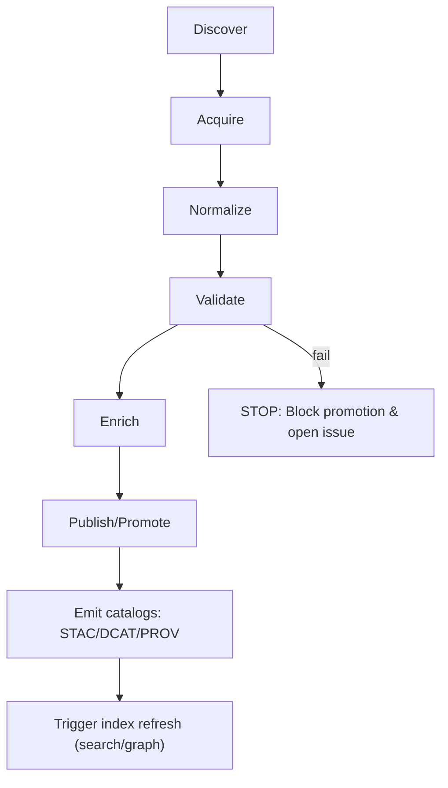

# tools/data — KFM Data Tooling (Ingest • Validate • Catalog • Promote)


**Purpose:** This folder contains **data tooling** (utility scripts, validators, and policy/promotion helpers) that implement the KFM evidence-first lifecycle: **raw → work → processed**, with **STAC/DCAT/PROV** emitted and validated before anything is promoted or served.

> [!IMPORTANT]
> **Non‑negotiables (KFM governance invariants)**
>
> - **Trust membrane:** tools may write artifacts, but **runtime access is only via the governed API + policy boundary** (no “UI reads from DB/storage directly”).  
> - **Fail‑closed:** missing/invalid evidence artifacts (catalogs, checksums, provenance, policy labels) **must block promotion**.  
> - **Promotion requires catalogs:** any publish/promote step must generate and validate **STAC/DCAT/PROV** before the dataset is considered served/usable.  
> - **Evidence-first UX:** downstream systems (UI + Focus Mode) must be able to **resolve citations** or **abstain**.

---

<details>
<summary><strong>Table of contents</strong></summary>

- [What lives in tools/data](#what-lives-in-toolsdata)
- [What does not belong here](#what-does-not-belong-here)
- [Repository context: where outputs go](#repository-context-where-outputs-go)
  - [Data zones: raw → work → processed](#data-zones-raw--work--processed)
  - [Catalog outputs: STAC/DCAT/PROV](#catalog-outputs-stacdcatprov)
  - [Supported layout conventions](#supported-layout-conventions)
- [tools/data directory layout](#toolsdata-directory-layout)
- [Lifecycle: from source to processed](#lifecycle-from-source-to-processed)
- [Artifacts and contracts](#artifacts-and-contracts)
  - [Raw manifest](#raw-manifest)
  - [Run record / run receipt](#run-record--run-receipt)
  - [Deterministic hashing: spec_hash](#deterministic-hashing-spec_hash)
  - [Catalog minimum fields](#catalog-minimum-fields)
- [Validation gates (promotion blockers)](#validation-gates-promotion-blockers)
- [CI & local verification](#ci--local-verification)
- [Adding a new dataset connector](#adding-a-new-dataset-connector)
- [Sensitive data & redaction](#sensitive-data--redaction)
- [Security & secrets](#security--secrets)
- [Troubleshooting](#troubleshooting)
- [Glossary](#glossary)

</details>

---

## What lives in tools/data

This folder is for **operational data tooling**, including:

- **Connectors and fetch helpers** (HTTP/ArcGIS hub, file snapshots, incremental slices, diffing)
- **Normalization helpers** (encoding/time/geometry canonicalization)
- **Validation** (schema checks, geometry checks, temporal sanity, license/policy checks)
- **Catalog generation** (STAC / DCAT / PROV emitters + validators)
- **Promotion helpers** (checksums, copy/move/packaging from work → processed)
- **Policy/promotion gates** (OPA/Conftest test runners, “fail-closed” verification wrappers)
- **Developer ergonomics** (sample configs, smoke tests, reusable scripts)

> [!NOTE]
> **Pipeline code vs. tooling**
>
> - The **domain ETL jobs** normally live under `src/pipelines/` (domain-specific transformations).
> - `tools/data/` is the **toolbox** that runs/validates those jobs and enforces **governed promotion**.

---

## What does not belong here

- **No raw data** or large datasets committed in `tools/data/` (data lives under `data/…`)
- **No secrets** (API keys, tokens, credentials)
- **No runtime API logic** (that belongs under the server boundary)
- **No UI artifacts** (frontend lives elsewhere)
- No “quick scripts” that bypass evidence production (everything must produce receipts, catalogs, and checksums)

---

## Repository context: where outputs go

### Data zones: raw → work → processed

KFM stages data through three zones:

1. **Raw**: source acquisitions (read-only snapshots/manifests)
2. **Work**: intermediate outputs + validation reports
3. **Processed**: final publishable artifacts (parquet/tiles/derived products), plus checksums

### Catalog outputs: STAC/DCAT/PROV

At the point of publication/promotion:

- **STAC** describes geospatial assets (collections/items)
- **DCAT** provides dataset discovery metadata (JSON-LD)
- **PROV** captures lineage (entities, activities, agents)

These are “boundary artifacts” and are **required** for governed publishing.

### Supported layout conventions

KFM documents show two common on-disk conventions; **pick one and stay consistent**:

- **Domain-first (recommended)**  
  `data/<domain>/{raw,work,processed}`  
  plus catalogs at `data/stac/`, `data/catalog/dcat/`, `data/prov/`, `data/graph/`

- **Zone-first (legacy/alternate)**  
  `data/{raw,work,processed}/<domain-or-dataset>/`  
  plus the same catalog locations

> [!TIP]
> If you are onboarding a new domain, prefer **domain-first** for isolation and maintainability:
> `data/<domain>/raw/`, `data/<domain>/work/`, `data/<domain>/processed/`.

---

## tools/data directory layout

This README is **contract-first**: the following structure is the expected, reviewable layout for `tools/data/`.
If a folder is missing in your working tree, create it when implementing the corresponding capability.

```text
tools/data/
├── README.md
├── bin/                      # entrypoint wrappers (shell/python/node) for local + CI
├── configs/                  # connector configs (YAML/JSON), no secrets
│   └── examples/             # safe example configs (public endpoints only)
├── connectors/               # source-specific acquisition logic (Discover/Acquire)
├── transforms/               # normalization + enrichment helpers (Normalize/Enrich)
├── validators/               # schema/geometry/time/license/policy validators
├── catalogs/                 # STAC/DCAT/PROV emitters + validators
├── promotion/                # work→processed helpers, checksums, packaging
├── policy/                   # policy-as-code checks (OPA/Conftest runners, bundles)
├── templates/                # catalog templates and JSON schema helpers
├── fixtures/                 # tiny fixed test slices for deterministic integration tests
└── tests/                    # tool-level tests (unit + integration + golden outputs)
```

---

## Lifecycle: from source to processed

KFM ingestion is a governed pipeline that must produce evidence artifacts **before** publication.



**Stage intent**

- **Discover:** resolve endpoints/params/auth needs; cache capability metadata  
- **Acquire:** fetch incremental slices when possible; otherwise snapshot + diff  
- **Normalize:** canonical encodings (UTF‑8), geometry (WGS84), time (ISO 8601)  
- **Validate:** schema + geometry validity + timestamp sanity + license/policy checks  
- **Enrich:** derive join keys (GeoIDs), normalize place/time, entity resolution candidates  
- **Publish:** promote to processed, update catalogs, trigger index refresh

---

## Artifacts and contracts

### Raw manifest

A raw acquisition is anchored by a **manifest** describing the source, licensing, expected files, and sensitivity classification.

Example (illustrative):

```yaml
# data/<domain>/raw/<dataset_id>/manifest.yml
dataset_id: example_dataset
source:
  type: http
  uri: "https://example.org/source.csv"
license: "CC-BY-4.0"
expected_files:
  - name: source.csv
    sha256: "..."
sensitivity_level: "public"
```

### Run record / run receipt

Every pipeline run should emit a **run record** (or run receipt) that ties together:

- input URIs + checksums
- the code identity (git sha and/or container image digest)
- outputs + checksums
- validation report reference
- provenance reference

Example (illustrative):

```json
{
  "run_id": "run_...",
  "dataset_id": "example_dataset",
  "inputs": [{"uri":"data/raw/example.csv","sha256":"..."}],
  "code": {"git_sha":"...","image":"kfm/pipeline:..."},
  "outputs": [{"uri":"data/processed/example.parquet","sha256":"..."}],
  "validation_report": "data/work/example/validation_report.json",
  "prov_ref": "data/catalog/prov/example/run_....json"
}
```

### Deterministic hashing: spec_hash

KFM relies on deterministic hashing to make provenance and promotion reproducible.

**Rule (normative):**

- `spec_hash = sha256(JCS(spec))`, where `spec` is a schema-defined object
- include `spec_schema_id` + `spec_recipe_version`
- use **RFC 8785** JSON Canonicalization Scheme (JCS) for canonical bytes

This prevents “hash drift” across environments and makes audits repeatable.

### Catalog minimum fields

Catalogs must be schema-validated emitters. Minimum fields should match KFM profiles:

**DCAT (minimum)**  
- `dct:title`, `dct:description`  
- `dct:publisher` (org id)  
- `dct:license` (SPDX or URL)  
- `dct:spatial` (bbox or admin coverage)  
- `dct:temporal` (start/end)  
- `dct:accrualPeriodicity` (update cadence)  
- `dcat:distribution` (download/API endpoints)  
- `prov:wasGeneratedBy` (link to PROV activity)

**STAC (minimum)**  
- Collection: `id`, `title`, `description`, `license`, `extent.spatial`, `extent.temporal`, `keywords`, `providers`
- Item: `id`, `geometry`, `bbox`, `datetime`, plus required `assets` and `links` to provenance/citation path

**PROV (minimum)**  
- Entities: `raw_asset`, `normalized_table`, `derived_tile`, `ocr_text`, etc.
- Activities: `ingest_run`, `transform_job`, `redaction_job`
- Agents: connector/service, steward approval
- Relations: `wasGeneratedBy`, `used`, `wasDerivedFrom`, `wasAssociatedWith`

---

## Validation gates (promotion blockers)

Promotion to **Processed** must be blocked unless all gates pass:

- Row-level schema validation (required fields present; coercion rules documented)
- Geometry validity + bounds (no self-intersections; within expected extent when applicable)
- Temporal consistency (no future dates for historic archives; no negative durations)
- License + attribution captured in DCAT; restrictions encoded in policy
- Provenance completeness: every promoted artifact has a PROV chain + deterministic checksum

> [!WARNING]
> “Close enough” is not allowed at publish time. If evidence artifacts or required metadata are missing,
> the correct behavior is to **fail the run** and **block promotion**.

---

## CI & local verification

A CI-ready acceptance harness should validate (at minimum):

- STAC/DCAT/PROV schema validation
- policy tests (OPA/Conftest) for required fields, sensitivity flags, redaction rules
- signature/attestation verification (if bundles are used)
- spec_hash reproducibility checks

Local runs should mirror CI behavior so contributors can catch failures early.

> [!NOTE]
> If your CI implements a “Promotion Contract”, treat it as merge-blocking: receipts + attestations + signatures + kill-switch.

---

## Adding a new dataset connector

Use this checklist to add a new data source **without violating governance**:

1. **Define the dataset**
   - Choose `dataset_id` and domain placement.
   - Record license/attribution, update cadence, and sensitivity class.

2. **Create connector configuration**
   - Add a config under `tools/data/configs/<provider>/<dataset_id>.yml`
   - No secrets: reference environment variables or vault keys.

3. **Implement Discover + Acquire**
   - Prefer incremental fetches (cursor by date/ID) when supported; otherwise snapshot+diff.

4. **Implement Normalize**
   - Canonicalize encodings (UTF‑8), geometry (WGS84), time (ISO 8601).

5. **Implement Validate**
   - Enforce the promotion gates above.
   - Emit a machine-readable validation report into the work zone.

6. **Implement Enrich**
   - Derive join keys (GeoIDs), normalize place/time, preserve uncertainty where applicable.

7. **Emit catalogs**
   - DCAT always; STAC/PROV as applicable.
   - Ensure link-check clean + schema validated.

8. **Add tests**
   - Unit tests for coercion/mapping helpers.
   - Integration test with a fixed small slice (deterministic checksums + counts).
   - Contract test: API response includes provenance bundle and respects redaction.

9. **Document**
   - Add/update the domain runbook (`data/<domain>/README.md` or `docs/data/<domain>/…` depending on repo standard).
   - Record backfill strategy (ranges + expected runtime).

**Definition of Done**
- Connector implemented and registered
- Raw acquisition deterministic (manifest + checksums)
- Validation gates enforced in CI
- Policy labels defined; restricted fields/locations redacted
- Catalogs emitted (DCAT always; STAC/PROV as applicable)
- API contract tests pass for at least one representative query
- Backfill strategy documented

---

## Sensitive data & redaction

- Treat redaction as a **first-class transformation**.
- If obscuring locations (e.g., sensitive sites), store:
  - generalized geometry
  - sensitivity flag / policy labels
  - provenance linking generalized outputs to restricted inputs (without leaking restricted coordinates)

---

## Security & secrets

- **Never commit secrets.**
- Store credentials in a vault/secret manager; reference them via env vars or runtime injection.
- For public endpoints, prefer no-auth access and record upstream terms/limits in documentation.

---

## Troubleshooting

**Promotion blocked (expected behavior):**
- Missing/invalid STAC/DCAT/PROV → generate and validate catalogs before promote.
- Missing checksums → re-run packaging step that emits deterministic checksums.
- Policy gate failure → add required governance fields or apply redaction rules.

**Validation issues:**
- Geometry invalid → fix geometry repair step or reject records.
- Temporal sanity failures → enforce ISO 8601 parsing and “no future dates for historical archives.”

---

## Glossary

- **Raw / Work / Processed:** required staging zones for governed data lifecycle.
- **Promotion gate:** automated + stewarded checks required to publish to Processed.
- **Run record / receipt:** machine-readable artifact tying inputs, code identity, outputs, and provenance.
- **spec_hash:** deterministic hash over canonicalized spec (JCS → sha256).
- **STAC / DCAT / PROV:** catalog + provenance standards required for evidence-first KFM publishing.

---

