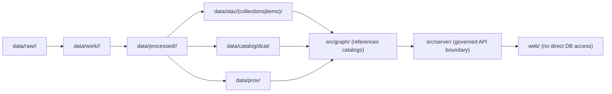

# 🧰 KFM Data Tooling (`tools/data/`)


**Purpose:** This folder contains **standalone data utilities** (validators, helpers, small CLIs) that support the KFM canonical pipeline—especially **data staging**, **validation gates**, **catalog emission**, and **redaction-safe derivatives**.

> **Rule of thumb:** if it *processes data files* or *verifies/creates boundary artifacts* (STAC/DCAT/PROV) and it’s useful outside a single pipeline module, it likely belongs here.

---

## ✅ What belongs here (and what does not)

### ✅ Belongs in `tools/data/`
- **Validation utilities** (schema checks, geometry validity, temporal sanity, link-check, license/attribution linting).
- **Catalog helpers** (generate/validate STAC/DCAT/PROV artifacts, cross-link checks).
- **Connector helpers** (snapshot manifests, checksum builders, diff helpers, small fetch utilities).
- **Redaction utilities** (generalization, suppression, aggregation, mask generation) **as first-class transformations**.
- **Test fixtures** that are small and policy-safe (no sensitive locations, no PII, no restricted cultural data).

### 🚫 Does *not* belong in `tools/data/`
- **Actual datasets** (raw/work/processed) → those live under the repository’s top-level `data/`.
- **Domain runbooks** → those live under `docs/data/<domain>/README.md`.
- **One-off analysis notebooks** → prefer a governed `mcp/experiments/` or `docs/research/` pattern (repo-specific).

---

## 🗺️ Canonical mental model

KFM’s ordering is strict: **ETL → catalogs (STAC/DCAT/PROV) → graph → API → UI → Story Nodes → Focus Mode**.  
Tools in this folder exist to make it easy to **not break** that ordering.



---

## 🗂️ Recommended directory layout (create on demand)

> This is a **suggested** structure for organizing utilities. Add subfolders when a tool actually exists.

```text
tools/data/
├── README.md                      # (this file)
├── ingest/                        # snapshot/manifest/checksum helpers
├── validate/                      # schema + geometry + temporal + license/policy validators
├── catalog/                       # STAC/DCAT/PROV emitters + cross-link checks
├── redaction/                     # redaction/generalization as deterministic transforms
└── fixtures/                      # tiny policy-safe sample datasets for tests
```

---

## 🧱 Tooling principles (non-negotiable)

### Determinism & idempotency
- Tools must be **config-driven**, **repeatable**, and **idempotent**:
  - same inputs + same config ⇒ same outputs
  - re-running should not corrupt or duplicate results

### Treat `data/raw/` as read-only
- Raw assets are **immutable snapshots** once ingested (new upstream updates → new snapshot/version, don’t mutate history).

### Boundary artifacts are required for “publish”
If a tool promotes or modifies data in `data/processed/**`, it must also ensure:
- **STAC** (if spatial assets exist)
- **DCAT** (always, for dataset discovery)
- **PROV** (always, to capture lineage)

> If the dataset can’t be represented safely or legally, the tool should **fail closed** (no partial “publish”).

---

## 🧾 Run metadata & provenance linkage

Tools that produce or promote artifacts must stamp run metadata so catalogs, telemetry, and Focus Mode can join on stable identifiers.

### Required run metadata fields (recommended names)
- `kfm.git.commit_sha`
- `kfm.job.status` (`scheduled|running|succeeded|failed|canceled`)
- `kfm.job.started_at` (RFC3339; also emit unix seconds for metrics math)
- `kfm.job.ended_at` (RFC3339; also emit unix seconds)
- `kfm.dataset.id` (must match dataset IDs in STAC/DCAT)
- `kfm.pipeline.name` (stable slug)
- `kfm.env` (`dev|staging|prod`)

> **Catalog linkage expectation:** include run identifiers in STAC Item properties (e.g., `kfm:run_id`, commit SHA, status). Model each run as a `prov:Activity` in PROV JSON-LD.

<details>
<summary><strong>Example: minimal run-metadata JSON (for logs / PROV / STAC properties)</strong></summary>

```json
{
  "kfm": {
    "run_id": "2026-02-16T18:02:11Z__hazards__openfema__a1b2c3d4",
    "git": { "commit_sha": "7f3a3c0e4a2d..." },
    "job": {
      "status": "succeeded",
      "started_at": "2026-02-16T18:02:11Z",
      "ended_at": "2026-02-16T18:07:54Z"
    },
    "dataset": { "id": "hazards.openfema.disaster-declarations" },
    "pipeline": { "name": "hazards.openfema.ingest" },
    "env": "dev"
  }
}
```
</details>

---

## 🧪 Minimum validation gates (must be CI-enforced)

Any tool that outputs publishable artifacts should implement and/or call validators for:

- **Row-level schema validation** (required fields present; type coercion rules documented)
- **Geometry validity + bounds** (no self-intersections; within expected extent when applicable)
- **Temporal consistency** (no future dates for historic archives; no negative durations)
- **License + attribution captured** (DCAT must reflect license, attribution, restrictions)
- **Provenance completeness** (PROV chain present; deterministic checksums for promoted artifacts)

> These gates are the difference between “data exists” and “data is governed.”

---

## 🔒 Governance & sensitive data handling

KFM must treat certain information as sensitive (examples include **precise archaeological site locations**, **private ownership**, and some **health/public-safety indicators**). Tools in this folder must support:

- **Policy labels** at dataset / record / field level
- **Redaction as a first-class transformation** (derivative datasets with explicit redaction provenance)
- **Fail-closed policy checks** (if policy says “don’t publish,” it doesn’t publish)

### Common redaction patterns (use only with governance approval)
- suppress small counts (k-anonymity-like thresholds)
- spatial generalization (grid snapping / fuzzing / centroid-to-area)
- temporal generalization (month/season bins)
- attribute suppression (drop or bucket sensitive fields)
- dual-publish model (restricted + public derivative with explicit PROV trace)

> **Sovereignty rule:** no output artifact can be less restricted than its inputs.

---

## 🧩 Adding a new tool (definition of done)

When you add `tools/data/<tool>/…`, the PR should include:

- [ ] Deterministic CLI or callable entry point (documented interface + examples)
- [ ] Config schema (YAML/JSON) with validation
- [ ] Unit tests for mappers/validators/core logic
- [ ] Integration test against `tools/data/fixtures/` (stable checksums + row/feature counts)
- [ ] Emits or validates STAC/DCAT/PROV as applicable
- [ ] Policy labels supported; restricted fields/locations redacted per rules
- [ ] No secrets committed (keys in vault; config supports env-var injection)
- [ ] Link-check clean (catalog distributions and references resolve)
- [ ] CI gates pass (lint + tests + schema validation + policy regression, if present)

---

## 🔗 Related docs (expected repo locations)

> If your repo differs, update these links **and** the canonical structure docs.

- Canonical pipeline + invariants: `../../docs/MASTER_GUIDE_v13.md`
- Standards:
  - `../../docs/standards/KFM_STAC_PROFILE.md`
  - `../../docs/standards/KFM_DCAT_PROFILE.md`
  - `../../docs/standards/KFM_PROV_PROFILE.md`
- Governance:
  - `../../docs/governance/ROOT_GOVERNANCE.md`
  - `../../docs/governance/ETHICS.md`
  - `../../docs/governance/SOVEREIGNTY.md`
- Domain runbooks: `../../docs/data/<domain>/README.md`
- Data root overview: `../../data/README.md` (if present)

---

## 🧭 If you’re unsure

1. **Do not publish.** Keep outputs in `data/work/`.
2. Add/validate STAC/DCAT/PROV first.
3. Escalate to governance review when sensitivity, sovereignty, or licensing is unclear.