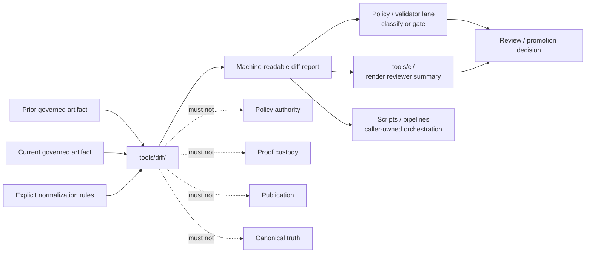

<!-- [KFM_META_BLOCK_V2]
doc_id: kfm://doc/<uuid-NEEDS-VERIFICATION>
title: tools/diff/
type: standard
version: v1
status: draft
owners: @bartytime4life
created: TODO-verify-from-git-history
updated: 2026-04-23
policy_label: public
related: [../README.md, ../../README.md, ../../.github/CODEOWNERS, ../../schemas/, ../../contracts/, ../../policy/, ../../tests/, ../../scripts/, ../../pipelines/, ../ci/, ../validators/, ../attest/, ../catalog/]
tags: [kfm, tools, diff, comparison, deterministic, review]
notes: [doc_id placeholder requires registry assignment; created date requires git-history verification; public label reflects public repository visibility, not a separately verified policy registry entry; current public-main inspection confirmed README placeholder only and did not confirm executable helpers in this lane.]
[/KFM_META_BLOCK_V2] -->

# tools/diff/

Deterministic comparison helpers for review-bearing KFM artifacts without deciding policy, proof, or publication.

> **Status:** experimental  
> **Owners:** `@bartytime4life`  
> **Path:** `tools/diff/README.md`  
> **Truth posture:** `CONFIRMED` directory README placeholder · `PROPOSED` executable helper contract · `UNKNOWN` active local checkout inventory  
>
> 
> 
> 
> 
> 
> 
>
> **Quick jumps:** [Scope](#scope) · [Repo fit](#repo-fit) · [Accepted inputs](#accepted-inputs) · [Exclusions](#exclusions) · [Current evidence snapshot](#current-evidence-snapshot) · [Directory tree](#directory-tree) · [Quickstart](#quickstart) · [Usage](#usage) · [Diff behavior contract](#diff-behavior-contract) · [Diagram](#diagram) · [Reference tables](#reference-tables) · [Task list & definition of done](#task-list--definition-of-done) · [FAQ](#faq) · [Appendix](#appendix)
>
> **Repo fit:** parent [`../README.md`](../README.md) · root [`../../README.md`](../../README.md) · ownership [`../../.github/CODEOWNERS`](../../.github/CODEOWNERS) · adjacent [`../../schemas/`](../../schemas/) · [`../../contracts/`](../../contracts/) · [`../../policy/`](../../policy/) · [`../../tests/`](../../tests/) · [`../../scripts/`](../../scripts/) · [`../../pipelines/`](../../pipelines/) · sibling tools [`../ci/`](../ci/) · [`../validators/`](../validators/) · [`../attest/`](../attest/) · [`../catalog/`](../catalog/)

> [!IMPORTANT]
> `tools/diff/` is not a scripts junk drawer and not a promotion gate. Its job is to make change visible. It may compare governed objects and emit stable review output; it must not decide what is true, what is allowed, what is proof, or what is published.

> [!TIP]
> Keep this trust split visible:
>
> ```text
> receipt ≠ proof ≠ bundle ≠ catalog ≠ publication
> ```
>
> Diff helpers may compare those objects. They must not collapse them into one helper-owned authority.

---

## Scope

`tools/diff/` is the KFM lane for small, reviewable comparison utilities.

Use it to answer questions like:

- What changed between two manifests, receipts, bundles, catalog records, or review artifacts?
- Did a release candidate add, remove, or change declared keys?
- Did a correction or rollback reference drift in a visible way?
- Did a generated summary stay stable while the underlying machine artifact changed?
- Is a proposed change ready for downstream policy evaluation, CI rendering, or steward review?

This lane supports KFM’s evidence-first posture by making drift inspectable. It does **not** replace validators, policy, attestation, catalog closure, release review, or EvidenceBundle resolution.

[Back to top](#toolsdiff)

---

## Repo fit

| Direction | Surface | Fit |
|---|---|---|
| Parent | [`../README.md`](../README.md) | Defines the wider helper family and keeps tools subordinate to KFM lifecycle and trust rules. |
| Upstream identity | [`../../README.md`](../../README.md) | Defines KFM as governed, evidence-first, map-first, and centered on inspectable claims. |
| Ownership | [`../../.github/CODEOWNERS`](../../.github/CODEOWNERS) | Assigns `/tools/diff/` review ownership. |
| Contract boundary | [`../../contracts/`](../../contracts/) | Contracts define meaning; diff helpers consume contract-shaped objects but do not define them. |
| Schema boundary | [`../../schemas/`](../../schemas/) | Schemas define machine validation; diff helpers should not become hidden schema authority. |
| Policy boundary | [`../../policy/`](../../policy/) | Policy classifies allow/deny/review obligations; diff output may inform policy but must not decide it. |
| Proof and test boundary | [`../../tests/`](../../tests/) | Tests should prove comparison behavior, deterministic output, and negative-path handling. |
| Orchestration boundary | [`../../scripts/`](../../scripts/) and [`../../pipelines/`](../../pipelines/) | Scripts and pipelines may call diff helpers; reusable comparison logic should stay inspectable here. |
| Renderer boundary | [`../ci/`](../ci/) | CI renderers may turn diff output into reviewer Markdown; rendering should not recompute diff law. |
| Attestation boundary | [`../attest/`](../attest/) | Attestation handles digest/signature/proof-supporting checks; diff helpers may compare attested objects without signing them. |
| Validator boundary | [`../validators/`](../validators/) | Validators decide shape and gate readiness; diff helpers make prior/current drift visible. |

[Back to top](#toolsdiff)

---

## Accepted inputs

Put artifacts in or under `tools/diff/` when their primary role is deterministic comparison or comparison-adjacent support.

| Accepted input | Belongs here when… |
|---|---|
| Comparison CLIs | They read two or more files and emit stable machine-readable drift output. |
| Canonicalization-before-diff utilities | They normalize ordering or representation before comparison and document every transform. |
| Small support fixtures | They are non-sensitive, tiny, reviewable, and used only to demonstrate comparison behavior. |
| Diff output format notes | They document machine-readable fields consumed by tests, validators, scripts, pipelines, or CI renderers. |
| Thin wrappers | They make the same comparison runnable locally and in CI without hiding logic in workflow YAML. |
| README-first helper plans | They describe a future helper boundary before code lands, while clearly marking it `PROPOSED`. |

Strong fit examples:

- manifest or release-bundle comparisons
- receipt/proof reference drift checks
- catalog membership comparisons
- top-level JSON key additions/removals/changes
- geometry summary deltas after upstream geometry processing
- correction, rollback, or supersession artifact comparisons

[Back to top](#toolsdiff)

---

## Exclusions

| Does not belong here | Better home | Why |
|---|---|---|
| Lifecycle orchestration | [`../../scripts/`](../../scripts/) or [`../../pipelines/`](../../pipelines/) | Comparison and choreography are different responsibilities. |
| Source ingestion, probes, watchers, or ETL | [`../probes/`](../probes/) or pipeline lanes | Diff helpers should compare outputs, not fetch or stage source data. |
| Canonical schema definitions | [`../../schemas/`](../../schemas/) | The diff lane must not become implicit machine-contract authority. |
| Human-readable contract law | [`../../contracts/`](../../contracts/) | Contracts define meaning; diff helpers consume declared structures. |
| Policy decisions | [`../../policy/`](../../policy/) | Diff output can support policy, but policy owns classification. |
| Validator gates | [`../validators/`](../validators/) | Validators prove readiness and fail closed; diff helpers expose drift. |
| Signature, attestation, or proof custody | [`../attest/`](../attest/) and proof homes | Diff helpers may compare proof-bearing objects without becoming proof authority. |
| Reviewer Markdown rendering | [`../ci/`](../ci/) | CI renderers produce reviewer summaries from already-produced machine artifacts. |
| Hidden mutation, auto-fix, or auto-publish behavior | Nowhere in this lane | KFM promotion is a governed state transition, not a file move or convenience side effect. |
| Sensitive exact-location fixtures or private data | Restricted lifecycle homes after policy review | Public helper lanes must stay safe to clone, test, and review. |

> [!WARNING]
> A diff helper that rewrites inputs, resolves policy, promotes artifacts, or turns a receipt into proof has crossed out of `tools/diff/`.

[Back to top](#toolsdiff)

---

## Current evidence snapshot

| Evidence item | Status | How this README uses it |
|---|---:|---|
| `tools/diff/README.md` exists in public main as a skeletal placeholder | **CONFIRMED** | This revision replaces the placeholder with a repo-ready lane README. |
| `tools/diff/stable_diff.py` was not confirmed on public main during this authoring pass | **CONFIRMED absent / NEEDS VERIFICATION** | Executable helper claims are marked `PROPOSED` until the working branch proves otherwise. |
| `tools/` includes a visible `diff/` child lane in the public directory listing | **CONFIRMED** | Grounds this file as a real child-lane README, not a hypothetical path. |
| `CODEOWNERS` assigns `/tools/diff/` to `@bartytime4life` | **CONFIRMED** | Grounds the owner line in the impact block. |
| Parent `tools/README.md` treats diff helpers as a future or lineage helper family | **CONFIRMED drift / context** | This README keeps executable inventory bounded rather than claiming the fuller lane is implemented. |
| Local mounted checkout was not available in this ChatGPT workspace | **CONFIRMED in-session** | Runtime behavior, branch status, CI results, and exact helper inventory remain `UNKNOWN`. |

[Back to top](#toolsdiff)

---

## Directory tree

### Current public-main lane shape

```text
tools/diff/
└── README.md
```

### Proposed first executable shape

```text
tools/diff/
├── README.md
└── stable_diff.py        # PROPOSED until present in the working branch

tests/diff/
└── test_stable_diff.py   # PROPOSED proof surface for the first helper
```

### Proposed future growth shape

```text
tools/diff/
├── README.md
├── stable_diff.py
├── canonicalize_for_diff.py
├── summarize_geometry_delta.py
└── examples/
```

> [!NOTE]
> The proposed shapes are intentionally small. Do not add a family of helpers until the first helper has a documented contract, fixtures, negative-path tests, and a caller that needs it.

[Back to top](#toolsdiff)

---

## Quickstart

Run these checks before adding, renaming, or deleting anything under `tools/diff/`.

### 1. Confirm branch and lane inventory

```bash
git status --short
git branch --show-current || true

test -d tools/diff && find tools/diff -maxdepth 3 \( -type f -o -type d \) | sort
test -d tests/diff && find tests/diff -maxdepth 3 \( -type f -o -type d \) | sort
```

### 2. Recheck owner and neighboring surfaces

```bash
sed -n '1,220p' .github/CODEOWNERS
sed -n '1,260p' tools/README.md
sed -n '1,220p' tools/validators/README.md 2>/dev/null || true
sed -n '1,220p' tools/ci/README.md 2>/dev/null || true
sed -n '1,220p' policy/README.md 2>/dev/null || true
sed -n '1,220p' schemas/README.md 2>/dev/null || true
sed -n '1,220p' tests/README.md 2>/dev/null || true
```

### 3. Search for existing callers before inventing a helper name

```bash
grep -RIn \
  "tools/diff\|stable_diff\|deterministic diff\|bundle diff\|manifest diff\|receipt_ref\|proof_ref" \
  README.md .github docs scripts tests policy contracts schemas tools pipelines data 2>/dev/null || true
```

### 4. Syntax-check helper code when present

```bash
find tools/diff -type f -name "*.py" -print0 2>/dev/null | xargs -0 -r -n1 python -m py_compile
find tools/diff -type f -name "*.sh" -print0 2>/dev/null | xargs -0 -r -n1 bash -n
```

[Back to top](#toolsdiff)

---

## Usage

### Add a comparison helper

When adding a helper to this lane, land the helper, docs, fixtures, and tests together.

1. Name the caller first: local review, CI, validator flow, release review, correction drill, or pipeline lane.
2. Define the input classes and required preconditions.
3. Keep the helper read-only by default.
4. Document any canonicalization step before using it.
5. Emit stable machine-readable output if any caller will parse the result.
6. Add valid, changed, malformed, and missing-input tests.
7. Keep renderer output in [`../ci/`](../ci/) rather than here.

### Compare two governed artifacts

A comparison belongs here when it:

- reads state without becoming the system of record
- produces deterministic output
- fails clearly on missing, malformed, or unsupported inputs
- does not publish, mutate, sign, validate, or promote authoritative truth
- can be reused by humans and automation

Recommended comparison order:

```text
same artifact class
  -> explicit normalization
  -> stable machine-readable diff
  -> optional downstream policy classification
  -> optional downstream CI reviewer rendering
```

[Back to top](#toolsdiff)

---

## Diff behavior contract

### Current implementation contract

`UNKNOWN`: no executable comparator was confirmed in this lane during this authoring pass.

### Proposed first helper contract

The first helper should stay intentionally narrow:

```text
tools/diff/stable_diff.py
```

It should compare two JSON documents after documented stable ordering and report:

- status: `same` or `changed`
- blocking: `false` by default unless a caller explicitly requests fail-on-change semantics
- added top-level keys
- removed top-level keys
- changed top-level keys
- left/right input references

Illustrative output shape:

```json
{
  "tool": "stable-diff",
  "status": "changed",
  "blocking": false,
  "left": "left.json",
  "right": "right.json",
  "summary": {
    "added": ["new_key"],
    "removed": ["old_key"],
    "changed": ["shared_key"]
  }
}
```

> [!IMPORTANT]
> Do not assert nested semantic diff, geometry interpretation, policy classification, proof validity, or release readiness until those contracts are explicitly implemented and tested.

### First proof-file expectation

A minimal proof landing should cover:

```text
tests/diff/
├── test_stable_diff.py
└── fixtures/
    ├── same/
    │   ├── left.json
    │   └── right.json
    ├── changed/
    │   ├── left.json
    │   └── right.json
    └── malformed/
        └── broken.json
```

Recommended first assertions:

- equivalent JSON under different key order reports `same`
- added, removed, and changed top-level keys are reported deterministically
- malformed JSON fails clearly
- missing input fails clearly
- optional `--fail-on-change` exits non-zero while still writing machine-readable output

[Back to top](#toolsdiff)

---

## Diagram



Diagram status: **PROPOSED operating boundary**, grounded in the current KFM trust split. It is not a claim that every node is currently wired end-to-end.

[Back to top](#toolsdiff)

---

## Reference tables

### Lane responsibility matrix

| Lane | Owns | Does not own |
|---|---|---|
| `tools/diff/` | comparison and drift visibility | policy, proof, publication, canonical schema, renderer prose |
| `tools/ci/` | reviewer-readable summaries from existing machine outputs | diff computation or policy law |
| `tools/validators/` | readiness checks, schema/linkage validation, fail-closed gate behavior | reviewer prose or canonical truth |
| `tools/attest/` | digest/signature/attestation support | prior/current semantic comparison |
| `policy/` | allow/deny/review classification and obligations | raw comparison mechanics |
| `schemas/` | machine-readable shape | runtime comparison behavior |
| `contracts/` | human-readable meaning and invariants | helper implementation |
| `scripts/` / `pipelines/` | orchestration and domain flows | reusable comparison law hidden in glue |

### Truth labels

| Label | Use in this README |
|---|---|
| `CONFIRMED` | Verified from current public repo inspection, current workspace inspection, or attached KFM doctrine. |
| `INFERRED` | Strongly suggested by nearby docs and KFM architecture, but not proven as implemented behavior. |
| `PROPOSED` | Intended target shape or first landing contract. |
| `UNKNOWN` | Not verified because the active checkout, runtime, tests, or helper code were unavailable. |
| `NEEDS VERIFICATION` | Requires a concrete branch-local check before merge or stronger claims. |

[Back to top](#toolsdiff)

---

## Task list & definition of done

### Minimum next landing

- [ ] Verify the working branch inventory for `tools/diff/`.
- [ ] Replace this README placeholder in the real checkout.
- [ ] Decide whether the first helper is `stable_diff.py` or another narrower name.
- [ ] Add non-sensitive fixtures for `same`, `changed`, malformed input, and missing input.
- [ ] Add `tests/diff/test_stable_diff.py` or the repo-native equivalent.
- [ ] Document exact CLI flags and output fields.
- [ ] Add syntax checks for every helper file.
- [ ] Wire one downstream caller only after the helper contract is green.

### Definition of done for this lane

A `tools/diff/` change is done enough when:

- [ ] inputs and output shape are documented
- [ ] helper behavior is deterministic
- [ ] helper is read-only by default
- [ ] missing and malformed inputs fail clearly
- [ ] fixtures are tiny and non-sensitive
- [ ] tests prove comparison behavior without policy or renderer overreach
- [ ] downstream renderers consume output rather than recomputing it
- [ ] policy and validator lanes remain separate
- [ ] no helper mutates lifecycle state, signs artifacts, stores proofs, or publishes outputs
- [ ] README and adjacent docs are updated when behavior changes

[Back to top](#toolsdiff)

---

## FAQ

### Does `tools/diff/` decide whether a change blocks release?

No. A diff helper may expose drift and may set a caller-requested `blocking` flag in a report, but release classification belongs to policy, validator, review, and promotion surfaces.

### Can a diff helper compare receipts or proofs?

Yes, if it treats them as input artifacts and preserves their separate roles. It may report changed fields or references. It must not decide that a receipt is proof.

### Should reviewer Markdown live here?

No. Machine-readable diff output belongs here. Reviewer Markdown belongs in a renderer lane such as [`../ci/`](../ci/), unless the repo later records a different convention.

### Can this lane canonicalize JSON before diffing?

Yes, but only when the canonicalization is explicit, stable, documented, and tested. Hidden normalization is a trust risk.

### Is `stable_diff.py` confirmed?

No. It is the proposed first executable helper name for this README unless the working branch proves otherwise.

[Back to top](#toolsdiff)

---

## Appendix

<details>
<summary>Maintainer checklist for branch-local verification</summary>

Run before making implementation claims:

```bash
git status --short
git branch --show-current || true
git rev-parse --show-toplevel

find tools/diff -maxdepth 4 -type f | sort 2>/dev/null || true
find tests/diff -maxdepth 4 -type f | sort 2>/dev/null || true

grep -RIn \
  "tools/diff\|stable_diff\|deterministic diff\|bundle diff\|manifest diff" \
  README.md .github docs scripts tests policy contracts schemas tools pipelines data 2>/dev/null || true

sed -n '1,220p' .github/CODEOWNERS
sed -n '1,260p' tools/README.md
```

Record the result in the PR description with `CONFIRMED`, `PROPOSED`, `UNKNOWN`, and `NEEDS VERIFICATION` labels.

</details>

<details>
<summary>Starter output contract for future tests</summary>

```json
{
  "tool": "stable-diff",
  "status": "same",
  "blocking": false,
  "left": "left.json",
  "right": "right.json",
  "summary": {
    "added": [],
    "removed": [],
    "changed": []
  }
}
```

Keep this tiny until the helper contract really grows.

</details>

[Back to top](#toolsdiff)
