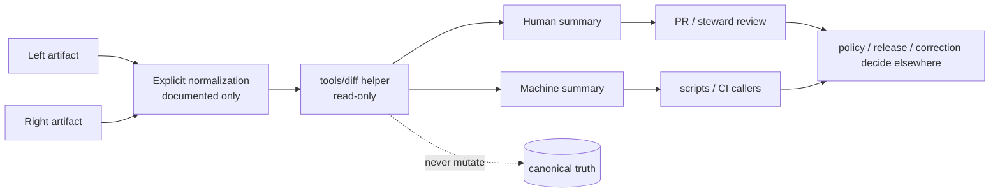

# diff

Deterministic comparison helpers for manifests, snapshots, release artifacts, geometry summaries, and other review-bearing Kansas Frontier Matrix objects.

> **Status:** experimental  
> **Owners:** `@bartytime4life`  
>        
> **Quick jumps:** [Scope](#scope) · [Repo fit](#repo-fit) · [Accepted inputs](#accepted-inputs) · [Exclusions](#exclusions) · [Current evidence snapshot](#current-evidence-snapshot) · [Directory tree](#directory-tree) · [Quickstart](#quickstart) · [Usage](#usage) · [Diff behavior contract](#diff-behavior-contract) · [Diagram](#diagram) · [Reference tables](#reference-tables) · [Task list](#task-list--definition-of-done) · [FAQ](#faq) · [Appendix](#appendix)  
> **Repo fit:** target file `tools/diff/README.md` · parent [`../README.md`](../README.md) · root [`../../README.md`](../../README.md) · governance [`../../.github/README.md`](../../.github/README.md) · adjacent [`../../scripts/README.md`](../../scripts/README.md) · [`../../contracts/README.md`](../../contracts/README.md) · [`../../schemas/README.md`](../../schemas/README.md) · [`../../policy/README.md`](../../policy/README.md) · [`../../tests/README.md`](../../tests/README.md) · downstream [`../../.github/workflows/README.md`](../../.github/workflows/README.md)  
> **Evidence posture:** doctrine-grounded · repo-grounded for current public `main` · deeper local checkout, workflow callers, and executable helper inventory remain bounded  
> **Current public snapshot:** `tools/diff/` currently renders as `README.md` only. The parent `tools/` lane now visibly includes sibling families — `attest/`, `catalog/`, `ci/`, `diff/`, `docs/`, `probes/`, and `validators/` — so this README documents a real lane inside an active helper family while keeping executable diff inventory bounded.  
> **Accepted inputs:** deterministic comparison helpers, explicit canonicalization-before-diff utilities, reviewer-facing summaries, machine-readable comparison output, and tiny non-sensitive support assets.  
> **Exclusions:** orchestration, promotion logic, policy decisions, canonical schema ownership, long-running runtime code, and hidden mutation shortcuts.

> [!IMPORTANT]
> `tools/diff/` is not a convenience bin for ad hoc one-liners. In KFM it is the reviewable comparison surface that helps humans, scripts, and CI see **what changed** without quietly deciding **what should be published**.

> [!NOTE]
> The parent `tools/` README already treats `diff/` as a named helper family. Current public tree inspection goes one step further: `tools/` now exposes sibling family directories around this lane, while `tools/diff/` itself remains README-first.

## Scope

`tools/diff/` is the KFM lane for small, explicit utilities whose main job is to compare two or more governed objects and emit stable, reviewable output.

Typical use cases include:

- comparing release manifests, run receipts, runtime envelopes, correction notices, catalog closures, or proof-pack members
- comparing normalized JSON-, GeoJSON-, or manifest-like snapshots
- summarizing geometry or support changes for review
- emitting machine-readable diff results for CI, scripts, or steward workflows
- producing human-readable summaries for PRs, release review, correction review, or rollback drills

That makes this lane useful precisely because it is **not** the place where policy law, schema authority, publication approval, or long-running business logic should accumulate.

What this README does:

1. describes the current public state honestly
2. defines the operating contract for the `diff/` lane
3. separates current subtree fact from documentary target shape
4. keeps KFM’s truth posture visible by marking what is **CONFIRMED**, **INFERRED**, **PROPOSED**, **UNKNOWN**, or **NEEDS VERIFICATION**

### Evidence markers used in this README

| Marker | Meaning here |
| --- | --- |
| **CONFIRMED** | Supported by current public repo files, current public tree inspection, or attached KFM doctrine already provided in this project session |
| **INFERRED** | Strongly suggested by parent `tools/` guidance and adjacent repo docs, but not proven as live executable `tools/diff/` inventory |
| **PROPOSED** | Target shape, placement rule, or starter helper contract consistent with KFM doctrine |
| **UNKNOWN** | Not established strongly enough from visible repo or workspace evidence |
| **NEEDS VERIFICATION** | Path, caller, owner, or merge-gate detail that should be checked in the active checkout before being treated as settled fact |

[Back to top](#diff)

## Repo fit

**Path:** `tools/diff/README.md`  
**Role:** directory README for deterministic comparison helpers, reviewer summaries, and diff-oriented support CLIs.

| Direction | Surface | Why it matters |
| --- | --- | --- |
| Parent | [`../README.md`](../README.md) | `tools/` defines the broader helper-surface doctrine and names `diff/` as one of the preferred tool families |
| Upstream | [`../../README.md`](../../README.md) | Root repo identity and verification-first posture |
| Governance | [`../../.github/README.md`](../../.github/README.md) | Repository gatehouse and review-routing guidance |
| Governance | [`../../.github/CODEOWNERS`](../../.github/CODEOWNERS) | Current owner map for `/tools/` and adjacent governed surfaces |
| Related family lanes | [`../attest/README.md`](../attest/README.md), [`../catalog/README.md`](../catalog/README.md), [`../ci/README.md`](../ci/README.md), [`../docs/README.md`](../docs/README.md), [`../probes/README.md`](../probes/README.md), [`../validators/README.md`](../validators/README.md) | sibling helper lanes with adjacent concerns that should stay coherent with diff behavior |
| Adjacent | [`../../scripts/README.md`](../../scripts/README.md) | `scripts/` may call diff helpers, but reusable comparison logic should not be buried there |
| Adjacent | [`../../contracts/README.md`](../../contracts/README.md) | Diff helpers compare typed objects; they do not define their canonical shape |
| Adjacent | [`../../schemas/README.md`](../../schemas/README.md) | Repo currently exposes a schema surface; `tools/diff/` must not silently arbitrate schema authority |
| Adjacent | [`../../policy/README.md`](../../policy/README.md) | Policy may consume diff output, but policy does the deciding |
| Adjacent | [`../../tests/README.md`](../../tests/README.md) | Fixtures and assertions should prove diff behavior explicitly |
| Downstream caller | [`../../.github/workflows/README.md`](../../.github/workflows/README.md) | Workflows may invoke diff helpers, but logic should stay inspectable outside YAML |

### Why this directory matters in KFM

KFM’s governing docs repeatedly treat receipts, manifests, evidence bundles, proof packs, correction objects, and review artifacts as part of the trust model, not as decorative packaging. A comparison lane matters because reviewers often need to answer concrete questions:

- What changed between the last released object and this candidate?
- Did identifiers drift?
- Did outward links, evidence members, or digest references change?
- Is a geometry change small, large, or obviously malformed?
- Did a correction narrow, supersede, or replace something?

`tools/diff/` exists so those questions can be answered in a stable, review-friendly way without silently turning comparison logic into policy law or publication authority.

[Back to top](#diff)

## Accepted inputs

The following belong in or under `tools/diff/` when they remain comparison-oriented and review-friendly:

- deterministic comparison helpers for manifests, receipts, catalog closures, snapshots, proof artifacts, runtime envelopes, or geometry summaries
- explicit canonicalization helpers used **before** diffing, where normalization rules are documented and reviewable
- machine-readable comparison output intended for CI, scripts, or audit joins
- reviewer/operator helpers that summarize additions, removals, identifier drift, field-level change, or geometry materiality
- tiny helper assets or formatters needed to keep diff output stable
- thin wrappers that make the same comparison lane runnable locally and in CI

### Boundary map

| Surface | Belongs there when… | Does **not** belong there when… |
| --- | --- | --- |
| `tools/diff/` | the artifact’s main job is compare / summarize / fail clearly / emit reviewable output | it orchestrates staged lifecycle work, publishes data, or decides policy |
| `scripts/` | the artifact coordinates operator choreography, staged movement, or transition flow and may call diff helpers | the logic is really a reusable comparator or stable reviewer-facing CLI |
| `contracts/` | the artifact defines schema, vocabulary, or object shape | it performs executable comparison logic |
| `schemas/` | the artifact belongs to the repo’s declared schema surface | it quietly turns convenience choices into diff law |
| `policy/` | the artifact decides allow / deny / obligation / reason behavior | it merely compares artifacts for later review |
| `tests/` | the artifact is primarily a fixture, assertion, or negative-path proof | it is the primary operational CLI or maintainer-facing helper |
| `packages/` | the logic is shared library code imported across multiple repo surfaces | it only exists as a thin comparison entrypoint |

## Exclusions

| Does **not** belong here | Put it in | Why |
| --- | --- | --- |
| Lifecycle orchestration, promotion support, rollback choreography | [`../../scripts/README.md`](../../scripts/README.md) | comparison and choreography are different responsibilities |
| Canonical policy bundles, decision grammar, allow/deny logic | [`../../policy/README.md`](../../policy/README.md) | diff output may inform policy, but policy remains the source of truth |
| Authoritative schema or contract ownership | [`../../contracts/README.md`](../../contracts/README.md) and/or [`../../schemas/README.md`](../../schemas/README.md) | comparison tools consume declared structures; they should not redefine them |
| Long-running service code, handlers, or public runtime behavior | app or package lanes | helper CLIs are not runtime surfaces |
| Hidden mutation, auto-promote, or silent auto-fix shortcuts | nowhere | KFM review and promotion must remain governed and inspectable |
| Sensitive fixture dumps or unrestricted precise-location exports | secured data lanes | public helper surfaces must stay safe to clone and review |
| Inline workflow shell blobs as the only implementation | stable tool entrypoints plus documented workflows | reviewers should be able to locate comparison logic outside CI YAML |

> [!WARNING]
> A diff helper that quietly rewrites inputs, resolves policy, or publishes artifacts has already crossed the boundary out of `tools/diff/`.

## Current evidence snapshot

| Evidence item | Status | How this README uses it |
| --- | --- | --- |
| Public `tools/` root now exposes `attest/`, `catalog/`, `ci/`, `diff/`, `docs/`, `probes/`, and `validators/` alongside `README.md` | **CONFIRMED** | grounds that `diff/` is a live child lane in the checked-in helper family |
| Public `tools/diff/` page lists `README.md` only | **CONFIRMED** | prevents overclaiming executable helper inventory |
| Visible sibling helper lanes each currently expose a `README.md` on public `main` | **CONFIRMED** | supports README-first lane navigation and a shared family pattern |
| Parent `tools/README.md` names `diff/` as a helper family | **CONFIRMED** | grounds the lane role and directory naming |
| Parent `tools/README.md` includes `tools/diff/stable_diff.py` as a design-note example path | **CONFIRMED documentary evidence** / **PROPOSED implementation** | used here only as an illustrative starter path, never as current-tree proof |
| `.github/CODEOWNERS` assigns `/tools/` to `@bartytime4life` | **CONFIRMED** | grounds the owners line and review expectation |
| Adjacent `scripts/`, `contracts/`, `schemas/`, `policy/`, `tests/`, and `.github/workflows/` README surfaces exist on public `main` | **CONFIRMED** | grounds relative links and boundary language |
| Exact local checkout inventory, executable diff helpers, fixture catalog, and workflow callers | **UNKNOWN** | kept visibly bounded until the active checkout is inspected directly |

[Back to top](#diff)

## Directory tree

### Current public `tools/` family snapshot

```text
tools/
├── README.md
├── attest/
│   └── README.md
├── catalog/
│   └── README.md
├── ci/
│   └── README.md
├── diff/
│   └── README.md
├── docs/
│   └── README.md
├── probes/
│   └── README.md
└── validators/
    └── README.md
```

### Current public `tools/diff/` snapshot

```text
tools/
└── diff/
    └── README.md
```

> [!NOTE]
> The presence of `tools/diff/` is confirmed. The presence of executable helpers inside `tools/diff/` is not.

### PROPOSED minimal landing shape for the first executable helper

```text
tools/
└── diff/
    ├── README.md
    └── stable_diff.py   # PROPOSED starter helper, not current public-tree proof
```

### Reading rule for this tree

Use the split above intentionally:

- the first two trees are **current public-tree fact**
- the third tree is a **preferred landing shape**
- anything beyond that remains **UNKNOWN** or **NEEDS VERIFICATION** until the active checkout is inspected directly

[Back to top](#diff)

## Quickstart

The commands below are inventory-first. Run them before adding, renaming, or deleting anything under `tools/diff/`.

1. Confirm what actually exists in the lane.

```bash
test -d tools/diff && find tools/diff -maxdepth 3 \( -type f -o -type d \) | sort
```

2. Recheck parent helper doctrine, ownership, and sibling family neighbors.

```bash
sed -n '1,240p' tools/README.md 2>/dev/null
sed -n '1,120p' .github/CODEOWNERS 2>/dev/null
find tools -maxdepth 2 -type f | sort 2>/dev/null
sed -n '1,220p' .github/workflows/README.md 2>/dev/null
```

3. Search for callers and documentary references before inventing a new helper name.

```bash
grep -RIn "tools/diff\|stable_diff\|deterministic diff" \
  README.md .github docs scripts tests policy contracts schemas tools 2>/dev/null || true
```

4. Inspect adjacent stronger surfaces before introducing comparison rules.

```bash
sed -n '1,220p' scripts/README.md 2>/dev/null
sed -n '1,220p' contracts/README.md 2>/dev/null
sed -n '1,220p' schemas/README.md 2>/dev/null
sed -n '1,220p' policy/README.md 2>/dev/null
```

5. Syntax-check candidate helpers **only when they actually exist**.

```bash
find tools/diff -type f -name "*.py" -print0 2>/dev/null | xargs -0 -r -n1 python -m py_compile
find tools/diff -type f -name "*.sh" -print0 2>/dev/null | xargs -0 -r -n1 bash -n
```

> [!TIP]
> If the local tree still matches the README-only snapshot, treat this file as the lane contract and landing plan for the first executable helper, not as evidence that the helper already exists.

[Back to top](#diff)

## Usage

### Add the first executable helper into a README-first lane

When `tools/diff/` still contains only documentation, land the first helper with its caller and proof burden in the same change.

1. identify the caller surface first: local review, CI gate, release review, correction drill, or operator workflow
2. create the helper under the narrowest descriptive name that matches its actual job
3. keep the helper read-only by default
4. add fixtures or negative-path tests in [`../../tests/README.md`](../../tests/README.md) at the same time
5. document inputs, outputs, side effects, and blocking conditions in this README
6. keep the change small enough that reviewers can verify purpose and failure behavior in one pass

### Compare two governed artifacts

A comparison belongs in this lane when it:

- reads or compares state without becoming the system of record
- produces deterministic, reviewable output
- can fail clearly when a documented blocking condition is detected
- does not silently publish, mutate, or promote authoritative truth
- is useful both to humans and to automation

Recommended sequence:

1. confirm both inputs are the same logical artifact class
2. apply only explicit, documented normalization
3. emit a machine-readable summary if any caller will parse the result
4. emit a human-readable summary if a reviewer will need to inspect the change
5. route the result outward to scripts, CI, review, or policy lanes as appropriate

### Wire diff helpers into scripts or CI

Keep orchestration and comparison logic distinct:

1. let [`../../scripts/README.md`](../../scripts/README.md) own staged movement, scheduling, or operator choreography
2. let `tools/diff/` own reusable comparison, summarization, and stable exit semantics
3. keep workflow YAML small by calling stable helper entrypoints instead of embedding large shell blobs
4. make the same helper runnable locally and in CI
5. document the caller path and the helper together whenever either one becomes merge-blocking

### Use geometry-aware comparison carefully

Geometry comparison may belong here when the helper remains read-only and reviewer-facing. Good outputs include:

- bounding-box or extent delta
- count / part / ring / vertex summaries
- area or length change summaries
- stable identifiers for changed features
- machine-readable change counts

What does **not** belong here is silent snapping, dissolving, topology repair, or any other mutation that changes authoritative geometry while pretending to be “just a diff.”

[Back to top](#diff)

## Diff behavior contract

### Required posture

| Concern | Required posture |
| --- | --- |
| Determinism | same inputs should yield the same output shape and exit semantics |
| Read-only default | comparison should inspect state, not rewrite it |
| Canonicalization | sorting, trimming, key order, or formatting rules must be explicit and documented |
| Output shape | prefer JSON/JSONL or another stable machine-readable format when automation consumes output |
| Reviewer readability | output should also support compact human review where practical |
| Provenance joinability | summaries should carry enough IDs, digests, refs, or paths to join back to manifests, receipts, or release objects |
| Materiality discipline | a helper may report change magnitude; it must not silently convert magnitude into publication approval |
| Safety | no secret scraping, unrestricted sensitive fixtures, or logs that leak restricted material |
| Boundary discipline | no direct bypass of policy, review, release evidence, or the trust membrane |
| Local / CI parity | a merge-blocking helper should be runnable locally with the same core behavior used in CI |

### Illustrative starter output shape (**PROPOSED**)

```json
{
  "tool": "stable_diff",
  "status": "changed",
  "blocking": false,
  "left": "data/catalog/stac/items/place-a.json",
  "right": "data/catalog/stac/items/place-b.json",
  "summary": {
    "added": 2,
    "removed": 0,
    "changed": 4
  },
  "notes": [
    "normalized key order applied",
    "no policy decision made in this lane"
  ]
}
```

> [!IMPORTANT]
> “Fail closed” in this directory does **not** mean every difference is fatal. It means that documented blocking conditions block consistently, visibly, and without quietly rewriting the evidence of what changed.

[Back to top](#diff)

## Diagram



[Back to top](#diff)

## Reference tables

### Comparison class matrix

| Comparison class | Typical question | Good output | Final decision lives in |
| --- | --- | --- | --- |
| Release manifest vs release manifest | What changed between candidate and baseline? | added / removed / changed fields, digest drift, missing refs | review + release lanes |
| Run receipt / AI receipt vs same class | Did evidence refs, digests, runtime metadata, or obligations change? | field diff, checksum drift, missing-link summary, machine-readable comparison output | review + policy lanes |
| Catalog closure vs catalog closure | Did outward identifiers or links drift? | missing-link summary, identifier diff, outward-profile delta | catalog validation + review |
| Evidence bundle vs evidence bundle | Did support members, transforms, or citations change? | bundle member diff, transform summary, missing refs | evidence + review lanes |
| Correction notice vs correction notice | Did the correction narrow, supersede, withdraw, or replace cleanly? | affected-release summary, replacement refs, scope delta | correction + review lanes |
| Snapshot vs snapshot | Did the normalized object materially change? | stable field diff, counts, optional machine-readable summary | caller-specific |
| Geometry support artifact vs geometry support artifact | Is the spatial change small, large, or obviously malformed? | extent / area / count / vertex summaries | stewardship + policy lanes |

### Naming and placement rules

| Prefer | Avoid | Why |
| --- | --- | --- |
| `tools/diff/` | comparison logic hidden in workflow YAML | reviewers should be able to inspect the helper directly |
| `stable_diff.py` or another descriptive entrypoint | `check.py` / `run.py` / `main.py` | names should reveal the guarded contract |
| explicit normalization flags | undocumented in-code rewriting | reviewers need to know what changed before the comparison |
| `scripts/` for orchestration | promotion choreography hidden in `tools/diff/` | reusable comparison and lifecycle movement are different concerns |
| `contracts/` / `schemas/` for authority | helper code silently choosing schema law | repo-wide authority should be declared, not inferred from tool convenience |

[Back to top](#diff)

## Task list / Definition of done

- [ ] the helper has one narrow, documented purpose
- [ ] directory placement matches the helper’s real job
- [ ] inputs, outputs, and side effects are explicit
- [ ] read-only is the default unless an exception is deliberately documented
- [ ] exit semantics are explicit and tested
- [ ] at least one representative success path and one failing path exist
- [ ] machine-readable output exists where CI, scripts, or audits need stable parsing
- [ ] the helper does not bypass policy, review, release evidence, or the trust membrane
- [ ] any caller in scripts, workflows, docs, or tests is documented near the helper
- [ ] no secret, restricted, or rights-unclear fixture material was committed
- [ ] this README was updated alongside any new helper path, caller path, or merge-blocking behavior
- [ ] any future `stable_diff.py`-style landing keeps its **PROPOSED** status removed only after the file is actually present and reviewable

[Back to top](#diff)

## FAQ

### Why not just use `git diff`?

`git diff` is still useful. This lane exists for cases where reviewers need deterministic normalization, structured output, artifact-aware summaries, or machine-readable results that plain line diffs do not provide by themselves.

### Does a diff helper decide whether a change is safe to publish?

No. `tools/diff/` can report what changed and how large the change looks. Policy, review, correction, and release surfaces decide what happens next.

### Can `tools/diff/` compare geometry?

Yes, when the helper remains read-only and emits review-facing summaries. Geometry repair, topology fixing, or authoritative rewrites do not belong here.

### Why keep `stable_diff.py` as **PROPOSED** in this README?

Because the parent `tools/` README names that path as a design-note example, but the current public `tools/diff/` subtree does not prove the file exists yet.

### What becomes **CONFIRMED** once the first helper lands?

The executable path, the caller path, the documented inputs/outputs, the exit semantics, and the fixture-backed proof burden for that helper.

[Back to top](#diff)

## Appendix

<details>
<summary>Illustrative starter CLI shape (<strong>PROPOSED</strong>)</summary>

A first helper in this lane could look like this:

```bash
python tools/diff/stable_diff.py \
  --left data/catalog/stac/items/place-a.json \
  --right data/catalog/stac/items/place-b.json \
  --format json \
  --summary markdown
```

Minimal design expectations for a first helper:

- accepts explicit left/right inputs
- makes normalization rules visible
- emits stable machine-readable output
- returns documented exit semantics
- stays runnable locally and in CI
- does not mutate either input

</details>

<details>
<summary>Current public-main facts this README is built to respect</summary>

1. `tools/diff/` exists on public `main`.
2. `tools/diff/` currently shows `README.md` only.
3. The public `tools/` root now shows sibling helper lanes: `attest/`, `catalog/`, `ci/`, `diff/`, `docs/`, `probes/`, and `validators/`.
4. Each visible sibling helper lane currently exposes a `README.md`.
5. `/tools/` is currently owned by `@bartytime4life`.
6. Adjacent `scripts/`, `contracts/`, `schemas/`, `policy/`, `tests/`, and workflow README surfaces are present and should remain linked together.

</details>
