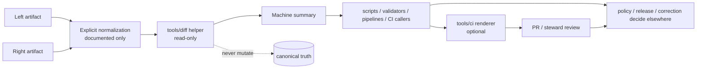

<!-- [KFM_META_BLOCK_V2]
doc_id: kfm://doc/NEEDS_VERIFICATION
title: diff
type: standard
version: v1
status: draft
owners: @bartytime4life
created: NEEDS_VERIFICATION
updated: 2026-04-16
policy_label: public
related: [
  ../README.md,
  ../../README.md,
  ../../.github/README.md,
  ../../.github/CODEOWNERS,
  ../../.github/workflows/README.md,
  ../../.github/watchers/README.md,
  ../../scripts/README.md,
  ../../contracts/README.md,
  ../../schemas/README.md,
  ../../policy/README.md,
  ../../data/receipts/README.md,
  ../../data/proofs/README.md,
  ../../tests/README.md,
  ../../tests/contracts/README.md,
  ../../tools/ci/README.md,
  ../../tools/attest/README.md,
  ../../tools/catalog/README.md,
  ../../tools/validators/README.md,
  ../../tools/validators/promotion_gate/README.md
]
tags: [kfm, tools, diff, comparison, deterministic, review, receipts, proofs, bundles]
notes: [
  Updated to reflect the stable_diff.py thin slice and tests/diff/test_stable_diff.py.
  This revision aligns the diff lane with the newer workflow, receipt, proof, validator, attestation, CI-renderer, and promotion-gate documentation.
  doc_id placeholder requires repo UUID assignment; created date requires git-history verification; policy_label reflects current public-main visibility rather than a separately verified policy registry entry.
]
[/KFM_META_BLOCK_V2] -->

<a id="top"></a>

# `tools/diff/`

Deterministic comparison helpers for manifests, snapshots, release artifacts, catalog closures, receipt/proof-bearing trust objects, geometry summaries, and other review-bearing Kansas Frontier Matrix objects.

> [!NOTE]
> **Status:** experimental  
> **Owners:** `@bartytime4life`  
> **Path:** `tools/diff/README.md`  
>          
> **Quick jumps:** [Scope](#scope) · [Repo fit](#repo-fit) · [Accepted inputs](#accepted-inputs) · [Exclusions](#exclusions) · [Current evidence snapshot](#current-evidence-snapshot) · [Directory tree](#directory-tree) · [Quickstart](#quickstart) · [Usage](#usage) · [Diff behavior contract](#diff-behavior-contract) · [Diagram](#diagram) · [Reference tables](#reference-tables) · [Task list / definition of done](#task-list--definition-of-done) · [FAQ](#faq) · [Appendix](#appendix)  
> **Repo fit:** target file `tools/diff/README.md` · parent [`../README.md`](../README.md) · root [`../../README.md`](../../README.md) · governance [`../../.github/README.md`](../../.github/README.md) and [`../../.github/CODEOWNERS`](../../.github/CODEOWNERS) · workflow boundary [`../../.github/workflows/README.md`](../../.github/workflows/README.md) · watcher boundary [`../../.github/watchers/README.md`](../../.github/watchers/README.md) · adjacent [`../../scripts/README.md`](../../scripts/README.md), [`../../contracts/README.md`](../../contracts/README.md), [`../../schemas/README.md`](../../schemas/README.md), [`../../policy/README.md`](../../policy/README.md), [`../../data/receipts/README.md`](../../data/receipts/README.md), [`../../data/proofs/README.md`](../../data/proofs/README.md), [`../../tests/README.md`](../../tests/README.md), [`../../tools/ci/README.md`](../../tools/ci/README.md), [`../../tools/attest/README.md`](../../tools/attest/README.md), [`../../tools/catalog/README.md`](../../tools/catalog/README.md), [`../../tools/validators/README.md`](../../tools/validators/README.md), and [`../../tools/validators/promotion_gate/README.md`](../../tools/validators/promotion_gate/README.md)  
> **Evidence posture:** doctrine-grounded · repo-grounded for the current thin-slice lane shape plus broader public-tree context · deeper local checkout, workflow callers, and additional executable helper inventory remain bounded  
> **Current lane snapshot:** `tools/diff/` now has one documented executable thin slice plus tests: `stable_diff.py` and `tests/diff/test_stable_diff.py`. Broader helper families remain bounded and explicitly marked `PROPOSED`, `UNKNOWN`, or `NEEDS VERIFICATION`.  
> **Accepted inputs:** deterministic comparison helpers, explicit canonicalization-before-diff utilities, machine-readable comparison output, and tiny non-sensitive support assets.  
> **Exclusions:** orchestration, promotion logic, policy decisions, canonical schema ownership, receipt/proof ownership, long-running runtime code, reviewer rendering, and hidden mutation shortcuts.

> [!IMPORTANT]
> `tools/diff/` is not a convenience bin for ad hoc one-liners. In KFM it is the reviewable comparison surface that helps humans, scripts, pipelines, validators, and CI see **what changed** without quietly deciding **what should be published**, **how policy should classify it**, or **whether a proof should be trusted**.

> [!TIP]
> Keep the KFM trust split visible here:
>
> **receipt ≠ proof ≠ bundle ≠ catalog ≠ publication**
>
> Diff helpers may compare any of these objects. They must not collapse them into one helper-owned authority.

> [!TIP]
> **Current executable snapshot (thin slice)**  
> The current documented thin slice for this lane is:
>
> - `tools/diff/stable_diff.py`
>
> It checks:
>
> - added top-level JSON keys
> - removed top-level JSON keys
> - changed top-level JSON keys
> - deterministic equality under normalized key ordering
>
> Expected proof surface:
>
> - `tests/diff/test_stable_diff.py`
> - optional JSON report for CI and reviewer rendering
>
> The broader lane remains larger than this one executable helper. Richer canonicalization, nested-path diffs, geometry summaries, and reviewer renderers are still **PROPOSED** unless directly verified in the active branch.

> [!NOTE]
> The parent `tools/` README already treats `diff/` as a named helper family. This child README narrows that doctrine to one lane: comparison helpers must stay deterministic, explicit, read-only by default, and subordinate to contracts, policy, receipts, proofs, review, and release evidence.

---

## Scope

`tools/diff/` is the KFM lane for small, explicit utilities whose main job is to compare two or more governed objects and emit stable, reviewable output.

Typical use cases include:

- comparing release manifests, receipts, catalog closures, snapshots, proof artifacts, runtime envelopes, or geometry summaries
- comparing normalized JSON-, GeoJSON-, or manifest-like snapshots
- comparing promotion records, promotion bundles, or other review-bearing trust-chain artifacts
- summarizing geometry or support changes for review
- emitting machine-readable diff results for CI, scripts, pipelines, validators, or audit joins
- producing compact human-readable summaries for PRs, release review, correction review, rollback drills, or steward-facing checks

That makes this lane useful precisely because it is **not** the place where policy law, schema authority, publication approval, receipt ownership, proof ownership, or long-running business logic should accumulate.

What this README does:

1. describes the current lane state honestly
2. defines the operating contract for the `diff/` lane
3. separates current lane fact from target-shape guidance
4. keeps KFM’s truth posture visible by marking what is **CONFIRMED**, **INFERRED**, **PROPOSED**, **UNKNOWN**, or **NEEDS VERIFICATION**
5. makes the newer receipt / proof / validator / CI-renderer boundary explicit

### Evidence markers used in this README

| Marker | Meaning here |
| --- | --- |
| **CONFIRMED** | Supported by current repo files, current tree inspection, or current in-repo KFM doctrine |
| **INFERRED** | Strongly suggested by current repo docs and lane boundaries, but not proven as broader live executable `tools/diff/` inventory |
| **PROPOSED** | Target shape, placement rule, or starter helper guidance consistent with current repo doctrine |
| **UNKNOWN** | Not established strongly enough from visible repo or public docs |
| **NEEDS VERIFICATION** | Path, caller, owner, or merge-gate detail that should be checked on the exact working branch before merge |

[Back to top](#top)

---

## Repo fit

**Path:** `tools/diff/README.md`  
**Role:** directory README for deterministic comparison helpers, machine-readable comparison outputs, and diff-oriented support CLIs.

| Direction | Surface | Why it matters |
| --- | --- | --- |
| Parent | [`../README.md`](../README.md) | `tools/` defines the broader helper-surface doctrine and names `diff/` as one of the preferred tool families |
| Upstream | [`../../README.md`](../../README.md) | root repo identity and verification-first posture |
| Governance | [`../../.github/README.md`](../../.github/README.md) | repository gatehouse and review-routing guidance |
| Governance | [`../../.github/CODEOWNERS`](../../.github/CODEOWNERS) | current owner map for `/tools/` and adjacent governed surfaces |
| Workflow boundary | [`../../.github/workflows/README.md`](../../.github/workflows/README.md) | workflow lane remains a caller/orchestration seam; reusable comparison logic should stay inspectable outside YAML |
| Watcher boundary | [`../../.github/watchers/README.md`](../../.github/watchers/README.md) | watcher lanes may emit receipts or bundle artifacts that later need deterministic comparison without moving watcher logic here |
| Related family lanes | [`../attest/README.md`](../attest/README.md), [`../catalog/README.md`](../catalog/README.md), [`../ci/README.md`](../ci/README.md), [`../docs/README.md`](../docs/README.md), [`../probes/README.md`](../probes/README.md), [`../validators/README.md`](../validators/README.md) | sibling helper lanes with adjacent concerns that should stay coherent with diff behavior |
| Adjacent | [`../../scripts/README.md`](../../scripts/README.md) | `scripts/` may call diff helpers, but reusable comparison logic should not be buried there |
| Adjacent | [`../../contracts/README.md`](../../contracts/README.md) | diff helpers compare typed objects; they do not define their canonical shape |
| Adjacent | [`../../schemas/README.md`](../../schemas/README.md) | repo exposes a schema surface; `tools/diff/` must not silently arbitrate schema authority |
| Adjacent | [`../../policy/README.md`](../../policy/README.md) | policy may consume diff output, but policy does the deciding |
| Adjacent | [`../../data/receipts/README.md`](../../data/receipts/README.md) | receipts are governed process memory; diff helpers may compare them without owning them |
| Adjacent | [`../../data/proofs/README.md`](../../data/proofs/README.md) | proofs remain higher-order trust objects; diff helpers may compare or summarize them without becoming proof authority |
| Adjacent | [`../../tests/README.md`](../../tests/README.md) and [`../../tests/contracts/README.md`](../../tests/contracts/README.md) | fixtures and assertions should prove diff behavior explicitly and keep contract-shaped objects honest |
| Visible execution neighbor | [`../../pipelines/`](../../pipelines/) | execution lanes exist at repo root, but specific diff callers there remain unverified |
| Promotion consumer | [`../../tools/validators/promotion_gate/README.md`](../../tools/validators/promotion_gate/README.md) | promotion review increasingly benefits from deterministic comparison of candidates, prior releases, bundles, and drift reports |
| CI renderer neighbor | [`../../tools/ci/README.md`](../../tools/ci/README.md) | diff outputs are direct inputs for reviewer-readable summaries; diff computation and rendering should remain separate |
| Attestation neighbor | [`../../tools/attest/README.md`](../../tools/attest/README.md) | attested release artifacts may still need deterministic comparison without duplicating signing logic |
| Catalog neighbor | [`../../tools/catalog/README.md`](../../tools/catalog/README.md) | catalog closure checks may depend on deterministic comparison of outward records or bundle membership without becoming metadata truth |

### Why this directory matters in KFM

KFM’s governing docs repeatedly treat receipts, manifests, evidence bundles, proof packs, correction objects, and review artifacts as part of the trust model, not as decorative packaging. A comparison lane matters because reviewers often need to answer concrete questions:

- What changed between the last released object and this candidate?
- Did identifiers drift?
- Did outward links, evidence members, or digest references change?
- Is a geometry change small, large, or obviously malformed?
- Did a correction narrow, supersede, or replace something?
- Did a promotion bundle grow, shrink, or lose a trust-visible artifact?
- Did receipt or proof references drift without an explained reason?
- Did a composed bundle change while its reviewer-facing summary stayed stable?

`tools/diff/` exists so those questions can be answered in a stable, review-friendly way without silently turning comparison logic into policy law, publication authority, validator law, or proof ownership.

[Back to top](#top)

---

## Accepted inputs

The following belong in or under `tools/diff/` when they remain comparison-oriented and review-friendly:

- deterministic comparison helpers for manifests, receipts, catalog closures, snapshots, proof artifacts, runtime envelopes, or geometry summaries
- explicit canonicalization helpers used **before** diffing, where normalization rules are documented and reviewable
- machine-readable comparison output intended for CI, scripts, pipelines, validators, or audit joins
- tiny helper assets or formatters needed to keep diff output stable
- thin wrappers that make the same comparison lane runnable locally and in CI

### Boundary map

| Surface | Belongs there when… | Does **not** belong there when… |
| --- | --- | --- |
| `tools/diff/` | the artifact’s main job is compare / summarize / fail clearly / emit reviewable output | it orchestrates staged lifecycle work, publishes data, renders reviewer Markdown, or decides policy |
| `scripts/` | the artifact coordinates operator choreography, staged movement, or transition flow and may call diff helpers | the logic is really a reusable comparator or stable machine-oriented CLI |
| `pipelines/` | the artifact is a domain-specific execution lane that may invoke diff helpers as part of a larger flow | the comparison logic itself is reusable and belongs in a reviewable helper surface |
| `contracts/` | the artifact defines schema, vocabulary, or object shape | it performs executable comparison logic |
| `schemas/` | the artifact belongs to the repo’s declared schema surface | it quietly turns convenience choices into diff law |
| `policy/` | the artifact decides allow / deny / obligation / reason behavior | it merely compares artifacts for later review |
| `data/receipts/` | the artifact stores process memory | the lane’s main job is executable comparison |
| `data/proofs/` | the artifact stores higher-order trust objects | the lane’s main job is executable comparison |
| `tests/` | the artifact is primarily a fixture, assertion, or negative-path proof | it is the primary operational CLI or maintainer-facing helper |
| `packages/` | the logic is shared library code imported across multiple repo surfaces | it only exists as a thin comparison entrypoint |

### Particularly strong fit classes

| Comparison class | Typical examples |
| --- | --- |
| Manifest-like objects | release manifests, proof-pack indexes, bundle manifests, receipt indexes |
| Catalog-like objects | STAC items/collections, DCAT records, PROV fragments, outward links |
| Runtime / policy envelopes | decision objects, runtime response envelopes, evidence bundles |
| Geometry support artifacts | geometry summaries, bbox summaries, count/area/vertex summaries |
| Review and correction artifacts | correction notices, rollback refs, supersession records |
| Promotion trust chain artifacts | decision vs prior decision, record vs prior record, bundle vs prior bundle |
| Receipt / proof chain artifacts | `run_receipt`, `ai_receipt`, receipt/proof refs, verification-state deltas |
| JSON document pairs | left/right JSON snapshots where stable top-level change reporting is enough | the current thin-slice implemented class |

[Back to top](#top)

---

## Exclusions

| Does **not** belong here | Put it in | Why |
| --- | --- | --- |
| Lifecycle orchestration, promotion support, rollback choreography | [`../../scripts/README.md`](../../scripts/README.md) | comparison and choreography are different responsibilities |
| Long-running pipeline watchers, ingestion logic, or domain ETL | [`../../pipelines/`](../../pipelines/) or [`../../scripts/README.md`](../../scripts/README.md) | diff helpers should stay reusable and caller-neutral |
| Canonical policy bundles, decision grammar, allow / deny logic | [`../../policy/README.md`](../../policy/README.md) | diff output may inform policy, but policy remains the source of truth |
| Authoritative schema or contract ownership | [`../../contracts/README.md`](../../contracts/README.md) and/or [`../../schemas/README.md`](../../schemas/README.md) | comparison tools consume declared structures; they should not redefine them |
| Long-running service code, handlers, or public runtime behavior | app or package lanes | helper CLIs are not runtime surfaces |
| Hidden mutation, auto-promote, or silent auto-fix shortcuts | nowhere | KFM review and promotion must remain governed and inspectable |
| Sensitive fixture dumps or unrestricted precise-location exports | secured data lanes | public helper surfaces must stay safe to clone and review |
| Inline workflow shell blobs as the only implementation | stable tool entrypoints plus documented workflows | reviewers should be able to locate comparison logic outside CI YAML |
| Signature generation or verification | [`../../tools/attest/README.md`](../../tools/attest/README.md) | comparison of signed artifacts is fine; signing itself belongs elsewhere |
| Reviewer summary rendering | [`../../tools/ci/README.md`](../../tools/ci/README.md) | `tools/diff/` emits stable comparison output that `tools/ci/` later renders |
| Receipt or proof storage | [`../../data/receipts/README.md`](../../data/receipts/README.md), [`../../data/proofs/README.md`](../../data/proofs/README.md) | this lane compares those surfaces; it does not own them |

> [!WARNING]
> A diff helper that quietly rewrites inputs, resolves policy, publishes artifacts, or turns receipts into proofs has already crossed the boundary out of `tools/diff/`.

[Back to top](#top)

---

## Current evidence snapshot

| Evidence item | Status | How this README uses it |
| --- | --- | --- |
| `tools/` root exposes `attest/`, `catalog/`, `ci/`, `diff/`, `docs/`, `probes/`, and `validators/` alongside `README.md` | **CONFIRMED** | grounds that `diff/` is a live child lane in the checked-in helper family |
| `.github/CODEOWNERS` assigns `/tools/` to `@bartytime4life` | **CONFIRMED** | grounds the owners line and review expectation |
| Adjacent `scripts/`, `contracts/`, `schemas/`, `policy/`, `data/receipts/`, `data/proofs/`, `tests/`, and `.github/workflows/` README surfaces exist | **CONFIRMED** | grounds relative links and boundary language |
| `.github/workflows/` evidence remains bounded | **CONFIRMED bounded workflow evidence** | keeps workflow-caller claims limited and pushes reusable comparison logic out of hidden YAML |
| Repo root visibly includes `pipelines/` as a separate execution lane | **CONFIRMED** | supports treating pipelines as possible callers without implying any specific checked-in diff integration there |
| `tools/ci/` and promotion documentation describe renderer and bundle surfaces that may consume comparison output | **CONFIRMED via adjacent documentation** | strengthens the downstream reviewer-value case for stable diff outputs |
| `tools/diff/stable_diff.py` is the current thin-slice executable helper | **CONFIRMED** | this README now documents one concrete helper rather than a purely README-only lane |
| `tests/diff/test_stable_diff.py` is the current thin-slice proof surface | **CONFIRMED** | the first helper now lands with explicit test coverage |
| Updated adjacent docs now explicitly distinguish receipts from proofs and validators from attestation helpers | **CONFIRMED in-session doctrine alignment** | this lane should now describe comparison of trust-chain objects more carefully |
| Exact additional helper inventory beyond the thin slice | **UNKNOWN** | keeps wider lane growth explicitly bounded |

[Back to top](#top)

---

## Directory tree

### Current lane shape

```text
tools/diff/
├── README.md
└── stable_diff.py

tests/diff/
└── test_stable_diff.py
```

> [!NOTE]
> The lane now has one real executable thin slice plus tests. That does **not** yet prove the wider family layout below.

### PROPOSED slightly richer landing shape

```text
tools/diff/
├── README.md
├── stable_diff.py
├── summarize_diff.py
├── canonicalize_for_diff.py
└── examples/
```

### Reading rule for this tree

Use the split above intentionally:

- the first tree is **current lane fact**
- the latter shape is **preferred future growth**
- anything beyond that remains **UNKNOWN** or **NEEDS VERIFICATION** until the active checkout is inspected directly

[Back to top](#top)

---

## Quickstart

The commands below are inventory-first. Run them before adding, renaming, or deleting anything under `tools/diff/`.

### 1) Confirm what actually exists in the lane

```bash
test -d tools/diff && find tools/diff -maxdepth 3 \( -type f -o -type d \) | sort
test -d tests/diff && find tests/diff -maxdepth 3 \( -type f -o -type d \) | sort
```

### 2) Recheck parent helper doctrine, ownership, and sibling family neighbors

```bash
sed -n '1,240p' tools/README.md 2>/dev/null
sed -n '1,120p' .github/CODEOWNERS 2>/dev/null
find tools -maxdepth 2 -type f | sort 2>/dev/null
sed -n '1,220p' .github/workflows/README.md 2>/dev/null
sed -n '1,220p' .github/watchers/README.md 2>/dev/null
sed -n '1,220p' tools/ci/README.md 2>/dev/null
sed -n '1,220p' tools/attest/README.md 2>/dev/null
sed -n '1,220p' data/receipts/README.md 2>/dev/null
sed -n '1,220p' data/proofs/README.md 2>/dev/null
```

### 3) Search for callers and documentary references before inventing a new helper name

```bash
grep -RIn "tools/diff\|deterministic diff\|stable_diff\|bundle diff\|manifest diff\|receipt_ref\|proof_ref\|promotion-bundle" \
  README.md .github docs scripts tests policy contracts schemas tools pipelines data 2>/dev/null || true
```

### 4) Inspect adjacent stronger surfaces before introducing comparison rules

```bash
sed -n '1,220p' scripts/README.md 2>/dev/null
sed -n '1,220p' contracts/README.md 2>/dev/null
sed -n '1,220p' schemas/README.md 2>/dev/null
sed -n '1,220p' policy/README.md 2>/dev/null
sed -n '1,220p' tests/README.md 2>/dev/null
sed -n '1,220p' tests/contracts/README.md 2>/dev/null
sed -n '1,220p' tools/validators/promotion_gate/README.md 2>/dev/null
```

### 5) Thin-slice local run

```bash
python tools/diff/stable_diff.py \
  --left left.json \
  --right right.json \
  --output diff-report.json
```

### 6) Thin-slice test run

```bash
pytest -q tests/diff/test_stable_diff.py
```

### 7) Syntax-check helpers when present

```bash
find tools/diff -type f -name "*.py" -print0 2>/dev/null | xargs -0 -r -n1 python -m py_compile
find tools/diff -type f -name "*.sh" -print0 2>/dev/null | xargs -0 -r -n1 bash -n
```

[Back to top](#top)

---

## Usage

### Add an executable helper into a diff lane

When extending `tools/diff/`, land the helper with its caller and proof burden in the same change.

1. identify the caller surface first: local review, CI gate, release review, correction drill, operator workflow, validator flow, or a pipeline lane
2. create the helper under the narrowest descriptive name that matches its actual job
3. keep the helper read-only by default
4. add fixtures or negative-path tests in [`../../tests/README.md`](../../tests/README.md) at the same time
5. document inputs, outputs, side effects, and blocking conditions in this README
6. keep the change small enough that reviewers can verify purpose and failure behavior in one pass

### Compare two governed artifacts

A comparison belongs in this lane when it:

- reads or compares state without becoming the system of record
- produces deterministic, reviewable output
- can fail clearly when a documented blocking condition is detected
- does not silently publish, mutate, or promote authoritative truth
- is useful both to humans and to automation

Recommended sequence:

1. confirm both inputs are the same logical artifact class
2. apply only explicit, documented normalization
3. emit a machine-readable summary if any caller will parse the result
4. emit a human-readable summary only in an adjacent rendering lane when a reviewer needs it
5. route the result outward to scripts, pipelines, CI, review, or policy lanes as appropriate

### Thin-slice behavior

The current thin slice:

- loads two JSON documents
- normalizes object key ordering deterministically
- reports added top-level keys
- reports removed top-level keys
- reports changed top-level keys
- optionally fails non-zero when changes are present

It does **not yet** provide:

- nested-path diff output
- geometry-aware summaries
- field-type-specific materiality rules
- reviewer-facing Markdown rendering
- policy classification of changes

### Wire diff helpers into scripts, pipelines, validators, or CI

Keep orchestration, comparison, validation, policy, and rendering distinct:

1. let [`../../scripts/README.md`](../../scripts/README.md) or [`../../pipelines/`](../../pipelines/) own staged movement, scheduling, or domain choreography
2. let `tools/diff/` own reusable comparison, summarization, and stable exit semantics
3. let [`../../tools/validators/README.md`](../../tools/validators/README.md) or [`../../tools/validators/promotion_gate/README.md`](../../tools/validators/promotion_gate/README.md) interpret whether a diff matters for a governed decision
4. let [`../../tools/ci/README.md`](../../tools/ci/README.md) render reviewer-facing summaries from stable diff outputs
5. make the same helper runnable locally and in CI
6. document the caller path and the helper together whenever either one becomes merge-blocking

### Use geometry-aware comparison carefully

Geometry comparison may belong here when the helper remains read-only and reviewer-facing.

Good outputs include:

- bounding-box or extent delta
- count / part / ring / vertex summaries
- area or length change summaries
- stable identifiers for changed features
- machine-readable change counts

What does **not** belong here is silent snapping, dissolving, topology repair, or any other mutation that changes authoritative geometry while pretending to be “just a diff.”

### Use trust-chain artifact comparison carefully

A promotion-oriented comparison helper may compare:

- `decision.json` vs prior `decision.json`
- `promotion-record.json` vs prior record
- `promotion-bundle.json` vs prior bundle
- artifact-index membership between bundles
- `run_receipt` vs prior `run_receipt`
- proof-ref visibility or verification-state deltas

That belongs here **only** when the helper remains a comparator and does not re-decide promotion, verification, or release law.

[Back to top](#top)

---

## Diff behavior contract

### Required posture

| Concern | Required posture |
| --- | --- |
| Determinism | same inputs should yield the same output shape and exit semantics |
| Read-only default | comparison should inspect state, not rewrite it |
| Canonicalization | sorting, trimming, key order, or formatting rules must be explicit and documented |
| Output shape | prefer JSON/JSONL or another stable machine-readable format when automation consumes output |
| Reviewer readability | human-facing rendering should stay possible, but it belongs in a renderer lane when shared output is needed |
| Provenance joinability | summaries should carry enough IDs, digests, refs, or paths to join back to manifests, receipts, proofs, or release objects |
| Materiality discipline | a helper may report change magnitude; it must not silently convert magnitude into publication approval |
| Safety | no secret scraping, unrestricted sensitive fixtures, or logs that leak restricted material |
| Boundary discipline | no direct bypass of policy, review, release evidence, receipt/proof authority, or the trust membrane |
| Local / CI parity | a merge-blocking helper should be runnable locally with the same core behavior used in CI |

### Current thin-slice output shape

```json
{
  "tool": "stable-diff",
  "status": "changed",
  "blocking": false,
  "left": "left.json",
  "right": "right.json",
  "summary": {
    "added": ["new_key"],
    "removed": ["old_key"],
    "changed": ["shared_key"]
  }
}
```

> [!IMPORTANT]
> “Fail closed” in this directory does **not** mean every difference is fatal. It means that documented blocking conditions block consistently, visibly, and without quietly rewriting the evidence of what changed.

[Back to top](#top)

---

## Diagram



[Back to top](#top)

---

## Reference tables

### Comparison class matrix

| Comparison class | Typical question | Good output | Final decision lives in |
| --- | --- | --- | --- |
| Release manifest vs release manifest | What changed between candidate and baseline? | added / removed / changed fields, digest drift, missing refs | review + release lanes |
| Run receipt / AI receipt vs same class | Did evidence refs, digests, runtime metadata, or obligations change? | field diff, checksum drift, missing-link summary, machine-readable comparison output | review + policy lanes |
| Catalog closure vs catalog closure | Did outward identifiers or links drift? | missing-link summary, identifier diff, outward-profile delta | catalog validation + review lanes |
| Evidence bundle vs evidence bundle | Did support members, transforms, or citations change? | bundle member diff, transform summary, missing refs | evidence + review lanes |
| Correction notice vs correction notice | Did the correction narrow, supersede, withdraw, or replace cleanly? | affected-release summary, replacement refs, scope delta | correction + review lanes |
| JSON document vs JSON document | What top-level keys were added, removed, or changed? | stable machine-readable diff summary | caller-specific |
| Geometry support artifact vs geometry support artifact | Is the spatial change small, large, or obviously malformed? | extent / area / count / vertex summaries | stewardship + policy lanes |
| Promotion bundle vs promotion bundle | Did the trust-visible artifact set change between candidate and baseline? | artifact membership diff, digest drift summary, verification-state delta | stewardship + release review lanes |

### Naming and placement rules

| Prefer | Avoid | Why |
| --- | --- | --- |
| `tools/diff/` | comparison logic hidden in workflow YAML | reviewers should be able to inspect the helper directly |
| `stable_diff.py` or another descriptive entrypoint | `check.py` / `run.py` / `main.py` | names should reveal the guarded contract |
| explicit normalization flags | undocumented in-code rewriting | reviewers need to know what changed before the comparison |
| `scripts/` or `pipelines/` for orchestration | promotion choreography hidden in `tools/diff/` | reusable comparison and lifecycle movement are different concerns |
| `contracts/` / `schemas/` for authority | helper code silently choosing schema law | repo-wide authority should be declared, not inferred from tool convenience |
| `tools/ci/` for presentation | Markdown-heavy rendering inside comparison helpers | keep comparison output reusable before rendering layers consume it |
| `data/receipts/` / `data/proofs/` for storage | dumping compared artifacts into `tools/diff/` | comparison helpers should not become trust-object archives |

[Back to top](#top)

---

## Task list / Definition of done

### Definition of done for the current thin slice

- [x] `stable_diff.py` thin slice implemented
- [x] diff helper tests added
- [x] machine-readable output exists for CI, scripts, and reviewer handoff
- [x] read-only behavior is the default
- [x] exit semantics are explicit and tested
- [x] the helper does not bypass policy, review, release evidence, receipt/proof authority, or the trust membrane

### Next sensible expansions

- [ ] extend JSON diff from top-level keys to nested-path reporting
- [ ] add reviewer-facing renderer handoff to `tools/ci/`
- [ ] add promotion-bundle and promotion-record comparison fixtures
- [ ] add receipt/proof-linkage comparison fixtures where the helper contract truly requires them
- [ ] add geometry-summary comparison helper separately instead of overloading the base JSON diff
- [ ] document specific callers in scripts, workflows, or promotion review once they are mounted and verified

[Back to top](#top)

---

## FAQ

### Why not just use `git diff`?

`git diff` is still useful. This lane exists for cases where reviewers need deterministic normalization, structured output, artifact-aware summaries, or machine-readable results that plain line diffs do not provide by themselves.

### Does a diff helper decide whether a change is safe to publish?

No. `tools/diff/` can report what changed and how large the change looks. Policy, review, correction, validator, and release surfaces decide what happens next.

### Can `tools/diff/` compare geometry?

Yes, when the helper remains read-only and emits review-facing summaries. Geometry repair, topology fixing, or authoritative rewrites do not belong here.

### Why was `stable_diff.py` previously described as PROPOSED?

Because earlier lane docs were still README-first and did not yet have a mounted helper. That is no longer the case for the current thin slice.

### What is CONFIRMED today?

The executable path `tools/diff/stable_diff.py`, the proof surface `tests/diff/test_stable_diff.py`, the documented inputs/outputs, and the tested exit semantics for that helper.

### Can this lane compare promotion bundles or signed artifacts?

Yes, but only as a comparator. Signature generation and verification remain in `tools/attest/`; promotion decisions remain in `tools/validators/`; reviewer rendering remains in `tools/ci/`.

### Why mention receipts and proofs here?

Because downstream promotion, review, and handoff flows increasingly depend on visible trust-chain drift. Mentioning them does not move their ownership or storage into this lane.

[Back to top](#top)

---

## Appendix

<details>
<summary>Illustrative starter CLI shape (<strong>current thin-slice aligned</strong>)</summary>

A current helper in this lane now looks like this:

```bash
python tools/diff/stable_diff.py \
  --left left.json \
  --right right.json \
  --output diff-report.json
```

Minimal current behavior:

- accepts explicit left / right inputs
- normalizes object key order
- emits stable machine-readable output
- returns documented exit semantics
- stays runnable locally and in CI
- does not mutate either input

</details>

<details>
<summary>Current lane facts this README is built to respect</summary>

1. `tools/diff/` exists.
2. `tools/diff/stable_diff.py` is the current thin-slice executable helper.
3. `tests/diff/test_stable_diff.py` exists as the current thin-slice proof surface.
4. The `tools/` root shows sibling helper lanes: `attest/`, `catalog/`, `ci/`, `diff/`, `docs/`, `probes/`, and `validators/`.
5. `/tools/` is currently owned by `@bartytime4life`.
6. Adjacent `scripts/`, `contracts/`, `schemas/`, `policy/`, `data/receipts/`, `data/proofs/`, `tests/`, and workflow README surfaces are present and should remain linked together.
7. Repo root also visibly includes `pipelines/` as a separate execution lane, but no specific checked-in diff caller there is claimed here beyond the thin slice itself.

</details>

<details>
<summary>Illustrative future promotion-oriented diff use (<strong>PROPOSED</strong>)</summary>

A future diff helper or caller might compare:

- a candidate `promotion-bundle.json` against the last accepted bundle
- artifact membership, digest drift, and verification-state change
- prior vs current release manifest linkage
- receipt / proof reference visibility between successive promotion bundles

That helper would still belong here only if it stays:

- deterministic
- read-only
- machine-readable first
- policy-neutral
- reviewer-friendly

</details>

[Back to top](#top)
