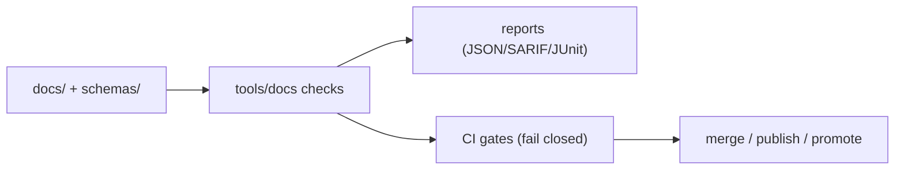

<!--
Path: tools/docs/README.md
Purpose: Documentation tooling entrypoint for KFM
-->

# Docs Tooling


Utilities that **validate, build, and publish** Kansas Frontier Matrix documentation as **governed artifacts**.

> **Principle:** Treat docs like code. If a doc can change system behavior, it must be **machine-checkable** and **review-gated**.

---

## What belongs here

This folder is for tooling that operates on repo documentation and documentation-adjacent artifacts, such as:

- ✅ Markdown linting and structural checks
- ✅ YAML front-matter validation (required fields, allowed values, schema compliance)
- ✅ Link integrity checks (internal + external, configurable)
- ✅ Template conformance checks (Universal Doc, Story Node, API Contract Extension)
- ✅ Schema validation for Story Nodes and other doc-linked JSON schemas
- ✅ Diagram rendering helpers (Mermaid → SVG/PNG)
- ✅ PDF build pipelines and PDF validation helpers
- ✅ CI-friendly reports (JSON, SARIF, JUnit XML) + deterministic exit codes

---

## What does not belong here

- ❌ Application runtime code (`src/`, `web/`)
- ❌ Data pipeline ETL implementations (`src/pipelines/`)
- ❌ Anything that directly touches databases, object stores, or external services
- ❌ “Helper scripts” that bypass governance gates or write to canonical docs without review

---

## Directory context

Docs tooling lives in `tools/`, but it exists to support canonical docs and schemas.

**Related canonical locations:**

- `docs/` — canonical documentation (master guides, standards, governance, templates)
- `docs/standards/` — documentation protocols and metadata profiles
- `docs/templates/` — governed templates (Universal Doc, Story Node, API Contract Extension)
- `docs/governance/` — governance rules, ethics, sovereignty, review gates
- `schemas/` — JSON schemas (including story nodes and UI/telemetry schemas)
- `tools/validation/` — other validation tooling (e.g., catalog QA)

<details>
<summary><strong>Repo map excerpt</strong></summary>

```text
docs/
  standards/
  templates/
  governance/
  reports/
schemas/
tools/
  docs/              <-- you are here
  validation/
```

</details>

---

## How these tools fit into the gate system



---

## Tool contract

To keep docs validation predictable and CI-friendly, tools in this folder should follow a consistent contract.

### Inputs

- Repo files under `docs/**`, `schemas/**`, and any explicitly allowed “doc-adjacent” paths.
- Config files stored with the tool (example: `tools/docs/config/**`).

### Outputs

Tools should write reports to an **artifact folder** (recommended: `dist/docs/` or `artifacts/docs/`), never into `docs/` itself.

| Output type | Recommended format | Purpose |
|---|---|---|
| Lint results | SARIF or JSON | CI annotations + local review |
| Template/structure validation | JSON | Machine-readable violations |
| Link check report | JSON | Broken links + resolution hints |
| PDF validation | JSON | CI gate + audit-friendly record |

### Exit codes

- `0` → pass
- `2` → violations found (expected “fail closed” gate)
- `>2` → tool error (broken toolchain / misconfiguration)

### Determinism rules

- Same inputs + same config → **same outputs** (ordering, formatting, identifiers).
- No hidden network calls by default.
- If a tool needs network access (e.g., external link checking), require an explicit `--allow-network` flag and support an offline mode.

---

## Common workflows

### Local authoring flow

Recommended order when editing docs:

1. Markdown lint and structure validation  
2. Front-matter validation  
3. Template conformance (if applicable)  
4. Link checks (offline first; optional online pass)  
5. Optional: build PDF or render diagrams for review

### CI flow

CI should run at least:

- Lint + structure
- Front-matter schema validation
- Template validation where relevant
- Link integrity checks (policy-dependent)
- Optional: PDF build + PDF validation (especially for published releases)

---

## Recommended internal layout for this folder

This README does not assume these exist yet; it documents a clean, discoverable structure if you’re wiring tooling incrementally:

```text
tools/docs/
  README.md
  config/
    markdownlint.yml
    linkcheck.yml
    frontmatter.schema.json
  scripts/
    docs_lint.*
    linkcheck.*
    validate_frontmatter.*
    validate_storynodes.*
    render_mermaid.*
    build_pdf.*
    validate_pdf.*
  fixtures/
    minimal_docs/
    broken_docs/
  reports/
    (optional local scratch; CI should write elsewhere)
```

---

## Adding a new docs tool

Use this checklist to keep new tools governable and CI-ready:

- [ ] Tool is **documented** (purpose, inputs, outputs, exit codes)
- [ ] Tool is **deterministic** (stable ordering, stable IDs)
- [ ] Tool produces a **machine-readable report**
- [ ] Tool is runnable locally and in CI (no workstation-only assumptions)
- [ ] Tool has at least one fixture-based test (good doc vs bad doc)
- [ ] Tool does not mutate canonical docs without explicit intent and review
- [ ] Tool respects governance flags and sensitivity conventions

---

## Governance and sensitivity

Docs can be system inputs. Anything that encodes governance, sovereignty, or sensitivity requirements must be validated as **machine-checkable invariants** and must **fail closed** when inconsistent.

If a tool surfaces sensitive details (e.g., precise locations, private individuals, culturally restricted material), it should:

- redact or generalize by default,
- emit a “needs governance review” flag in the report,
- avoid writing sensitive extracted text into logs.

---

## References

Start here when wiring or updating docs tooling:

- `docs/MASTER_GUIDE_v13.md` (canonical structure + rules)
- `docs/standards/KFM_MARKDOWN_WORK_PROTOCOL.md`
- `docs/standards/kfm-mdp-enforcement.md`
- `docs/templates/`
  - `TEMPLATE__KFM_UNIVERSAL_DOC.md`
  - `TEMPLATE__STORY_NODE_V3.md`
  - `TEMPLATE__API_CONTRACT_EXTENSION.md`
- `docs/governance/REVIEW_GATES.md`
- `schemas/storynodes/`

---