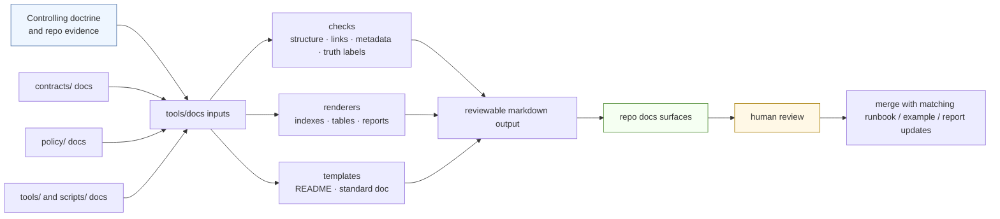

<!-- [KFM_META_BLOCK_V2]
doc_id: kfm://doc/TODO-NEEDS-UUID
title: Documentation Tooling
type: standard
version: v1
status: draft
owners: TODO-NEEDS-VERIFICATION
created: YYYY-MM-DD
updated: YYYY-MM-DD
policy_label: TODO-NEEDS-VERIFICATION
related: [tools/README.md, contracts/README.md, policy/README.md, scripts/README.md, docs/reports/readme-structure-reconciliation.md]
tags: [kfm, docs, tooling, readme]
notes: [Built from attached March 2026 KFM corpus and repo-grounded audit; actual tools/docs tree and owners still require mounted repo verification.]
[/KFM_META_BLOCK_V2] -->

# Documentation Tooling

Repo-facing tooling guidance for KFM documentation production, structure checks, and maintenance workflows.


> [!IMPORTANT]
> **Status:** experimental *(placeholder until mounted repo verification)*  
> **Owners:** TODO / NEEDS VERIFICATION  
> **Path:** `tools/docs/README.md`  
> **Quick jumps:** [Scope](#scope) · [Repo fit](#repo-fit) · [Inputs](#inputs) · [Exclusions](#exclusions) · [Directory tree](#directory-tree) · [Quickstart](#quickstart) · [Usage](#usage) · [Diagram](#diagram) · [Tables](#tables) · [Task list](#task-list) · [FAQ](#faq) · [Appendix](#appendix)

> [!NOTE]
> In KFM, documentation is not decorative overhead. It is part of the working system: reviewable, truth-sensitive, release-relevant, and expected to stay aligned with contracts, policy posture, and correction behavior.

---

## Scope

This lane is for **documentation-specific helpers** that make KFM docs easier to create, review, reconcile, and maintain without letting tooling become a second source of truth.

That means this directory is the right place for things like:

- README and doc scaffolds
- structure and metadata checks
- link, anchor, and navigation validation
- controlled renderers for indices, matrices, or documentation reports
- fixtures and examples for documentation tooling itself

It is **not** the place where KFM’s governing law should quietly migrate.

> [!CAUTION]
> `tools/docs/` may **support** contract, policy, and runtime documentation, but it must not redefine contract law, invent a parallel schema authority, or become an unreviewed source of operational truth.

[Back to top](#documentation-tooling)

---

## Repo fit

| Field | Value |
| --- | --- |
| Path | `tools/docs/` |
| Parent lane | [`../README.md`](../README.md) |
| Confirmed adjacent inputs | [`../../contracts/README.md`](../../contracts/README.md), [`../../policy/README.md`](../../policy/README.md), [`../../scripts/README.md`](../../scripts/README.md) |
| Confirmed related report surface | [`../../docs/reports/readme-structure-reconciliation.md`](../../docs/reports/readme-structure-reconciliation.md) |
| Downstream doc targets | `TODO / NEEDS VERIFICATION` after mounted tree inspection |
| Current confidence | Adjacent repo docs are partially verified; exact `tools/docs/` contents are not yet verified in mounted workspace evidence |

This README is intentionally written to feel native to the repo while staying honest about current evidence limits. The surrounding repo appears to already distinguish between:

- top-level **documentation surfaces**
- **contracts** and **policy** surfaces
- **scripts/tools** intent surfaces
- a documentation reconciliation/report layer

`tools/docs/` should strengthen that separation rather than blur it.

> [!WARNING]
> Treat reconciliation reports as **review inputs**, not as live inventory truth. If the repo tree and a report disagree, the mounted repo wins.

[Back to top](#documentation-tooling)

---

## Inputs

### Accepted inputs

**CONFIRMED-adjacent inputs**

- lane and root README material that needs structure or consistency checks
- shared terminology coming from adjacent repo documentation surfaces
- documentation reports that need regeneration, normalization, or review support
- metadata/header patterns used across standard docs

**PROPOSED starter inputs**

- README templates and partials
- KFM meta block checkers
- truth-label consistency checks
- relative-link and anchor validation
- documentation index builders
- generated comparison tables or lane registries
- fixtures showing valid and invalid documentation states

### What good input looks like

Good inputs are:

- reviewable in Git
- clearly attributable
- scoped to documentation work
- reversible
- easy to compare against current repo evidence

Poor inputs are:

- ad hoc scratch scripts with no review path
- generators that hide their source basis
- renderers that silently rewrite doctrine
- tooling that outputs authoritative claims without traceable upstream inputs

[Back to top](#documentation-tooling)

---

## Exclusions

| Does **not** belong here | Why | Put it here instead |
| --- | --- | --- |
| Canonical JSON Schemas or schema authority decisions | This lane must not create a second or third schema truth surface | `../../contracts/` |
| Policy bundles, enforcement logic, or policy runtime tests | Documentation can describe policy, but should not own enforcement | `../../policy/` |
| Runtime/API/business logic | Tooling here should support docs, not mutate application truth | app / package / worker lanes |
| Release proof objects and correction records | Those are trust-bearing artifacts, not doc helpers | release / proof / governed artifact surfaces |
| Generic maintenance scripts unrelated to docs | Avoid turning this lane into a catch-all toolbox | `../../scripts/` or another verified tools lane |
| Domain ETL, ingest, or geospatial validation code | Documentation tooling should not absorb data-plane work | domain/data/worker lanes |

A simple rule works well here:

> **If the thing can change publication state, policy state, or canonical meaning, it probably does not belong in `tools/docs/`.**

[Back to top](#documentation-tooling)

---

## Directory tree

> [!NOTE]
> The tree below is a **PROPOSED starter layout**, not a claim about current mounted repo reality.

```text
tools/docs/
├── README.md
├── templates/
│   ├── readme/
│   └── standard-doc/
├── checks/
│   ├── metadata/
│   ├── links/
│   ├── structure/
│   └── truth-labels/
├── renderers/
│   ├── indexes/
│   ├── matrices/
│   └── reports/
├── fixtures/
│   ├── valid/
│   └── invalid/
└── examples/
```

Design intent:

- **templates/** keeps authoring shells compact and reusable
- **checks/** keeps structure and trust posture testable
- **renderers/** keeps generated outputs explicit and reviewable
- **fixtures/** makes doc tooling behavior provable
- **examples/** shows maintainers what “good” looks like

[Back to top](#documentation-tooling)

---

## Quickstart

### Minimal operator path

```text
1. Start from mounted repo evidence, not memory.
2. Identify the authoritative upstream docs for the change.
3. Run or apply documentation checks from this lane.
4. Review the diff for invented facts, terminology drift, and stale links.
5. Ship supporting doc updates together when behavior changed.
```

### Before you automate anything here

Make sure you can answer all four:

1. What is the authoritative input?
2. What is generated vs hand-maintained?
3. What truth label applies to the output?
4. What neighboring file must stay synchronized?

If any answer is fuzzy, stop and narrow scope before adding tooling.

[Back to top](#documentation-tooling)

---

## Usage

### 1) Writing or revising a README

Use this lane to help produce README files that are:

- repo-fit
- navigable in GitHub
- explicit about inputs and exclusions
- visually structured
- honest about CONFIRMED vs PROPOSED vs UNKNOWN state

The generated or checked output should make it **easier** to see uncertainty, not easier to hide it.

### 2) Keeping docs aligned with KFM doctrine

When this lane touches doctrine-facing files, prioritize:

- authority order
- trust membrane language
- authoritative-vs-derived separation
- evidence-linked claims
- visible correction / rollback / stale-state language

### 3) Regenerating supporting reports

A generated report is acceptable here when:

- the input set is named
- the generation step is reproducible
- the output is explicitly non-authoritative unless reviewed
- maintainers can diff the result cleanly

### 4) Guarding against documentation drift

This lane is a good fit for checks that answer questions like:

- Is the KFM meta block present?
- Are quick links still valid?
- Do relative links resolve?
- Did a lane README keep its path / inputs / exclusions sections?
- Did a doc add policy or schema language that now contradicts the canonical lane?

[Back to top](#documentation-tooling)

---

## Diagram


```mermaid
flowchart LR
    A[Controlling doctrine<br/>and repo evidence] --> B[tools/docs inputs]
    C[contracts/ docs] --> B
    D[policy/ docs] --> B
    E[tools/ and scripts/ docs] --> B

    B --> F[checks<br/>structure · links · metadata · truth labels]
    B --> G[renderers<br/>indexes · tables · reports]
    B --> H[templates<br/>README · standard doc]

    F --> I[reviewable markdown output]
    G --> I
    H --> I

    I --> J[repo docs surfaces]
    J --> K[human review]
    K --> L[merge with matching runbook / example / report updates]

    style A fill:#eef6ff,stroke:#4a6fa5
    style J fill:#f5fff2,stroke:#4d8b31
    style K fill:#fff8e6,stroke:#a67c00
```

This lane should sit **between** authoritative inputs and reviewable markdown output, not above the authority layer and not inside runtime truth paths.

[Back to top](#documentation-tooling)

---

## Tables

### Responsibility matrix

| Responsibility | Belongs here? | Notes |
| --- | --- | --- |
| README scaffolding | Yes | Keep shells lightweight and reviewable |
| KFM meta block enforcement | Yes | Good candidate for a check rather than prose policing |
| Relative-link validation | Yes | High value, low governance risk |
| Navigation/index rendering | Yes | Especially useful for docs-heavy repos |
| Truth-label consistency checks | Yes | Helpful if outputs remain advisory and reviewable |
| Schema definition authority | No | Documentation may reference canonical schemas only |
| Policy enforcement runtime | No | Keep enforcement with policy surfaces |
| Release/correction artifact issuance | No | Trust-bearing runtime/output concern |
| Domain ETL or geospatial processing | No | Keep this lane documentation-focused |

### Quality bar for anything added here

| Test | Pass condition |
| --- | --- |
| Scope test | Clearly documentation-specific |
| Authority test | Does not become a new source of truth |
| Review test | Output is diffable and understandable in Git |
| Drift test | Helps reduce, not increase, stale structure claims |
| Reversibility test | Easy to remove or replace if repo reality differs |
| KFM fit test | Preserves trust posture, clarity, and inspection paths |

[Back to top](#documentation-tooling)

---

## Task list

### Definition of done

- [ ] Mounted repo tree checked before moving or creating subpaths
- [ ] This README stays honest about what is verified vs placeholder
- [ ] Path, inputs, and exclusions remain explicit
- [ ] Relative links are valid
- [ ] At least one meaningful diagram remains current
- [ ] No tool added here creates a parallel schema or policy authority
- [ ] Generated outputs identify their inputs and regeneration path
- [ ] Behavior-significant doc changes ship with matching examples, runbooks, or notes
- [ ] Historical structure reports are not treated as live inventory without recheck

### Review gates worth adding when this lane becomes executable

- [ ] metadata block check
- [ ] required-section check
- [ ] link/anchor check
- [ ] stale placeholder scan
- [ ] “PDF-only session” language scan for live repo docs
- [ ] generated-doc freshness marker check

[Back to top](#documentation-tooling)

---

## FAQ

### Why is this under `tools/` and not directly under `docs/`?

Because this lane is about **how documentation work is produced or checked**, not the documentation corpus itself. The output may feed `docs/`, but the tooling should stay separate from published or normative prose.

### Why can’t this lane own schema or policy truth?

Because KFM already treats contracts, policy, and runtime trust objects as distinct authority-bearing surfaces. A documentation helper may render or check them, but must not quietly replace them.

### Can this lane generate documentation from contracts or policy vocabularies?

Yes—carefully. That is a strong use case **if** the generated output points back to canonical inputs and does not become the new place where people edit the law.

### What changes once the mounted repo is inspected?

Three things should tighten immediately:

1. placeholder owners
2. real directory inventory
3. actual command and workflow references

Until then, keep the lane lightweight and explicit about uncertainty.

### What is the easiest way for this lane to go wrong?

By becoming a convenience layer that rewrites authoritative terminology, duplicates schema or policy structure, or presents historical inventory as current fact.

[Back to top](#documentation-tooling)

---

## Appendix

<details>
<summary><strong>Truth posture used in this README</strong></summary>

### CONFIRMED
Use for things directly supported by the visible source corpus and repo-grounded audit.

### PROPOSED
Use for starter layout, future checks, renderers, and commands that fit KFM but are not yet proven as mounted implementation.

### UNKNOWN / NEEDS VERIFICATION
Use for actual `tools/docs/` contents, owners, CI wiring, and concrete executable entrypoints until the mounted repo is inspected.

</details>

<details>
<summary><strong>Open verification items</strong></summary>

- Does `tools/docs/` already exist in the mounted repo?
- If it exists, what substructure is already present?
- Who owns this lane today?
- Which checks already run from `tools/` or `scripts/`?
- Should documentation tooling live here, or should some functions stay in the parent `tools/` lane?
- Which downstream docs should be linked here once the tree is verified?

</details>

<details>
<summary><strong>Neighbor links to consider after repo inspection</strong></summary>

Potential additions after verification:

- a canonical docs index
- a contributor-facing documentation guide
- ADR authoring guidance
- release-gate or correction-runbook documentation
- verified generated report surfaces

</details>

---

If this lane is adopted, keep it small, legible, and subordinate to the repo’s actual authority surfaces.

[Back to top](#documentation-tooling)
