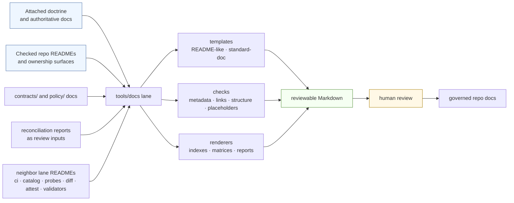

<!-- [KFM_META_BLOCK_V2]
doc_id: kfm://doc/TODO-NEEDS-UUID
title: Documentation Tooling
type: standard
version: v1
status: draft
owners: @bartytime4life
created: 2026-03-28
updated: 2026-04-13
policy_label: TODO-NEEDS-VERIFICATION
related: [tools/README.md, .github/CODEOWNERS, contracts/README.md, policy/README.md, scripts/README.md, docs/reports/readme-structure-reconciliation.md, tools/ci/README.md, tools/catalog/README.md, tools/probes/README.md, tools/diff/README.md, tools/attest/README.md, tools/validators/promotion_gate/README.md]
tags: [kfm, docs, tooling, readme, metadata, structure, validation]
notes: [Updated to reflect the check_doc_structure.py thin slice and tests/docs/test_check_doc_structure.py. Current public/main subtree for tools/docs/ historically presented as README-first; created date, policy label, and any broader helper inventory still need direct verification.]
[/KFM_META_BLOCK_V2] -->

# Documentation Tooling

Repo-facing tooling guidance for KFM documentation production, structure checks, and maintenance workflows.


> [!IMPORTANT]
> **Status:** experimental  
> **Owners:** `@bartytime4life` *(current public `CODEOWNERS` coverage for `/tools/`; finer-grained lane ownership still needs verification)*  
> **Path:** `tools/docs/README.md`  
> **Quick jumps:** [Scope](#scope) · [Repo fit](#repo-fit) · [Inputs](#inputs) · [Exclusions](#exclusions) · [Current evidence snapshot](#current-evidence-snapshot) · [Directory tree](#directory-tree) · [Quickstart](#quickstart) · [Usage](#usage) · [Diagram](#diagram) · [Tables](#tables) · [Task list](#task-list) · [FAQ](#faq) · [Appendix](#appendix)

> [!TIP]
> **Current executable snapshot (thin slice)**  
> The current documented thin slice for this lane is:
>
> - `tools/docs/check_doc_structure.py`
>
> It checks:
>
> - KFM Meta Block V2 presence
> - exactly one H1
> - Quick jumps block presence
> - broken relative links
> - placeholder leakage
>
> Expected proof surface:
>
> - `tests/docs/test_check_doc_structure.py`
> - optional JSON output for CI summaries
>
> The broader lane remains larger than this one executable helper. Templates, richer validators, renderers, and expanded consistency checks are still **PROPOSED** unless directly verified in the active branch.

> [!NOTE]
> In KFM, documentation is part of the working system. This lane exists to help docs stay reviewable, policy-aware, structurally consistent, and subordinate to the repo’s actual authority surfaces.

---

## Scope

`tools/docs/` is the documentation-tooling lane inside `tools/`: the place for helpers, conventions, and review aids that improve KFM documentation quality without quietly becoming a second source of truth.

This lane is the right home for:

- documentation structure checks
- README and standard-doc scaffolds
- metadata/header validation
- relative-link and anchor checks
- placeholder and stale-state scans
- generated documentation indices, matrices, or reconciliation aids
- fixtures and examples for documentation tooling itself
- reviewer-facing documentation consistency checks that remain subordinate to canonical repo surfaces

This lane is **not** the home for canonical contract meaning, policy enforcement semantics, or release truth.

### Truth labels used in this README

| Label | Meaning here |
| --- | --- |
| **CONFIRMED** | Supported by current public repo evidence or attached doctrine in this review pass |
| **INFERRED** | Strongly suggested by adjacent repo structure or doctrine, but not directly proven as checked-in implementation |
| **PROPOSED** | Recommended lane shape or future tooling pattern, not yet verified as mounted implementation |
| **UNKNOWN** | Not verified in the current session |
| **NEEDS VERIFICATION** | Reviewer action required before treating the statement as settled repo reality |

> [!CAUTION]
> Documentation tooling may support policy, contracts, publication, and review docs, but it must not redefine schema authority, runtime policy meaning, or release law.

[Back to top](#documentation-tooling)

---

## Repo fit

### Path and relationships

| Direction | Path | Status | Notes |
| --- | --- | --- | --- |
| Target lane | `tools/docs/` | **CONFIRMED** | Current lane is visible and now documented with one executable thin slice plus tests. |
| Parent | [`../README.md`](../README.md) | **CONFIRMED** | Parent `tools/README.md` defines `tools/` as the tooling lane and lists `docs/` as a child surface. |
| Ownership surface | [`../../.github/CODEOWNERS`](../../.github/CODEOWNERS) | **CONFIRMED** | Public `CODEOWNERS` currently assigns `/tools/` to `@bartytime4life`. |
| Neighbor | [`../../contracts/README.md`](../../contracts/README.md) | **CONFIRMED** | Contract lane exists and is framed as the machine-readable trust-object surface. |
| Neighbor | [`../../policy/README.md`](../../policy/README.md) | **CONFIRMED** | Policy lane exists and is framed as executable governance, not prose-only guidance. |
| Neighbor | [`../../scripts/README.md`](../../scripts/README.md) | **CONFIRMED** | Script lane exists as a thin-entrypoint/documented helper surface. |
| Related report | [`../../docs/reports/readme-structure-reconciliation.md`](../../docs/reports/readme-structure-reconciliation.md) | **CONFIRMED** | Useful review aid, but explicitly not safe to treat as live inventory on its own. |
| Potential downstream | [`../../.github/workflows/README.md`](../../.github/workflows/README.md) | **INFERRED** | Likely consumer of doc checks when workflow wiring becomes executable, but public evidence may remain README-bounded. |
| Neighbor lane | [`../../tools/ci/README.md`](../../tools/ci/README.md) | **CONFIRMED** | CI helpers may render doc-check results, but should not own documentation truth. |
| Neighbor lane | [`../../tools/catalog/README.md`](../../tools/catalog/README.md) | **CONFIRMED** | Catalog docs may need structure and metadata checks without moving catalog law into docs tooling. |
| Neighbor lane | [`../../tools/probes/README.md`](../../tools/probes/README.md) | **CONFIRMED** | Probe docs and bounded-readme conventions benefit from consistent structure tooling. |
| Neighbor lane | [`../../tools/diff/README.md`](../../tools/diff/README.md) | **CONFIRMED** | Diff lane docs benefit from stable README discipline and anchor/link validation. |
| Neighbor lane | [`../../tools/attest/README.md`](../../tools/attest/README.md) | **CONFIRMED** | Trust-helper docs should stay aligned without duplicating trust authority. |
| Neighbor lane | [`../../tools/validators/promotion_gate/README.md`](../../tools/validators/promotion_gate/README.md) | **CONFIRMED** | Promotion README work now depends heavily on structure, quick-jump, and metadata consistency. |

### Current evidence snapshot

| Surface | Current reading | Why it matters here |
| --- | --- | --- |
| `tools/` | Multiple child lanes are visible under `tools/`, including `docs/`, but the family remains lane-specific rather than generic-toolbox-oriented | `tools/docs/` should stay narrow and documentation-specific |
| `tools/docs/` | no longer purely conceptual in this README; the lane now has one documented thin-slice executable helper | This README should describe a real small tool surface rather than a purely future lane |
| `contracts/` | Present, but doc tooling still does not own contract truth | Documentation helpers may inspect contract-facing docs, but must stay subordinate |
| `policy/` | Present as a separate authority surface | Documentation tooling must not drift into policy ownership |
| `scripts/` | Present as thin-entrypoint lane | General script entrypoints belong there, not by default in `tools/docs/` |
| reconciliation report | Historical scaffold + correction layer | Treat as review input, never as sovereign current inventory |
| promotion/readme-heavy lanes | Multiple adjacent lanes now rely on richer README discipline | Strengthens the case for lane-local doc tooling without changing authority boundaries |

### Working interpretation

The current repo shape supports a clean separation:

- **contracts/** owns machine-readable trust objects
- **policy/** owns executable governance grammar
- **scripts/** owns thin entrypoints and operational helpers
- **tools/** owns support tooling
- **tools/docs/** should therefore specialize in documentation quality, structure, and maintenance support

> [!WARNING]
> Historical reconciliation reports are useful review inputs, not live repo truth. If a report and the checked tree disagree, the checked tree wins.

[Back to top](#documentation-tooling)

---

## Inputs

### Accepted inputs

**CONFIRMED or strongly adjacent inputs**

- README-like docs in `tools/`, `contracts/`, `policy/`, `scripts/`, and nearby repo surfaces
- standard docs that use or should use the KFM meta block pattern
- documentation structure rules, ownership markers, and quick-jump/navigation blocks
- reconciliation or gap-analysis reports used as review aids
- neighboring doctrine that defines how docs must talk about contracts, policy, evidence, and publication
- adjacent lane READMEs that should remain terminologically consistent

**Implemented thin-slice input pattern**

- Markdown files or directories
- repo root for relative-path resolution
- optional placeholder-tolerance flag
- optional JSON output path for CI/reporting

**PROPOSED tooling inputs**

- metadata/header validators
- required-section checks
- relative-link and anchor validation
- stale-language detection
- generated doc registries, matrices, and reconciliation outputs
- fixtures showing valid and invalid documentation states
- anchor-map or quick-jump consistency checks
- KFM Meta Block V2 field-level validation helpers

### What good input looks like

Good input is:

- documentation-specific
- reviewable in Git
- explicit about source basis
- diff-friendly
- reversible
- honest about **CONFIRMED** versus **PROPOSED** versus **UNKNOWN**

### What bad input looks like

Bad input is:

- tooling that silently rewrites doctrine
- generators that invent repo state, owners, paths, or commands
- maintenance scripts that are not documentation-specific
- checks that imply policy or release enforcement the repo does not actually implement

[Back to top](#documentation-tooling)

---

## Exclusions

| Does **not** belong here | Why | Put it here instead |
| --- | --- | --- |
| Canonical JSON Schemas or schema authority decisions | This lane must not create a parallel contract universe | `../../contracts/` or `../../schemas/` |
| Policy bundles, runtime policy decisions, or enforcement logic | Documentation may describe policy, but should not own enforcement | `../../policy/` |
| Release proof packs, correction notices, or promotion artifacts themselves | Those are trust-bearing release objects, not doc helpers | release / proof / correction surfaces |
| General-purpose operational scripts unrelated to docs | Avoid turning this lane into an undifferentiated tool bucket | `../../scripts/` |
| Runtime/API/business logic | Docs tooling should support explanation and verification, not application truth | app / package / worker lanes |
| Domain ETL, geospatial transforms, or catalog publication code | This lane is documentation-focused, not data-plane focused | `../../pipelines/`, `../../packages/`, or domain lanes |
| Signing and verification behavior | Trust-helper logic belongs elsewhere | `../../tools/attest/` |
| Reviewer summary rendering for non-doc artifacts | CI/presentation belongs elsewhere | `../../tools/ci/` |
| Policy or promotion decisions | Validation/governance belong elsewhere | `../../tools/validators/` |

> **Rule of thumb:** if the artifact can directly change canonical meaning, policy result, or publication state, it probably does **not** belong in `tools/docs/`.

[Back to top](#documentation-tooling)

---

## Current evidence snapshot

| Evidence item | Status | Why it matters here |
| --- | --- | --- |
| `tools/docs/` exists in the tree | **CONFIRMED** | The lane is real, not hypothetical |
| `tools/docs/README.md` is already substantive rather than placeholder-only | **CONFIRMED** | Future edits should revise in place, not reset lane doctrine |
| Parent `tools/README.md` names `docs/` as a lane | **CONFIRMED** | Grounds lane role inside the helper family |
| Public `CODEOWNERS` covers `/tools/` | **CONFIRMED** | Grounds owner posture conservatively |
| `tools/docs/check_doc_structure.py` is the current thin-slice executable helper | **CONFIRMED** | The lane now has one concrete helper instead of a fully README-only posture |
| `tests/docs/test_check_doc_structure.py` is the current thin-slice proof surface | **CONFIRMED** | The first helper lands with explicit test coverage |
| Neighbor lanes now include richer README surfaces with heavy structural expectations | **CONFIRMED via adjacent documentation** | Strengthens the case for structure/link/metadata tooling in this lane |
| Broader helper families such as templates, renderers, and expanded checks | **PROPOSED** | These remain target shapes, not fully proven mounted inventory |
| Exact workflow or CI wiring for doc tooling under this lane | **UNKNOWN / NEEDS VERIFICATION** | Public evidence remains bounded |

[Back to top](#documentation-tooling)

---

## Directory tree

### Current lane shape

```text
tools/docs/
├── README.md
└── check_doc_structure.py

tests/docs/
└── test_check_doc_structure.py
```

> [!NOTE]
> The lane now has one real executable thin slice plus tests. That does **not** yet prove the wider family layout below.

### PROPOSED starter expansion

<details>
<summary><strong>Illustrative starter layout for future growth</strong></summary>

```text
tools/docs/
├── README.md
├── templates/
│   ├── readme-like/
│   └── standard-doc/
├── checks/
│   ├── metadata/
│   ├── links/
│   ├── structure/
│   └── placeholders/
├── renderers/
│   ├── indexes/
│   ├── matrices/
│   └── reports/
├── fixtures/
│   ├── valid/
│   └── invalid/
└── examples/
```

</details>

### Thin-slice executable shape

```text
tools/docs/
├── README.md
└── check_doc_structure.py

tests/docs/
└── test_check_doc_structure.py
```

### Design intent for the PROPOSED layout

- **templates/** keeps authoring shells explicit and reusable
- **checks/** keeps structure, links, and truth posture testable
- **renderers/** keeps generated doc artifacts reviewable instead of magical
- **fixtures/** makes checker behavior demonstrable
- **examples/** shows maintainers what “good” looks like

[Back to top](#documentation-tooling)

---

## Quickstart

### Read-first verification path

```text
1. Start from the checked repo and attached doctrine, not memory.
2. Read the local README or standard doc you intend to change.
3. Identify what is canonical, what is derived, and what is only advisory.
4. Verify current lane inventory before naming helper paths or commands.
5. Check for broken links, stale placeholders, unsupported claims, and terminology drift.
6. Update neighboring runbooks or reports when behavior-significant documentation changed.
```

### Safe local inspection commands

```bash
find tools/docs -maxdepth 3 -type f | sort
sed -n '1,240p' tools/docs/README.md
sed -n '1,240p' tools/README.md
sed -n '1,220p' .github/CODEOWNERS
sed -n '1,240p' tools/ci/README.md
sed -n '1,240p' tools/catalog/README.md
```

### Thin-slice local run

```bash
python tools/docs/check_doc_structure.py \
  README.md tools docs contracts policy scripts \
  --root . \
  --output doc-structure-report.json
```

### Thin-slice test run

```bash
pytest -q tests/docs/test_check_doc_structure.py
```

> [!TIP]
> Keep quickstarts light on executable claims beyond what the mounted lane already proves.

### Four questions before automating anything here

1. What is the authoritative input?
2. What output is generated versus hand-maintained?
3. What uncertainty must stay visible in the result?
4. Which adjacent doc must stay synchronized?

[Back to top](#documentation-tooling)

---

## Usage

### 1) Scaffold README-like and standard docs

Use this lane to support docs that need to be:

- repo-fit
- GitHub-readable
- explicit about path, inputs, and exclusions
- visually structured
- honest about uncertainty and evidence basis

### 2) Check metadata and required structure

Good fits for this lane include checks that answer questions like:

- Is the KFM meta block present where required?
- Is there exactly one H1?
- Is the Quick jumps block present?
- Are relative links valid from the file’s real location?
- Are TODO/placeholder markers still intentional and visible?
- Do nearby lane READMEs keep a consistent top-of-file structure?

### 3) Generate reconciliation or inventory aids

Generated reports belong here when they are:

- reproducible
- clearly marked as review inputs
- sourced from named files or trees
- diffable in Git
- not presented as sovereign live inventory

### 4) Guard against documentation drift

This lane is a strong fit for tooling that prevents:

- README skeleton drift
- broken internal navigation
- terminology drift across adjacent docs
- “documentation says X, checked tree says Y” blind spots

### 5) Stay subordinate to stronger lanes

A docs helper may inspect:

- policy-facing docs
- contract-facing docs
- promotion lane docs
- trust-helper docs
- CI/rendering docs

But it should only check structure, metadata, links, consistency, or freshness. It should not redefine what those lanes mean.

### Thin-slice behavior

The current thin slice checks:

- KFM Meta Block V2 presence
- exactly one H1
- Quick jumps block presence
- broken relative links
- placeholder leakage

It currently performs **presence-oriented** Quick jumps validation, not full anchor-resolution checks.

[Back to top](#documentation-tooling)

---

## Diagram


```mermaid
flowchart LR
    A[Attached doctrine<br/>and authoritative docs] --> B[tools/docs lane]
    C[Checked repo READMEs<br/>and ownership surfaces] --> B
    D[contracts/ and policy/ docs] --> B
    E[reconciliation reports<br/>as review inputs] --> B
    N[neighbor lane READMEs<br/>ci · catalog · probes · diff · attest · validators] --> B

    B --> F[templates<br/>README-like · standard-doc]
    B --> G[checks<br/>metadata · links · structure · placeholders]
    B --> H[renderers<br/>indexes · matrices · reports]

    F --> I[reviewable Markdown]
    G --> I
    H --> I

    I --> J[human review]
    J --> K[governed repo docs]

    style A fill:#eef6ff,stroke:#4a6fa5
    style C fill:#eef6ff,stroke:#4a6fa5
    style I fill:#f5fff2,stroke:#4d8b31
    style J fill:#fff8e6,stroke:#a67c00
```

This lane sits **between** authoritative inputs and reviewable documentation output. It should not sit above the authority layer or masquerade as a publication gate by itself.

[Back to top](#documentation-tooling)

---

## Tables

### Lane responsibility matrix

| Responsibility | Belongs here? | Why |
| --- | --- | --- |
| README scaffolding | Yes | Useful, low-risk, and reviewable |
| KFM meta block checks | Yes | Strong fit for deterministic validation |
| Relative-link and anchor checks | Yes | High ROI and documentation-specific |
| Placeholder / stale-marker scans | Yes | Helps keep uncertainty visible and intentional |
| Reconciliation report generation | Yes | Fits documentation maintenance and review work |
| Neighbor-lane doc consistency checks | Yes | Helps keep repeated lane structure and terminology aligned |
| Schema authority | No | Keep canonical schema meaning with contract/schema surfaces |
| Policy runtime enforcement | No | Documentation may describe policy but should not own it |
| Release proof-pack issuance | No | Trust-bearing release concern, not a doc-helper concern |
| Domain ETL / geospatial transforms | No | Out of lane; belongs with data-plane workflows |

### Current-state versus future-state reading

| Topic | Current reading | Preferred treatment in this README |
| --- | --- | --- |
| `tools/docs/` contents | one helper + one test plus README | **CONFIRMED** current lane shape |
| Broader helper scripts/checks/templates under this lane | not yet proven in the mounted lane beyond the thin slice | **PROPOSED / UNKNOWN** depending on claim strength |
| Expanded lane shape for future growth | Fits doctrine and adjacent lane patterns | **PROPOSED** |
| Ownership | `/tools/` currently owned by `@bartytime4life` in public `CODEOWNERS` | **CONFIRMED** at `/tools/` scope |
| Executable CI/workflow wiring | not directly proven for this lane in public evidence | **UNKNOWN / NEEDS VERIFICATION** |

### Candidate check matrix

| Check | Intended outcome | Status |
| --- | --- | --- |
| KFM meta block presence/shape | Standard docs stay machine-auditable | **Thin-slice implemented** |
| README required structure: exactly one H1 | README-like docs stay structurally comparable | **Thin-slice implemented** |
| Relative-link validation | Broken navigation fails early | **Thin-slice implemented** |
| Anchor/jump validation | Quick-jump blocks do not rot | **Partially implemented** |
| Placeholder scan | TODO leakage remains visible and reviewable | **Thin-slice implemented** |
| Reconciliation freshness marker | Reports do not masquerade as live inventory | **PROPOSED** |
| Documentation/accessibility gate | Public-facing docs stay readable and behavior-aligned | **PROPOSED** |
| Neighbor-lane structure consistency | repeated lane contracts stay navigable and comparable | **PROPOSED** |

[Back to top](#documentation-tooling)

---

## Task list

### Definition of done for the current thin slice

- [x] current lane path checked before claiming one live helper
- [x] path, inputs, exclusions, and adjacent links are explicit
- [x] current lane shape and future proposed structure are clearly separated
- [x] representative tests added for the first helper
- [x] helper output format and exit semantics are stable enough for local and CI use
- [x] no tool described here creates a parallel policy or schema authority

### Sensible next gates for this lane

- [ ] extend Quick jumps validation from presence-only to anchor-resolution checks
- [ ] add KFM Meta Block field-level validation
- [ ] add required-section checker for README-like docs
- [ ] add report freshness marker checker
- [ ] add docs-style accessibility and readability checks for public-facing README surfaces
- [ ] add neighbor-lane quick-jump / section consistency checker

[Back to top](#documentation-tooling)

---

## FAQ

### Why is this under `tools/` and not directly under `docs/`?

Because this lane is about **how documentation work is checked, scaffolded, or maintained**, not the documentation corpus itself. The output may feed `docs/`, but the helpers should remain distinct from authoritative prose.

### Why does this README stay cautious about executable helpers?

Because the broader future lane still exceeds the currently proven helper inventory. Good documentation should not invent templates, validators, or CI wiring that the mounted lane does not yet prove.

### Why can’t this lane own schema or policy truth?

Because adjacent repo surfaces already distinguish those roles. `contracts/` and `policy/` are not just neighboring directories; they are separate authority surfaces.

### Can this lane generate docs from contracts or policy vocabularies?

Yes—carefully. That is a good fit **if** the generated output points back to canonical inputs and remains reviewable.

### What is the easiest way for this lane to go wrong?

By becoming a convenience layer that rewrites doctrine, duplicates policy or schema meaning, or treats historical report scaffolds as if they were live repo fact.

### Can this lane help keep neighboring README lanes consistent?

Yes. That is a strong fit, as long as it checks structure, metadata, links, or wording discipline rather than redefining the neighboring lane’s authority.

### What exactly is implemented today?

Today’s thin slice is `check_doc_structure.py`, with tests in `tests/docs/test_check_doc_structure.py`. It checks metadata-block presence, single-H1 structure, Quick jumps presence, relative links, and placeholder leakage.

[Back to top](#documentation-tooling)

---

## Appendix

<details>
<summary><strong>Truth posture used in this README</strong></summary>

### CONFIRMED
Supported by the current repo surfaces directly inspected during this revision.

### INFERRED
Strongly suggested by adjacent lane structure or doctrine, but not directly enumerated as checked-in implementation under `tools/docs/`.

### PROPOSED
A recommended lane shape, checker family, or future layout that fits KFM doctrine but is not yet verified as mounted implementation.

### UNKNOWN / NEEDS VERIFICATION
Broader executable helper inventory under `tools/docs/`, mounted-checkout parity beyond the thin slice, exact workflow wiring, policy label, and any finer-grained lane ownership beyond current `/tools/` coverage.

</details>

<details>
<summary><strong>Open verification items</strong></summary>

- Should lane ownership be narrowed from `/tools/` to a more specific `tools/docs/` rule?
- What is the intended policy label for this document under current repo governance?
- Which downstream docs should link back here once the local tree is reverified?
- Is there already a helper family under `scripts/` or `.github/actions/` that should be reconciled with this lane before broader expansion?

</details>

<details>
<summary><strong>Adoption notes</strong></summary>

This README intentionally distinguishes three things that often get blurred:

1. **Current lane fact**
2. **Doctrinally preferred direction**
3. **Future lane expansion**

That separation matters. The lane now has a real executable thin slice and tests. It still does **not** justify stronger claims about templates, richer validators, renderers, or CI wiring until those are actually mounted and reviewed.

Keep that distinction visible during review.

</details>

---

Keep this lane small, inspectable, and subordinate to the repo’s actual authority surfaces.

[Back to top](#documentation-tooling)
