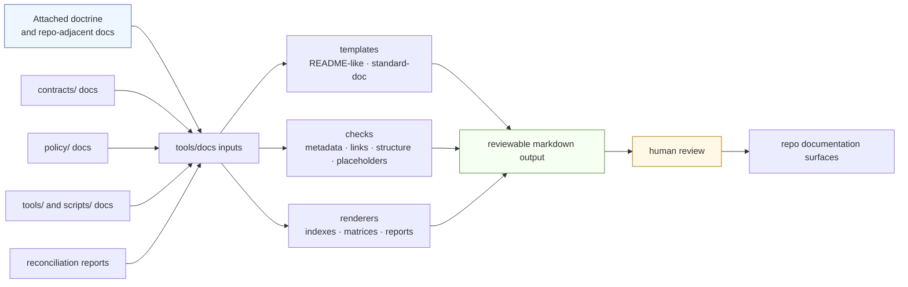

<!-- [KFM_META_BLOCK_V2]
doc_id: kfm://doc/TODO-NEEDS-UUID
title: Documentation Tooling
type: standard
version: v1
status: draft
owners: TODO-NEEDS-VERIFICATION
created: 2026-03-28
updated: 2026-03-28
policy_label: TODO-NEEDS-VERIFICATION
related: [tools/README.md, contracts/README.md, policy/README.md, scripts/README.md, docs/reports/readme-structure-reconciliation.md]
tags: [kfm, docs, tooling, readme]
notes: [Grounded in the attached March 2026 KFM corpus and attached repo-grounded audit; the exact mounted tools/docs tree, owners, commands, and CI wiring still need direct repo verification.]
[/KFM_META_BLOCK_V2] -->

# Documentation Tooling

Repo-facing guidance for KFM documentation helpers, structure checks, and maintenance workflows.


> [!IMPORTANT]
> **Status:** experimental  
> **Owners:** TODO-NEEDS-VERIFICATION  
> **Path:** `tools/docs/README.md` *(target path; direct mounted-tree verification still needed)*  
> **Quick jumps:** [Scope](#scope) · [Repo fit](#repo-fit) · [Inputs](#inputs) · [Exclusions](#exclusions) · [Directory tree](#directory-tree) · [Quickstart](#quickstart) · [Usage](#usage) · [Diagram](#diagram) · [Tables](#tables) · [Task list](#task-list) · [FAQ](#faq) · [Appendix](#appendix)

> [!NOTE]
> In KFM, documentation is part of the working system. This lane exists to improve reviewability, consistency, and trust visibility in docs without turning tooling into a second source of truth.

---

## Scope

`tools/docs/` is the documentation-tooling lane: the place for helpers that make KFM docs easier to author, inspect, reconcile, and maintain while staying subordinate to doctrine, contracts, policy, and mounted repo reality.

This lane is the right home for things like:

- README and standard-doc scaffolds
- metadata/header checks
- relative-link, anchor, and structure validation
- placeholder and stale-state scans
- controlled generators for documentation indices, matrices, and reconciliation reports
- fixtures and examples for documentation tooling itself

It is **not** the place where KFM’s governing law should quietly migrate.

> [!CAUTION]
> Documentation tooling may *support* contract, policy, release, and runtime docs, but it must not redefine schema authority, policy meaning, or publication law.

[Back to top](#documentation-tooling)

---

## Repo fit

### Path and relationships

| Direction | Path | Status | Notes |
| --- | --- | --- | --- |
| Target lane | `tools/docs/` | NEEDS VERIFICATION | This README is written for the target lane, but the mounted tree for this exact subdirectory still needs direct confirmation. |
| Upstream | [`../README.md`](../README.md) | CONFIRMED *(audit-backed)* | Parent `tools/README.md` exists as a documentary tools surface. |
| Neighbor | [`../../contracts/README.md`](../../contracts/README.md) | CONFIRMED *(audit-backed)* | Contract lane exists and is already framed as a schema/contract surface. |
| Neighbor | [`../../policy/README.md`](../../policy/README.md) | CONFIRMED *(audit-backed)* | Policy lane exists and is described as deny-by-default with reasons, obligations, and finite outcomes. |
| Neighbor | [`../../scripts/README.md`](../../scripts/README.md) | CONFIRMED *(audit-backed)* | Script lane exists, but current evidence still describes it as documentary rather than executable proof. |
| Related report | [`../../docs/reports/readme-structure-reconciliation.md`](../../docs/reports/readme-structure-reconciliation.md) | CONFIRMED *(audit-backed)* | Useful as a review input, but not safe to treat as live inventory without re-checking the mounted repo. |

### Working interpretation

The surrounding repo appears to already distinguish between:

- doctrinal and policy-bearing surfaces
- contract/schema surfaces
- tools and scripts intent surfaces
- report-style reconciliation surfaces

`tools/docs/` should strengthen that separation.

> [!WARNING]
> Historical reconciliation reports are review aids, not sovereign truth. If a report and the mounted repo disagree, the mounted repo wins.

[Back to top](#documentation-tooling)

---

## Inputs

### Accepted inputs

**CONFIRMED / audit-backed adjacent inputs**

- lane and root README files that need structure or consistency checks
- metadata/header patterns already used across standard docs
- report surfaces that summarize README shape, drift, or missing sections
- adjacent doctrinal language from `contracts/`, `policy/`, `tools/`, and `scripts/`

**PROPOSED lane inputs**

- README-like and standard-doc templates
- KFM meta block validators
- required-section rules
- relative-link and anchor validation maps
- placeholder/TODO scans
- generated documentation registries, matrices, and report artifacts
- fixtures that demonstrate valid and invalid documentation states

### What good input looks like

Good input is:

- reviewable in Git
- explicit about source basis
- documentation-specific
- reversible
- diff-friendly
- honest about `CONFIRMED` vs `PROPOSED` vs `UNKNOWN`

Bad input is:

- tooling that silently rewrites doctrine
- generators that emit authoritative claims with no source trail
- “helpful” scripts that invent repo paths, owners, or commands
- catch-all maintenance utilities that are not documentation-specific

[Back to top](#documentation-tooling)

---

## Exclusions

| Does **not** belong here | Why | Put it here instead |
| --- | --- | --- |
| Canonical JSON Schemas or schema authority decisions | This lane must not create a parallel schema universe | `../../contracts/` or `../../schemas/` |
| Policy bundles, policy runtime decisions, or enforcement logic | Documentation may describe policy, but should not own enforcement | `../../policy/` |
| Release proof objects, correction notices, or promotion artifacts | These are trust-bearing runtime/release objects, not doc helpers | release / proof / correction surfaces |
| General-purpose maintenance scripts unrelated to docs | Avoid turning this lane into an undifferentiated toolbox | `../../scripts/` |
| Runtime/API/business logic | Docs tooling should support explanation and verification, not own application truth | app / package / worker lanes |
| Domain ETL, ingest, or geospatial transformation code | This lane is documentation-focused, not data-plane focused | domain / ingest / processing lanes |

A simple rule is usually enough:

> **If the thing can change canonical meaning, publication state, or policy state, it probably does not belong in `tools/docs/`.**

[Back to top](#documentation-tooling)

---

## Directory tree

> [!NOTE]
> The tree below is a **PROPOSED starter layout**, not a claim about current mounted repo reality.

```text
tools/docs/
├── README.md
├── templates/
│   ├── readme-like/
│   └── standard-doc/
├── checks/
│   ├── metadata/
│   ├── links/
│   ├── structure/
│   └── placeholders/
├── renderers/
│   ├── indexes/
│   ├── matrices/
│   └── reports/
├── fixtures/
│   ├── valid/
│   └── invalid/
└── examples/
```

### Design intent

- **templates/** keeps reusable authoring shells small and explicit
- **checks/** keeps structure, links, and truth posture testable
- **renderers/** keeps generated doc artifacts reviewable instead of magical
- **fixtures/** makes checker behavior demonstrable
- **examples/** shows maintainers what “good” looks like

[Back to top](#documentation-tooling)

---

## Quickstart

### Read-first operator path

```text
1. Start from the mounted repo and attached doctrine, not memory.
2. Read the local README or standard doc you intend to touch.
3. Identify what is canonical, what is derived, and what is merely advisory.
4. Apply the relevant documentation checks from this lane.
5. Review the diff for invented facts, stale placeholders, broken links, and terminology drift.
6. Update neighboring runbooks, examples, or reports when behavior-significant docs changed.
```

### Four questions before you automate anything here

1. What is the authoritative input?
2. What output is generated versus hand-maintained?
3. What uncertainty must stay visible in the result?
4. Which neighboring file must stay synchronized?

> [!TIP]
> Keep quickstarts command-light until mounted repo entrypoints are directly verified. A fake command is worse than a missing one.

[Back to top](#documentation-tooling)

---

## Usage

### 1) Scaffold README-like docs

Use this lane to help produce README-like docs that are:

- repo-fit
- readable in GitHub
- explicit about path, inputs, and exclusions
- visually structured
- honest about uncertainty

### 2) Check metadata and required structure

Good candidates for this lane include checks that answer questions like:

- Is the KFM meta block present and shaped correctly?
- Are required README sections present?
- Do quick-jump anchors still resolve?
- Are relative links valid from the file’s actual location?
- Did placeholders or stale language leak into a review candidate?

### 3) Generate reconciliation or inventory reports

Generated reports belong here when they are:

- reproducible
- clearly marked as review inputs
- sourced from named inputs
- diffable in Git

### 4) Guard against documentation drift

This lane is a strong fit for tooling that prevents:

- README skeleton drift
- broken internal navigation
- terminology drift across neighboring docs
- “documentation says X, implementation says Y” blind spots

[Back to top](#documentation-tooling)

---

## Diagram


```mermaid
flowchart LR
    A[Attached doctrine<br/>and repo-adjacent docs] --> B[tools/docs inputs]
    C[contracts/ docs] --> B
    D[policy/ docs] --> B
    E[tools/ and scripts/ docs] --> B
    F[reconciliation reports] --> B

    B --> G[templates<br/>README-like · standard-doc]
    B --> H[checks<br/>metadata · links · structure · placeholders]
    B --> I[renderers<br/>indexes · matrices · reports]

    G --> J[reviewable markdown output]
    H --> J
    I --> J

    J --> K[human review]
    K --> L[repo documentation surfaces]

    style A fill:#eef6ff,stroke:#4a6fa5
    style J fill:#f5fff2,stroke:#4d8b31
    style K fill:#fff8e6,stroke:#a67c00
```

This lane belongs **between** authoritative inputs and reviewable Markdown output. It should not sit above the authority layer or masquerade as a publication gate on its own.

[Back to top](#documentation-tooling)

---

## Tables

### Lane responsibility matrix

| Responsibility | Belongs here? | Why |
| --- | --- | --- |
| README scaffolding | Yes | Useful, low-risk, and reviewable |
| KFM meta block checks | Yes | Good fit for deterministic validation |
| Relative-link and anchor checks | Yes | High ROI and documentation-specific |
| Placeholder / stale-marker scans | Yes | Helps keep uncertainty visible instead of accidental |
| Reconciliation report generation | Yes | Fits report-style documentation maintenance |
| Schema authority | No | Keep canonical schema meaning with contract/schema surfaces |
| Policy enforcement runtime | No | Documentation may describe policy but should not own it |
| Release proof-pack issuance | No | Trust-bearing release concern, not a doc-helper concern |
| Domain ETL / geospatial transforms | No | Out of lane; belongs with data-plane workflows |

### Candidate checks matrix

| Check | Intended outcome | Status |
| --- | --- | --- |
| KFM meta block presence/shape | Standard docs stay machine-auditable | PROPOSED |
| README required sections | README-like docs stay structurally comparable | PROPOSED |
| Relative-link validation | Broken navigation fails early | PROPOSED |
| Anchor/jump validation | Quick-jump blocks do not rot | PROPOSED |
| Placeholder scan | TODO leakage remains visible and reviewable | PROPOSED |
| Reconciliation freshness marker | Reports do not masquerade as live inventory | PROPOSED |
| Documentation/accessibility gate | Public-facing docs stay aligned with behavior and legible | PROPOSED, but doctrine-backed |

[Back to top](#documentation-tooling)

---

## Task list

### Definition of done

- [ ] Target lane path was checked against the mounted repo before claiming live inventory
- [ ] Path, inputs, exclusions, and related links are explicit
- [ ] Relative links are valid from the file’s actual location
- [ ] At least one meaningful diagram remains current
- [ ] No command or entrypoint is invented without verification
- [ ] No tool added here creates a parallel policy or schema authority
- [ ] Generated outputs identify their source inputs and review role
- [ ] Historical reconciliation reports are not presented as live inventory without re-checking

### Future gates worth adding once this lane becomes executable

- [ ] metadata block checker
- [ ] required-section checker
- [ ] relative-link / anchor checker
- [ ] placeholder / stale-marker checker
- [ ] report freshness marker checker
- [ ] documentation/accessibility gate for behavior-significant public docs

[Back to top](#documentation-tooling)

---

## FAQ

### Why is this under `tools/` and not directly under `docs/`?

Because this lane is about **how documentation work is produced and checked**, not the documentation corpus itself. The output may feed `docs/`, but the helpers should remain distinct from authoritative prose.

### Why does this README avoid concrete commands?

Because current attached evidence confirms documentary intent surfaces more strongly than executable entrypoints. Until the mounted repo verifies real commands, naming them here would create fake certainty.

### Why can’t this lane own schema or policy truth?

Because the repo already distinguishes contract/schema and policy surfaces. Documentation tooling may render or check those lanes, but it must not quietly become their new authority.

### Can this lane generate docs from contracts or policy vocabularies?

Yes—carefully. That is a good fit **if** the generated output points back to canonical inputs and remains reviewable.

### What is the easiest way for this lane to go wrong?

By becoming a convenience layer that rewrites doctrine, duplicates schema or policy structure, or presents stale inventory reports as current repo fact.

[Back to top](#documentation-tooling)

---

## Appendix

<details>
<summary><strong>Truth posture used in this README</strong></summary>

### CONFIRMED
Supported by the attached March 2026 corpus and/or the attached repo-grounded audit artifact in the current session.

### PROPOSED
A recommended lane shape, checker family, or starter layout that fits KFM doctrine but is not yet verified as mounted implementation.

### UNKNOWN / NEEDS VERIFICATION
Current `tools/docs/` inventory, owner assignment, exact commands, workflow wiring, and any executable checker set not directly reverified from the mounted repo in this run.

</details>

<details>
<summary><strong>Open verification items</strong></summary>

- Does `tools/docs/` already exist as a mounted lane?
- If it exists, what files and subdirectories are already present?
- Who owns this lane in CODEOWNERS or equivalent repo governance?
- Which documentation checks already exist under `tools/`, `scripts/`, or workflow docs?
- Should this lane own report generators, or should some stay in the parent `tools/` surface?
- Which downstream docs should link back here after the mounted tree is verified?

</details>

<details>
<summary><strong>Adoption notes</strong></summary>

This README is intentionally small on executable claims and strong on boundaries. That is deliberate.

The current evidence supports:
- doctrinal guardrails
- adjacent repo documentation surfaces
- documentation-as-governance posture
- the need for typed registries, fixtures, and documentation gates

The current evidence does **not** directly prove:
- a live `tools/docs/` tree
- lane ownership
- concrete commands
- active merge-blocking doc tooling in the repo

Keep that distinction visible during review.

</details>

---

Keep this lane small, legible, and subordinate to the repo’s actual authority surfaces.

[Back to top](#documentation-tooling)
