# 📝 `tools/docs` — DOCX tooling for governed documentation


`tools/docs` is the **DOCX (Microsoft Word) authoring + review toolchain** used by Kansas Frontier Matrix (KFM) to create and maintain **client-ready, governed documents**.

It emphasizes:

- **Fidelity**: preserve Word-native structure (paragraphs, tables, lists).
- **Visual QA**: treat **rendered output** as truth by reviewing a PDF/PNG render.
- **Governance & professionalism**: no placeholder citations, no “tool tokens”, and no sloppy formatting.

> [!IMPORTANT]
> This directory is part of KFM’s **governed toolchain**. If you change behavior (templates, render commands, outputs), treat it like a production change.

---

## Table of contents

- [What this tool is](#what-this-tool-is)
- [What this tool is not](#what-this-tool-is-not)
- [Inputs and outputs](#inputs-and-outputs)
- [Dependencies](#dependencies)
- [Quickstart](#quickstart)
- [Core workflow](#core-workflow)
- [Reading and extracting from DOCX](#reading-and-extracting-from-docx)
- [Authoring DOCX with python-docx](#authoring-docx-with-python-docx)
- [Quality bar](#quality-bar)
- [Governance rules](#governance-rules)
- [Recommended directory layout](#recommended-directory-layout)
- [Troubleshooting](#troubleshooting)
- [CI and automation](#ci-and-automation)
- [Versioning and compatibility](#versioning-and-compatibility)
- [Contributing](#contributing)
- [Support](#support)
- [License](#license)
- [References](#references)

---

## What this tool is

`tools/docs` is a **Word-document workflow** centered on:

1. **Creating and editing** `.docx` files with `python-docx`.
2. **Rendering** `.docx → .pdf` with LibreOffice (`soffice`) to validate layout.
3. **Reviewing** `.pdf → .png` page images to catch formatting defects early.

It is used for:

- KFM “Universal Docs”
- Story Node exports (when a stakeholder requires Word format)
- Executive summaries / reports
- Client-ready deliverables where Word is the expected artifact

---

## What this tool is not

- Not a replacement for canonical KFM Markdown workflows.
- Not a publishing mechanism to bypass KFM governance review gates.
- Not a general “convert anything to anything” wrapper.

If you need **deterministic canonical text outputs** for ingestion / indexing, prefer the KFM canonical Markdown pipeline (DOCX → canonical MD → deterministic PDF), and treat DOCX as an input format rather than the canonical store.

---

## Inputs and outputs

| Input | Output | Purpose |
|---|---|---|
| `*.docx` | `*.pdf` | Rendering for visual QA and distribution |
| `*.pdf` | `*.png` pages | “Look with your eyes” validation (catch layout bugs) |
| `python-docx` scripts | `*.docx` | Programmatic authoring/editing |

---

## Dependencies

### Required

- **Python** (3.x)
- **python-docx** for authoring/editing DOCX
- **LibreOffice CLI** (`soffice`) for `.docx → .pdf`
- **Poppler** (`pdftoppm`) for `.pdf → .png`

### Optional (situational)

- `pandoc` (when converting canonical Markdown → PDF in other pipelines)

> [!NOTE]
> The KFM toolchain uses LibreOffice rendering for visual review because it is scriptable and widely available in CI.

---

## Quickstart

### 1) Install Python dependencies

```bash
pip install python-docx
```

### 2) Render a DOCX to PDF (visual ground truth)

```bash
OUTDIR=out
INPUT_DOCX=docs/MyDoc.docx
mkdir -p "$OUTDIR"

soffice -env:UserInstallation=file:///tmp/lo_profile_$$ \
  --headless --convert-to pdf --outdir "$OUTDIR" "$INPUT_DOCX"
```

> [!IMPORTANT]
> Always include `-env:UserInstallation=file:///tmp/lo_profile_$$` to avoid LibreOffice profile-lock timeouts.

### 3) Convert the PDF to PNG page images

```bash
BASENAME=MyDoc
pdftoppm -png "$OUTDIR/$BASENAME.pdf" "$OUTDIR/$BASENAME"
```

Then open the generated `out/MyDoc-1.png`, `out/MyDoc-2.png`, … and review.

---

## Core workflow

```mermaid
flowchart LR
  A[Edit DOCX<br/>python-docx or Word] --> B[Render DOCX → PDF<br/>LibreOffice soffice]
  B --> C[Render PDF → PNG pages<br/>pdftoppm]
  C --> D{Visual QA passes?}
  D -->|No| A
  D -->|Yes| E[Ship DOCX + PDF<br/>and archive evidence]
```



### Why the “DOCX → PDF → PNG” loop?

Text extraction routinely misses:

- broken table borders
- misaligned bullets
- clipped headers/footers
- fonts not embedded / substituted
- orphan/widow problems
- page breaks / section breaks

The PNG review loop makes these defects obvious.

---

## Reading and extracting from DOCX

When you need to **inspect** or **extract** content from DOCX programmatically, `python-docx` provides access to:

- `document.paragraphs`
- `document.tables`
- nested tables (tables within table cells)

### Example: iterate paragraphs + tables

```python
from docx import Document

doc = Document("docs/MyDoc.docx")

# Paragraphs
for p in doc.paragraphs:
    if p.text.strip():
        print("P:", p.text)

# Tables (top-level)
for t_i, table in enumerate(doc.tables):
    print(f"TABLE {t_i}:")
    for row in table.rows:
        cells = [c.text.strip() for c in row.cells]
        print(" | ".join(cells))
```

### Example: recursively visit nested tables

```python
from __future__ import annotations
from docx import Document
from docx.table import Table

def walk_tables(table: Table):
    yield table
    for row in table.rows:
        for cell in row.cells:
            # Table cells can contain nested tables
            for nested in cell.tables:
                yield from walk_tables(nested)

doc = Document("docs/MyDoc.docx")
for t_i, table in enumerate(doc.tables):
    for sub_i, t in enumerate(walk_tables(table)):
        print(f"TABLE {t_i}.{sub_i} rows={len(t.rows)} cols={len(t.columns)}")
```

> [!NOTE]
> Word style inheritance can be complex. If you are inferring structure (heading levels, list nesting) from a DOCX, prefer explicit styles (Heading 1/2/3) and avoid “looks like a heading” heuristics unless you record provenance for the heuristic.

---

## Authoring DOCX with python-docx

### Example: create a DOCX with headings + table

```python
from docx import Document

doc = Document()
doc.add_heading("KFM Report Title", level=1)
doc.add_paragraph("This document is produced under KFM governance rules.")

table = doc.add_table(rows=2, cols=2)
table.cell(0, 0).text = "Field"
table.cell(0, 1).text = "Value"
table.cell(1, 0).text = "Version"
table.cell(1, 1).text = "1.0.0"

doc.save("out/example.docx")
```

### Style guidance (practical)

- Prefer **named styles** over “manual formatting”.
- Use standard Word styles consistently:
  - `Heading 1`, `Heading 2`, `Heading 3`
  - `Normal`
  - `List Bullet`, `List Number`
- Avoid “format drift” (different fonts and spacing for visually similar sections).

---

## Quality bar

### “Client-ready” expectations (non-negotiable)

- Consistent typography and spacing
- Clear hierarchy: headings, subheadings, captions, and list indentation
- Tables are readable, aligned, and not split awkwardly
- No clipped/overlapping text, black squares, or broken glyphs
- Visuals and charts are legible at 100% zoom

> [!WARNING]
> Avoid Unicode dash variants that sometimes render inconsistently across toolchains.
> Use ASCII `-` hyphens in generated text.

### Final checks checklist

- [ ] Render the *latest* DOCX → PDF
- [ ] Convert PDF → PNG pages
- [ ] Review **every page** at 100% zoom
- [ ] Fix and re-render until clean
- [ ] Keep outputs organized (so reviewers can find final artifacts quickly)

---

## Governance rules

### Evidence-first, fail-closed behavior

- Prefer **traceable** sources and explicit references.
- If a section cannot be represented faithfully during conversion, mark it explicitly (do not silently drop content).

### Trust membrane alignment

This tool operates on **documents**, not databases. If you are integrating doc outputs into KFM catalogs:

- Store authoritative artifacts behind the governed API boundary.
- Do not create side channels (e.g., “direct DB writes from a doc script”).

### Citation hygiene (Word deliverables)

- Convert tool citations into **human-readable** scholarly format (author/title/date/URL as appropriate).
- Do **not** ship internal tokens (e.g., `【turn...†L...】`) or placeholder citations.

---

## Recommended directory layout

This README targets `tools/docs/` specifically. A typical layout looks like:

```text
tools/
└── docs/
    ├── README.md
    ├── examples/
    │   ├── example.docx
    │   └── example_render.md
    ├── scripts/
    │   ├── render_docx_to_pdf.sh
    │   └── render_pdf_to_png.sh
    └── src/
        ├── __init__.py
        └── docx_tools.py
```

> [!NOTE]
> If your repository already has a different structure, keep this README and update only the tree to match the repo.

---

## Troubleshooting

### `soffice` hangs or times out

**Symptom:** render command never exits.

**Fix:** use the per-run profile flag (required):

```bash
soffice -env:UserInstallation=file:///tmp/lo_profile_$$ --headless ...
```

### `unoconv` fails (or is unavailable)

`unoconv` sometimes works, but is often unreliable in container/CI environments (depends on UNO bindings and LibreOffice state).

Prefer the direct `soffice --headless --convert-to pdf` workflow shown above.

### Fonts look different in PDF vs Word

- Ensure fonts are installed on the render machine (CI runners often differ from laptops).
- Prefer widely available fonts for deterministic renders.
- Re-run the PDF/PNG review loop after any font-related change.

### Bullets/numbering look wrong

- `python-docx` preserves structure, but Word style inheritance can be complex.
- Prefer using named styles consistently (Heading 1/2/3, Normal, List Bullet, List Number).

---

## CI and automation

A lightweight CI gate (recommended):

- Render selected DOCX files to PDF
- Export PNG pages
- Store outputs as build artifacts for reviewer inspection

> [!TIP]
> Even if you do not implement pixel-diff checks, attaching rendered PDFs/PNGs to CI artifacts catches most issues early.

---

## Versioning and compatibility

### Toolchain stability

- Treat LibreOffice rendering changes as **behavior changes** (they can alter pagination, line breaks, and tables).
- Pin versions in CI runners whenever feasible.
- Re-review PNG pages when:
  - LibreOffice version changes
  - fonts change
  - template/style changes
  - table layout logic changes

### Document versioning

For governed deliverables, include a version string in:

- the DOCX (front matter or footer), and
- the output bundle name (folder and/or PDF filename)

Example convention:

- `MyDoc_v1.2.0.docx`
- `MyDoc_v1.2.0.pdf`

---

## Contributing

- Small, reviewable changes preferred.
- If you change rendering behavior, update this README and include before/after PNG evidence.
- Keep scripts deterministic (pinned tool versions when feasible).

---

## Support

- File bugs/requests in the main KFM issue tracker (preferred).
- If an issue is about **rendering differences**, attach:
  - input DOCX
  - rendered PDF
  - at least one PNG page showing the defect
  - LibreOffice version (`soffice --version`) and OS/runner info

---

## License

See the repository-level `LICENSE` file.

---

## References

- `python-docx` documentation: https://python-docx.readthedocs.io/
- LibreOffice command-line options: https://help.libreoffice.org/latest/en-US/text/shared/guide/start_parameters.html
- Poppler `pdftoppm`: https://manpages.debian.org/poppler-utils/pdftoppm.1.en.html

