# 🧩 KFM DSL Toolkit (`tools/dsl`)

<p align="center">
  
  
  
  
</p>

> [!IMPORTANT]
> **KFM’s ordering is non‑negotiable**: **data → catalogs → graph → APIs → UI → Story Nodes → Focus Mode**.  
> The DSL exists to *enforce* this flow, *encode* contracts, and *preserve* provenance (so every claim can be traced back to evidence).

---

## 📌 What this folder is

`tools/dsl` is the **Domain‑Specific Language (DSL)** toolkit for the Kansas Frontier Matrix (KFM).  
It provides a **declarative**, **auditable**, **reproducible** way to describe KFM workflows end‑to‑end:

- 🧱 **Datasets & contracts** (schemas, licenses, extents, versions)
- 🧪 **ETL / transforms** (vector + raster pipelines)
- ✅ **Validation** (schema + domain rules + statistical checks)
- 🗂️ **Catalog publishing** (STAC / DCAT / PROV artifacts)
- 🕸️ **Graph population** (nodes/edges linked to catalog items)
- 🗺️ **Map products** (layers/styles/tiles/scenes)
- 🧾 **Story Nodes** (narrative with evidence references; Focus Mode‑ready)

This README is a **design + usage spec** (🚧). It’s meant to guide implementation and keep our toolchain consistent with the project’s “contract‑first / provenance‑first” doctrine.

---

## 🧭 Folder layout

```text
tools/dsl/ 🧩
├─ 📜 spec/                     # grammar + semantics + builtin catalog/graph contracts
├─ 🧪 examples/                 # sample .kfm scripts (pipelines, queries, story nodes)
├─ 🧠 src/                      # lexer/parser → AST → planner → runtime
├─ 🔌 adapters/                 # postgis | neo4j | stac | dcat | prov | ee | filesystem | http
├─ ✅ tests/                    # golden tests (parse/plan), property tests, fixtures
└─ 📘 README.md                 # you are here
```

> [!NOTE]
> The **outputs** of the DSL are **KFM-native artifacts** (files + catalogs + graph entries), *not* hidden side effects.

---

## ✨ Quick links

- 📦 **KFM core doctrine**: contract‑first, provenance‑first, open standards (STAC/DCAT/PROV), Focus Mode evidence discipline
- 🧪 **Scientific method discipline**: reproducibility, validation, uncertainty, and defensible inference
- 🗺️ **Geospatial stack**: PostGIS + catalogs + cartography + WebGL rendering

(See **📚 Project reference shelf** at the bottom for the exact project files this spec is built from.)

---

## 🎯 Why a DSL (instead of scripts)

### We want workflows that are:
- ✅ **Reproducible** (same inputs → same outputs)
- 🔎 **Explainable** (“show me the plan”)
- 🧾 **Auditable** (every output links to provenance + contract)
- 🔐 **Safe** (no arbitrary code execution; sandboxable)
- ⚡ **Optimizable** (compile to SQL/graph queries; push down filters; parallelize)
- 🤝 **Composable** (pipelines can be reused, parameterized, and versioned)

A DSL lets us treat workflows like **build artifacts**, similar to how compilers treat source code: parse → typecheck → plan → run.

---

## 🧠 Mental model

### 1) The KFM canonical pipeline (what the DSL must respect)

```mermaid
flowchart LR
  A[📥 Data Ingestion] --> B[🗂️ Catalogs: STAC/DCAT/PROV]
  B --> C[🕸️ Graph: Nodes/Edges]
  C --> D[🧩 APIs]
  D --> E[🖥️ UI]
  E --> F[🧾 Story Nodes]
  F --> G[🎯 Focus Mode]
```



### 2) The DSL compiler stages


---

## 🧾 The language at a glance

### File types

| File | Purpose | Typical output |
|---|---|---|
| `*.kfm` | **Workflow** definitions (ingest → validate → publish → graph → story) | files + catalogs + graph |
| `*.kq` *(optional)* | **Read‑side** query scripts (graph + catalog + DB reads) | query results + figures |

> [!TIP]
> Keep the DSL **declarative**. If you need “imperative” logic, put it behind a **named adapter** with a stable contract.

---

## 🧱 Core primitives

### ✅ `dataset`
Defines canonical identity + contract metadata.

Minimum required fields (enforced by linter):
- `id`, `version`
- `license`
- `source` (where it came from)
- `spatial` and/or `temporal` extent
- `schema` (JSON Schema / Arrow schema / DB contract)

### 🔁 `workflow`
Defines an ordered set of steps that compile into a DAG plan.

Typical steps:
- `ingest`, `transform`, `validate`
- `publish stac|dcat|prov`
- `graph upsert`
- `analyze`
- `render`
- `story`

### 🔌 `adapter`
A named bridge to real systems (DBs, catalogs, APIs, Earth Engine, etc.).  
Adapters are the only place where “real world” side effects occur.

---

## 🚀 Quickstart (CLI shape)

> [!NOTE]
> The CLI commands below define the **target UX**. Implementation may be Python or Node, but the interface stays stable.

```bash
# format
kfm dsl fmt workflows/ks_base_layers.kfm

# validate: grammar + contracts + required metadata
kfm dsl validate workflows/ks_base_layers.kfm

# plan: prints the DAG + what artifacts will be written
kfm dsl plan workflows/ks_base_layers.kfm --explain

# run: executes via adapters (filesystem, postgis, neo4j, stac/dcat/prov)
kfm dsl run workflows/ks_base_layers.kfm --env dev
```

---

## 🧪 Example: “Hello, Kansas” workflow

```kfm
version "0.1";

dataset ks_counties {
  title       "Kansas Counties";
  version     "2026.01";
  license     "public-domain";
  source      url "https://example.org/source/ks_counties";
  spatial     bbox [-102.05, 36.99, -94.59, 40.00];
  crs         "EPSG:4326";
  schema      json "schemas/ks_counties.schema.json";
  tags        ["boundaries", "kansas", "vector"];
}

workflow build_ks_counties {
  ingest ks_counties
    -> file "data/raw/boundaries/ks_counties.geojson";

  validate ks_counties
    ruleset "rules/boundaries.rules.kfm";

  transform ks_counties {
    reproject "EPSG:4326";
    simplify tolerance 0.0002;
  } -> file "data/processed/boundaries/ks_counties_simplified.geojson";

  publish stac {
    collection "boundaries";
    item from file "data/processed/boundaries/ks_counties_simplified.geojson";
  }

  publish dcat {
    dataset "ks_counties";
  }

  publish prov {
    activity "build_ks_counties";
    used dataset ks_counties;
    generated "data/processed/boundaries/ks_counties_simplified.geojson";
  }

  graph upsert {
    nodes from stac collection "boundaries";
    edges provenance from prov activity "build_ks_counties";
  }
}
```

> [!TIP]
> “Publish” steps are not optional. If it shows up anywhere in UI/Focus Mode, it must exist as a **cataloged artifact**.

---

## 🧾 Example: Story Node generation (evidence-first)

```kfm
story "ks_counties_basemap" {
  title "Kansas counties basemap layer";
  claim "This basemap layer is derived from the canonical counties boundary dataset.";
  evidence [
    stac_item("boundaries/ks_counties_simplified"),
    prov_activity("build_ks_counties")
  ];
  map {
    layer "counties" from stac_item("boundaries/ks_counties_simplified");
    style "styles/boundaries.counties.style.json";
  }
  export {
    markdown "stories/ks_counties_basemap.md";
    meta_json "stories/ks_counties_basemap.meta.json";
  }
}
```

---

## 📐 Contract-first semantics (non-negotiables)

### 1) Every boundary has a contract
Examples of boundaries:
- DSL → runtime
- runtime → PostGIS
- runtime → Neo4j
- runtime → STAC/DCAT/PROV
- runtime → UI layer
- UI → Focus Mode

Each boundary must have:
- **schema**
- **versioning**
- **validation**
- **clear error reporting**
- **provenance links**

### 2) Provenance is a first-class field (not a comment)
Every output artifact must be able to answer:
- What inputs did it use?
- What transforms were applied?
- What software/version produced it?
- What validations passed/failed?
- What license constraints apply downstream?

> [!WARNING]
> If a step can’t produce provenance metadata, it shouldn’t exist in the DSL.

---

## 🗺️ Geospatial & mapping support

The DSL should support both **vector** and **raster** workflows:

### Vector operations (examples)
- `reproject`, `clip`, `buffer`, `simplify`
- `join`, `aggregate`, `dissolve`
- `validate geometry` (self‑intersections, winding, empty geometries)

### Raster operations (examples)
- `warp`, `resample`, `mask`
- `tile` (XYZ/WMTS), `cog` (cloud‑optimized GeoTIFF)
- `validate raster` (nodata %, pixel size, CRS)

### Map products
- Web‑friendly outputs: GeoJSON, vector tiles, raster tiles
- Styling: declarative style JSON (MapLibre-like), plus metadata for legends/layouts
- 3D scenes: (Cesium/WebGL) layer manifests for archaeological + terrain contexts

---

## 📊 Analysis blocks (stats, ML, simulation)

KFM isn’t “just GIS”—it’s an evidence engine. The DSL should provide safe, contract‑checked entry points for analysis.

### `analyze` (examples)
- `regression` (linear/logistic), with diagnostics and reproducible splits
- `bayes` (priors/posteriors), with credible intervals + sensitivity notes
- `experiment` (randomization/blocking/factorial), with design metadata
- `graph spectral` (Laplacian/eigenstuff) for clustering/community structure
- `simulate` (ODE/PDE/FEM) with verification/validation + uncertainty tracking
- `optimize topology` for structural design pipelines (where applicable)

> [!NOTE]
> The DSL does **not** embed arbitrary Python/R. Instead it binds to **named analysis adapters** with fixed I/O contracts.

---

## ⚡ Performance model (how we avoid “slow DSL syndrome”)

### Compilation targets
The planner should prefer compilation/pushdown:
- PostGIS → SQL (parameterized)
- Graph → Cypher/Gremlin‑like queries
- Catalogs → fast local indexes + content-addressed storage
- Raster transforms → streaming pipelines (chunked, parallel where safe)

### Optimization ideas (first wave)
- Predicate pushdown (`filter` before `join`)
- Projection pushdown (`select` early)
- Cost hints (`estimate rows`, `tile size`, `index`)
- Incremental builds (content hashes + memoization)

> [!TIP]
> `kfm dsl plan --explain` should always show **what work is avoided** (cache hits, skipped steps, etc.).

---

## 🔐 Security posture

The DSL runtime is assumed to execute **untrusted inputs** (even if “internal”), so we design defensively:

- ✅ No dynamic eval
- ✅ No raw SQL string concatenation
- ✅ No shell execution unless behind explicit “dangerous” adapter + allowlist
- ✅ Strict path sandboxing (no `../../` escapes)
- ✅ Typed parameters only
- ✅ Secrets via environment/provider (never in `.kfm` source)

> [!IMPORTANT]
> Security references in the project library are used for **defense and threat modeling**—not for offensive replication.

---

## 🧪 Testing strategy

Minimum quality gates:
- **Parser golden tests** (source → AST)
- **Semantic tests** (missing license/extents/contracts should fail)
- **Plan tests** (AST → stable DAG; deterministic)
- **Adapter contract tests** (mocked PostGIS/Neo4j/STAC)
- **Repro tests** (same inputs/hashes produce same outputs)
- **Story Node tests** (claims must include evidence links)

---

## 🧩 Extending the DSL (how we add new capabilities)

### Add a new builtin step
1) Update grammar in `spec/grammar.ebnf`
2) Add AST node + semantic checks
3) Add planner lowering rule → IR op
4) Add adapter interface (or extend existing)
5) Add golden tests + plan tests
6) Add one example in `examples/`

### Add a new adapter
- Define input/output schemas
- Add a sandbox policy
- Add “dry-run” mode for `plan --explain`

---

## 🛣️ Roadmap (high-value milestones)

- [ ] v0.1 grammar + formatter + linter
- [ ] Contract packs: `stac`, `dcat`, `prov`, `postgis`, `neo4j`
- [ ] Deterministic planner + `--explain`
- [ ] Adapters: filesystem, PostGIS, Neo4j, STAC/DCAT/PROV writer
- [ ] Story Node generator (MD + meta.json) with evidence enforcement
- [ ] Raster pipeline + tile outputs
- [ ] Earth Engine adapter (read-only first)
- [ ] CI integration: “no catalog → no merge” checks

---

## 📚 Project reference shelf (what this spec is built from)

> [!TIP]
> These are the **project files** used to shape this DSL: architecture, compilers, data science, GIS, performance, security, ethics, and UI.

### 🧭 KFM doctrine + workflow discipline
- Kansas Frontier Matrix (KFM) – Comprehensive Technical Documentation :contentReference[oaicite:0]{index=0}
- `MARKDOWN_GUIDE_v13.md.gdoc` (pipeline ordering, contract/provenance rules) :contentReference[oaicite:1]{index=1}
- Scientific Method / Research / Master Coder Protocol Documentation :contentReference[oaicite:2]{index=2}

### 🧩 DSL & language implementation (compilers/interpreters)
- Implementing Programming Languages: An Introduction to Compilers and Interpreters :contentReference[oaicite:3]{index=3}
- O‑R programming Books (multi‑book compendium; language/tooling references) :contentReference[oaicite:4]{index=4}

### 🗄️ Data, databases, performance
- PostgreSQL Notes for Professionals :contentReference[oaicite:5]{index=5}
- Database Performance at Scale :contentReference[oaicite:6]{index=6}
- Scalable Data Management for Future Hardware :contentReference[oaicite:7]{index=7}
- Data Spaces :contentReference[oaicite:8]{index=8}

### 📈 Statistics, modeling, simulation
- Scientific Modeling and Simulation: A Comprehensive NASA‑Grade Guide :contentReference[oaicite:9]{index=9}
- Regression Analysis with Python :contentReference[oaicite:10]{index=10}
- Regression analysis using Python (slides: linear regression) :contentReference[oaicite:11]{index=11}
- Understanding Statistics & Experimental Design :contentReference[oaicite:12]{index=12}
- Graphical Data Analysis with R :contentReference[oaicite:13]{index=13}
- Think Bayes: Bayesian Statistics in Python :contentReference[oaicite:14]{index=14}
- SciPy Lecture Notes :contentReference[oaicite:15]{index=15}

### 🌍 Geospatial, cartography, remote sensing
- Python Geospatial Analysis Cookbook :contentReference[oaicite:16]{index=16}
- Making Maps: A Visual Guide to Map Design for GIS :contentReference[oaicite:17]{index=17}
- Mobile Mapping: Space, Cartography and the Digital :contentReference[oaicite:18]{index=18}
- Archaeological 3D GIS :contentReference[oaicite:19]{index=19}
- Cloud‑Based Remote Sensing with Google Earth Engine :contentReference[oaicite:20]{index=20}

### 🧮 Graph theory + optimization (advanced analysis features)
- Spectral Geometry of Graphs :contentReference[oaicite:21]{index=21}
- Generalized Topology Optimization for Structural Design :contentReference[oaicite:22]{index=22}
- Principles of Biological Autonomy 

### 🖥️ UI, rendering, formats
- WebGL Programming Guide :contentReference[oaicite:24]{index=24}
- Responsive Web Design with HTML5 and CSS3 :contentReference[oaicite:25]{index=25}
- Compressed Image File Formats (JPEG/PNG/GIF/…) :contentReference[oaicite:26]{index=26}

### 🔐 Security, governance, human-centered constraints
- Ethical Hacking and Countermeasures: Secure Network Infrastructures :contentReference[oaicite:27]{index=27}
- Gray Hat Python (used for defensive sandboxing lessons) :contentReference[oaicite:28]{index=28}
- Introduction to Digital Humanism 
- On the path to AI Law’s prophecies… (AI governance + accountability framing) 

### 📚 Additional project library (compendiums)
- Data Mining: Concepts and Techniques (2nd ed.) :contentReference[oaicite:31]{index=31}
- Understanding Machine Learning: From Theory to Algorithms :contentReference[oaicite:32]{index=32}
- Bash Notes for Professionals :contentReference[oaicite:33]{index=33}
- MATLAB Notes for Professionals :contentReference[oaicite:34]{index=34}
- Objective‑C Notes for Professionals :contentReference[oaicite:35]{index=35}
- Flexible Software Design: A Practical Approach to Modern Software Architecture :contentReference[oaicite:36]{index=36}
- F‑H / I‑L / S‑T programming Books (multi‑book compendiums used throughout implementation) :contentReference[oaicite:37]{index=37} :contentReference[oaicite:38]{index=38} :contentReference[oaicite:39]{index=39}

---

## ✅ Next action for implementers (minimum viable slice)

1) Implement **parser + formatter** (stable AST)
2) Implement **semantic checks** for required dataset fields (license, source, extents, schema)
3) Implement **planner + `--explain`** (DAG output only)
4) Implement **filesystem adapter** (write artifacts)
5) Implement **STAC/DCAT/PROV writers** as pure functions
6) Add **golden tests** + one end‑to‑end example that produces:
   - 1 dataset contract
   - 1 STAC item/collection
   - 1 PROV activity record
   - 1 Story Node (MD + meta.json)

> [!TIP]
> Once that works, we can add PostGIS + Neo4j adapters without changing the language surface.

---

