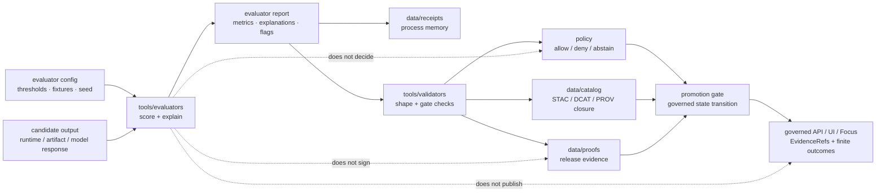

<!-- [KFM_META_BLOCK_V2]
doc_id: kfm://doc/NEEDS-VERIFICATION-tools-evaluators-readme
title: tools/evaluators
type: standard
version: v1
status: draft
owners: @bartytime4life
created: 2026-04-24
updated: 2026-04-24
policy_label: public-safe
related: [
  ../README.md,
  ../validators/README.md,
  ../receipts/README.md,
  <NEEDS_VERIFICATION: ../attest/README.md>,
  ../../data/receipts/README.md,
  ../../data/proofs/README.md,
  ../../contracts/README.md,
  ../../schemas/README.md,
  ../../policy/README.md,
  ../../tests/README.md
]
tags: [kfm, tools, evaluators, metrics, receipts, spec_hash, governance]
notes: [
  "Target path requested for creation or revision: tools/evaluators/README.md.",
  "No current tools/evaluators README was found in the searched public-main evidence; treat this as a proposed new directory README until branch inventory confirms the path.",
  "Owner follows adjacent tools/ and validators README pattern; verify against active CODEOWNERS before publishing.",
  "policy_label follows adjacent validator-lane public-safe posture; verify if evaluator fixtures include restricted examples."
]
[/KFM_META_BLOCK_V2] -->

<a id="top"></a>

# `tools/evaluators/`

Explainable evaluation helpers for scoring model, runtime, citation, and artifact behavior without becoming policy, proof, catalog, or promotion authority.


> [!NOTE]
> **Status:** experimental  
> **Document status:** draft  
> **Owners:** `@bartytime4life` — **NEEDS VERIFICATION** against active `CODEOWNERS`  
> **Path:** `tools/evaluators/README.md`  
> **Authority class:** helper surface for evaluation runs and explainable metric output  
> **Quick jumps:** [Scope](#scope) · [Repo fit](#repo-fit) · [Accepted inputs](#accepted-inputs) · [Exclusions](#exclusions) · [Directory tree](#directory-tree) · [Quickstart](#quickstart) · [Usage](#usage) · [Diagram](#diagram) · [Reference tables](#reference-tables) · [Definition of done](#definition-of-done) · [FAQ](#faq) · [Appendix](#appendix)

> [!IMPORTANT]
> `tools/evaluators/` may produce scores, explanations, metric breakdowns, and evaluator receipts.
>
> It must not decide publication, replace policy, create proof authority, bypass catalog closure, or expose unsupported runtime claims.

> [!CAUTION]
> A good evaluation score is not a release decision. Promotion remains a governed state transition that depends on receipts, policy, catalog/proof closure, review state, and fail-closed gate behavior.

---

## Scope

`tools/evaluators/` is the proposed helper lane for deterministic, explainable evaluation runs.

Use this lane for small, reviewable evaluators that can answer questions such as:

- Did the runtime response satisfy its declared envelope?
- Did the answer cite required evidence?
- Did the output abstain when support was missing?
- Did a candidate artifact preserve expected schema, units, tolerances, or references?
- Did a model, prompt, fixture, or evaluator config produce the same reviewable result under the same declared spec?

This lane should help KFM preserve the difference between:

```text
score -> explanation -> receipt -> validation / policy / proof / catalog checks -> promotion decision
```

It should not collapse those steps into one opaque “pass.”

### Current evidence posture

| Surface | Status | Reading rule |
|---|---:|---|
| `tools/evaluators/README.md` | **NEEDS VERIFICATION** | Requested target path; no current README was found in the searched public-main evidence. |
| `tools/README.md` | **CONFIRMED adjacent doctrine** | Parent lane says tools are governed helpers, not truth, policy, runtime, or publication authority. |
| `tools/validators/README.md` | **CONFIRMED adjacent doctrine** | Validators are fail-closed, deterministic, receipt-aware, and boundary-aware. |
| `tools/receipts/README.md` | **CONFIRMED adjacent pattern** | Receipt tooling may summarize process memory but does not own proof, policy, catalog, or publication state. |
| Executable evaluator inventory | **UNKNOWN** | Do not claim evaluator code, CLI entrypoints, fixtures, workflow callers, or CI enforcement until branch inspection confirms them. |

[Back to top](#top)

---

## Repo fit

`tools/evaluators/` belongs beside validators and receipt helpers. It produces evaluation evidence that other lanes may inspect, validate, summarize, or gate.

| Direction | Surface | Fit | Status |
|---|---|---|---:|
| Parent tooling | [`../README.md`](../README.md) | Defines `tools/` as a governed helper surface that supports evidence movement without becoming truth or publication. | **CONFIRMED** |
| Validation lane | [`../validators/README.md`](../validators/README.md) | Validators may check evaluator reports, receipts, fixture behavior, and fail-closed output shape. | **CONFIRMED** |
| Receipt helper lane | [`../receipts/README.md`](../receipts/README.md) | Receipt helpers may summarize evaluator receipts or assemble evaluator-linked manifests. | **CONFIRMED** |
| Attestation lane | [`../attest/README.md`](../attest/README.md) | Evaluator receipts may later be signed or verified there. | **NEEDS VERIFICATION** |
| Receipt custody | [`../../data/receipts/README.md`](../../data/receipts/README.md) | Stores emitted process-memory receipts, including evaluation run receipts when adopted. | **CONFIRMED / verify exact convention** |
| Proof custody | [`../../data/proofs/README.md`](../../data/proofs/README.md) | Stores release-grade proof and attestation evidence, not ordinary evaluator output. | **NEEDS VERIFICATION** |
| Contracts | [`../../contracts/README.md`](../../contracts/README.md) | Defines semantic meaning of evaluated objects and trust boundaries. | **NEEDS VERIFICATION** |
| Schemas | [`../../schemas/README.md`](../../schemas/README.md) | Owns machine-checkable shapes for evaluator configs, reports, and receipts if adopted. | **NEEDS VERIFICATION** |
| Policy | [`../../policy/README.md`](../../policy/README.md) | Owns allow, deny, abstain, obligations, sensitivity, and promotion logic. | **NEEDS VERIFICATION** |
| Tests | [`../../tests/README.md`](../../tests/README.md) | Proves evaluator behavior with positive, negative, and edge fixtures. | **NEEDS VERIFICATION** |

[Back to top](#top)

---

## Accepted inputs

Use `tools/evaluators/` for explicit, bounded, non-secret inputs that can be reviewed and replayed.

| Accepted input | Examples | Required posture |
|---|---|---|
| Evaluator configs | metric lists, thresholds, fixture refs, deterministic seeds | Canonicalize and hash where identity matters. |
| Evaluation fixtures | expected runtime envelopes, citation cases, abstention cases, schema-valid examples | Keep fixtures non-sensitive or redacted. |
| Candidate outputs | model responses, runtime envelopes, artifact summaries, generated catalog candidates | Evaluate only the declared scope. |
| Metric implementations | schema checks, citation checks, exact-match checks, tolerance checks, span overlap checks | Emit score plus explanation. |
| Explanation payloads | matched spans, missing fields, evidence refs, token diffs, reason codes | Make failures inspectable. |
| Evaluation reports | JSON or JSONL result files intended for CI, review, or receipt creation | Stable shape; no hidden side effects. |
| Evaluator receipts | run memory for what was checked, with which spec hash, and what failed | Store under approved receipt custody, not as proof. |

Healthy evaluator output may say:

- “metric `citation_presence` passed with these matched spans”
- “metric `schema_valid` failed at this JSON path”
- “candidate and evaluator `spec_hash` values do not match”
- “response should abstain because evidence refs are unresolved”
- “this report is ready for validator review”

It must not say:

- “this artifact is published”
- “policy allows release”
- “proof is complete”
- “runtime truth is established”
- “the model answer is authoritative”

[Back to top](#top)

---

## Exclusions

Do **not** put these responsibilities under `tools/evaluators/`.

| Excluded responsibility | Better home | Why |
|---|---|---|
| Policy law | `../../policy/` | Evaluators may measure behavior; policy decides obligations, denial, and release posture. |
| Canonical schemas | `../../schemas/` | Evaluators consume shapes; they do not become the schema registry. |
| Human semantic contracts | `../../contracts/` | Evaluation prose must not replace object meaning or trust doctrine. |
| Receipt custody | `../../data/receipts/` | Evaluators may emit receipt candidates; lifecycle custody belongs in data receipt lanes. |
| Proof packs and attestations | `../../data/proofs/` or `../attest/` | Proof authority is separate from routine metric output. |
| Catalog closure | `../../data/catalog/` | Evaluators may check catalog-like refs; they do not publish catalog records. |
| Promotion gates | `../validators/promotion_gate/` | Evaluator pass/fail may feed gates, but gates own promotion checks. |
| Workflow orchestration | `.github/workflows/`, `.github/actions/`, or `scripts/` | CI may call evaluators; evaluator logic should remain reusable. |
| Raw source or canonical data | `../../data/raw/`, `../../data/work/`, `../../data/quarantine/`, or approved lifecycle homes | Evaluation must not become hidden storage. |
| Secrets or private payloads | secret manager / restricted stores | Never commit credentials, tokens, raw private content, exact sensitive geometry, or restricted living-person data. |

[Back to top](#top)

---

## Directory tree

### Proposed starter shape

This tree is **PROPOSED** until the active branch confirms `tools/evaluators/`.

```text
tools/
└── evaluators/
    ├── README.md
    ├── _shared/                    # PROPOSED: report, reason-code, and hashing helpers
    ├── runtime_response/            # PROPOSED: runtime envelope and abstention checks
    ├── citation_quality/            # PROPOSED: citation and EvidenceRef checks
    ├── artifact_quality/            # PROPOSED: schema, units, tolerance, and manifest checks
    └── fixtures/                    # PROPOSED: small non-sensitive evaluator fixtures
```

### Keep generated outputs elsewhere

```text
data/
├── receipts/                        # evaluator run receipts and review memory
├── proofs/                          # release-grade proof only
└── catalog/                         # STAC / DCAT / PROV closure

tests/
└── ...                              # executable evaluator regression tests
```

> [!NOTE]
> Prefer narrow evaluator families over a large generic scoring script. Each evaluator should have a documented subject, input shape, output shape, and failure grammar.

[Back to top](#top)

---

## Quickstart

Run these from the repository root before adding or relying on evaluator code.

### 1. Confirm the target path and branch state

```bash
git status --short
git branch --show-current || true
find tools -maxdepth 3 -type f | sort
find tools/evaluators -maxdepth 4 -type f 2>/dev/null | sort
```

### 2. Read adjacent lane contracts

```bash
sed -n '1,260p' tools/README.md
sed -n '1,260p' tools/validators/README.md
sed -n '1,260p' tools/receipts/README.md 2>/dev/null || true
sed -n '1,220p' data/receipts/README.md 2>/dev/null || true
sed -n '1,220p' policy/README.md 2>/dev/null || true
sed -n '1,220p' schemas/README.md 2>/dev/null || true
```

### 3. Search for existing evaluator vocabulary

```bash
grep -RIn \
  -e 'evaluator' \
  -e 'metric_breakdown' \
  -e 'failure_flags' \
  -e 'spec_hash' \
  -e 'citation_presence' \
  -e 'abstain' \
  tools tests contracts schemas policy data .github 2>/dev/null || true
```

### 4. Run evaluator tests after code exists

```bash
# Replace with repo-native test targets after evaluator code lands.
python -m pytest tests -q
```

[Back to top](#top)

---

## Usage

An evaluator should be callable with explicit inputs and a declared output path.

```bash
python tools/evaluators/<family>/<evaluator>.py \
  --config configs/evaluators/<config>.json \
  --input <candidate-or-fixture>.json \
  --report <report>.json
```

Expected behavior:

1. Load explicit config and candidate input.
2. Compute or verify the evaluator spec identity.
3. Run only the declared metric set.
4. Emit score, pass/fail state, explanation, and reason codes for every metric.
5. Return non-zero for evaluator errors and blocking failures when configured as strict.
6. Avoid writing anywhere except the explicit report path.

### Minimal evaluator report shape

This shape is **PROPOSED** until contract and schema homes are confirmed.

```json
{
  "report_type": "kfm.evaluator_report.v1",
  "evaluator": "tools/evaluators/<family>/<name>",
  "subject_ref": "<candidate-or-fixture-ref>",
  "evaluator_spec_hash": "sha256:<canonical-config-hash>",
  "artifact_spec_hash": "sha256:<candidate-spec-hash>",
  "outcome": "DENY",
  "metric_breakdown": {
    "schema_valid": 1.0,
    "citation_presence": 0.0
  },
  "failure_flags": [
    "MISSING_REQUIRED_CITATION"
  ],
  "metrics": [
    {
      "name": "citation_presence",
      "score": 0.0,
      "passed": false,
      "reason_code": "MISSING_REQUIRED_CITATION",
      "explanation": {
        "matched_spans": [],
        "missing": ["EvidenceRef"],
        "evidence_refs": []
      }
    }
  ],
  "generated_at": "2026-04-24T00:00:00Z"
}
```

> [!IMPORTANT]
> `metric_breakdown` is useful for review, but `failure_flags` should drive fail-closed behavior. A high score must not hide a blocking flag.

[Back to top](#top)

---

## Diagram



[Back to top](#top)

---

## Reference tables

### Evaluator behavior contract

| Concern | Required posture |
|---|---|
| Determinism | Same declared inputs should produce the same metric results and report shape, except timestamps and explicitly declared nondeterminism. |
| Explainability | Every metric emits a score and a reviewable explanation object. |
| Failure semantics | Blocking failures remain visible in `failure_flags` and reason codes. |
| Output shape | Prefer JSON or JSONL for CI, receipts, and validator compatibility. |
| Side effects | Default to read-only inspection; write only to explicit report paths. |
| Fixture coverage | Include pass, fail, abstain, error, and edge cases where evaluator behavior is consequential. |
| Boundary discipline | Evaluation output may support review; it does not authorize release. |
| Sensitive content | Redact or avoid restricted examples; do not normalize sensitive data into public fixtures. |

### Suggested evaluator families

| Family | Checks | First safe version |
|---|---|---|
| Runtime response | finite outcome grammar, citation presence, abstention behavior, envelope shape | README + small fixture set + JSON report |
| Citation quality | EvidenceRef presence, span support, missing citation flags | deterministic string/span checks before learned metrics |
| Artifact quality | schema validity, required refs, numeric tolerance, units, digest alignment | contract-backed checks with negative fixtures |
| Promotion support | metric breakdown, failure flags, receipt joinability, `spec_hash` alignment | report-only helper consumed by validators |
| Drift checks | prior/current metric deltas and threshold flags | deterministic diff output; no policy decision |

### Outcome vocabulary

| Outcome | Meaning |
|---|---|
| `ALLOW` | No blocking evaluator condition found for the declared evaluation scope. |
| `ABSTAIN` | Evaluation cannot support an outward claim because evidence, input completeness, or source authority is insufficient. |
| `DENY` | A blocking metric, contract, citation, or trust condition failed. |
| `ERROR` | The evaluator could not complete reliably. |

> [!NOTE]
> Child evaluator families may use lower-case or domain-specific outcomes only if they document the mapping and do not create a parallel promotion vocabulary.

### Boundary map

| Surface | Owns | Evaluator handoff rule |
|---|---|---|
| `tools/evaluators/` | Scores, explanations, reports, and evaluator-run helper logic. | Emit reviewable outputs; do not promote. |
| `tools/validators/` | Fail-closed shape, linkage, and gate checks. | Validate evaluator report shape and blocking conditions. |
| `tools/receipts/` | Receipt-adjacent summaries and manifests. | Summarize evaluator receipts without changing meaning. |
| `data/receipts/` | Process-memory custody. | Store evaluator run receipts when approved. |
| `data/proofs/` | Release-grade proof. | Use evaluator output only as linked support, not proof by itself. |
| `policy/` | Allow, deny, abstain, obligations, sensitivity, promotion rules. | Consume evaluator flags only through explicit policy/gate logic. |
| `schemas/` | Machine shape. | Own evaluator report and config schemas if adopted. |
| `contracts/` | Human semantic meaning. | Define what evaluator subjects and outcomes mean. |

[Back to top](#top)

---

## Definition of done

A change under `tools/evaluators/` is ready for review when all applicable checks are true:

- [ ] The evaluator belongs in `tools/evaluators/` rather than `tools/validators/`, `policy/`, `schemas/`, `contracts/`, `data/`, or `tests/`.
- [ ] Inputs are explicit, bounded, and safe to commit.
- [ ] Config identity is deterministic where `spec_hash` is used.
- [ ] Each metric emits score, pass/fail state, reason code, and explanation.
- [ ] Blocking failures appear in `failure_flags`.
- [ ] Positive, negative, abstention, and evaluator-error fixtures exist for consequential checks.
- [ ] Output is JSON or JSONL when consumed by validators, receipts, or CI.
- [ ] The evaluator does not claim policy approval, proof completion, catalog closure, promotion, or publication.
- [ ] Generated reports and receipts are written only to approved lifecycle or explicit output paths.
- [ ] Relative links in this README resolve from `tools/evaluators/`.
- [ ] Ownership is verified against `.github/CODEOWNERS`.
- [ ] Any workflow invocation is documented as **CONFIRMED** only after `.github/workflows/` evidence is inspected.

[Back to top](#top)

---

## FAQ

### Is an evaluator the same as a validator?

No. An evaluator scores and explains observed behavior. A validator checks declared shapes, references, and fail-closed conditions. Evaluator reports may become validator inputs, but they should not replace validator logic.

### Can evaluators use learned metrics?

Yes, but learned metrics should be supporting signals unless the contract explicitly says otherwise. Prefer deterministic checks for gates that carry release or runtime trust.

### Can this lane create receipts?

It may emit receipt-shaped run memory when approved by the repo’s receipt convention, but custody belongs in `data/receipts/` or the confirmed receipt lane.

### Can a passing evaluator report promote an artifact?

No. Promotion requires governed gate behavior, policy state, catalog/proof closure, review, and release handling. Evaluator success is support, not authority.

### Should evaluator fixtures include real sensitive examples?

No. Use minimized, redacted, synthetic, or public-safe fixtures. Do not commit raw private content, exact sensitive locations, credentials, living-person restricted details, or unpublished restricted evidence.

[Back to top](#top)

---

## Appendix

<details id="appendix-inspection">
<summary><strong>Appendix A — branch inspection checklist</strong></summary>

Use this before hardening the README from `draft` to `review` or `published`.

```bash
git status --short
git branch --show-current || true

find tools/evaluators -maxdepth 5 -type f 2>/dev/null | sort
find tests -maxdepth 5 -type f 2>/dev/null | grep -Ei 'eval|metric|runtime|citation' | sort || true
find configs -maxdepth 5 -type f 2>/dev/null | grep -Ei 'eval|metric|model|runtime' | sort || true

grep -RIn \
  -e 'tools/evaluators' \
  -e 'evaluator_spec_hash' \
  -e 'metric_breakdown' \
  -e 'failure_flags' \
  -e 'citation_presence' \
  -e 'spec_hash' \
  tools tests configs contracts schemas policy data .github 2>/dev/null || true
```

</details>

<details id="appendix-open-items">
<summary><strong>Appendix B — open verification items</strong></summary>

| Item | Evidence needed |
|---|---|
| Path exists | `find tools/evaluators -maxdepth 4 -type f` |
| Parent navigation | `tools/README.md` updated to list `tools/evaluators/` |
| Owner | active `.github/CODEOWNERS` line covering `tools/evaluators/` |
| Config schema | confirmed schema path for evaluator config |
| Report schema | confirmed schema path for evaluator report |
| Receipt convention | approved output path and receipt shape |
| Test runner | repo-native command for evaluator tests |
| CI wiring | `.github/workflows/` or action evidence |
| Attestation handoff | confirmed `tools/attest/` behavior if evaluator receipts are signed |
| Promotion use | confirmed promotion-gate consumption pattern before claiming enforcement |

</details>

[Back to top](#top)
