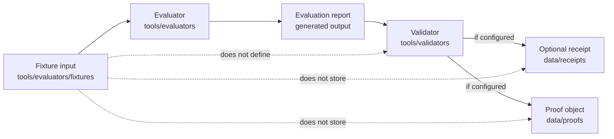

<!-- [KFM_META_BLOCK_V2]
doc_id: kfm://doc/NEEDS-VERIFICATION-tools-evaluators-fixtures-readme
title: tools/evaluators/fixtures
type: standard
version: v1
status: draft
owners: <NEEDS_VERIFICATION: owner from CODEOWNERS or repo maintainers>
created: 2026-04-24
updated: 2026-04-25
policy_label: <NEEDS_VERIFICATION: public-safe>
related: [
  ../README.md,
  ../../validators/README.md,
  ../../receipts/README.md,
  ../../../data/receipts/README.md,
  ../../../data/proofs/README.md,
  ../../../tests/README.md,
  <NEEDS_VERIFICATION: ../../../schemas/README.md>,
  <NEEDS_VERIFICATION: ../../../contracts/README.md>
]
tags: [kfm, evaluators, fixtures, testing, evidence, governance]
notes: [
  "Target path: tools/evaluators/fixtures/README.md.",
  "Directory README for evaluator fixtures.",
  "No mounted repository evidence was available in the supplied workspace; adjacent links and owners require verification.",
  "Fixture structure is PROPOSED from the supplied draft and KFM evaluator/validator/receipt doctrine.",
  "Fixtures are test inputs only; they are not policy, truth, receipts, proofs, catalog records, or production evidence."
]
[/KFM_META_BLOCK_V2] -->

<a id="top"></a>

# `tools/evaluators/fixtures/`

Deterministic, reviewable inputs used to test evaluator correctness, failure modes, abstention behavior, and report semantics.


> [!NOTE]
> **Status:** experimental  
> **Document status:** draft  
> **Owner:** `<NEEDS_VERIFICATION>`  
> **Path:** `tools/evaluators/fixtures/README.md`  
> **Purpose:** provide stable, inspectable test inputs for evaluator logic  
> **Quick jumps:** [Scope](#scope) · [Repo fit](#repo-fit) · [Accepted inputs](#accepted-inputs) · [Exclusions](#exclusions) · [Directory tree](#directory-tree) · [Quickstart](#quickstart) · [Usage](#usage) · [Diagram](#diagram) · [Tables](#tables) · [Definition of done](#definition-of-done) · [FAQ](#faq) · [Verification backlog](#verification-backlog)

> [!IMPORTANT]
> Fixtures are **evaluator test inputs**. They are not truth, policy, production data, proof objects, catalog records, or release evidence.

> [!CAUTION]
> Fixtures in this directory must never contain secrets, private data, sensitive real-world entities, restricted geospatial precision, unpublished evidence, or governed evidence that has not been cleared for fixture use.

---

## Scope

`tools/evaluators/fixtures/` holds controlled inputs for evaluator tests.

Use this directory when a maintainer needs to prove that an evaluator can consistently answer questions such as:

- Does the evaluator distinguish supported output from unsupported output?
- Does it emit the expected `failure_flags`?
- Does it abstain when evidence is missing, stale, partial, or conflicted?
- Does it explain why a result passed, failed, denied, or abstained?
- Does it preserve deterministic behavior across repeated runs?

The basic test shape is:

```text
fixture input → evaluator → evaluation report → validator → optional receipt
```

Fixtures help make evaluator behavior:

| Quality | Meaning |
|---|---|
| Deterministic | Same fixture and evaluator version produce the same expected result. |
| Explainable | Reviewers can see why a fixture should pass, fail, deny, abstain, or error. |
| Minimal | Each file isolates one behavior instead of hiding intent in a large scenario. |
| Reproducible | Fixtures can be used by tests, validators, and review tooling without live data. |
| Public-safe | Fixture content is safe to store in the repo after review. |

---

## Repo fit

> [!WARNING]
> The links below are the intended repo relationships for this README. They must be verified against the mounted repository before the document is promoted beyond draft.

| Direction | Surface | Fit | Status |
|---|---|---|---|
| Parent | [`../README.md`](../README.md) | Evaluator families consume fixtures as inputs for scoring and explanation. | **NEEDS VERIFICATION** |
| Validators | [`../../validators/README.md`](../../validators/README.md) | Validators may assert fixture → report correctness. | **NEEDS VERIFICATION** |
| Receipts | [`../../receipts/README.md`](../../receipts/README.md) | Fixture-driven evaluation runs may emit process receipts. | **NEEDS VERIFICATION** |
| Data receipts | [`../../../data/receipts/README.md`](../../../data/receipts/README.md) | Stores run memory when receipt emission is enabled. | **NEEDS VERIFICATION** |
| Data proofs | [`../../../data/proofs/README.md`](../../../data/proofs/README.md) | Stores proof artifacts; fixtures must not be stored there. | **NEEDS VERIFICATION** |
| Tests | [`../../../tests/README.md`](../../../tests/README.md) | Executes fixtures against evaluator logic. | **NEEDS VERIFICATION** |
| Schemas | `<NEEDS_VERIFICATION>` | Defines fixture shape contracts if a fixture schema exists. | **UNKNOWN** |
| Contracts | `<NEEDS_VERIFICATION>` | Defines evaluator report semantics if a contract exists. | **UNKNOWN** |

---

## Accepted inputs

A file belongs in `tools/evaluators/fixtures/` when it is a small, safe, deterministic input designed to test evaluator behavior.

### Fixture categories

| Category | Purpose | Expected reviewer question |
|---|---|---|
| Positive | Valid case that should pass under the target evaluator. | “Can the evaluator recognize a supported result?” |
| Negative | Invalid case that should fail or deny for a clear reason. | “Can the evaluator catch the defect?” |
| Abstention | Missing, weak, partial, stale, or conflicted evidence case. | “Can the evaluator abstain rather than overclaim?” |
| Edge case | Boundary condition such as empty evidence, duplicate refs, or tolerance limits. | “Can the evaluator stay stable at the edge?” |
| Error case | Invalid input shape or intentionally broken fixture. | “Does the evaluator fail explicitly without pretending success?” |

### Fixture requirements

| Property | Requirement |
|---|---|
| Deterministic | No live network, clock-dependent, random, or environment-dependent behavior unless explicitly frozen. |
| Minimal | Include the smallest input needed to prove one behavior. |
| Reviewable | Make expected behavior obvious to a human reviewer. |
| Isolated | Avoid hidden dependencies on external state, production data, or unpublished artifacts. |
| Non-sensitive | Use synthetic or approved public-safe examples only. |
| Contract-aware | Align expected output with the evaluator family’s report semantics. |
| Version-aware | When relevant, include fixture schema/version fields instead of relying on implicit shape. |

---

## Exclusions

Do not put the following in this directory.

| Excluded | Why | Put it here instead |
|---|---|---|
| Real production data | Can violate privacy, rights, sensitivity, or source terms. | Governed lifecycle storage after source review. |
| Secrets or credentials | Security violation. | Never commit; use approved secret management. |
| Full datasets | Fixtures must stay minimal and reviewable. | Dataset lifecycle directories, if cleared. |
| Policy logic | Fixtures test behavior; they do not define policy. | `policy/` or the repo’s verified policy home. |
| Proof artifacts | Proofs are output artifacts, not evaluator inputs. | `data/proofs/` after verification. |
| Receipt storage | Receipts are process memory, not fixtures. | `data/receipts/` after verification. |
| Catalog records | Catalog records describe released or governed artifacts. | `data/catalog/` after verification. |
| Raw model output without expected result | Unbounded examples are not test fixtures. | Add expected outcome and evaluator family first. |
| Sensitive exact-location examples | Public fixture leakage risk. | Use generalized or synthetic geometry only. |
| Unpublished governed evidence | Breaks promotion and review boundaries. | Keep in governed evidence lifecycle. |

---

## Directory tree

### Proposed structure

```text
tools/evaluators/fixtures/
├── README.md
├── runtime_response/
│   ├── valid_response.json
│   ├── missing_citation.json
│   └── abstain_case.json
├── citation_quality/
│   ├── valid_citations.json
│   ├── missing_refs.json
│   └── partial_support.json
└── artifact_quality/
    ├── valid_schema.json
    ├── invalid_schema.json
    └── tolerance_fail.json
```

> [!NOTE]
> This tree is **PROPOSED** until the mounted repo confirms actual evaluator families, fixture names, schema homes, and test runners.

---

## Quickstart

### Inspect the fixture inventory

```bash
find tools/evaluators/fixtures -type f | sort
```

### Run an evaluator against one fixture

> [!WARNING]
> The command below is an illustrative pattern. Replace `runtime_response_evaluator.py`, fixture names, and output paths with verified repo-native evaluator commands.

```bash
mkdir -p build/evaluators/runtime_response

python tools/evaluators/runtime_response/runtime_response_evaluator.py \
  --input tools/evaluators/fixtures/runtime_response/missing_citation.json \
  --report build/evaluators/runtime_response/missing_citation.report.json
```

### Run tests

> [!NOTE]
> Test runner and test paths are **NEEDS VERIFICATION** until the real repository is mounted.

```bash
pytest tests -q
```

---

## Usage

A good fixture makes one behavior unmistakable.

### Naming pattern

Use descriptive names that identify the evaluator family and behavior.

```text
<behavior>.json
```

Examples:

```text
valid_response.json
missing_citation.json
abstain_case.json
partial_support.json
invalid_schema.json
```

For larger evaluator families, prefer a stable prefix:

```text
citation_missing_required_ref.json
citation_partial_support.json
runtime_abstain_no_evidence.json
artifact_schema_missing_required_field.json
```

### Minimal fixture shape

> [!IMPORTANT]
> This shape is **PROPOSED**. If the repo already has a fixture schema, use the verified schema instead.

```json
{
  "fixture_id": "runtime_response.missing_citation.v1",
  "fixture_type": "negative",
  "description": "Runtime response lacks a required citation.",
  "input": {
    "text": "Soil moisture increased.",
    "citations": []
  },
  "expected": {
    "outcome": "DENY",
    "failure_flags": ["MISSING_REQUIRED_CITATION"]
  }
}
```

### Fixture authoring rules

1. Start with the evaluator behavior, not the example story.
2. Keep the input as small as possible.
3. Use synthetic content unless public-safe source terms are verified.
4. Include the expected outcome and expected flags.
5. Avoid hidden dependencies on runtime state.
6. Make abstention cases first-class, not failed positive cases.
7. Update tests when fixture behavior changes.

---

## Diagram



---

## Tables

### Behavior-to-outcome guide

Evaluator families may use different result vocabularies. Keep each fixture aligned to the verified evaluator contract.

| Fixture intent | Common outcome shape | Notes |
|---|---|---|
| Supported answer | `ANSWER`, `ALLOW`, `PASS`, or equivalent | Use the evaluator family’s verified vocabulary. |
| Unsupported answer | `DENY`, `FAIL`, or equivalent | Include stable `failure_flags`. |
| Evidence gap | `ABSTAIN` | Missing evidence is not the same as technical failure. |
| Policy block | `DENY` or policy-specific equivalent | Fixture may simulate policy result, but policy logic belongs elsewhere. |
| Technical failure | `ERROR` | Use only when the fixture is meant to prove error handling. |

### Fixture family guide

| Family | Purpose | Example fixture | Status |
|---|---|---|---|
| `runtime_response/` | Tests finite runtime response outcomes and citation behavior. | `missing_citation.json` | **PROPOSED** |
| `citation_quality/` | Tests citation presence, support, and reference linkage. | `partial_support.json` | **PROPOSED** |
| `artifact_quality/` | Tests schema, tolerance, or artifact-shape expectations. | `invalid_schema.json` | **PROPOSED** |

### Fixture review matrix

| Review question | Required answer before merge |
|---|---|
| Is the fixture synthetic or confirmed public-safe? | Yes. |
| Does it test one behavior? | Yes. |
| Is the expected outcome explicit? | Yes. |
| Are `failure_flags` stable and reviewable? | Yes, when applicable. |
| Does it avoid policy-authority claims? | Yes. |
| Is it covered by at least one evaluator test? | Yes, unless intentionally staged as backlog. |
| Does it preserve deterministic behavior? | Yes. |

---

## Definition of done

A fixture is complete when:

- [ ] It represents one clear evaluator behavior.
- [ ] It is minimal, deterministic, and isolated.
- [ ] It contains no secrets, private data, sensitive entities, or restricted precision.
- [ ] It has an explicit expected outcome.
- [ ] It defines expected `failure_flags` when the evaluator emits them.
- [ ] It uses the verified outcome vocabulary for its evaluator family.
- [ ] It is covered by at least one evaluator test.
- [ ] It produces consistent results across repeated runs.
- [ ] It does not claim policy authority, truth authority, catalog status, proof status, or release status.
- [ ] Any schema/version assumption is documented or marked `NEEDS VERIFICATION`.

---

## FAQ

### Why keep fixtures separate from tests?

Fixtures define **inputs and expected behavior**. Tests define **execution and assertions**. Keeping them separate makes examples reusable across unit tests, regression tests, validators, and review tooling.

### Can fixtures evolve?

Yes, but changes must preserve determinism and reviewability. If expected behavior changes, update the test assertion and note why the previous expectation changed.

### Are fixtures reused across evaluators?

Yes, when behavior overlaps. A citation-quality fixture may be reused by runtime-response evaluators if the expected result is still unambiguous.

### Can a fixture include policy decisions?

A fixture may include a synthetic policy-shaped input or expected policy result when testing evaluator behavior. It must not define policy logic or act as a policy registry.

### Can a fixture include EvidenceBundle-like content?

Yes, as synthetic or approved public-safe content. The fixture must not pretend to be production evidence, a proof object, or a released catalog record.

### Should fixtures produce receipts?

Fixtures do not produce receipts by themselves. A fixture-driven run may emit an optional receipt if the evaluator, validator, or test harness is configured to do so.

### What should happen when evidence is missing?

Use `ABSTAIN` or the verified evaluator-family equivalent. Missing evidence should not be silently converted into a confident answer.

### What if the evaluator contract is not verified yet?

Keep the fixture staged as `PROPOSED`, document the expected vocabulary, and avoid claiming test coverage until the contract and runner are verified.

---

## Verification backlog

Resolve these before promoting this README beyond draft.

| Item | Status | Why it matters |
|---|---|---|
| Confirm owner from `CODEOWNERS` or maintainer records. | **NEEDS VERIFICATION** | The current owner value is not verified from repo evidence. |
| Confirm adjacent README paths. | **NEEDS VERIFICATION** | Relative links should not imply files exist unless inspected. |
| Confirm evaluator family names. | **NEEDS VERIFICATION** | Directory tree should match real evaluator boundaries. |
| Confirm fixture schema home. | **UNKNOWN** | Schema authority may live under `schemas/`, `contracts/`, or another verified home. |
| Confirm test runner and command. | **NEEDS VERIFICATION** | `pytest` is illustrative until repo tooling is inspected. |
| Confirm outcome vocabulary by evaluator family. | **NEEDS VERIFICATION** | Runtime, policy, artifact, and citation evaluators may use different result vocabularies. |
| Confirm receipt/proof emission behavior. | **UNKNOWN** | Fixtures should not imply receipt or proof generation unless implemented. |
| Confirm policy label. | **NEEDS VERIFICATION** | `public-safe` must match repo sensitivity taxonomy before publication. |

---

[Back to top](#top)
