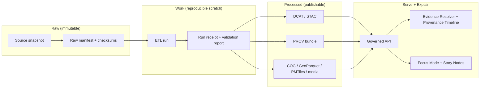

# tools/evidence 🧾🔎


KFM’s core promise is **“cite or abstain”**. This folder exists to make that promise enforceable.

## What belongs here

This directory is for **offline + CI utilities** that:

- **Capture** source snapshots and metadata (rights, license, sensitivity).
- **Produce** verifiable “receipts” for pipeline runs (inputs, outputs, checksums, policy results).
- **Package** datasets + catalogs + provenance into **digest-addressed evidence bundles**.
- **Verify** evidence bundles (checksums, signatures/attestations) without “prior state.”
- **Support** the **Evidence Resolver** UX by standardizing evidence references (“evidence refs”).

> [!IMPORTANT]
> Evidence tooling **must not** bypass KFM’s trust membrane.
> - UI and external clients never talk to databases/object storage directly.
> - Resolution and redaction happen via governed APIs.

---

## Evidence objects

_KFM mental model_

| Object | Purpose | Produced by | Consumed by |
|---|---|---:|---:|
| **Source snapshot** (raw file) | Immutable copy of upstream evidence | Watcher/connector | Reprocessing, audit |
| **Raw manifest + checksums** | Deterministic inventory of raw inputs | Watcher/connector | Validation, reproducibility |
| **Run receipt** (`run_record`, `validation_report`, `run_manifest`) | “What happened?” for a pipeline run | ETL/orchestrator | Promotion gates, audit, UI |
| **Catalogs** (DCAT / STAC) | Dataset discovery + spatial asset metadata | ETL/publisher | API + UI discovery |
| **PROV bundle** (JSON‑LD) | Lineage: entities/activities/agents | ETL/publisher | Provenance timeline, audit |
| **Evidence ref** (claim → evidence pointers) | Normalized citations for “click to evidence” | Focus/Story tooling | Evidence resolver API + UI |
| **Evidence bundle** (OCI, digest‑pinned) | Portable, verifiable package for auditors + clients | Publisher | Bundle resolver, offline verification |
| **Audit ref** (`audit_ref`) | Tamper‑evident log pointer | Governed API | Every governed response |

---

## How this fits the “Truth Path”

KFM data moves through **Raw → Work → Processed**, with catalogs/provenance emitted as first‑class outputs.



---

## Proposed folder layout

> [!NOTE]
> This is a **recommended** layout for this directory. Some items may not exist yet (scaffold-first).

```text
tools/evidence/
  README.md                  # you are here
  schemas/                   # JSON Schemas for evidence_ref / run_receipt / bundle config
  templates/                 # source_record.yaml, claim.yaml, evidence_ref examples
  scripts/                   # pack/verify helpers (OCI bundle, signature checks, link checks)
  fixtures/                  # golden fixtures + regression tests (redaction, leak prevention)
  reports/                   # CI outputs (machine-readable) for audits
```

---

## Interfaces

_Contracts this tooling should enforce_

### Evidence reference

_Evidence ref format_

An **evidence_ref** is a portable “citation object” that a UI can resolve into:

- record IDs
- snippets (e.g., page + bounds for a PDF)
- media pointers (e.g., image/tile/document)
- provenance chain IDs (run, bundle digest)

**Design goal:** if a sentence exists in a Story Node or Focus answer, it can point to at least one evidence_ref.

<details>
<summary><strong>Example (illustrative) evidence_ref JSON</strong></summary>

```json
{
  "type": "kfm.evidence_ref.v1",
  "claim_id": "story:example:para-3:sent-2",
  "dataset_version": {
    "doi": "10.xxxx/example",
    "provider_key": "kshs:collection:123",
    "version_digest": "sha256:…"
  },
  "source_record_ids": ["src:kc:foo:1890-04-12:p3"],
  "stac": { "collection": "stac:…", "item": "stac:…" },
  "prov": { "run_id": "prov:run:…", "bundle": "sha256:…" },
  "snippets": [{ "kind": "pdf", "page": 3, "bbox": [0.12, 0.20, 0.88, 0.33] }],
  "care": { "sensitivity": "public", "generalized": false }
}
```

</details>

### Evidence bundle

_OCI, digest‑pinned_

A digest‑pinned evidence bundle should be able to carry (at minimum):

- catalogs (DCAT/STAC)
- run receipt
- PROV bundle
- SBOM + attestations (optional but recommended)
- the actual artifacts (GeoParquet/COG/PMTiles/media)

**Rule of thumb:** an auditor should be able to verify the bundle *offline* (checksums + signatures), then browse it.

---

## Workflows

_Human-readable workflows_

### 1. Add a new upstream source snapshot

_Raw zone_

- [ ] Acquire source data into `data/raw/...` (immutable)
- [ ] Generate **manifest + checksums**
- [ ] Record **rights / license / attribution** and **policy label** (public / restricted / sensitive‑location / aggregate‑only)
- [ ] If sensitive: confirm default classification is **fail‑closed** and any public derivative is generalized/redacted

### 2. Produce publishable artifacts

_Work → Processed_

- [ ] Run ETL deterministically (idempotent)
- [ ] Emit **run receipt** (PASS or FAIL is still a receipt)
- [ ] Emit catalogs (DCAT always; STAC/PROV when applicable)
- [ ] Ensure cross-links are resolvable (DCAT ↔ STAC ↔ PROV)

### 3. Package and sign evidence bundle

- [ ] Package artifacts + catalogs + receipts into OCI bundle
- [ ] Sign and attach attestations (supply‑chain evidence)
- [ ] Store/record the **bundle digest** as the canonical address

### 4. Verify

_CI and auditors_

- [ ] Verify checksums for all listed artifacts
- [ ] Verify signatures/attestations (fail closed)
- [ ] Verify policy gates passed (or confirm denial is expected and recorded)
- [ ] Confirm a fresh environment can discover attached evidence and validate without prior state

---

## Integration points

_Runtime, via governed API_

These tools should support (and never bypass) runtime endpoints such as:

- `GET /bundles/{digest}` — resolve bundle digest to descriptors/children
- `GET /provenance/timeline?...` — user-facing provenance slice for a dataset/time window
- `POST /evidence/resolve` — translate a claim/evidence_ref into evidence payloads (snippets/media/prov)
- `POST /focus/query` — Focus Mode orchestration (must return citations or abstain + audit ref)

---

## Governance and safety guardrails

> [!WARNING]
> **Never** commit secrets, API keys, or private credentials.  
> Treat credentials as infrastructure-managed secrets (vault/secret manager).

> [!IMPORTANT]
> Sensitive-location handling is not optional.
> - When evidence includes protected coordinates (e.g., archaeology), publish only generalized derivatives **with explicit redaction provenance**.
> - If policy is unclear, default to **deny**.

### Cite or abstain enforcement

_Definition of Done_

- [ ] Any claim in Story Nodes / Focus output **has** a resolvable evidence_ref **or** is marked **abstained/not confirmed**
- [ ] Every governed response includes an `audit_ref` and (where applicable) an evidence bundle hash/digest
- [ ] Policy regression suite includes negative tests to prevent reintroducing prior leaks

---

## Troubleshooting

| Symptom | Likely cause | Fix |
|---|---|---|
| Evidence resolver can’t find snippets | Missing/invalid `evidence_ref` pointers | Validate against schema; ensure bundle digest + locator exists |
| Bundle verification fails | Tampering, missing artifacts, or unsigned bundle | Repack; ensure checksums + signature step ran; fail closed |
| CI blocks promotion | License/sensitivity metadata missing | Add rights metadata; set policy label; rerun gates |
| “Cite or abstain” failure | Focus/Story output missing citations | Update generator to emit evidence_ref; add fixtures |

---

## Next thin slice

_Recommended_

If you’re implementing this folder from scratch, the minimum credible slice is:

1. JSON Schemas: `evidence_ref`, `run_receipt`, `bundle_config`
2. One pack + verify script path (bundle digest → verify → list contents)
3. CI gate: schema validation + signature verification + link check
4. One end-to-end demo: Story Node sentence → evidence drawer snippet → audit ref

---

## Glossary

- **Evidence ref**: A normalized citation object pointing to specific evidence + provenance.
- **Receipt**: A signed record of a pipeline run (inputs/outputs/hashes/policy result).
- **Bundle digest**: Content address (sha256:…) used as the canonical “version id.”
- **Fail-closed**: Default deny when metadata/policy/evidence is missing or uncertain.
- **Trust membrane**: The enforced boundary: clients/UI cannot access storage directly.
