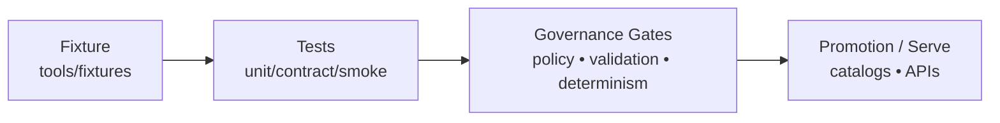

# tools/fixtures


Curated, **small**, **deterministic**, and **governance-safe** fixtures used to test KFM’s truth path:
**ingest → validate → enrich → catalog/provenance → serve (API+policy) → explain (Focus Mode / Story Nodes)**.

> [!IMPORTANT]
> Fixtures are part of the **governance surface**. Treat changes here like production changes:
> they can affect CI gate behavior, policy enforcement, and what can be considered “proven”.

## Why this exists

KFM is explicitly **evidence-first** and **fail-closed**. That means we need fixtures to support:

- **Policy unit tests + regression fixtures**
- At least one **“smoke” end-to-end test** that brings up the stack (or a stub stack) and runs an **anchor dataset promotion** in dry-run mode
- **Deterministic “golden” artifacts** so the same spec produces the same outputs over time

This folder is the canonical home for those fixtures.

## What belongs here

✅ **Belongs**

- Minimal input datasets (synthetic / permitted) used in pipeline tests
- Expected catalog/provenance fragments (DCAT/STAC/PROV) for contract tests
- Policy allow/deny test cases (including “known leak” negative cases)
- Golden outputs + checksums for deterministic identity tests
- API request/response fixtures for contract tests

❌ **Does not belong**

- Large production datasets (store those in governed data zones / object storage)
- Any sensitive or restricted location data in raw form
- Anything with unclear rights / license status
- Secrets (API keys, tokens, credentials)

> [!NOTE]
> When in doubt: prefer **synthetic** fixtures and test the transform/policy logic, not the raw source data.

## Directory layout

The exact layout may evolve, but keep it **predictable** and **discoverable**.

```text
tools/fixtures/
├─ README.md
├─ _templates/                 # Copy/paste templates (fixture manifests, expected outputs)
├─ policy/                     # Policy-as-code tests: allow/deny cases + “known leak” cases
├─ datasets/                   # Minimal datasets that drive pipeline + catalog tests
│  └─ <fixture_id>/
│     ├─ fixture.yaml          # Required metadata (license, sensitivity, purpose, checksums…)
│     ├─ input/                # Inputs to a pipeline step / use case
│     ├─ expected/             # Expected outputs (golden) OR assertions scaffolding
│     └─ notes.md              # Optional rationale + gotchas
├─ api/                        # API-level fixtures (requests/responses, OpenAPI/GraphQL samples)
└─ golden/                     # Canonical outputs + checksums for determinism regression
```

> [!TIP]
> If your fixture doesn’t fit any category, add a new folder **once**, document it here, and keep the naming consistent.

## Fixture manifest (required)

Each fixture directory **must** include a `fixture.yaml` (or `fixture.json`) sidecar with governance metadata.

| Field | Required | Example | Notes |
|---|---:|---|---|
| `id` | ✅ | `anchor_landparcel_v1` | Stable identifier (`snake_case`). |
| `title` | ✅ | `Anchor: Land parcel mini-set` | Human label. |
| `purpose` | ✅ | `pipeline_smoke` | One of: `pipeline_smoke`, `policy_regression`, `api_contract`, `determinism_golden`, `ui_smoke`. *(extend as needed)* |
| `sensitivity` | ✅ | `public` | One of: `public`, `internal`, `restricted`. **Default should be conservative.** |
| `license` | ✅ | `CC-BY-4.0` | SPDX identifier when possible. |
| `sources` | ✅ | `[...]` | Evidence pointers (dataset IDs, catalog IDs, doc paths). |
| `inputs` | ✅ | `['input/parcels.geojson']` | Relative paths. |
| `expected` | ✅ | `['expected/dcat.jsonld']` | Relative paths. |
| `checksums` | ✅ | `{ 'input/parcels.geojson': 'sha256:...' }` | Drift detection. |
| `created_at` | ✅ | `2026-02-16` | ISO date (not a build timestamp). |
| `maintainers` | ✅ | `['@data-steward', '@platform-eng']` | CODEOWNERS can enforce. *(not confirmed in repo)* |

### Template `fixture.yaml`

```yaml
id: anchor_landparcel_v1
title: "Anchor: Land parcel mini-set"
purpose: pipeline_smoke
created_at: "2026-02-16"

sensitivity: public           # public | internal | restricted
license: CC-BY-4.0            # SPDX recommended

sources:
  - kind: doc
    ref: "docs/.../some-spec.md"
  - kind: dataset
    ref: "data/registry/<dataset_id>.yaml"   # (not confirmed in repo)

inputs:
  - "input/parcels.geojson"
expected:
  - "expected/dcat.dataset.jsonld"
  - "expected/prov.activity.json"
checksums:
  "input/parcels.geojson": "sha256:<fill>"
  "expected/dcat.dataset.jsonld": "sha256:<fill>"
  "expected/prov.activity.json": "sha256:<fill>"

notes:
  - "Synthetic geometry; no real parcel owner PII."
  - "Sorted features by stable key for deterministic hashing."
```

## Determinism rules (golden fixtures)

Golden fixtures exist to protect KFM’s **deterministic identity** guarantees.

**Rules of thumb**

- No timestamps, random UUIDs, or unordered maps in golden outputs.
- Stable sort order for arrays/lists.
- For JSON used in hashing/signing, canonicalize (e.g., **RFC 8785 JCS**) before hashing.
  *(Hashing implementation may live elsewhere; fixtures just provide goldens.)*

## Sensitivity & “known leak” fixtures

Some fixtures exist purely to ensure we **don’t leak** sensitive locations.

- Use **synthetic** coordinates or **generalized** geometries.
- Include negative fixtures that represent “known leak” patterns, so redaction/generalization logic can be regression-tested.

> [!WARNING]
> Do **not** include restricted archaeology/cultural site coordinates in this repo.
> If a test needs that shape, generate a synthetic stand-in or a generalized polygon and document the rationale in `notes.md`.

## How to add a fixture

1. Create a new folder under the appropriate namespace (`datasets/`, `policy/`, `api/`, `golden/`).
2. Add `fixture.yaml` with required metadata.
3. Add `input/` and `expected/` artifacts (or policy cases).
4. Add/extend tests so the fixture is **actually used**.
5. Run the test suite and ensure it passes locally.
6. Open a PR; expect governance review (license + sensitivity + determinism).

### Definition of Done ✅

- [ ] Fixture is minimal (smallest possible) and deterministic
- [ ] `fixture.yaml` complete (license + sensitivity + checksums present)
- [ ] No restricted/sensitive raw data included
- [ ] At least one automated test consumes the fixture
- [ ] Golden outputs updated (if applicable) with stable ordering
- [ ] Notes explain any non-obvious choices

## Fixture → test flow



---

## FAQ

<details>
<summary><strong>Why not store “real” datasets here?</strong></summary>

Fixtures are optimized for **repeatability** and **safety**. Real datasets are often large, licensed,
or sensitive, and belong in governed data zones with explicit promotion gates and audit trails.
</details>

<details>
<summary><strong>What if my fixture needs to reference a real source?</strong></summary>

Prefer: store **a citation pointer** (dataset ID, catalog ID, doc path) in `fixture.yaml`, and keep
the fixture itself synthetic/minimal.

If you must include a small excerpt, ensure the license allows it and the excerpt does not contain
restricted/sensitive data.
</details>