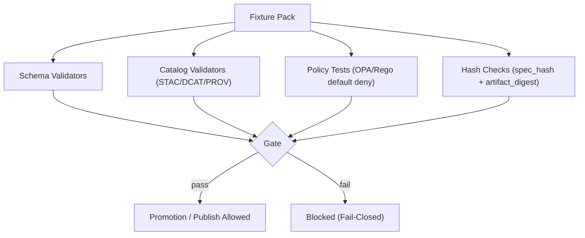

# KFM Tooling Fixtures (`tools/fixtures/`) 🧪🧷


Governed **fixture packs** used to validate KFM’s evidence-first pipeline, catalogs (**STAC/DCAT/PROV**), provenance receipts (**run_receipt/run_manifest**), and policy gates (**OPA/Rego**, cite‑or‑abstain).

---

## Why this folder exists

KFM’s credibility depends on **repeatable, audited behavior**. Fixtures in this directory enable CI and local runs to prove:

- **Determinism**: fixed inputs produce fixed hashes/counts/outputs.
- **Governance**: policy gates **fail closed** (default deny) when required fields, provenance, or rights are missing.
- **Evidence-first**: outputs intended for end-users are only produced when citations/provenance are present (or they abstain).
- **Catalog integrity**: what catalogs advertise (digests, links, metadata) matches what artifacts actually are.

> [!IMPORTANT]
> Fixtures are treated as **governed artifacts**. Changing them can change system behavior and test baselines.

---

## Non-negotiables (fixtures must reinforce these)

KFM is built around hard invariants. Fixtures in this folder **must not** undermine them:

- **Trust membrane**: clients/UI do not directly access databases; access is mediated through governed APIs + policy boundary.
- **Fail-closed policy checks**: missing governance data is a hard failure (deny promotion/deny response).
- **No promotion without STAC/DCAT/PROV**: promoted datasets/artifacts must have catalogs + provenance.
- **Focus Mode must cite or abstain**: fixtures must include both *allowed* (cited) and *denied* (uncited / sensitive) cases.

---

## What belongs here

✅ **Good fixture candidates (expected)**

- `run_receipt` / `run_manifest` JSON examples:
  - required fields present vs missing required fields
  - passing vs failing `policy_gate` outcomes
  - stable `spec_hash` reproducibility vectors
  - stable `artifact_digest` matching vectors
- Minimal, **synthetic** catalog artifacts:
  - STAC Item/Collection with required links and digest fields
  - DCAT dataset stub with license/rights
  - PROV bundle stub referencing the run receipt
- OPA/Rego test cases:
  - allow when citations present and sensitivity OK
  - deny when missing citations, missing rights/license, or sensitivity not OK
- API contract fixtures:
  - request + expected response showing provenance bundle links and redaction behavior
- Small synthetic dataset slices (tabular / vector) to validate:
  - schema mapping
  - geometry validity
  - time normalization rules
  - stable counts and checksums

🚫 **Do not commit**
- secrets, API keys, tokens, credentials, cookies
- production data dumps
- precise sensitive locations or restricted cultural knowledge
- personal data from real individuals (unless explicitly governed/approved and sanitized)

---

## Recommended organization

Fixtures are easiest to maintain when grouped as **packs**.

A **fixture pack** is a self-contained directory that includes:
- a short README (what it tests, what validators use it)
- metadata (rights/sensitivity + intent)
- fixture files (inputs/expected outputs)
- checksums (so CI can prove byte-stability)

### Suggested tree

```text
tools/fixtures/
├── README.md
├── packs/
│   ├── run-receipts/
│   │   ├── demo-pass/
│   │   │   ├── pack.meta.json
│   │   │   ├── run_receipt.pass.json
│   │   │   ├── spec.canonical.json
│   │   │   ├── expected.spec_hash.txt
│   │   │   ├── manifest.sha256
│   │   │   └── README.md
│   │   └── demo-fail/
│   │       ├── pack.meta.json
│   │       ├── run_receipt.fail.missing_license.json
│   │       ├── expected.policy_decision.json
│   │       ├── manifest.sha256
│   │       └── README.md
│   ├── policy/
│   │   ├── cite-or-abstain/
│   │   │   ├── pack.meta.json
│   │   │   ├── input.allow.json
│   │   │   ├── input.deny.missing_citations.json
│   │   │   ├── input.deny.sensitivity_not_ok.json
│   │   │   ├── expected.allow.json
│   │   │   ├── expected.deny.json
│   │   │   ├── manifest.sha256
│   │   │   └── README.md
│   ├── catalogs/
│   │   ├── stac-min/
│   │   ├── dcat-min/
│   │   └── prov-min/
│   └── api-contract/
│       └── provenance-and-redaction/
└── _notes/
    └── rationale.md
```

> [!NOTE]
> The tree above is a **recommended** structure. If the repository uses a different layout, keep the **pack contract** (below) consistent.

---

## Fixture pack contract (minimum)

Each fixture pack directory **must** include:

| File | Required | Purpose |
|---|---:|---|
| `pack.meta.json` | ✅ | Declares what the pack is, plus governance (license/rights, sensitivity). |
| `manifest.sha256` | ✅ | Byte-level integrity for every file in the pack. |
| `README.md` | ✅ | Human explanation: what it tests, expected behavior, and how failures should be interpreted. |
| `*.json / *.geojson / *.parquet / *.ttl / *.md` | ✅ | The actual fixtures (inputs/expected outputs). |

### `pack.meta.json` (recommended schema shape)

```json
{
  "pack_id": "kfm.fixtures.run_receipts.demo_pass.v1",
  "title": "Run receipt demo (policy pass)",
  "summary": "Synthetic run_receipt + spec_hash/artifact_digest examples for deterministic CI checks.",
  "owners": ["kfm-engineering"],
  "governance": {
    "license": "CC0-1.0",
    "attribution": "None (synthetic)",
    "sensitivity": "public",
    "contains_real_world_data": false
  },
  "intent": {
    "validators": [
      "receipt_schema_validation",
      "policy_gate_validation",
      "spec_hash_reproducibility",
      "artifact_digest_match"
    ],
    "failure_should_block_ci": true
  },
  "created_at": "2026-02-14T00:00:00Z",
  "notes": [
    "All values are synthetic.",
    "Spec hash is computed from canonical JSON (RFC 8785 JCS) and hashed with sha256."
  ]
}
```

### `manifest.sha256` (simple, tool-friendly)

Format: one file per line as `sha256  relative/path`.

```text
7b7a3fddc8d3f8e1d3d2c8f0ff5f0b9c8c88a52a9a6d8f0b1a2c3d4e5f6a7b8c  pack.meta.json
1a0ad6c2b1d3a4f96c3a1b7c6b4c8b40c1d4d0c1b5e2c7a5e6d1c2b3a4f5e6d7  run_receipt.pass.json
8d1b2c3a4f5e6d7c8b9a0a1b2c3d4e5f60718293a4b5c6d7e8f9a0b1c2d3e4f5  spec.canonical.json
```

> [!TIP]
> Keep manifests generated by a single, pinned tool (or a pinned OS utility) to avoid cross-platform formatting drift.

---

## Determinism rules (hard requirements)

Fixtures MUST be reproducible across machines and CI runners:

- **UTF‑8** encoding for text files.
- **LF** line endings (`\n`) for text fixtures.
- **Stable JSON**:
  - no pretty-print differences used for hashing
  - canonical JSON is preferred for spec hashing (RFC 8785 JCS)
- **Pinned tool versions** in receipts when the toolchain affects outputs.
- **Digest-addressable references** where applicable (prefer `@sha256:<digest>` style references over mutable tags).

---

## Core fixture types

### 1) Run receipts (`run_receipt` / `run_manifest`)

Run receipts bridge “what should have been built” (`spec_hash`) and “what was built” (`artifact_digest`).

**Policy and provenance tests** commonly assert:
- required fields exist (`fetched_at`, `accessURL`, `spec_hash`, `artifact_digest`, tool versions, etc.)
- `spec_hash` is reproducible for the canonical spec (golden vectors)
- `artifact_digest` matches the advertised digest in catalogs
- `policy_gate.status` blocks promotion when checks fail

#### Example: passing `run_receipt` (synthetic)

`run_receipt.pass.json`

```json
{
  "example": "kfm.run_receipt.v1",
  "fetched_at": "2026-02-13T00:00:00Z",
  "accessURL": "https://example.org/source",
  "etag": "W/\"abc123\"",
  "last_modified": "Wed, 12 Feb 2026 00:00:00 GMT",
  "spec_hash": "sha256:7f3f4c45d0674860ccafaba3057762b1ef88fc10b8c927033a4851da02caec37",
  "artifact_digest": "sha256:e72ce14d61167aaec1cb3206c6cf171736289a5df80a2e7eec8f3ab4fd35f758",
  "tool_versions": {
    "pipeline": "1.0.0"
  },
  "policy_gate": {
    "status": "pass",
    "checks": [
      "license_present",
      "stac_present"
    ]
  }
}
```

#### Example: failing `run_receipt` (missing license)

`run_receipt.fail.missing_license.json`

```json
{
  "example": "kfm.run_receipt.v1",
  "fetched_at": "2026-02-13T00:00:00Z",
  "accessURL": "https://example.org/source",
  "spec_hash": "sha256:7f3f4c45d0674860ccafaba3057762b1ef88fc10b8c927033a4851da02caec37",
  "artifact_digest": "sha256:e72ce14d61167aaec1cb3206c6cf171736289a5df80a2e7eec8f3ab4fd35f758",
  "tool_versions": {
    "pipeline": "1.0.0"
  },
  "policy_gate": {
    "status": "fail",
    "checks": [
      "license_present"
    ]
  }
}
```

---

### 2) `spec_hash` golden test vectors

The goal is **reproducibility**: same canonical spec → same `spec_hash`.

`spec.canonical.json`

```json
{
  "dataset_id": "kfm.dataset.demo.v1",
  "source": {
    "accessURL": "https://example.org/source",
    "etag": "W/\"abc123\"",
    "last_modified": "Wed, 12 Feb 2026 00:00:00 GMT"
  },
  "transform": {
    "name": "normalize_demo_v1",
    "params": {
      "target_crs": "EPSG:4326",
      "time_format": "ISO-8601"
    }
  },
  "window": {
    "start": "2026-02-01T00:00:00Z",
    "end": "2026-02-02T00:00:00Z"
  }
}
```

`expected.spec_hash.txt`

```text
sha256:7f3f4c45d0674860ccafaba3057762b1ef88fc10b8c927033a4851da02caec37
```

> [!NOTE]
> The canonicalization rules for `spec_hash` must match the repository’s spec-hash standard (RFC 8785 JCS is the recommended baseline). If a reference implementation exists in this repo, fixtures should be generated by that implementation and treated as authoritative.

---

### 3) Policy fixtures (OPA/Rego)

Policy fixtures should provide:
- `input.*.json` cases
- `expected.*.json` decisions
- a README that explains why each case should allow/deny

#### Example: cite-or-abstain allow input (synthetic)

`input.allow.json`

```json
{
  "actor": {
    "role": "public",
    "attributes": {
      "user_id": "u-0001"
    }
  },
  "request": {
    "endpoint": "/api/v1/ai/query",
    "context": {
      "bbox": [-102.05, 36.99, -94.59, 40.0],
      "timeRange": ["1861-01-01", "1865-12-31"]
    }
  },
  "answer": {
    "text": "Example answer text with citations.",
    "has_citations": true,
    "citations": [
      {
        "id": "prov://kfm/demo#c1"
      }
    ],
    "sensitivity_ok": true
  }
}
```

`expected.allow.json`

```json
{
  "allow": true
}
```

#### Example: deny when sensitivity is not OK

`input.deny.sensitivity_not_ok.json`

```json
{
  "actor": {
    "role": "public",
    "attributes": {
      "user_id": "u-0001"
    }
  },
  "request": {
    "endpoint": "/api/v1/ai/query",
    "context": {
      "bbox": [-102.05, 36.99, -94.59, 40.0],
      "timeRange": ["1861-01-01", "1865-12-31"]
    }
  },
  "answer": {
    "text": "Example answer text with citations.",
    "has_citations": true,
    "citations": [
      {
        "id": "prov://kfm/demo#c1"
      }
    ],
    "sensitivity_ok": false
  }
}
```

`expected.deny.json`

```json
{
  "allow": false
}
```

---

## How fixtures map to test layers

Fixtures should support the CI-ready test plan:

| Test layer | What it proves | Typical fixture packs |
|---|---|---|
| Unit | pure schema/mapping logic is correct | `datasets/*`, `schemas/*` |
| Integration | connector works on a fixed small slice; stable checksums/counts | `datasets/*`, `run-receipts/*` |
| Contract | API responses include provenance bundle links and obey redaction | `api-contract/*` |
| Regression | profiling metrics are stable or versioned | `datasets/*`, `profiles/*` |
| Governance/Policy | default-deny behavior; “No Source, No Answer” | `policy/*`, `catalogs/*` |

---

## Handling sensitive-location and restricted-field scenarios

Some KFM domains require special handling (e.g., sensitive archaeological site locations):

- Prefer **synthetic** sensitive-location fixtures (made-up coordinates) that still exercise redaction logic.
- If you must test “precise vs generalized geometry,” keep both synthetic and clearly labeled.
- Never commit real restricted coordinates unless governance explicitly approves and the repository access controls match the sensitivity.

Recommended approach for fixtures:
- `public` pack includes generalized geometry only
- `restricted` pack (if needed) is synthetic or stored in a separate, access-controlled repository

---

## Adding or updating fixtures (workflow)

### Add a new fixture pack

1. Create a new pack directory under `tools/fixtures/packs/<category>/<pack-name>/`.
2. Write `pack.meta.json`:
   - include **license/rights** and **sensitivity**
   - state intended validators and whether CI should fail if it breaks
3. Add fixtures:
   - inputs and expected outputs
   - keep datasets **small** and **synthetic** whenever possible
4. Generate `manifest.sha256` for all files in the pack.
5. Ensure:
   - hashes are stable
   - policy cases include at least one **allow** and one **deny**
6. Commit with a clear message (fixture packs are governed artifacts).

### Update an existing pack

When changing any fixture file:
- update the manifest
- update any expected hashes (only if the change is intended)
- ensure the change does not weaken governance tests (deny cases must remain deny)

---

## Review checklist ✅

Before merging changes under `tools/fixtures/`:

- [ ] All packs include `pack.meta.json`, `manifest.sha256`, and a pack `README.md`.
- [ ] No secrets or credentials are present.
- [ ] License/rights and sensitivity are explicitly declared.
- [ ] Fixtures are deterministic (stable ordering, stable encoding, stable hashing).
- [ ] Policy fixtures include deny cases for missing required governance fields.
- [ ] Any “sensitive-location” logic is exercised using synthetic coordinates (or properly governed alternatives).
- [ ] Changes do not weaken “cite-or-abstain” / default-deny behavior.

---

## Visual: how fixtures enforce fail-closed behavior



---

## Glossary

- **Fixture pack**: a self-contained directory of test inputs/expected outputs + metadata + checksums.
- **spec_hash**: a deterministic hash of the canonical “spec” (what should be built).
- **artifact_digest**: sha256 digest of the produced artifact (what was built).
- **policy_gate**: recorded policy outcome; used to enforce fail-closed behavior.
- **Cite-or-abstain**: a rule that requires citations for factual answers; otherwise the system abstains.

---

## Support boundaries

This folder documents and hosts test fixtures only. It must not:
- act as a substitute for authoritative catalogs
- embed hidden production knowledge
- become a data distribution mechanism for restricted datasets

If you need to add a fixture derived from a real upstream source:
- encode attribution/license in `pack.meta.json`
- ensure the fixture’s size and sensitivity posture matches governance expectations
- ensure any restricted details are removed or generalized

