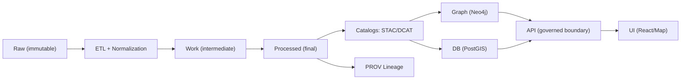

# 🧪 `tools/fixtures/` — Fixture Packs for KFM


Portable, **small**, and **deterministic** datasets used for:
- ✅ local development (bootstrapping a non-empty UI)
- ✅ API + pipeline testing (unit + integration)
- ✅ CI sanity checks
- ✅ demos / screenshots / reproducible bug reports

KFM’s **non-negotiable “truth path”** is: **Raw → ETL → Processed → Catalog/Provenance → DB/Graph → API → UI** (no skipping stages).:contentReference[oaicite:0]{index=0}:contentReference[oaicite:1]{index=1}  
This folder exists to make that path *repeatable on demand* with tiny, curated data packs.

---

## 📌 Quick Start

> These steps assume you’re running the dev stack via Docker Compose and want a minimal dataset to explore.

1) **Start the stack** (DBs + API + web):
```bash
docker-compose up
```

2) **Load a fixture pack** (pick one strategy):
- **Preferred**: copy/symlink fixture pack contents into the canonical `data/` staging locations (Raw/Work/Processed/Catalog/PROV) and run pipelines.
- **Testing-only**: load directly into PostGIS/Neo4j with seed scripts for quick endpoint tests.

3) **Verify via API docs (Swagger UI)**:
```text
http://localhost:8000/docs
```
…and hit an endpoint like `GET /datasets` (if present) to confirm the fixture data is visible.:contentReference[oaicite:2]{index=2}

4) **Optional: verify Neo4j**:
```text
http://localhost:7474
```
(to confirm graph nodes/edges were loaded).:contentReference[oaicite:3]{index=3}

> ⚠️ Keep fixtures **small**. Large datasets can exceed Docker memory and slow dev/CI.:contentReference[oaicite:4]{index=4}

---

## 🧭 What “Fixtures” Mean in KFM

Fixtures in KFM are *not* “random sample files.” They are **miniature, governed datasets** that follow the same lifecycle rules as real data:

- **Staging layout is explicit**: raw inputs go under `data/raw/<domain>/`, intermediate outputs in `data/work/<domain>/`, and final outputs in `data/processed/<domain>/`.:contentReference[oaicite:5]{index=5}
- **Boundary artifacts are required before publication/use**:
  - STAC records (collections/items)
  - DCAT dataset entries
  - PROV lineage bundles  
  These become the interface to downstream stages (graph/API/UI).:contentReference[oaicite:6]{index=6}:contentReference[oaicite:7]{index=7}

So a “fixture pack” should ideally include **both data and its metadata/provenance**, even if tiny.

---

## 🗺️ Canonical Ordering (Fixture Packs Must Respect This)

KFM treats pipeline ordering as absolute:  
**ETL → Catalogs (STAC/DCAT/PROV) → Graph → API → UI → Story Nodes → Focus Mode**.:contentReference[oaicite:8]{index=8}

And similarly, the technical blueprint reiterates:  
**Raw → Processed → Catalog/Prov → Database → API → UI** (shortcutting is flawed unless proven otherwise).:contentReference[oaicite:9]{index=9}



---

## 🗂️ Recommended Directory Layout (for this folder)

> This is the **intended** organization for fixture packs. If the repo differs today, align future additions to this structure.

```text
📁 tools/fixtures/
├─ 📄 README.md
├─ 📄 fixtures.manifest.yml          # index of packs + checksums (recommended)
├─ 📁 packs/
│  ├─ 📁 pack__<slug>/
│  │  ├─ 📄 README.md                # what it is + what it covers + how to load
│  │  ├─ 📄 pack.yml                 # pack metadata (id, license, domains, etc.)
│  │  ├─ 📁 data/                    # mirrors canonical lifecycle
│  │  │  ├─ 📁 raw/
│  │  │  ├─ 📁 work/
│  │  │  ├─ 📁 processed/
│  │  │  ├─ 📁 stac/                 # collections + items
│  │  │  ├─ 📁 catalog/              # dcat
│  │  │  └─ 📁 prov/                 # provenance bundles
│  │  └─ 📁 seeds/
│  │     ├─ 📁 postgis/              # SQL / CSV imports
│  │     └─ 📁 neo4j/                # Cypher / CSV imports
└─ 📁 scripts/
   ├─ 📄 validate_fixtures.py         # schema + checksum + link checks
   ├─ 📄 load_pack_postgis.sh         # optional convenience loader
   └─ 📄 load_pack_neo4j.sh           # optional convenience loader
```

Why mirror the canonical lifecycle? Because KFM is explicit that the system “adds value while preserving lineage,” with raw inputs landing in `data/raw/`, outputs in `data/processed/`, and metadata/provenance in catalog folders before DB/API/UI use.:contentReference[oaicite:10]{index=10}

---

## 🧱 What a Fixture Pack Should Contain

### 1) Data (Raster / Vector / Tables)
KFM commonly uses:
- **Raster layers** stored as **COGs** (Cloud-Optimized GeoTIFF)
- **Vector layers** stored as **GeoJSON** (or shapefiles where appropriate)
- optional derived products like tiles or KML/KMZ for interactive use:contentReference[oaicite:11]{index=11}:contentReference[oaicite:12]{index=12}

If you’re building a spatial fixture, keep it *tiny but meaningful*:
- a few points (e.g., “sites”)
- a few lines (e.g., “routes”)
- a few polygons (e.g., “boundaries”)

Vector data is naturally expressed as **points/lines/polygons**, and many tools treat these as Features/FeatureCollections (handy mental model even outside Earth Engine).:contentReference[oaicite:13]{index=13}

### 2) Metadata (STAC/DCAT) + Provenance (PROV)
Fixture packs should include the “boundary artifacts” that allow downstream stages (graph/API/UI) to consume data safely:
- STAC items/collections written to canonical STAC locations
- DCAT discovery records
- PROV lineage bundles capturing inputs, activities, agents:contentReference[oaicite:14]{index=14}

### 3) Seeds (Optional)
Sometimes you want “instant DB state” for endpoint tests. The blueprint describes PostGIS + Neo4j adapters and usage, so fixture packs can optionally include:
- `postgis/` seeds (SQL, CSV, `COPY`)
- `neo4j/` seeds (Cypher, CSV imports):contentReference[oaicite:15]{index=15}

> ✅ Prefer pipeline-driven loading for realism; use direct seeds for speed in tests.

---

## 🧪 Fixtures in Tests (Why This Folder Exists)

KFM’s blueprint explicitly calls out tests that use **fixtures to simulate data**, then hit endpoints using **FastAPI’s test client** to verify responses.:contentReference[oaicite:16]{index=16}:contentReference[oaicite:17]{index=17}

### Example (pattern)
```python
# pseudo-example (adjust imports to your repo layout)
from fastapi.testclient import TestClient
from api.main import app

client = TestClient(app)

def test_datasets_list_has_expected_fixture_items():
    r = client.get("/datasets")
    assert r.status_code == 200
    assert isinstance(r.json(), list)
```

---

## 🧰 Loading Strategies (Choose the Right One)

### ✅ Strategy A — Canonical “truth path” loading (recommended)
1) Copy fixture raw inputs into `data/raw/<domain>/`
2) Run ETL to generate `data/work/<domain>/` and `data/processed/<domain>/`
3) Generate STAC/DCAT/PROV (or verify they exist)
4) Load DB/Graph from processed outputs
5) Verify via API/UI

This matches the end-to-end flow described in the blueprint (raw → processed → metadata/prov → DB/graph → API → UI).:contentReference[oaicite:18]{index=18}

### ⚡ Strategy B — “Seed-only” loading (fast endpoint tests)
Use `seeds/postgis/` + `seeds/neo4j/` loaders for quick API tests, but **do not treat this as “published data.”**  
In v13 terms, anything used downstream should still be traceable and governed through catalogs/provenance.:contentReference[oaicite:19]{index=19}

---

## 🌱 Sample Data Bootstrapping (Existing Pattern in the Blueprint)

The blueprint notes first-run DBs may be empty, and repos may include:
- scripts like `scripts/init_sample_data.py` to create minimal records for a non-blank UI
- or a small sample under `data/raw/sample/` that can be run through pipelines to populate downstream stages:contentReference[oaicite:20]{index=20}:contentReference[oaicite:21]{index=21}

Example commands mentioned (if they exist in your repo):
```bash
docker-compose exec api python scripts/init_sample_data.py
docker-compose exec api python pipelines/import_rainfall.py
```
:contentReference[oaicite:22]{index=22}

---

## ✅ Fixture Pack Checklist (PR Gate Mental Model)

When adding a fixture pack, aim to satisfy:

- [ ] **Small** (fast in CI; won’t blow Docker resources):contentReference[oaicite:23]{index=23}
- [ ] **Deterministic** (same inputs → same outputs):contentReference[oaicite:24]{index=24}
- [ ] **Cataloged** (STAC/DCAT present and valid):contentReference[oaicite:25]{index=25}
- [ ] **Provenance recorded** (PROV bundle links inputs + processing + agents):contentReference[oaicite:26]{index=26}
- [ ] **DB/Graph optional seeds** (only if needed)
- [ ] **README explains** what it covers + how to load
- [ ] **License + attribution** included (no mystery datasets)
- [ ] **No sensitive content** (PII, restricted cultural sites, etc.)
- [ ] **No stage skipping** (UI never loads raw data directly; API is the boundary):contentReference[oaicite:27]{index=27}:contentReference[oaicite:28]{index=28}

---

## 🧾 Fixture Metadata: `pack.yml` (Suggested Schema)

```yaml
id: pack__dustbowl_min
title: "Dust Bowl Minimal Demo Pack"
domains:
  - climate
  - narratives
stages_included:
  - raw
  - processed
  - stac
  - dcat
  - prov
db_seeds:
  postgis: true
  neo4j: true
formats:
  raster: ["cog"]
  vector: ["geojson"]
license: "CC-BY-4.0"
sources:
  - name: "USGS / NOAA (example)"
    notes: "replace with actual sources"
provenance:
  prov_bundle: "data/prov/pack__dustbowl_min.prov.json"
notes:
  - "Designed for API smoke tests + UI demo."
```

> Tip: keep stable IDs and checksums to enforce determinism.

---

## 🔧 Validation Utilities (Where They Belong)

The v13 guide explicitly calls out that catalog generation/validation utilities often live under `tools/` as standalone helpers, while pipeline code lives in the pipeline subsystem.:contentReference[oaicite:29]{index=29}  
So this folder is a natural home for:
- checksum verification
- STAC/DCAT schema validation
- link integrity checks
- fixture “pack” linting

(If you add scripts here, document them in each pack’s README.)

---

## ✍️ Documentation Style Notes (for pack READMEs)

- Keep **one H1** per README and use clean heading hierarchy for GitHub rendering.:contentReference[oaicite:30]{index=30}
- Use short paragraphs, lists, and code blocks for load steps.
- Avoid bare URLs; prefer code formatting or reference links.

---

## 📚 References & Source Docs

These project files informed the fixture conventions in this README:

- **Kansas Frontier Matrix (KFM) – Comprehensive Technical Blueprint**:contentReference[oaicite:31]{index=31}:contentReference[oaicite:32]{index=32} :contentReference[oaicite:33]{index=33}  
- **KFM Master Guide v13 (Draft)** (pipeline invariants, staging, boundary artifacts):contentReference[oaicite:34]{index=34}:contentReference[oaicite:35]{index=35} :contentReference[oaicite:36]{index=36}  
- **Kansas-Frontier-Matrix: Open-Source Geospatial Historical Mapping Hub Design** (COG/GeoJSON/STAC-like catalog conventions):contentReference[oaicite:37]{index=37}:contentReference[oaicite:38]{index=38} :contentReference[oaicite:39]{index=39}  
- **Cloud-Based Remote Sensing with Google Earth Engine** (vector mental model: points/lines/polygons; Feature/FeatureCollection):contentReference[oaicite:40]{index=40} :contentReference[oaicite:41]{index=41}  
- **Comprehensive Markdown Guide (Best Practices)**:contentReference[oaicite:42]{index=42} :contentReference[oaicite:43]{index=43}  

