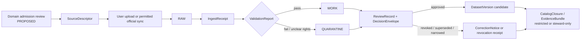

<!-- [KFM_META_BLOCK_V2]
doc_id: kfm://doc/NEEDS-UUID
title: Genealogy DNA Export Ingestion (Revocable Consent Model)
type: standard
version: v1
status: draft
owners: @bartytime4life
created: 2026-04-10
updated: 2026-04-10
policy_label: NEEDS_VERIFICATION
related: [policy/README.md, data/receipts/README.md, tools/validators/README.md, tools/attest/README.md]
tags: [kfm, genealogy, dna, consent, provenance, proposed-lane]
notes: [uploaded scaffold used as baseline; target path inferred from scaffold; repo paths, policy label, schemas, and runtime bindings need verification]
[/KFM_META_BLOCK_V2] -->

# Genealogy DNA Export Ingestion (Revocable Consent Model)

Proposed KFM lane for governed intake of consumer genealogy exports and DNA-match artifacts with revocable consent, deny-by-default policy, and correction-ready provenance.


| Field | Value |
|---|---|
| Status | **Draft** |
| Lane posture | **PROPOSED** high-sensitivity lane; not confirmed as an admitted baseline KFM lane |
| Owners | `@bartytime4life` *(carried forward from the uploaded scaffold; repo ownership still needs verification)* |
| Repo fit | `tools/genealogy-ingest/README.md` *(INFERRED from the uploaded scaffold; verify against the mounted tree before commit)* |

**Quick jumps:** [Scope](#scope) · [Repo fit](#repo-fit) · [Inputs](#inputs) · [Exclusions](#exclusions) · [Directory tree](#directory-tree) · [Quickstart](#quickstart) · [Usage](#usage) · [Diagram](#diagram) · [Contract surfaces](#contract-surfaces) · [Task list](#task-list--definition-of-done) · [FAQ](#faq) · [Appendix](#appendix)

> [!IMPORTANT]
> This README is intentionally conservative. The attached KFM corpus confirms the trust model, truth path, correction posture, contract lattice, and visible negative-outcome behavior. It does **not** confirm a mounted genealogy package, schema registry, CLI, or live vendor adapters in the current session. Treat everything in this file beyond core KFM doctrine as **PROPOSED**, **INFERRED**, or **NEEDS VERIFICATION** until repo evidence exists.

> [!NOTE]
> KFM’s confirmed first proof slice is still hydrology, not genealogy. This document therefore describes how a genealogy/DNA lane could be admitted **without bypassing** KFM’s sequencing discipline.

## Scope

This document defines a **README-first admission and implementation frame** for a possible genealogy and consumer DNA intake lane inside KFM. It is written to keep the lane subordinate to KFM’s governing rules: `RAW -> WORK/QUARANTINE -> PROCESSED -> CATALOG -> PUBLISHED`, the trust membrane, typed proof objects, visible correction lineage, and fail-closed behavior.

The lane is intentionally narrow. It covers **intake, normalization, validation, consent handling, review, and correction posture** for genealogy exports and DNA-match artifacts. It does **not** authorize public release of living-person data, medical inference, or a shortcut around KFM’s existing hydrology-first sequencing.

## Repo fit

| Aspect | Current best reading |
|---|---|
| Path | `tools/genealogy-ingest/README.md` *(INFERRED from the uploaded scaffold)* |
| Upstream links | [`../../policy/README.md`](../../policy/README.md), [`../../data/receipts/README.md`](../../data/receipts/README.md) *(both inherited from the scaffold and still NEED VERIFICATION)* |
| Downstream links | [`../../tools/validators/README.md`](../../tools/validators/README.md), [`../../tools/attest/README.md`](../../tools/attest/README.md) *(also inherited from the scaffold and still NEED VERIFICATION)* |
| Operational dependency | Source admission, policy bundle coverage, review/stewardship flow, receipts, correction handling, and evidence resolution |
| Current-session evidence limit | No mounted repo tree, tests, workflow YAML, or schema files were directly visible in this session |

## Inputs

### Accepted inputs

| Input class | Status | Notes |
|---|---|---|
| User-initiated GEDCOM exports | **PROPOSED** | Exploratory packet material supports GEDCOM / GEDZip parsing as a plausible intake path. |
| User-initiated GEDZip bundles | **PROPOSED** | Treat as archival input, not sovereign truth. |
| User-downloaded raw DNA/genotype files | **PROPOSED** | Intake only under explicit consent and review-bearing policy. |
| DNA match lists / shared-segment CSVs | **PROPOSED** | Normalize into typed match and segment records; preserve source-specific provenance. |
| Place strings and vendor place identifiers | **PROPOSED** | Preserve original text and add canonical place identifiers only as an overlay, never as destructive replacement. |
| Consent token / consent event reference | **REQUIRED** | Every person-bearing or DNA-bearing record needs an explicit consent basis before downstream use. |
| Official API sync where the vendor explicitly allows it | **PROPOSED** | Preferred over scraping; still subject to source-descriptor and rights review. |

### Intake expectations

1. Prefer **user-initiated uploads** or **official, consented APIs**.
2. Preserve the original file, filename, timestamp, and checksum at intake.
3. Emit typed proof objects early: at minimum a `SourceDescriptor`, `IngestReceipt`, and `ValidationReport`.
4. Keep living-person handling, revoked consent, and exact-location exposure as first-class policy questions, not afterthoughts.

## Exclusions

| Not admitted here | Why it is excluded | Where it belongs instead |
|---|---|---|
| Medical or trait inference | Outside the admitted purpose of this lane; materially raises sensitivity and misuse risk | Not admitted by this README |
| UI scraping or vendor-bypass automation | Conflicts with KFM’s rights posture and with the exploratory packet’s preference for official APIs or user uploads | Source-descriptor rejection or policy denial |
| Direct public release of living-person data | Conflicts with fail-closed sensitivity handling | Steward-only review lane until a policy-safe release shape exists |
| Silent exact-location release for sensitive persons or families | Conflicts with KFM publication-burden rules | Generalized or withheld public representation only |
| Direct model/runtime access to raw genealogy or DNA inputs | Violates the trust membrane and bounded-AI posture | Governed API only, after policy-safe evidence preparation |
| Best-effort publication when rights, consent, or provenance are unresolved | Violates default-deny doctrine | `WORK`, `QUARANTINE`, `DENY`, or `ABSTAIN` outcomes |

## Directory tree

The uploaded scaffold implied a package-shaped README under `tools/`. The tree below keeps that shape, but recasts it around the KFM contract lattice rather than assuming a live downloader/CLI exists.

```text
tools/genealogy-ingest/                          # INFERRED target root
├── README.md
├── contracts/                                  # PROPOSED
│   ├── source_descriptor.schema.json
│   ├── ingest_receipt.schema.json
│   ├── validation_report.schema.json
│   ├── decision_envelope.schema.json
│   ├── evidence_bundle.schema.json
│   └── correction_notice.schema.json
├── parsers/                                    # PROPOSED
│   ├── gedcom.py
│   ├── gedzip.py
│   ├── dna_matches.py
│   └── places.py
├── policy/                                     # PROPOSED
│   └── genealogy.rego
├── receipts/                                   # PROPOSED
│   ├── run_receipt.example.json
│   └── revocation_receipt.example.json
└── tests/                                      # PROPOSED
    ├── fixtures/
    │   ├── valid/
    │   └── invalid/
    └── test_revocation_and_living_person_rules.py
```

> [!TIP]
> If the mounted repo already has a stronger placement for high-sensitivity lanes, keep the doctrinal content of this README and relocate the file. Do **not** force the code tree to mimic an unverified scaffold path.

## Quickstart

Illustrative only. This is a **contract-first** flow, not a verified current CLI.

```text
1) Approve a SourceDescriptor for the export type or official endpoint.
2) Land the upload in RAW with file checksum, filename, and retrieval timestamp.
3) Emit an IngestReceipt tied to the source reference and output pointers.
4) Validate structure, rights, consent, living-person posture, and exact-location policy.
5) Route to WORK or QUARANTINE and emit a ValidationReport.
6) Require ReviewRecord + DecisionEnvelope before any candidate dataset is promoted.
7) Build EvidenceBundle links only from policy-safe released scope.
8) On revocation, supersession, or exposure issue, emit a CorrectionNotice / revocation receipt.
```

## Usage

### Operating sequence

1. **Admit the source before admitting the data.**  
   Every vendor export type or official endpoint needs a `SourceDescriptor` naming identity, access mode, rights posture, cadence, validation plan, and publication intent.

2. **Treat user files as evidence-bearing intake, not immediate truth.**  
   Raw uploads belong in `RAW`; normalization and policy evaluation happen later.

3. **Normalize without erasing source-specific meaning.**  
   Preserve vendor identifiers, original filenames, timestamps, and checksums. Add KFM identifiers and canonical fields alongside them.

4. **Separate structure checks from policy decisions.**  
   A file can be structurally valid and still policy-blocked because consent, living-person exposure, or rights posture fails.

5. **Do not outrun KFM’s trust surfaces.**  
   If this lane later appears in Focus, Story, Dossier, Export, or the Evidence Drawer, it must inherit the same release linkage, rights state, freshness cues, and correction behavior as other KFM surfaces.

### Runtime outcome posture

If a downstream governed surface touches this lane, the lane should inherit KFM’s explicit negative-outcome behavior.

| Surface situation | Expected behavior |
|---|---|
| Evidence and policy pass | `ANSWER` or released feature/view, with evidence linkage |
| Scope exists but evidence is incomplete | `ABSTAIN` |
| Consent, rights, or sensitivity blocks use | `DENY` |
| Runtime or contract failure prevents safe response | `ERROR` |

### High-sensitivity defaults

| Question | Default posture |
|---|---|
| Living person visibility | **Deny by default** |
| DNA segment release | **Steward-only unless explicitly approved** |
| Exact person/location precision in public artifacts | **Generalize or withhold** |
| Place canonicalization | Preserve original `place_string`; add canonical ID and confidence as non-destructive enrichment |
| Revoked consent | Inactivate overlays, strip exported PII, preserve only hashed evidence references plus signed revocation proof |

## Diagram



## Contract surfaces

This lane should reuse KFM’s confirmed proof-object family rather than inventing a parallel ad hoc receipt model.

| KFM contract | Lane-specific role in this README |
|---|---|
| `SourceDescriptor` | Declares the export type or official endpoint, access mode, rights posture, cadence, validation plan, and publication intent |
| `IngestReceipt` | Proves a fetch or landing event occurred and records source reference, fetch time, integrity checks, and output pointers |
| `ValidationReport` | Records structural validity, living-person checks, consent checks, rights posture, and quarantine reasons |
| `DatasetVersion` | Carries an authoritative candidate or promoted subject set only after review |
| `DecisionEnvelope` | Expresses allow / generalize / hold / deny style policy outcomes machine-readably |
| `EvidenceBundle` | Packages policy-safe support for a claim, feature, story excerpt, or export preview |
| `RuntimeResponseEnvelope` | Makes downstream answer / abstain / deny / error behavior accountable |
| `CorrectionNotice` | Preserves visible lineage when consent is revoked, scope narrows, or an exposure issue requires withdrawal or supersession |

### Illustrative domain fields

These fields are **illustrative** and come from exploratory packet material, not mounted schemas.

| Object family | Illustrative fields |
|---|---|
| `kfm:person` | `urn`, `names`, `sex` |
| `kfm:event` | `type`, `date`, `place_string`, `place_pdid`, `lat`, `lon`, `geocode_confidence` |
| `kfm:dna_match` | `match_urn`, `kit_hash`, `relationship_hint`, `metrics`, `consent_token` |
| `kfm:dna_segments[]` | `chr`, `start_bp`, `end_bp`, `cM` |
| Evidence refs | `kind`, `hash`, `spec_hash` |

## Task list / Definition of done

A lane like this is not “done” when a parser works once. It is done when the trust-bearing seams are visible and testable.

- [ ] Domain-admission decision recorded, including rights posture, publication burden, and sequencing relative to hydrology-first work.
- [ ] `SourceDescriptor`, `IngestReceipt`, `ValidationReport`, `DecisionEnvelope`, `EvidenceBundle`, and `CorrectionNotice` schemas exist with valid and invalid fixtures.
- [ ] At least one user-upload flow lands a genealogy artifact in `RAW` and emits an `IngestReceipt`.
- [ ] Living-person and revoked-consent rules are covered by policy tests.
- [ ] One positive and one negative `EvidenceBundle` / `RuntimeResponseEnvelope` trace exist for steward review.
- [ ] One correction or revocation drill proves supersession / withdrawal lineage instead of silent deletion.
- [ ] Documentation, contracts, policy bundles, fixtures, and runbooks agree before the lane is called operational.

## FAQ

### Why is this lane written as proposed instead of active?

Because the current session surfaced KFM doctrine and one uploaded scaffold, but did **not** surface a mounted genealogy package, schema registry, workflow inventory, or executed proof objects.

### Why not publish user-uploaded DNA data directly after parsing?

Because KFM treats promotion as a governed transition, not a file move. Consent, rights, living-person exposure, exact-location sensitivity, and correction posture must all be visible before release.

### Why not scrape vendor UIs if the user already has an account?

Because this README stays inside KFM’s rights and trust posture. Preferred intake modes are user-initiated exports and official APIs where the provider explicitly allows them.

### Why preserve the original place text if canonicalization is available?

Because canonicalization is enrichment, not replacement. Historical or family-supplied place strings may carry ambiguity, spelling variation, or context worth preserving.

### Why does revocation need a first-class receipt?

Because KFM preserves correction lineage. Revocation should narrow or withdraw use visibly, not erase the fact that a governed change happened.

## Appendix

<details>
<summary><strong>Open verification items</strong></summary>

| Item | Current status |
|---|---|
| Actual repo path for this README | **UNKNOWN** |
| Real owner / CODEOWNERS entry | **NEEDS VERIFICATION** |
| Policy label for human-genomics material | **NEEDS VERIFICATION** |
| Mounted schema files and validator commands | **UNKNOWN** |
| Existing review / stewardship surface for this lane | **UNKNOWN** |
| Existing Evidence Drawer payloads for person-bearing data | **UNKNOWN** |
| Existing runtime envelopes for answer / abstain / deny / error on this lane | **UNKNOWN** |

</details>

<details>
<summary><strong>Illustrative field mapping carried forward from exploratory packet material</strong></summary>

```yaml
person:
  urn: kfm:person:<source>:<id>
  names: ["..."]
  sex: "F|M|X|unknown"

events:
  - type: BIRT|DEAT|MARR|...
    date: YYYY-MM-DD
    place_string: "original source text"
    place_pdid: "canonical place id when resolved"
    lat: 0.0
    lon: 0.0
    geocode_confidence: 0.0

dna_match:
  match_urn: kfm:dna:<source>:<id>
  kit_hash: sha256:...
  relationship_hint: "2nd-3rd cousin"
  metrics:
    shared_cM: 0.0
    total_segments: 0
    longest_segment: 0.0
  consent_token: consent:...
```

Use this as a design sketch only until real schemas and fixtures exist.

</details>

<details>
<summary><strong>Source and sync posture</strong></summary>

- Prefer official APIs where the provider explicitly allows them.
- Otherwise prefer user-initiated uploads and preserve the uploaded file as evidence.
- Do not rely on UI scraping to create a baseline operational path.
- Keep vendor-specific capability notes in a re-verifiable source registry, not as timeless doctrine in this README.

</details>

[Back to top](#genealogy-dna-export-ingestion-revocable-consent-model)
