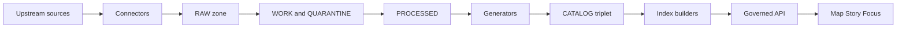

<!-- [KFM_META_BLOCK_V2]
doc_id: kfm://doc/177c31af-7599-479e-bdcf-a04b349b7235
title: tools/generators/README.md
type: standard
version: v1
status: draft
owners: TBD
created: 2026-02-22
updated: 2026-02-22
policy_label: public
related:
  - "Kansas Frontier Matrix (KFM) — Definitive Design & Governance Guide (vNext) (2026-02-20)"
tags: [kfm, generators, pipelines, governance]
notes:
  - "This README is intentionally fail-closed: it documents contracts and invariants without assuming repo-specific implementation details."
[/KFM_META_BLOCK_V2] -->

<a id="top"></a>

# tools/generators
_Map-first, time-aware generators that produce governed artifacts (catalogs, lineage, receipts)_

[](#)
[](#)
[](#)

## Navigation
- [What lives in this directory](#what-lives-in-this-directory)
- [Core invariants](#core-invariants)
- [Generator contract](#generator-contract)
- [Promotion gates](#promotion-gates)
- [How generators fit the system](#how-generators-fit-the-system)
- [Adding a new generator](#adding-a-new-generator)
- [Testing](#testing)
- [Security and sensitivity](#security-and-sensitivity)
- [Directory layout](#directory-layout)

---

## What lives in this directory
This directory is for **deterministic generators** that convert upstream pipeline outputs into **governed, promotable artifacts**.

Typical generator responsibilities include:

- **Catalog generation**: produce the **catalog triplet** (DCAT + STAC + PROV) and ensure cross-links validate.
- **Lineage production**: generate PROV activities/entities/agents that explain how an artifact was created.
- **Run receipts**: emit a receipt for every run so results are reproducible and auditable.
- **Contract validation**: fail closed if required inputs are missing, ambiguous, or policy-disallowed.
- **Scaffolding**: generate repeatable boilerplate (schemas, fixture templates, index manifests) when it reduces human error.

> NOTE  
> This README describes **requirements and contracts**. It does **not** assume which language, framework, or exact CLI exists in this repository.

[Back to top](#top)

---

## Core invariants
Generators are part of KFM’s **trust membrane** and **promotion contract**. They MUST uphold the following invariants:

### Determinism and reproducibility
- **Same inputs → same outputs** (byte-for-byte where feasible).
- Outputs must be tied to a **dataset version identity** derived from a stable spec hash.
- Every produced artifact must have a **checksum/digest**.

### Fail-closed posture
Generators MUST refuse to produce promotable outputs when any of the following are true:

- upstream artifacts are missing or don’t validate
- licensing/rights are unclear
- sensitivity classification is missing or obligations cannot be satisfied
- catalogs don’t validate or cross-links don’t resolve

### Auditability
Every generator run MUST emit a **run receipt** containing (at minimum):

- inputs (by digest and/or upstream version)
- outputs (artifact digests)
- environment (container image digest and parameters)
- validation results
- policy decisions

### Separation of concerns
- Generators should be **pure transformation + validation**.
- Side effects (writes) should be limited to **declared output locations** with a clear manifest.
- No silent reads/writes to “mystery paths”.

[Back to top](#top)

---

## Generator contract
All generators in this folder SHOULD conform to the same contract so they are:

- composable in CI and pipeline runner environments
- observable (standard logs + receipts)
- reversible (outputs can be rebuilt from inputs)

### Required inputs
A generator run should declare its inputs explicitly, typically:

- **dataset identifier** and **dataset version identifier**
- **input artifact manifest** (paths + digests) from RAW/WORK/PROCESSED zones
- **policy context** (policy label, allowed outputs, redaction obligations)
- **run context** (who/what/when/why: pipeline id, git sha, container digest)

### Required outputs
A generator run must produce:

- outputs to a predictable location (or return paths)  
- an output manifest listing artifact paths and digests
- a run receipt (see below)
- validation reports (machine-readable preferred)

### Exit behavior
- Exit code `0` only when **all required outputs** are produced and validate.
- Non-zero on any failure; **do not** emit “promoted-looking” artifacts on failure.

### Minimal run receipt schema (conceptual)
This is the minimum information content; field names are implementation-defined.

```yaml
run_id: <uuid or ulid>
run_type: <catalog|lineage|schema|index-manifest|...>
started_at: <timestamp>
ended_at: <timestamp>
actor:
  kind: <ci|developer|scheduler>
  id: <user or service id>
environment:
  repo_revision: <git sha>
  container_image_digest: <sha256:...>
  parameters: { ... }
policy:
  policy_label: <public|restricted|...>
  decisions:
    - decision: <allow|deny>
      obligations: [ ... ]
      reason_codes: [ ... ]
inputs:
  - path: <...>
    digest: <...>
    zone: <raw|work|processed>
outputs:
  - path: <...>
    digest: <...>
    kind: <dcat|stac|prov|report|...>
validations:
  - name: <...>
    status: <pass|fail>
    details_ref: <path or id>
```

[Back to top](#top)

---

## Promotion gates
Generators are frequently used to satisfy the **Promotion Contract** gates.

When you add or modify a generator, verify it can support these minimum gates:

- **Gate A: Identity and versioning**  
  Stable dataset ID, immutable dataset version identity derived from a stable spec hash.

- **Gate B: Licensing and rights metadata**  
  Explicit license and captured attribution/rights holder. Unclear license → quarantine.

- **Gate C: Sensitivity classification and redaction plan**  
  Policy label assigned; redaction/generalization plan recorded when needed.

- **Gate D: Catalog triplet validation**  
  DCAT, STAC, and PROV artifacts exist, validate, and cross-link.

- **Gate E: Run receipts and checksums**  
  Each producing run has a receipt; inputs/outputs enumerated with digests; environment recorded.

- **Gate F: Policy tests and contract tests**  
  Policy tests pass; evidence resolver can resolve at least one EvidenceRef for the dataset version in CI; API schemas validate.

> TIP  
> Treat promotion gates as **tests**. If your generator makes a gate possible, add (or extend) a test that proves it.

[Back to top](#top)

---

## How generators fit the system
Conceptually, generators sit between **PROCESSED artifacts** and **PUBLISHED runtime surfaces**.



**Key rule:** A generator should never make something “look published” unless the dataset version is promotable.

[Back to top](#top)

---

## Adding a new generator
1. **Write a one-page spec** (inputs, outputs, failure modes, and which promotion gates it supports).
2. **Define the contract**:
   - required inputs and their zones
   - output locations and naming
   - receipt fields
3. **Implement** as a pure function first, then wrap with I/O.
4. **Add validations**:
   - schema validation for generated artifacts
   - cross-link validation (where applicable)
5. **Add tests**:
   - golden tests (same input → same output)
   - fail-closed tests (missing license/sensitivity → non-zero)
6. **Register the generator** (if a registry exists in this repo) so CI and the pipeline runner can discover it.

> WARNING  
> If you can’t name the inputs and outputs, you can’t audit the run. Don’t merge generators with implicit dependencies.

[Back to top](#top)

---

## Testing
Minimum expectations for generators:

- **Unit tests** for pure transformations (no filesystem, no network).
- **Contract tests** for receipts and manifests (required keys exist).
- **Validation tests** for produced artifacts (schemas + cross-links).
- **Determinism tests** (repeat runs produce identical digests).
- **Negative tests** for quarantine conditions (unclear license, missing policy label, failed validation).

[Back to top](#top)

---

## Security and sensitivity
Generators often touch sensitive datasets and must be safe by design:

- Apply **redaction/generalization obligations** before producing any artifact used by runtime surfaces.
- Never log sensitive payloads; log **digests + counts + high-level stats** instead.
- Treat the **audit ledger** and receipts as governed artifacts; redact if needed.
- If unsure whether an output is publish-safe, **quarantine** it.

[Back to top](#top)

---

## Directory layout
A realistic directory tree depends on the repository, but the following structure is a **recommended** starting point (not confirmed in repo):

```text
tools/
└─ generators/
   ├─ README.md
   ├─ registry/                 # generator discovery (optional)
   │  └─ generators.yaml
   ├─ contracts/                # schemas for receipts/manifests
   │  ├─ run-receipt.schema.json
   │  └─ artifact-manifest.schema.json
   ├─ catalog/                  # catalog triplet generators
   ├─ lineage/                  # PROV / lineage utilities
   ├─ fixtures/                 # small, versioned test fixtures
   └─ _shared/                  # shared libs used by generators
```

If your repo already has conventions (language, build system, CI), update this section to match reality.

[Back to top](#top)
