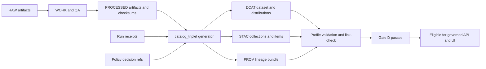

<!-- [KFM_META_BLOCK_V2]
doc_id: kfm://doc/1b5cf0b0-6b7a-4b48-9e0a-8ac23996a57e
title: catalog_triplet generator
type: standard
version: v1
status: draft
owners: kfm-platform (TBD)
created: 2026-02-26
updated: 2026-02-26
policy_label: public
related:
  - kfm://doc/TODO-kfm-gdg-vnext
  - ../../validation/catalog/README.md (if present)
tags: [kfm, generator, catalog, triplet, dcat, stac, prov, provenance]
notes:
  - Contract surface for Promotion Gate D (Catalog triplet validation).
  - Entrypoint/flags are intentionally TODO until verified in repo.
[/KFM_META_BLOCK_V2] -->

<a id="top"></a>

# catalog_triplet generator
> Generate the KFM catalog **triplet** (**DCAT + STAC + PROV**), **cross-link** it, and make **Gate D** validation deterministic.


---

## Quick navigation
- [Purpose](#purpose)
- [Where this fits](#where-this-fits)
- [Inputs](#inputs)
- [Outputs](#outputs)
- [Contract rules](#contract-rules)
- [Validation and promotion gates](#validation-and-promotion-gates)
- [How to run](#how-to-run)
- [CI expectations](#ci-expectations)
- [Troubleshooting](#troubleshooting)
- [Security and governance](#security-and-governance)
- [Appendix templates](#appendix-templates)

---

## Purpose

KFM treats catalogs as **contract surfaces** between pipelines and runtime. This generator’s job is to produce a **cross-linked** catalog triplet:

- **DCAT**: dataset-level metadata (who/what/license/distributions)
- **STAC**: spatiotemporal metadata and assets (collections/items)
- **PROV**: lineage (inputs/tools/parameters → outputs; environment capture)

> [!IMPORTANT]
> This generator is part of promotion readiness. A dataset version **must not** be promoted if the triplet is missing, invalid, or not cross-linked (fail closed).

**Non-goals**
- This generator does **not** decide policy (it consumes policy decisions / labels).
- This generator does **not** publish runtime endpoints (it produces catalog artifacts that enable governed publication).

[Back to top](#top)

---

## Where this fits



[Back to top](#top)

---

## Inputs

This directory documents the contract; the *exact* filenames and CLI flags are repo-specific.

### Required inputs (contract-level)

| Input | Required | What it must contain | Why it matters |
|---|---:|---|---|
| Dataset identity + version | ✅ | `dataset_slug`, `dataset_version_id`, stable `spec_hash` | Deterministic promotion + caching |
| License / rights metadata | ✅ | license or rights statement + attribution/holder notes | Promotion must fail closed if unclear |
| Policy classification | ✅ | `policy_label` + decision reference(s) + obligations | Geometry/fields may require redaction/generalization |
| Processed artifact inventory | ✅ | artifact path/URI + `sha256:` digest + media type | Catalog distributions/assets must be addressable + checkable |
| Run receipt(s) | ✅ | per-run inputs/outputs + environment (container digest, git commit, params digest) | PROV lineage + auditability |

> [!NOTE]
> Linkage invariant: each raw/processed artifact should be traceable to exactly one producing run receipt, and receipts must be discoverable from DCAT and/or STAC.

### Recommended inputs (quality-of-life)

- Precomputed **spatial/temporal extents** per artifact (bbox, interval, count summaries).
- “Distribution base URLs” for serving artifacts (hostnames belong in distribution URLs, not canonical IDs).
- Optional thumbnails / previews (policy permitting).

[Back to top](#top)

---

## Outputs

At minimum, the generator emits:

| Output artifact | Required | Purpose |
|---|---:|---|
| DCAT record | ✅ | Dataset metadata, distributions, license/publisher, cross-link into PROV |
| STAC catalog | ✅ (if applicable) | Collections/items/assets with spatiotemporal extent + links back to DCAT and PROV |
| PROV bundle | ✅ | Activity/entity/agent graph capturing lineage + environment capture |
| Link-check / validation report | 🚀 recommended | CI-friendly proof that profiles and cross-links validate |

### Proposed output layout (NOT confirmed in repo)
Use or adapt this layout, but keep it stable once chosen:

```
tools/generators/catalog_triplet/
  README.md

# Typical dataset output areas (repo-specific; example only):
data/
  processed/<dataset_slug>/<dataset_version_id>/...
  catalog/<dataset_slug>/<dataset_version_id>/
    dcat.*            # DCAT serialization (format is repo decision)
    stac/             # STAC catalog structure
  prov/<dataset_slug>/<dataset_version_id>/
    run_receipts/...
    bundle.*          # PROV serialization (format is repo decision)
```

[Back to top](#top)

---

## Contract rules

### 1) Triplet responsibilities

- **DCAT** answers: “What is this dataset? Who published it? What is the license? What distributions exist?”
- **STAC** answers: “What assets exist? What are their spatiotemporal extents? Where are the files?”
- **PROV** answers: “How were outputs created? Which inputs, which tools, which parameters?”

### 2) EvidenceRef schemes (minimum)

The ecosystem should be able to resolve references without guessing:

- `dcat://...` → dataset/distribution metadata
- `stac://...` → collection/item/asset metadata
- `prov://...` → run lineage (activities/entities/agents)
- `doc://...` → governed docs and story citations
- `graph://...` → entity relations (if enabled)

### 3) Profile minimums (PROPOSED fields)

> [!WARNING]
> These minimums are intentionally strict. If you add fields, keep backward compatibility; if you remove fields, expect downstream breakage (validators, evidence resolver, UI cards).

| Profile | Minimum required fields (starter) |
|---|---|
| DCAT dataset | `dct:title`, `dct:description`, `dct:publisher`, `dct:license` (or `dct:rights`), `dcat:theme`, `dct:spatial`, `dct:temporal`, `dcat:distribution`, `prov:wasGeneratedBy`, `kfm:policy_label`, `kfm:dataset_id`, `kfm:dataset_version_id` |
| STAC collection | `id`, `title`, `description`, `extent` (bbox + temporal), `license`, link to DCAT, `kfm:dataset_version_id`, policy label |
| STAC item | `id`, `geometry` or `bbox` (policy-consistent), `datetime` (or start/end), `assets` (`href` + `checksum` + `media_type`), links to PROV/run receipt + DCAT distribution |
| PROV bundle | `prov:Activity` per run, `prov:Entity` per artifact, `prov:Agent` for pipeline + approvals, `prov:used` + `prov:wasGeneratedBy`, policy decision refs, environment capture (container digest, git commit, parameters) |

### 4) Cross-linking rules (must be testable)

Cross-links must be explicit and deterministic:

- DCAT dataset → distributions → artifact digests
- DCAT dataset → `prov:wasGeneratedBy` → PROV activity bundle
- STAC collection → `rel="describedby"` → DCAT dataset
- STAC item → link to PROV activity and/or run receipt
- CI should run a **link-checker** verifying cross-links for every promoted dataset version

[Back to top](#top)

---

## Validation and promotion gates

This generator exists primarily to satisfy **Promotion Gate D** (Catalog triplet validation), but it is coupled to adjacent gates.

### Gate D checklist (must pass)

- [ ] DCAT exists and validates against KFM DCAT profile
- [ ] STAC collection/items exist (if applicable) and validate against KFM STAC profile
- [ ] PROV bundle exists and validates against KFM PROV profile
- [ ] Cross-links between DCAT, STAC, PROV are present and resolvable

### Adjacent “don’t get surprised in CI” checks

- [ ] Gate B: license/rights explicit; otherwise fail closed (quarantine)
- [ ] Gate C: policy label assigned; obligations recorded and applied
- [ ] Gate E: run receipts + checksums present for inputs/outputs/environment

[Back to top](#top)

---

## How to run

> [!NOTE]
> The repo’s actual entrypoint is **UNKNOWN** in this document. Fill in the command once the implementation is verified (search for `catalog_triplet` in build scripts / task runner).

### Typical workflow (implementation-agnostic)

1. Ensure you have a **dataset spec** (canonical input for `spec_hash`) and/or **promotion manifest** for the dataset version.
2. Ensure **processed artifacts** exist and are digest-addressed (sha256).
3. Ensure one or more **run receipts** exist capturing inputs/outputs/environment and policy decision refs.
4. Run the generator to emit DCAT/STAC/PROV and a validation report.
5. Run validators + link-check in CI (or locally) before promotion.

### Placeholder command patterns (replace with real entrypoint)

```bash
# TODO: replace with actual entrypoint once confirmed in-repo.
# Example shape:
<task-runner> catalog_triplet \
  --promotion-manifest path/to/promotion_manifest.json \
  --processed-root data/processed/<dataset_slug>/<dataset_version_id>/ \
  --prov-receipts-root data/prov/<dataset_slug>/<dataset_version_id>/run_receipts/ \
  --out-catalog-root data/catalog/<dataset_slug>/<dataset_version_id>/
```

[Back to top](#top)

---

## CI expectations

A healthy CI for this generator usually includes:

- **Schema/profile validation**
  - STAC JSON schema/profile validation
  - DCAT validation (serialization-dependent)
  - PROV validation (serialization-dependent)
- **Cross-link check** (fail closed)
  - every declared link resolves
  - every asset href is reachable in the build context (or via allowed base URLs)
- **Determinism checks**
  - spec hashing stable (canonicalize JSON before hashing)
  - IDs consistent across reruns with identical inputs
- **Fixture-driven tests**
  - at least one small fixture dataset version that proves “golden path” end-to-end

[Back to top](#top)

---

## Troubleshooting

| Symptom | Likely cause | Fix |
|---|---|---|
| Gate D fails: “missing DCAT” | DCAT not emitted or wrong path | Ensure DCAT generation step runs and output is included in manifest |
| Gate D fails: “broken cross-link” | STAC/DCAT/PROV links point to wrong IDs/paths | Run link-check locally; verify canonical IDs vs distribution URLs |
| STAC item rejected for geometry | Policy label requires generalization / redaction | Apply obligations (e.g., bbox-only, coarser geometry) before emitting STAC |
| “unknown license” blocks promotion | Rights metadata missing/unclear | Add license/rights holder metadata; otherwise quarantine (fail closed) |
| “missing checksum” | Artifacts not digest-addressed | Compute sha256 for every artifact and record it in manifests and STAC assets |

[Back to top](#top)

---

## Security and governance

> [!WARNING]
> The generator must not create “policy-bypassing” metadata. If policy denies or imposes obligations, output must reflect that (e.g., generalized geometry, removed attributes) and the policy decision reference must be carried into PROV.

Key rules:
- Treat **policy_label** as a first-class input.
- If **rights are unclear**, promotion must be blocked.
- Prefer canonical IDs that do **not** embed environment-specific hostnames; hostnames belong in distribution URLs.

[Back to top](#top)

---

## Appendix: templates

<details>
<summary><strong>Run receipt template (starter)</strong></summary>

```json
{
  "run_id": "kfm://run/2026-02-20T12:00:00Z.abcd",
  "actor": { "principal": "svc:pipeline", "role": "pipeline" },
  "operation": "ingest+publish",
  "dataset_version_id": "2026-02.abcd1234",
  "inputs": [
    { "uri": "raw/source.csv", "digest": "sha256:1111" }
  ],
  "outputs": [
    { "uri": "processed/events.parquet", "digest": "sha256:2222" }
  ],
  "environment": {
    "container_digest": "sha256:img...",
    "git_commit": "deadbeef",
    "params_digest": "sha256:3333"
  },
  "validation": { "status": "pass", "report_digest": "sha256:7777" },
  "policy": { "decision_id": "kfm://policy_decision/xyz" },
  "created_at": "2026-02-20T12:05:00Z"
}
```
</details>

<details>
<summary><strong>Promotion manifest template (starter)</strong></summary>

```json
{
  "kfm_promotion_manifest_version": "v1",
  "dataset_slug": "example_dataset",
  "dataset_version_id": "2026-02.abcd1234",
  "spec_hash": "sha256:abcd1234",
  "released_at": "2026-02-20T13:00:00Z",
  "artifacts": [
    { "path": "events.parquet", "digest": "sha256:2222", "media_type": "application/x-parquet" }
  ],
  "catalogs": [
    { "path": "dcat.jsonld", "digest": "sha256:4444" },
    { "path": "stac/collection.json", "digest": "sha256:5555" }
  ],
  "qa": { "status": "pass", "report_digest": "sha256:7777" },
  "policy": { "policy_label": "public", "decision_id": "kfm://policy_decision/xyz" },
  "approvals": [
    { "role": "steward", "principal": "<id>", "approved_at": "2026-02-20T12:59:00Z" }
  ]
}
```
</details>

<details>
<summary><strong>Recommended data layout skeleton (example)</strong></summary>

```text
data/
  raw/...
  processed/...
  catalog/
    dcat/...
    stac/collections/.../collection.json
  prov/
    run_receipts/.../*.json
    datasets/.../bundle.json
```

Key linkage expectation: each raw/processed artifact points to exactly one run_receipt, and receipts are discoverable from DCAT and/or STAC.
</details>

---

## Directory documentation standard

**Where it fits in the repo:** `tools/generators/catalog_triplet/` is a generator module responsible for emitting the catalog triplet artifacts used for promotion and evidence resolution.

**Acceptable inputs (what belongs here):**
- Generator implementation source code
- Schemas/profiles used for validation (or references to them)
- Fixture examples for CI
- This contract README

**Exclusions (what must not go here):**
- Large datasets or promoted artifacts (belong in data zones)
- Secrets, tokens, or privileged credentials
- Environment-specific hardcoding that breaks determinism

[Back to top](#top)
