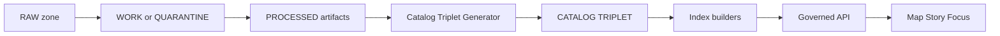

<!-- [KFM_META_BLOCK_V2]
doc_id: kfm://doc/f0106cb9-9310-405e-8529-3e99167b878d
title: Catalog Triplet Generator (DCAT + STAC + PROV)
type: standard
version: v1
status: draft
owners: TBD
created: 2026-02-26
updated: 2026-02-26
policy_label: restricted
related:
  - ../../../../docs/TODO-kfm-governance-entrypoint.md
  - ../../../../docs/TODO-promotion-contract.md
tags: [kfm, catalog, triplet, dcat, stac, prov, provenance, generator]
notes:
  - This README documents the `catalog_triplet` generator *source module* and its contract surface.
  - Update owners, status, and related links when wiring into CI/pipeline.
[/KFM_META_BLOCK_V2] -->

# Catalog Triplet Generator (src)

Generate and validate the KFM **catalog “triplet”** — **DCAT + STAC + PROV** — plus **run receipts**.  
This is the *interop + evidence surface* that lets KFM pipelines promote DatasetVersions into governed API + UI without “guessing” what anything means.


> **TODO (repo wiring):** Replace the `ci` badge with a real workflow badge once this generator is hooked into GitHub Actions.

---

## Quick navigation

- [Where this fits](#where-this-fits)
- [What this generator does](#what-this-generator-does)
- [Inputs](#inputs)
- [Outputs](#outputs)
- [EvidenceRef and cross-linking contract](#evidenceref-and-cross-linking-contract)
- [Validation gates and Definition of Done](#validation-gates-and-definition-of-done)
- [Local usage](#local-usage)
- [Non-goals](#non-goals)
- [Appendix: directory layout expectations](#appendix-directory-layout-expectations)

---

## Where this fits

This directory lives at:

- `tools/generators/catalog_triplet/src/`

It exists to implement the **Catalog Generator** component in the KFM reference model: generate the triplet, validate strict profiles, and enforce cross-links before promotion.



### Directory documentation standard

**Purpose (one line):** emit + validate DCAT/STAC/PROV + run receipts for a DatasetVersion.

**Acceptable inputs:** processed artifacts and their checksums, dataset/version identity, policy label + licensing info, and run context (commit, container digest, parameters).

**Exclusions:** raw acquisition, QA computation, index building, runtime policy decisions, API serving, or UI rendering.

---

## What this generator does

### Responsibilities

| Responsibility | Why it matters | Hard requirement |
|---|---|---|
| Emit **DCAT** dataset metadata | discovery + license/rights surface | must include license/rights + distributions |
| Emit **STAC** collections/items/assets | spatiotemporal discovery of artifacts | must include extents + asset checksums |
| Emit **PROV** lineage bundle | reproducibility and audit | must include activity/entity/agent edges |
| Emit **run receipts** | promotion audit trail | receipts are first-class artifacts |
| Enforce **cross-links** | EvidenceRefs resolve without guessing | broken links must fail CI |
| Validate strict profiles | predictable behavior for Focus Mode and governed APIs | fail-closed on schema/profile errors |

> **Fail-closed rule:** if required metadata is missing or invalid, **do not emit a “promotable” triplet**. Produce an actionable error and stop.

### What “triplet” means (KFM-specific)

- **DCAT:** dataset-level metadata (license, publisher, distributions, themes)
- **STAC:** asset-level metadata for spatiotemporal artifacts (collections, items, assets)
- **PROV:** lineage describing how artifacts were created (activities, agents, entities)

---

## Inputs

> This README does not assume a specific runtime (Node, Python, etc.). The exact entrypoint is defined by the generator package one directory up (e.g., `../package.json`, `../pyproject.toml`, etc.). **Update this section once the implementation is wired.**

### Required inputs (conceptual)

| Input | Type | Notes |
|---|---|---|
| `dataset_id` | string | stable identifier for the dataset family |
| `dataset_version_id` | string | stable identifier for the promoted version |
| `policy_label` | string | classification input for redaction/obligations |
| `processed_artifacts/` | directory | publishable artifacts only (COG, PMTiles, GeoParquet, etc.) |
| `checksums.*` | file | sha256 for every processed artifact |
| `license_snapshot` | doc/blob | captured terms that govern redistribution |
| `qa_reports/` | directory | validation outputs required for promotion gates |
| `run_context` | object | commit SHA, container digest, parameters, timestamps |

### Allowed optional inputs

- human approval metadata (if required by policy label)
- additional “story node” references (for doc:// EvidenceRefs)
- graph extraction outputs (for graph:// EvidenceRefs)

---

## Outputs

Outputs are typically written into a dataset version folder (exact location depends on repo conventions):

| Output | Typical path | Format |
|---|---|---|
| DCAT dataset + distributions | `dcat/*.jsonld` | JSON-LD |
| STAC collection | `stac/collection.json` | JSON |
| STAC items | `stac/items/*.json` | JSON |
| PROV bundle | `prov/*.jsonld` | JSON-LD |
| Run receipt | `run_receipts/*.json` | JSON |
| Triplet validation report | `qa/catalog_triplet_validation.json` | JSON |

> **Policy note:** If a dataset is restricted, the STAC Item geometry/bbox must reflect required generalization (e.g., coarse bbox) and must never “leak” prohibited precision.

---

## EvidenceRef and cross-linking contract

KFM resolves evidence through *scheme-typed* references. This generator is the source of truth for **dcat://**, **stac://**, and **prov://** namespaces.

### EvidenceRef schemes

| Scheme | Resolves to | Produced by |
|---|---|---|
| `dcat://…` | dataset/distribution metadata | this generator |
| `stac://…` | collection/item/asset metadata | this generator |
| `prov://…` | run lineage bundle | this generator |
| `doc://…` | governed docs + story citations | documentation system |
| `graph://…` | entity relations | graph/index pipeline (optional) |

### Cross-linking rules (must be testable)

Minimum expectations:

1. **DCAT ↔ STAC**
   - DCAT Dataset links to the STAC Collection (and/or STAC Collection links to DCAT Dataset).
2. **STAC Item ↔ DCAT Distribution**
   - Each STAC Item asset that points to a publishable artifact must correspond to a DCAT Distribution entry for that artifact (or distribution group).
3. **STAC ↔ PROV**
   - STAC Items link to the PROV Activity that generated them (direct link, or via run receipt → PROV activity).
4. **DCAT ↔ PROV**
   - DCAT Dataset includes provenance pointer(s) to the PROV activity (e.g., `prov:wasGeneratedBy`) for the dataset version.

#### Cross-linking matrix (minimum)

| From | Must link to | Why |
|---|---|---|
| DCAT dataset | PROV activity | reproducibility and audit |
| DCAT dataset | STAC collection | discovery alignment |
| STAC collection | DCAT dataset | EvidenceRef resolution |
| STAC item | DCAT distribution | asset → distribution alignment |
| STAC item | PROV activity/run receipt | lineage per asset |

<details>
<summary>Example: minimal link objects (illustrative)</summary>

```jsonc
// STAC item (partial)
{
  "id": "item-001",
  "links": [
    {"rel": "derived_from", "href": "prov://run/sha256:..."},
    {"rel": "via", "href": "dcat://dataset_version/ks.example.v1#distribution-001"}
  ]
}
```

```jsonc
// DCAT dataset (partial JSON-LD framing)
{
  "dct:title": "Example dataset",
  "dcat:distribution": [
    {"@id": "dcat://dataset_version/ks.example.v1#distribution-001"}
  ],
  "prov:wasGeneratedBy": {"@id": "prov://run/sha256:..."},
  "kfm:policy_label": "public"
}
```

</details>

---

## Validation gates and Definition of Done

This generator is the enforcement point for the “Catalog triplet validation” gate, and also contributes evidence for identity, rights, and receipts.

### Minimum promotion gates supported here

- [ ] **Gate A: Identity and versioning** (IDs present and deterministic; spec hashes stable)
- [ ] **Gate B: Licensing and rights metadata** (license/rights present and consistent)
- [ ] **Gate C: Sensitivity classification and redaction plan** (policy label present; obligations recorded)
- [ ] **Gate D: Catalog triplet validation** (schemas + profiles validate; cross-links pass)
- [ ] **Gate E: Run receipt and checksums** (run receipt exists; every artifact has checksum)
- [ ] **Gate F: Policy tests and contract tests** (fixtures-driven; fail closed)

> **CI requirement:** catalog validation + cross-link checks must run in CI, and **promotion must be blocked** if they fail.

### Profiles: minimum required fields (KFM proposed)

These fields are the minimum set required to make validation strict and predictable. Treat missing fields as a **hard error** unless an explicit profile override is provided (and reviewed).

<details>
<summary>Minimum required fields by artifact type</summary>

| Profile | Minimum required fields |
|---|---|
| **DCAT dataset** | `dct:title`; `dct:description`; `dct:publisher`; `dct:license` or `dct:rights`; `dcat:theme`; `dct:spatial`; `dct:temporal`; `dcat:distribution`; `prov:wasGeneratedBy`; `kfm:policy_label`; `kfm:dataset_id`; `kfm:dataset_version_id` |
| **STAC collection** | `id`; `title`; `description`; `extent` (bbox + temporal); `license`; link to DCAT; `kfm:dataset_version_id`; policy label |
| **STAC item** | `id`; geometry or bbox (policy-consistent); `datetime` or start/end; `assets` (href + checksum + media_type); links to PROV or run receipt and DCAT distribution |
| **PROV bundle** | `prov:Activity` per run; `prov:Entity` per artifact; `prov:Agent` for pipeline and approvals; `prov:used` + `prov:wasGeneratedBy` edges; `kfm:policy_decision` references; environment capture (container digest, git commit, parameters) |

</details>

### Definition of Done for a dataset version (triplet portion)

- [ ] DCAT JSON-LD validates against the KFM profile (minimum fields present)
- [ ] STAC collection validates; STAC items validate; asset checksums present
- [ ] PROV bundle validates; links to inputs/outputs/tools/agents are complete
- [ ] Cross-links are complete (DCAT ↔ STAC ↔ PROV)
- [ ] Run receipt exists and is referenced from the triplet
- [ ] Outputs are policy-consistent (no forbidden geometry precision; no prohibited fields)

---

## Local usage

> **TBD:** Replace this section once the generator’s actual CLI/entrypoint is confirmed.

### Expected interface shape (recommended)

- Inputs: `--dataset-version <id>` + `--processed-dir <path>` + `--out-dir <path>`
- Optional: `--policy-label <label>` + `--run-context <json>`

Example (pseudo):

```bash
# Example only — adjust once the real entrypoint exists.
kfm-catalog-triplet \
  --dataset-version "kfm://dataset_version/ks.example.v1" \
  --processed-dir "data/.../processed" \
  --out-dir "data/.../catalog_triplet"
```

---

## Non-goals

This generator should **not**:

- fetch or mutate RAW artifacts
- perform QA computations (it may *consume* QA reports and emit validation results)
- build PostGIS/search/graph/tiles indexes
- decide access policy (it should *record* and *enforce* policy-safe representation constraints)
- publish anything to runtime surfaces directly

---

## Appendix: directory layout expectations

KFM dataset families commonly separate `raw/`, `processed/`, and the triplet outputs:

```text
<dataset_family>/<dataset_name>/
  raw/
  processed/
  stac/
  dcat/
  prov/
  qa/
  story_nodes/          (optional)
```

> If your repo uses a different dataset folder layout, keep the **logical separation**: outputs must be addressable, validate-able, and independently promotable.

---

## Appendix: minimal “unknowns to confirm” checklist (repo wiring)

When integrating this generator into the real pipeline, confirm:

- [ ] canonical location of dataset version manifests
- [ ] canonical naming convention for `dataset_id` and `dataset_version_id`
- [ ] exact output paths expected by index builders and the governed API
- [ ] which JSON schema validators are used in CI
- [ ] how policy obligations are represented (and where geometry generalization occurs)
- [ ] how run receipts are signed/attested (if enabled)
