<!-- [KFM_META_BLOCK_V2]
doc_id: kfm://doc/2a6e7ea3-6bb5-489b-aa4a-90d8d868125a
title: catalog_triplet generator - test suite
type: standard
version: v1
status: draft
owners: TODO(@owner)
created: 2026-02-26
updated: 2026-02-26
policy_label: public
related:
  - tools/generators/catalog_triplet/README.md
  - schemas/dcat/ # TODO: confirm path
  - schemas/stac/ # TODO: confirm path
  - schemas/prov/ # TODO: confirm path
tags: [kfm, tests, generator, catalog_triplet, dcat, stac, prov]
notes:
  - Contract + regression tests that enforce Promotion Contract Gate D (Catalog triplet validation).
[/KFM_META_BLOCK_V2] -->

# catalog_triplet generator — tests


-purple)


Contract tests for the **catalog_triplet generator** that emits the KFM “triplet” (**DCAT + STAC + PROV**, plus run receipts) from pipeline outputs.

- **DCAT** = dataset-level metadata (what it is, who published it, license, distributions)
- **STAC** = asset-level metadata (collections/items/assets, spatiotemporal extents, file locations)
- **PROV** = lineage (activities, entities, agents; how outputs were produced)

---

## Quick navigation

- [Purpose](#purpose)
- [What this suite protects](#what-this-suite-protects)
- [Test categories](#test-categories)
- [Running locally](#running-locally)
- [Fixtures and golden files](#fixtures-and-golden-files)
- [When adding or changing tests](#when-adding-or-changing-tests)
- [Troubleshooting](#troubleshooting)
- [Glossary](#glossary)

---

## Purpose

This directory exists to **fail closed** on catalog output quality.

When a dataset version is promoted into runtime surfaces (API/UI), KFM requires that its catalog triplet:

1. **Exists** (DCAT record, STAC collection/items when applicable, PROV bundle)
2. **Validates** against KFM profiles
3. **Cross-links deterministically** so EvidenceRefs resolve without guessing
4. **Carries governance signals** like `policy_label` and (where required) redaction/generalization constraints

> ⚠️ These tests are treated as **promotion gates**. If they fail, promotion must be blocked.

[Back to top](#catalog_triplet-generator--tests)

---

## What this suite protects

At a high level, the system flow is:

```mermaid
flowchart TD
  A[Pipeline outputs<br/>raw / work / processed] --> B[Catalog generator<br/>catalog_triplet]
  B --> C[DCAT dataset record]
  B --> D[STAC collection/items]
  B --> E[PROV bundle + run receipts]
  C --> F[Triplet validation<br/>schemas + link checks]
  D --> F
  E --> F
  F --> G[Promotable dataset version]
```



These tests primarily enforce:

- **Promotion Contract Gate D: Catalog triplet validation**
- (Often co-owned) checks from **Gate E: Run receipt + checksums** when the generator writes receipts/hashes alongside catalogs.

[Back to top](#catalog_triplet-generator--tests)

---

## Test categories

### 1) Schema conformance

**Goal:** generated catalogs match the KFM profiles (minimum required fields; strict validation).

Typical assertions:

- DCAT required fields are present (title/description/publisher/license/themes/spatial+temporal coverage/distributions/links + policy + ids).
- STAC collection required fields are present (id/title/description/extent/license/link to DCAT + version id + policy).
- STAC item required fields are present (id + geometry/bbox consistent with policy + datetime + assets with href+checksum+media_type + links to PROV/run receipt and DCAT distribution).
- PROV required elements exist (Activity per run, Entity per artifact, Agent attribution/approvals, edges, environment capture).

> NOTE: The KFM profiles are “minimums”, not “maximums” — extra fields are fine **as long as** they remain valid and cross-linked.

### 2) Cross-link integrity

**Goal:** the triplet is navigable and resolvable (no guessing).

Typical assertions (examples; update to match your repo’s link rels):

- DCAT dataset → distributions → artifact digests
- DCAT dataset → `prov:wasGeneratedBy` → PROV bundle
- STAC collection → `rel="describedby"` → DCAT dataset record
- STAC item → link to PROV activity and/or run receipt
- Every `href` is resolvable in the test harness (relative paths resolve under the fixture root; no “it works on my machine” absolute paths)

### 3) EvidenceRef determinism (optional but recommended)

**Goal:** EvidenceRefs resolve cleanly to one of the canonical objects.

If your generator (or adjacent tooling) includes EvidenceRef creation/parsing, add tests for:

- `dcat://…` → dataset/distribution metadata
- `stac://…` → collection/item/asset metadata
- `prov://…` → run lineage (activities/entities/agents)
- `doc://…` → governed docs and citations (if implemented in this module)
- `graph://…` → graph relations (if enabled)

### 4) Governance signals and policy consistency

**Goal:** policy labels and redaction constraints are embedded consistently.

Typical assertions:

- DCAT includes `kfm:policy_label`, `kfm:dataset_id`, `kfm:dataset_version_id`
- STAC collection includes dataset version id + policy label
- STAC items’ geometry/bbox is **consistent with policy label** (e.g., generalized geometry when required)
- PROV includes `kfm:policy_decision` references and environment capture (container digest, git commit, parameters)

[Back to top](#catalog_triplet-generator--tests)

---

## Running locally

> ✅ Prefer running from the repo root so relative paths, schemas, and fixtures resolve correctly.

Because this repo’s test runner may be Python, Node, or something else, **wire this section to the actual command used in the repository**.

### Common patterns (choose the one that matches this repo)

```bash
# Python (pytest) — if applicable
pytest -q tools/generators/catalog_triplet/tests

# Node (jest/vitest) — if applicable
npm test -- tools/generators/catalog_triplet/tests

# Makefile wrapper — if applicable
make test-catalog-triplet
```

**TODO:** Replace the above with the canonical command(s) once confirmed.

[Back to top](#catalog_triplet-generator--tests)

---

## Fixtures and golden files

### What belongs in fixtures

Fixtures should represent **pipeline outputs** that the generator consumes (processed artifacts + minimal metadata), in a *small, synthetic* form.

**Keep fixtures:**
- tiny (fast tests)
- deterministic (fixed timestamps/ids unless intentionally testing variability)
- license-clean (no encumbered datasets)
- non-sensitive (no precise vulnerable site locations; no PII)

### What belongs in golden outputs

Golden files are the *expected* DCAT/STAC/PROV outputs for a given fixture.

Recommendations:
- Store JSON in a normalized form (sorted keys, stable whitespace) to keep diffs reviewable.
- Prefer one golden bundle per fixture (or per scenario) so review stays localized.

### Proposed directory layout (verify against the repo)

```text
tools/generators/catalog_triplet/tests/
├── README.md                    # this file
├── fixtures/                    # input pipeline outputs (synthetic)
├── golden/                      # expected triplet outputs (normalized)
├── schemas/                     # optional: pinned schema snapshots for hermetic tests
└── <test files>                 # unit/integration tests for generator + validators
```

> If the repo already has a different layout, **keep it** and update this README instead of moving files.

[Back to top](#catalog_triplet-generator--tests)

---

## When adding or changing tests

### Definition of Done

- [ ] New/changed generator behavior has a **fixture + golden** update (or an explicit reason it doesn’t)
- [ ] Required profile fields are still enforced (no silent loosening)
- [ ] Cross-links remain deterministic and resolvable
- [ ] Negative tests exist for the most likely “oops” cases (missing license, missing policy label, broken hrefs)
- [ ] No fixture introduces sensitive locations, restricted data, or unclear licensing

### Adding a new fixture scenario

1. Create a minimal synthetic fixture under `fixtures/<scenario>/`.
2. Run the generator locally to produce DCAT/STAC/PROV outputs.
3. Normalize outputs (if your harness supports it) and store under `golden/<scenario>/`.
4. Add/extend tests to:
   - validate schemas
   - link-check
   - assert EvidenceRef behavior (if in scope)
5. Run the suite and confirm it’s fast (< a few seconds).

[Back to top](#catalog_triplet-generator--tests)

---

## Troubleshooting

### “Schema validation failed” but the output looks fine

Common causes:
- required field missing (often `license`, `policy_label`, dataset ids)
- a field moved but the schema/profile expects the old location
- an enum/controlled vocabulary mismatch (e.g., `dcat:theme`)

Fix:
- update the generator to conform to the profile, **or**
- update the profile/schema with a governance-reviewed change (do not silently loosen tests)

### “Cross-link check failed”

Common causes:
- absolute paths in `href` that won’t work in CI
- forgetting to link STAC collection → DCAT dataset record
- forgetting to link DCAT record → PROV activity bundle

Fix:
- prefer relative, fixture-rooted `href`s in tests
- add a link-checker assertion that fails closed

[Back to top](#catalog_triplet-generator--tests)

---

## Glossary

- **Triplet:** the DCAT + STAC + PROV catalog set that forms KFM’s interoperability + evidence surface.
- **Promotion Contract:** the fail-closed gates required to move dataset versions into governed runtime surfaces.
- **EvidenceRef:** a stable reference (e.g., `dcat://…`) that the evidence resolver can dereference into a renderable bundle.

<details>
<summary>Appendix: Suggested “must-have” negative tests</summary>

- DCAT missing `dct:license` → fails
- STAC item missing `assets[].checksum` → fails
- PROV bundle missing environment capture → fails (if required by profile)
- STAC collection missing link to DCAT (`rel="describedby"`) → fails
- Any `href` points outside fixture root (path traversal) → fails

</details>
