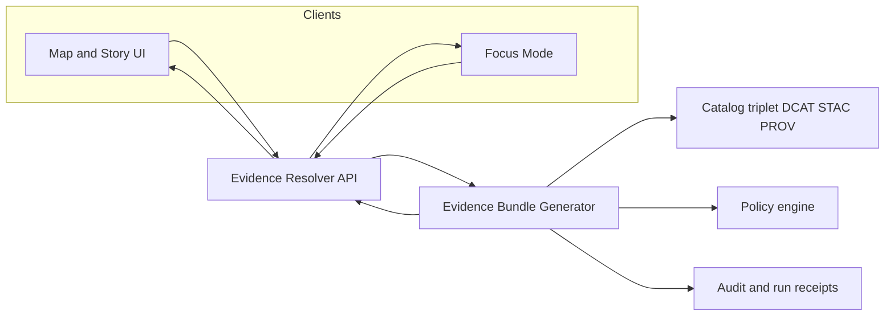

<!-- [KFM_META_BLOCK_V2]
doc_id: kfm://doc/3f585693-df62-40f0-b047-fa4389fabb72
title: Evidence Bundle Generator
type: standard
version: v1
status: draft
owners: <TODO: name a codeowner/team>
created: 2026-02-26
updated: 2026-02-26
policy_label: public
related:
  - kfm://doc/<TODO: link to KFM Definitive Design & Governance Guide>
tags: [kfm, evidence, generator]
notes:
  - Documents the contract + invariants for building EvidenceBundle objects from EvidenceRefs.
  - Implementation details (language/entrypoint) may differ by repo; keep the contract stable.
[/KFM_META_BLOCK_V2] -->

# Evidence Bundle Generator

Build **deterministic, policy-aware EvidenceBundles** from **EvidenceRefs** for KFM’s evidence-first UX and cite-or-abstain workflows.


**Owners:** `<TODO>`  
**Last updated:** 2026-02-26  

---

## Quick navigation

- [What this is](#what-this-is)
- [Where it fits](#where-it-fits)
- [Inputs and outputs](#inputs-and-outputs)
- [Architecture](#architecture)
- [EvidenceBundle contract](#evidencebundle-contract)
- [Determinism and hashing](#determinism-and-hashing)
- [Policy and safety](#policy-and-safety)
- [Audit and observability](#audit-and-observability)
- [Error model](#error-model)
- [Tests and gates](#tests-and-gates)
- [Directory layout](#directory-layout)
- [Contributing](#contributing)

---

## What this is

This directory holds the implementation (and fixtures/schemas) for **constructing an `EvidenceBundle`** from an `EvidenceRef`.

In KFM terms:

- An **EvidenceRef** is a stable reference to evidence (e.g., `dcat://…`, `stac://…`, `prov://…`, `doc://…`, `graph://…`).
- An **EvidenceBundle** is the resolved evidence view returned by the **evidence resolver** and used by Map/Story UI and Focus Mode.

> **Goal:** “evidence” is not raw text or a loose URL — it’s a **resolved, policy-applied, digest-addressed** bundle that can be cached and audited.

---

## Where it fits

KFM’s trust surfaces (Map, Story, Focus Mode) rely on evidence resolution staying inside the **trust membrane**:

- Clients **do not** talk directly to storage/caches/databases.
- Evidence is fetched via a governed boundary that applies **policy decisions**, **redaction obligations**, and **auditing**.

This generator is an internal building block that enables the evidence resolver to return an EvidenceBundle with:

- dataset version identity
- license + attribution
- artifact links + digests
- policy decision + obligations applied
- provenance and audit references

---

## Inputs and outputs

### Inputs (minimum)

| Input | Type | Notes |
|---|---|---|
| `evidence_ref` | string | A single `EvidenceRef` (or a list/JSONL of refs) to resolve. |
| `policy_context` | object | Caller role, policy label context, authz scope, and any request constraints. |
| `catalog_triplet` access | service/adapter | DCAT/STAC/PROV lookups to locate the dataset version and artifacts. |
| `provenance` access | service/adapter | Run receipts / lineage pointers for the dataset version. |

### Output

| Output | Type | Notes |
|---|---|---|
| `EvidenceBundle` | JSON | Stable, cacheable, digest-addressed bundle. |

---

## Architecture



**Design intent:** the Evidence Resolver calls the generator to assemble a bundle. The bundle is the *only* thing the UI/Focus Mode cites.

---

## EvidenceBundle contract

### Normative language

This README uses:

- **MUST** = required for correctness and governance
- **SHOULD** = strongly recommended
- **MAY** = optional

### Required fields (v1)

At minimum, an `EvidenceBundle` MUST include:

| Field | Required | Purpose |
|---|---:|---|
| `bundle_id` | ✅ | Immutable digest identifier for the bundle. |
| `dataset_version_id` | ✅ | The immutable dataset version backing this evidence. |
| `title` | ✅ | Human-facing label for UI cards and citations. |
| `policy` | ✅ | Policy decision + label + obligations applied. |
| `license` | ✅ | SPDX + attribution. |
| `provenance` | ✅ | Run ID / lineage pointer used to reproduce or audit. |
| `artifacts[]` | ✅ | Resolved artifact links with digests and media types. |
| `checks` | ✅ | Minimal health checks (schema/link validity). |
| `audit_ref` | ✅ | Pointer to audit record for this resolution (or governing run). |

### Example bundle

> NOTE: This is an illustrative example. Keep the **shape** stable; adjust values to your dataset.

```json
{
  "bundle_id": "sha256:bundle…",
  "dataset_version_id": "2026-02.abcd1234",
  "title": "Storm event record: 2026-02-19",
  "policy": {
    "decision": "allow",
    "policy_label": "public",
    "obligations_applied": []
  },
  "license": {"spdx": "CC-BY-4.0", "attribution": "Source org"},
  "provenance": {"run_id": "kfm://run/2026-02-20T12:00:00Z.abcd"},
  "artifacts": [
    {
      "href": "processed/events.parquet",
      "digest": "sha256:2222",
      "media_type": "application/x-parquet"
    }
  ],
  "checks": {"catalog_valid": true, "links_ok": true},
  "audit_ref": "kfm://audit/entry/123"
}
```

### EvidenceRef schemes

The resolver/generator MUST understand the allowed EvidenceRef schemes used in KFM (examples):

- `dcat://…`
- `stac://…`
- `prov://…`
- `doc://…`
- `graph://…`

Adding a new scheme is a governance change: it MUST include fixtures and policy tests.

---

## Determinism and hashing

Evidence bundles are **immutable by digest**.

**Rules:**

- The `bundle_id` MUST be computed from a canonical, machine-stable representation of the bundle payload.
- All digests MUST be deterministic across environments (no timestamps or nonces included in the hashed payload).
- If you need time fields, keep them *outside* the hashed material, or include them only when they are stable inputs.

**Recommended approach:**

1. Construct a canonical JSON object for the bundle.
2. Canonicalize using RFC 8785 JSON Canonicalization Scheme (JCS).
3. Compute `sha256` and prefix with `sha256:`.

---

## Policy and safety

The generator MUST be policy-aware.

- If the caller is not allowed to resolve an EvidenceRef, the generator MUST **fail closed**.
- If policy requires obligations (generalization/redaction), the generator MUST apply them before any content is returned.

Typical obligations include (examples):

- generalize geometry to a minimum cell size
- remove sensitive attributes

> WARNING: Avoid “existence leaks.” Errors and timing differences should not reveal restricted dataset existence.

---

## Audit and observability

Evidence resolution is part of governed operations.

### What to capture

At minimum, governed operations SHOULD emit an audit record that captures:

- **who**: principal and role
- **what**: operation + parameters
- **when**: timestamps
- **inputs/outputs**: by digest
- **policy decision**: allow/deny + obligations + reason codes

### Run receipt linkage

Where available, include:

- `provenance.run_id` pointing at the pipeline run that produced the dataset version
- `audit_ref` pointing at the API/run audit entry for this resolution

> NOTE: Audit logs are sensitive. Apply redaction and retention policy.

---

## Error model

Errors MUST be stable and policy-safe.

Recommended fields:

- `error_code`
- `message` (policy-safe)
- `audit_ref`
- `remediation` (optional, safe hints)

Avoid revealing sensitive existence through different 403 vs 404 behaviors.

---

## Tests and gates

This generator sits on the “truth path.” Treat it like a promotion gate.

### Required test coverage

- [ ] Resolves each supported EvidenceRef scheme to a bundle
- [ ] Fails closed for unknown schemes
- [ ] Applies policy obligations (redaction/generalization) deterministically
- [ ] Produces stable `bundle_id` across repeated runs
- [ ] Validates that artifact `href` exists and digests match
- [ ] Produces policy-safe, stable error responses

### Promotion-aligned checks (recommended)

- Identity + versioning checks
- Artifact digests present
- Catalog triplet schema validity
- Cross-link integrity (EvidenceRefs resolve)
- Audit references emitted

---

## Directory layout

> This tree is **proposed** as a guideline. Update it to match the actual repo contents.

```text
tools/generators/evidence_bundle/
  README.md
  src/                 # generator implementation (language-specific)
  schemas/             # EvidenceRef / EvidenceBundle JSON Schemas
  fixtures/            # golden inputs/outputs for deterministic tests
  tests/               # unit tests and contract tests
```

### Acceptable inputs

This directory MAY contain:

- generator library code
- JSON schemas
- fixtures (small, non-sensitive)
- contract tests / golden tests

### Exclusions

This directory MUST NOT contain:

- raw or processed dataset payloads
- credentials, API keys, or tokens
- policy secrets (keep policy packs in governed policy directories)
- any code that bypasses repository interfaces to reach storage directly

---

## Contributing

1. **Change the contract carefully.** Any field rename/removal is a breaking change.
2. Add/modify fixtures first.
3. Add tests proving:
   - determinism
   - policy correctness
   - fail-closed behavior
4. Ensure CI gates run catalog validation + cross-link checks.

### Definition of done

- [ ] Contract updated (README + schema if present)
- [ ] Fixtures added/updated
- [ ] Unit tests pass
- [ ] Determinism test passes (hash stable)
- [ ] Policy tests pass (deny-by-default, obligations applied)

---

<details>
<summary>Appendix: Suggested minimal schemas (starter)</summary>

If you keep schemas here, consider:

- `schemas/evidence_ref.schema.json`
- `schemas/evidence_bundle.schema.json`

Keep schemas versioned (e.g., `v1`, `v2`) and support dual-read during migrations.

</details>

---

<p align="right"><a href="#evidence-bundle-generator">Back to top</a></p>
