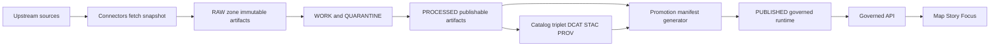

<!-- [KFM_META_BLOCK_V2]
doc_id: kfm://doc/782a67f8-d1ab-4e46-bdd7-09091c008539
title: Promotion Manifest Generator
type: standard
version: v1
status: draft
owners: [TBD]
created: 2026-02-26
updated: 2026-02-26
policy_label: public
related:
  - kfm://concept/promotion-contract
  - kfm://concept/run-receipt
  - kfm://concept/catalog-triplet
  - ../../../../docs/governance/ # TODO: replace with real repo paths
  - ../../../../schemas/ # TODO: replace with real repo paths
  - ../../../../policy/ # TODO: replace with real repo paths
tags: [kfm, generator, promotion, provenance]
notes:
  - This README is contract-first; replace TBD/TODO items once the repo wiring is confirmed.
[/KFM_META_BLOCK_V2] -->

# Promotion Manifest Generator

Generate a **promotion manifest** (`kfm_promotion_manifest_version: v1`) that proves a dataset version is safe to **promote** into KFM runtime surfaces.


> **NOTE**
> This directory is part of the KFM “Promotion Contract” posture: promotion is **blocked** unless required artifacts exist and validate. This generator exists to make that contract *machine-checkable*.

## Navigation

- [What this does](#what-this-does)
- [Where it fits](#where-it-fits)
- [Inputs and outputs](#inputs-and-outputs)
- [Promotion manifest format](#promotion-manifest-format)
- [Promotion Contract mapping](#promotion-contract-mapping)
- [Usage](#usage)
- [Validation and CI gates](#validation-and-ci-gates)
- [Governance and safety](#governance-and-safety)
- [Directory layout](#directory-layout)
- [Contribution rules](#contribution-rules)

---

## What this does

A **promotion manifest** is a *promotion-oriented rollup* describing exactly what is being promoted:

- stable dataset identity (`dataset_slug`)
- immutable dataset version identity (`dataset_version_id`) + deterministic `spec_hash`
- **artifact inventory** (paths, digests, media types)
- **catalog inventory** (DCAT/STAC/PROV digests and paths)
- QA outcome reference (status + report digest)
- policy classification (`policy_label`) + the policy decision record identifier
- required approvals (if any)

This generator should be treated as a **governed interface**:

- **Fail-closed**: missing fields or failed validations must block promotion.
- **Deterministic**: given the same inputs, the same manifest must be produced.

[Back to top](#promotion-manifest-generator)

---

## Where it fits

KFM promotion moves a dataset version from *Raw/Work* into *Processed + Catalog/Lineage*, and therefore into runtime surfaces.



**Interpretation:**

- The manifest generator runs after **processed artifacts** exist and after (or alongside) **catalog triplet** generation.
- The output manifest becomes one of the **required promotion artifacts**.

[Back to top](#promotion-manifest-generator)

---

## Inputs and outputs

### Inputs

Confirmed-by-contract inputs (must exist somewhere, even if the exact repo wiring varies):

- Dataset identity
  - `dataset_slug`
  - `dataset_version_id`
  - `spec_hash` (deterministic)
- Artifact inventory (processed)
  - `path`, `digest`, `media_type`
- Catalog inventory
  - DCAT, STAC collection/items (if applicable), PROV bundle
  - each with `path` + `digest`
- QA summary
  - `status` + `report_digest`
- Policy decision
  - `policy_label` (e.g., public/restricted)
  - `decision_id`
- Approvals (if required)

> **WARNING**
> Inputs with unclear licensing, failed validation, or unresolved sensitivity concerns belong in **QUARANTINE** and must not be promoted.

### Outputs

- `promotion_manifest.json` (name may vary; the content format must match the contract)
- (PROPOSED, repo-dependent) `promotion_manifest.json.sig` or equivalent signature/attestation sidecar

[Back to top](#promotion-manifest-generator)

---

## Promotion manifest format

### v1 JSON template

This is the minimal v1 shape used by KFM’s promotion gate.

```json
{
  "kfm_promotion_manifest_version": "v1",
  "dataset_slug": "example_dataset",
  "dataset_version_id": "2026-02.abcd1234",
  "spec_hash": "sha256:abcd1234",
  "released_at": "2026-02-20T13:00:00Z",
  "artifacts": [
    {
      "path": "events.parquet",
      "digest": "sha256:2222",
      "media_type": "application/x-parquet"
    }
  ],
  "catalogs": [
    {"path": "dcat.jsonld", "digest": "sha256:4444"},
    {"path": "stac/collection.json", "digest": "sha256:5555"}
  ],
  "qa": {"status": "pass", "report_digest": "sha256:7777"},
  "policy": {"policy_label": "public", "decision_id": "kfm://policy_decision/xyz"},
  "approvals": [
    {"role": "steward", "principal": "<id>", "approved_at": "2026-02-20T12:59:00Z"}
  ]
}
```

### Field rules (generator responsibilities)

- `spec_hash` must be computed from **canonicalized** input content to prevent “hash drift.”
- Every artifact and catalog entry must be **content-addressed** by digest.
- Timestamps must be **RFC3339** and semantically correct.

> **TIP**
> Keep the manifest “thin”: reference bulky reports and catalogs by digest rather than embedding them.

[Back to top](#promotion-manifest-generator)

---

## Promotion Contract mapping

The manifest is only one part of promotion. This table shows how it participates in the wider fail-closed gates.

| Gate | Fail-closed requirement | How this generator supports it |
|---|---|---|
| A | Identity + versioning | Emit `dataset_slug`, `dataset_version_id`, `spec_hash` deterministically |
| B | Licensing + rights metadata | (Outside manifest v1) ensure licensing is captured in catalogs; fail if missing |
| C | Sensitivity + redaction plan | Record `policy_label` + `decision_id`; ensure restricted cases have recorded obligations |
| D | Catalog triplet validation | Require catalog digests/paths; CI must validate DCAT/STAC/PROV + cross-links |
| E | Run receipts + checksums | Ensure every listed artifact/catalog has a digest; CI must require run receipts exist |
| F | Policy tests + contract tests | Manifest must be schema-valid; CI must run policy tests and at least one EvidenceRef resolution |
| G | Optional production posture | Leave room for SBOM / attestations / perf & a11y smoke checks (repo-specific) |

> **NOTE**
> If any gate cannot be satisfied, promotion must **fail closed**.

[Back to top](#promotion-manifest-generator)

---

## Usage

This README does **not** assume a specific language/runtime for the generator.

### PROPOSED CLI (verify in repo)

```bash
# TODO: confirm entrypoint + flags in repo
# Intended behavior: produce promotion_manifest.json and exit non-zero on any invariant violation.

kfm-gen-promotion-manifest \
  --dataset-slug example_dataset \
  --dataset-version-id 2026-02.abcd1234 \
  --released-at 2026-02-20T13:00:00Z \
  --artifacts-manifest ./data/processed/artifacts.json \
  --catalogs-manifest ./catalogs/catalogs.json \
  --qa-report ./reports/qa.json \
  --policy-decision ./policy/decision.json \
  --approvals ./approvals.json \
  --out ./promotion_manifest.json
```

### Library API (PROPOSED)

If this is implemented as a library, keep the API deterministic and explicit:

```ts
// pseudo-code
const manifest = buildPromotionManifest({
  datasetSlug,
  datasetVersionId,
  releasedAt,
  artifacts,
  catalogs,
  qa,
  policy,
  approvals,
});

validatePromotionManifestOrThrow(manifest);
writeJsonAtomic(outPath, manifest);
```

### Minimum verification steps (to convert TODO → Confirmed)

1. Find the actual entrypoint for this generator (script, binary, package).
2. Locate the canonical JSON Schema for `kfm_promotion_manifest_version: v1`.
3. Identify where digests are computed (and which hash algorithm is required).
4. Confirm how approvals are represented (file, API lookup, signature attestation).

[Back to top](#promotion-manifest-generator)

---

## Validation and CI gates

At minimum, promotion pipelines should enforce:

- **Schema validation** for promotion manifest (and for DCAT/STAC/PROV)
- **Digest verification** (every referenced object exists and matches its digest)
- **Cross-link checks** (catalog references resolvable; EvidenceRefs resolvable)
- **Policy tests** (deny-by-default + fixtures-driven)
- **Run receipt presence** (each producing run emits a receipt and is recorded in an append-only audit ledger)

Suggested CI structure (PROPOSED):

- `generate promotion manifest` → `validate manifest` → `validate catalogs` → `policy gate` → `attach/sign/attest` → `promote`

[Back to top](#promotion-manifest-generator)

---

## Governance and safety

- Promotion manifests must be **safe to publish at their policy label**.
- Do not embed secrets or sensitive raw values; prefer **digest references**.
- If a dataset version is **restricted** or contains location-sensitive information, ensure a **generalization/redaction plan** exists and is recorded in provenance.

[Back to top](#promotion-manifest-generator)

---

## Directory layout

Actual files may differ; this is a *recommended* (contract-first) layout:

```text
tools/generators/promotion_manifest/
  README.md
  schemas/
    promotion_manifest_v1.schema.json   # JSON Schema for v1
  fixtures/
    valid.v1.json
    invalid_missing_digest.v1.json
  src/                                  # generator implementation
  tests/
```

Directory documentation rules:

- **Acceptable inputs here:** schemas, fixtures, generator code, docs.
- **Must not go here:** raw datasets, credentials, private keys, or unredacted sensitive artifacts.

[Back to top](#promotion-manifest-generator)

---

## Contribution rules

- Do not change v1 semantics without a **new version** (`v2`, etc.).
- Any new fields must include:
  - schema updates,
  - valid + invalid fixtures,
  - policy gate updates (if relevant),
  - migration notes.
- Keep everything reversible: small diffs, testable invariants, fail-closed behavior.

---

<details>
<summary><strong>Appendix: Related contracts (run receipt)</strong></summary>

KFM pipelines should also emit a per-run **run receipt** containing inputs/outputs/environment/validation and policy decisions.

```json
{
  "run_id": "kfm://run/2026-02-20T12:00:00Z.abcd",
  "actor": {"principal": "svc:pipeline", "role": "pipeline"},
  "operation": "ingest+publish",
  "dataset_version_id": "2026-02.abcd1234",
  "inputs": [{"uri": "raw/source.csv", "digest": "sha256:1111"}],
  "outputs": [{"uri": "processed/events.parquet", "digest": "sha256:2222"}],
  "environment": {
    "container_digest": "sha256:img...",
    "git_commit": "deadbeef",
    "params_digest": "sha256:3333"
  },
  "validation": {"status": "pass", "report_digest": "sha256:7777"},
  "policy": {"decision_id": "kfm://policy_decision/xyz"},
  "created_at": "2026-02-20T12:05:00Z"
}
```

</details>
