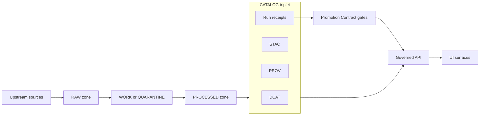

<!-- [KFM_META_BLOCK_V2]
doc_id: kfm://doc/2b08c6b2-3433-4acb-9579-5c23ee7a8055
title: Run Receipt Generator
type: standard
version: v1
status: draft
owners: ["TODO: data-platform", "TODO: governance"]
created: 2026-02-26
updated: 2026-02-26
policy_label: public
related:
  - tools/generators/run_receipt/
tags: [kfm, provenance, run-receipt, audit, promotion-contract]
notes:
  - "This README documents the *contract* and expected behavior for generating prov:run_receipt artifacts."
  - "Update paths/commands to match the implementation in this repo."
[/KFM_META_BLOCK_V2] -->

# Run Receipt Generator (prov:run_receipt)

**Purpose:** Emit a *per-run* receipt JSON that binds **inputs → outputs → environment → validation → policy decision** into an auditable evidence artifact.


---

## Quick navigation

- [What problem this solves](#what-problem-this-solves)
- [Where this fits in the KFM trust membrane](#where-this-fits-in-the-kfm-trust-membrane)
- [Receipt shape](#receipt-shape)
- [Deterministic identity and hashing](#deterministic-identity-and-hashing)
- [Storage and discovery](#storage-and-discovery)
- [How to use this generator](#how-to-use-this-generator)
- [Validation and policy gates](#validation-and-policy-gates)
- [Directory guide](#directory-guide)
- [Troubleshooting](#troubleshooting)
- [Security and privacy](#security-and-privacy)

---

## What problem this solves

KFM’s governance model depends on *evidence-first* artifacts. A **run receipt** is the smallest evidence object that makes an ingestion/transform run auditable, and it is required to pass promotion gates (fail-closed) before data can reach governed runtime surfaces.  

A run receipt is expected to capture:

- **Inputs** (URIs + digests + optional freshness hints)
- **Outputs** (URIs + digests)
- **Environment** (container digest, git commit, params digest)
- **Validation** status (and pointer to a report digest)
- **Policy decision** pointer (what was allowed/denied and why)

> **Non-goal:** A run receipt is *not* a narrative, and it is *not* a policy engine. It’s an evidence record used by policy and UI.

[Back to top](#run-receipt-generator-provrun_receipt)

---

## Where this fits in the KFM trust membrane

In KFM’s “truth path”, promoted data must remain traceable through **RAW → WORK/QUARANTINE → PROCESSED → CATALOG (DCAT/STAC/PROV + run receipts)**, and then into governed APIs and UI surfaces. Run receipts are part of the canonical audit trail and should be treated as governed datasets (append-only).  



**Promotion Contract note:** “Run receipt and checksums” is explicitly called out as a gate in the minimum gate set.  

[Back to top](#run-receipt-generator-provrun_receipt)

---

## Receipt shape

This generator targets a **v1 receipt** with two compatible “views” that show up in KFM artifacts:

1) **Pipeline run receipt (general)** — run-level I/O, environment, validation, policy decision.  
2) **Source fetch receipt (minimal)** — emphasizes `spec_hash`, `accessURL`, HTTP freshness hints (`etag`, `last_modified`), and `artifact_digest`.

### A. General run receipt (template)

```json
{
  "run_id": "kfm://run/2026-02-20T12:00:00Z.abcd",
  "actor": {"principal": "svc:pipeline", "role": "pipeline"},
  "operation": "ingest+publish",
  "dataset_version_id": "2026-02.abcd1234",
  "inputs": [
    {"uri": "raw/source.csv", "digest": "sha256:1111"}
  ],
  "outputs": [
    {"uri": "processed/events.parquet", "digest": "sha256:2222"}
  ],
  "environment": {
    "container_digest": "sha256:img...",
    "git_commit": "deadbeef",
    "params_digest": "sha256:3333"
  },
  "validation": {"status": "pass", "report_digest": "sha256:7777"},
  "policy": {"decision_id": "kfm://policy_decision/xyz"},
  "created_at": "2026-02-20T12:05:00Z"
}
```

### B. Minimal prov:run_receipt (starter fields)

These fields are the minimum “receipt contract” signals that tend to be enforced by schema and policy gates:

| Field | Required | Why it exists |
|---|---:|---|
| `@type` = `prov:run_receipt` | ✅ | Typed marker for downstream validation and UX |
| `spec_hash` | ✅ | Deterministic identity for the run spec (canonical JSON hashing) |
| `fetched_at` | ✅ (for fetch receipts) | Timestamp for acquisition / freshness evaluation |
| `accessURL` | ✅ (for fetch receipts) | Source URL used for acquisition |
| `artifact_digest` | ✅ (for fetch receipts) | Binds the receipt to the exact bytes fetched |

Optional-but-common: `etag`, `last_modified`, `fallback_used`, and `cosign.signature_ref` / `cosign.attestation_ref`.

> **Recommended practice:** If your implementation emits the “general” receipt, include `spec_hash` as well so idempotency and caching remain stable across re-runs.

[Back to top](#run-receipt-generator-provrun_receipt)

---

## Deterministic identity and hashing

### spec_hash

`spec_hash` should be computed from **canonicalized** run spec inputs (stable key ordering, stable null handling, stable whitespace), then hashed with sha256. Canonical JSON hashing is explicitly called out as a KFM invariant (e.g., RFC 8785 JCS is a good default).  

**Implementation sketch (pseudocode):**

```text
spec = load(run_spec)                 # JSON/YAML object
canon = canonicalize(spec)            # JCS or equivalent
spec_hash = "sha256:" + sha256(canon) # bytes, not string repr
```

### artifact_digest(s)

Any fetched or produced artifact referenced by the receipt should have a `sha256:<hex>` digest computed on the exact bytes written to storage.

> **Rule of thumb:** if an artifact can be cited by Story Nodes or Focus Mode, it must be reproducible and resolvable back to inputs and run receipts.

[Back to top](#run-receipt-generator-provrun_receipt)

---

## Storage and discovery

Receipts should be stored in a predictable, versionable location, and discoverable from catalogs:

- Store receipts under a path like: `data/prov/run_receipts/<date>/...`
- Ensure **DCAT and/or STAC** entries link to the receipt (direct link or bundle pointer)
- Treat the audit ledger as append-only; do not mutate old receipts — emit a new receipt for a new run

[Back to top](#run-receipt-generator-provrun_receipt)

---

## How to use this generator

> ⚠️ **Repo-specific:** The exact entrypoint (Python module, Node script, Make target, etc.) is not documented here. The patterns below describe the expected interface. Adjust to match your implementation.

### Proposed CLI contract

```bash
# Example: generate a receipt for an ingestion run
./tools/generators/run_receipt/run_receipt \
  --run-spec ./runs/spec.json \
  --inputs ./runs/inputs.json \
  --outputs ./runs/outputs.json \
  --validation ./runs/validation.json \
  --policy-decision ./runs/policy_decision.json \
  --out ./data/prov/run_receipts/2026-02-26/run_receipt.json
```

**Expected behavior:**

- Fail closed (non‑zero exit) if required fields are missing
- Compute `spec_hash` deterministically from the run spec
- Compute `digest` / `artifact_digest` for referenced files (or require digests as inputs)
- Emit JSON that validates against the repo’s run receipt schema (v1)
- Never write secrets into the receipt

### Proposed library API contract

```python
receipt = generate_run_receipt(
  run_spec=spec_obj,
  inputs=[{"uri": "...", "path": "..."}],
  outputs=[{"uri": "...", "path": "..."}],
  environment={
    "container_digest": "...",
    "git_commit": "...",
    "params_digest": "..."
  },
  validation={"status": "pass", "report_digest": "..."},
  policy={"decision_id": "..."},
)
write_json(receipt, out_path)
```

[Back to top](#run-receipt-generator-provrun_receipt)

---

## Validation and policy gates

A receipt isn’t “trustable” just because it exists.

### Minimum gates to expect in CI

- JSON Schema validation for receipts (v1 schema)
- Policy-as-code checks (OPA/Rego via Conftest) that deny promotion if:
  - required receipt fields are missing
  - `accessURL` is insecure (e.g., `http://`)
  - licensing / sensitivity / CARE signals are missing (where applicable)
- Optional but recommended:
  - signature/attestation verification for receipts and/or referenced artifacts (Cosign)

### UI safety note (why strict validation matters)

Receipt viewing is expected to follow a strict chain: **validate schema → verify signature → render**, and should fail closed if validation or signature verification fails.

[Back to top](#run-receipt-generator-provrun_receipt)

---

## Directory guide

### Where it fits in the repo

This folder is part of the tooling layer that produces governance artifacts. It should be callable from:

- ingestion pipelines / workflow runners
- CI promotion gates
- PR preview automation (draft PRs that include new receipts + catalog updates)

### Acceptable inputs

- Run specifications (JSON/YAML) and/or resolved pipeline parameters
- Lists of input and output artifacts (paths and/or URIs)
- Validation results (status + report digest)
- Policy decision IDs (or full policy decision objects that contain the ID)
- Optional: ETag/Last-Modified headers for HTTP sources

### Exclusions

- ❌ Do not embed secrets (tokens, cookies, credentials) in receipts
- ❌ Do not perform policy “allow/deny” here — policy belongs in the policy engine
- ❌ Do not mutate canonical artifacts; receipts must reference immutable content-addressed artifacts where possible

### Expected directory contents (update to match reality)

```text
tools/generators/run_receipt/
  README.md                    # this file
  run_receipt.(py|ts|go|sh)     # entrypoint (implementation-specific)
  fixtures/
    valid.receipt.json
    invalid.missing_digest.json
  tests/
    test_run_receipt.*          # unit tests for canonicalization + hashing
```

[Back to top](#run-receipt-generator-provrun_receipt)

---

## Troubleshooting

### spec_hash changes unexpectedly

Common causes:

- Non-canonical key order / whitespace changes in the run spec
- YAML → JSON conversion differences (null vs empty string)
- Floating point formatting differences

Fix: canonicalize with a single standard (JCS or an equivalent deterministic serializer) and add a unit test that asserts `spec_hash` for a fixed fixture.

### artifact_digest mismatch

Common causes:

- Digest computed on *different bytes* than the stored artifact (newline conversion, compression, different encoding)
- Digest computed on a transformed file instead of the raw bytes

Fix: compute the digest at the moment you write the artifact to its final location, on the exact bytes.

[Back to top](#run-receipt-generator-provrun_receipt)

---

## Security and privacy

- Treat receipts as governed artifacts: include only what is needed for auditability.
- Prefer referencing sensitive information indirectly (e.g., `decision_id`) rather than embedding sensitive fields.
- If the receipt includes source URLs, ensure policy gates enforce HTTPS and apply redaction/generalization obligations where needed.

---
