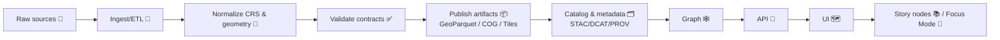

# 🧭 `tools/geo` — Geospatial Utility Belt (KFM)


> **What this folder is:** the reusable, *boring-on-purpose* geospatial toolkit for **Kansas Frontier Matrix (KFM)** — ingest ➜ normalize ➜ validate ➜ publish.  
> **What this folder is not:** a place for dataset-specific one-offs. Those belong in pipelines.

---

## 🧠 Why `tools/geo` exists

KFM’s architecture is explicitly **contract-first** and **provenance-first**: every dataset is expected to have a metadata contract, traceable sources, and validation gates before anything becomes “real.”:contentReference[oaicite:0]{index=0}:contentReference[oaicite:1]{index=1}

This folder is where we put the geospatial primitives that make that possible:

- 🧾 **Contracts & metadata** (STAC-ish items, catalog validation, schema checks)
- 🧹 **Normalization** (CRS rules, geometry validity, field standardization)
- 🧱 **Publishing formats** (GeoParquet, COGs, tiles, MBTiles)
- 🗃️ **Spatial storage** (PostGIS helpers, ingest/export patterns)
- 🛰️ **Remote sensing** hooks (GEE exports, raster pipelines)
- 🗺️ **Map-ready outputs** (vector tiles, simplified geometries, style helpers)

---

## ✅ Non‑negotiables (KFM rules this folder enforces)

> [!IMPORTANT]
> These are *design constraints*, not suggestions.

- **No mystery layers**: every output must have a source + processing lineage recorded (and machine-checkable).:contentReference[oaicite:2]{index=2}
- **Catalog/contract before UI**: pipeline order is **ETL → Catalogs → Graph → APIs → UI** (don’t leapfrog).:contentReference[oaicite:3]{index=3}
- **Validation gates**: contributors run `catalog_qa` locally; CI reruns it on PRs; only then we merge/publish.:contentReference[oaicite:4]{index=4}
- **Scale-aware raster strategy**: prefer **COGs** (HTTP range reads) and optionally pre‑tiled layers for heavy rasters; integrate GEE when computation/data scale demands it.:contentReference[oaicite:5]{index=5}
- **“Focus Mode”/AI outputs are advisory** and must stay evidence-backed + citation-forward (no silent automation).:contentReference[oaicite:6]{index=6}

---

## 🧱 Architecture: keep Geo utilities “clean”

KFM calls out a **Clean Architecture** approach: domain logic separated from service logic, adapters, and infrastructure.:contentReference[oaicite:7]{index=7}

In `tools/geo`, that translates to:

- 🟦 **Domain** (pure types): extents, CRS, geometry invariants, metadata models  
- 🟩 **Services** (pure-ish): validation, transforms, simplification, packaging  
- 🟨 **Adapters**: PostGIS, GDAL/OGR, Earth Engine, tile builders  
- 🟥 **CLI/entrypoints**: thin wrappers that call services

---

## 🗺️ Pipeline map (how Geo tools “fit”)



(That ordering is part of the project’s master workflow guidance.):contentReference[oaicite:8]{index=8}

---

## 📂 Suggested directory layout

> If the folder already exists with different filenames, keep the *roles* — rename later.

```text
tools/geo/
  README.md

  📦 core/
    crs.py                # CRS normalization + transform helpers
    extent.py             # bbox / polygon extents, temporal extents
    units.py              # meters/feet conversions, safe distance ops

  🧭 vector/
    validate.py           # ST_IsValid patterns, fixups, QA reports
    ops.py                # dissolve, clip, simplify, overlay
    tiles.py              # vector tile prep (simplify-by-zoom, etc.)

  🛰️ raster/
    cog.py                # GeoTIFF -> COG, overviews, compression presets
    stats.py              # zonal stats, histograms, QA summaries
    tiles.py              # raster tiling / MBTiles helpers

  🗃️ db/
    postgis.py            # connect, schema mgmt, load/export recipes
    sql/                  # versioned SQL snippets (safe, parameterized)

  🗂️ catalog/
    contract.py           # dataset contract model
    stac.py               # STAC item/collection builder helpers
    prov.py               # provenance manifests (inputs/steps/outputs)
    qa.py                 # catalog_qa runner helpers

  🌍 remote_sensing/
    gee.py                # Earth Engine adapter + export patterns
    indices.py            # NDVI/NDWI/etc calculators (where appropriate)

  🧪 tests/
    test_crs.py
    test_validate.py
    test_stac.py
```

---

## 🧾 Data contracts & catalog QA (the “front door”)

KFM expects a dataset workflow like:

- pipeline produces processed data (e.g., Parquet/COG)
- catalog JSON records **source_url**, **license**, **spatial bbox**, **temporal range**, etc.
- `tools/validation/catalog_qa` checks required fields and samples outputs
- CI repeats that validation on PR merge gates:contentReference[oaicite:9]{index=9}

### Minimal catalog JSON (shape, not strict schema)

```json
{
  "id": "example_dataset_id",
  "title": "Example Dataset",
  "source_url": "https://example.org/source",
  "license": "Public Domain",
  "spatial": { "bbox": [-102.05, 36.99, -94.59, 40.00], "crs": "EPSG:4326" },
  "temporal": { "start": "1860-01-01", "end": "2020-12-31" },
  "assets": [
    { "type": "vector", "format": "geoparquet", "path": "data/processed/example.parquet" }
  ],
  "provenance": {
    "inputs": ["..."],
    "processing_steps": ["..."],
    "software": ["..."],
    "hashes": ["..."]
  }
}
```

> [!NOTE]
> The *exact* required fields should be enforced by `catalog/contract.py` + `catalog/qa.py`, mirroring the project’s validation expectations.:contentReference[oaicite:10]{index=10}:contentReference[oaicite:11]{index=11}

---

## 🗃️ PostGIS patterns (DB helpers)

### Why `geodata` schema?

A practical pattern in the geo cookbook is to keep spatial tables in a dedicated schema (e.g., `geodata`) rather than dumping into `public`, because it improves organization and backups/restores.:contentReference[oaicite:12]{index=12}

### Common setup snippet

```sql
-- run once per database
CREATE EXTENSION IF NOT EXISTS postgis;

-- keep geo tables isolated
CREATE SCHEMA IF NOT EXISTS geodata;
```

### Ingest recipes we support (and why)

- `ogr2ogr` + schema targeting for repeatable imports (good for OSM, shp, gpkg, etc.).:contentReference[oaicite:13]{index=13}
- `shp2pgsql` for fast/standard bulk loads.:contentReference[oaicite:14]{index=14}

> [!TIP]
> When we split geometries or otherwise mutate features, **be explicit about attribute preservation**. Cookbook examples show how geometry-only ops can drop names/attributes and require a join to restore them.:contentReference[oaicite:15]{index=15}

---

## 🛰️ Raster strategy (COGs, tiles, “don’t melt the browser”)

KFM’s documentation is clear: large rasters are handled via **Cloud-Optimized GeoTIFFs**, enabling partial reads (HTTP range requests), and optionally prebuilt tiles for “heavy” layers.:contentReference[oaicite:16]{index=16}

### What belongs in `raster/cog.py`

- standard “COGify” step (tiling, overviews, compression)
- deterministic settings (so outputs are reproducible)
- metadata emission (hash, bounds, resolution, bands)
- optional tile export (MBTiles / XYZ folder) for hot layers

---

## 🌍 Remote sensing hooks (GEE + friends)

KFM hints at integrating **Google Earth Engine (GEE)** as an external compute/data source for petabyte-scale datasets and on-demand remote sensing computations.:contentReference[oaicite:17]{index=17}

In practice, we treat this as an adapter layer:

- `remote_sensing/gee.py` should:
  - authenticate via env/secret manager (never hardcode)
  - export imagery to cloud storage
  - hand off to `raster/cog.py` for standardization (COG + metadata)
  - record provenance (dataset IDs, reducers, params)

The Earth Engine reference text includes practical workflows for vector vs raster operations, joining vector datasets, and built-environment datasets — all patterns we can mirror in our adapter utilities.:contentReference[oaicite:18]{index=18}

---

## 🗺️ Web map readiness (MapLibre/WebGL + responsive UI)

KFM’s design includes a modern web UI (React + MapLibre) and expects map layers to be optimized for interactive use.:contentReference[oaicite:19]{index=19}

`tools/geo` supports this by producing:

- simplified vector layers per zoom (and/or vector tiles)
- tile-friendly raster outputs (COG or pre-tiles)
- consistent CRS strategy (storage in EPSG:4326; web display in 3857)
- image/format choices that work well on the web  
  (see: compressed image formats reference for tradeoffs) :contentReference[oaicite:20]{index=20}

---

## 📈 Performance & scale notes

- Use spatial indexes in PostGIS (GiST/BRIN where appropriate)
- Precompute heavy aggregates for UI; don’t do full-table scans “live”
- COG + range requests is the default for “big raster UX.”:contentReference[oaicite:21]{index=21}
- When workloads grow, consider push-based query execution and graph-aware operators ideas (useful inspiration for future geo/graph query acceleration).:contentReference[oaicite:22]{index=22}
- Database tuning and query planning belong in DB-focused guidance docs. :contentReference[oaicite:23]{index=23}

---

## 🔒 Security & governance (defensive posture)

- Treat all user-provided geometry/filters as untrusted
- Parameterize SQL (no string concatenation)
- Rate-limit heavy endpoints (tile generation, large bbox queries)
- Log access & failures for auditability
- Keep “security knowledge” references **defensive** (hardening, monitoring, incident response)  
  — do not add offensive tooling to this repo.

(Security references in the project library are for *defense and awareness* only.) :contentReference[oaicite:24]{index=24} :contentReference[oaicite:25]{index=25}

---

## 🧪 Testing & QA checklist

**Vector**
- [ ] all geometries valid (or fixed + documented)
- [ ] CRS present and standardized
- [ ] attributes preserved across ops (or explicitly rejoined):contentReference[oaicite:26]{index=26}

**Raster**
- [ ] bounds/resolution recorded
- [ ] COG overviews generated
- [ ] web performance smoke test (tile fetch + render)

**Catalog**
- [ ] required metadata fields present
- [ ] assets exist and match declared format
- [ ] provenance manifest emitted
- [ ] CI reruns validations on PRs:contentReference[oaicite:27]{index=27}

---

## 🧾 Glossary (quick sanity)

- **CRS/SRID**: coordinate reference system identifier (e.g., EPSG:4326)
- **COG**: Cloud-Optimized GeoTIFF (range-readable, web-friendly)
- **STAC**: SpatioTemporal Asset Catalog (standard for geospatial asset metadata)
- **MBTiles**: SQLite container for tiles
- **GeoParquet**: columnar vector storage (fast analytics + IO)
- **PROV**: provenance/lineage model (inputs → steps → outputs)

---

## 📚 Project Library Shelf (used to design and justify `tools/geo`)

<details>
<summary>📚 Open the shelf (all project files) 👇</summary>

### 🧭 KFM architecture, workflow, and contracts
- :contentReference[oaicite:28]{index=28} **Kansas Frontier Matrix (KFM) – Comprehensive Technical Documentation** — contracts, validation gates, COG/tiles strategy, GEE integration hints.
- :contentReference[oaicite:29]{index=29} **MARKDOWN_GUIDE_v13** — canonical pipeline ordering + repo conventions.
- :contentReference[oaicite:30]{index=30} **Kansas-Frontier-Matrix — Open-Source Geospatial Historical Mapping Hub Design** — repo structure, DVC/STAC patterns, ingest/standardize/publish flow.
- :contentReference[oaicite:31]{index=31} **Data Spaces** — connector/broker mindset for interoperable data sharing.  
- :contentReference[oaicite:32]{index=32} **Data Mining Concepts & applictions** — data preparation ethics + practical cleansing framing.

### 🗺️ GIS, cartography, and field mapping
- :contentReference[oaicite:33]{index=33} **Making Maps: A Visual Guide to Map Design for GIS** — map design and visual hierarchy.
- :contentReference[oaicite:34]{index=34} **Mobile Mapping: Space, Cartography and the Digital** — mobile constraints, context-aware mapping.
- :contentReference[oaicite:35]{index=35} **Archaeological 3D GIS** — 3D GIS workflows and domain pitfalls.

### 🛰️ Remote sensing & Earth Engine
- :contentReference[oaicite:36]{index=36} **Cloud-Based Remote Sensing with Google Earth Engine** — vector/raster conversions, joins, reducers, built environment case studies.

### 🐍 Python geo + PostGIS + DB performance
- :contentReference[oaicite:37]{index=37} **Python Geospatial Analysis Cookbook** — practical PostGIS, imports, validity checks, routing, etc.
- :contentReference[oaicite:38]{index=38} **KFM‑ Python Geospatial Analysis Cookbook** (project copy) — same core reference, colocated for KFM workflows.
- :contentReference[oaicite:39]{index=39} **PostgreSQL Notes for Professionals** — baseline PostgreSQL usage patterns.
- :contentReference[oaicite:40]{index=40} **Database Performance at Scale** — performance mindset for data-heavy workloads.

### 📊 Statistics, ML, and uncertainty
- :contentReference[oaicite:41]{index=41} **Understanding Statistics & Experimental Design** — evaluation rigor and hypothesis discipline.
- :contentReference[oaicite:42]{index=42} **Regression Analysis with Python** — regression tooling/interpretation.
- :contentReference[oaicite:43]{index=43} **Regression analysis using Python (slides)** — linear regression core concepts.
- :contentReference[oaicite:44]{index=44} **Think Bayes** — Bayesian modeling for uncertainty.
- :contentReference[oaicite:45]{index=45} **Graphical Data Analysis with R** — EDA patterns (portable to Python).
- :contentReference[oaicite:46]{index=46} **Understanding Machine Learning** — theoretical ML grounding.
- :contentReference[oaicite:47]{index=47} **Deep Learning for Coders (fastai/PyTorch)** — applied deep learning patterns *(note: file access may vary in this environment)*.

### 🕸️ Graphs, networks, and structure
- :contentReference[oaicite:48]{index=48} **Spectral Geometry of Graphs** — graph structure insight (useful for road/rail networks & knowledge graphs).
- :contentReference[oaicite:49]{index=49} **Scalable Data Management for Future Hardware** — performance patterns for graph/query engines (future-looking).

### 🧪 Modeling, simulation, and systems thinking
- :contentReference[oaicite:50]{index=50} **Scientific Modeling and Simulation (NASA‑grade guide)** — reproducibility, verification/validation mindsets.
- :contentReference[oaicite:51]{index=51} **Principles of Biological Autonomy** — systems framing (useful for socio‑ecological models).
- :contentReference[oaicite:52]{index=52} **Generalized Topology Optimization for Structural Design** — optimization thinking for spatial design problems.

### 🧑‍⚖️ Ethics, law, and human-centered constraints
- :contentReference[oaicite:53]{index=53} **Introduction to Digital Humanism** — transparency, agency, and ethical framing.
- :contentReference[oaicite:54]{index=54} **On the path to AI Law’s prophecies…** — legal/ML conceptual grounding.

### 🛡️ Security & reliability engineering (defensive only)
- :contentReference[oaicite:55]{index=55} **Ethical Hacking & Countermeasures** — hardening mindset (do not add offensive tooling).
- :contentReference[oaicite:56]{index=56} **Gray Hat Python** — awareness of attack surfaces (defense-focused usage only).
- :contentReference[oaicite:57]{index=57} **Concurrent Real‑Time & Distributed Programming in Java** — concurrency patterns (useful for streaming geo data services).

### 🌐 Web UX, WebGL, and delivery formats
- :contentReference[oaicite:58]{index=58} **Responsive Web Design (HTML5/CSS3)** — map UI responsiveness.
- :contentReference[oaicite:59]{index=59} **WebGL Programming Guide** — interactive 3D graphics foundations.
- :contentReference[oaicite:60]{index=60} **Compressed Image File Formats (JPEG/PNG/GIF/…)** — imagery delivery tradeoffs.

### 📦 Programming book compendiums (general references)
- :contentReference[oaicite:61]{index=61} **B‑C programming Books**
- *(Local file)* `D-E programming Books.pdf`
- :contentReference[oaicite:62]{index=62} **F‑H programming Books**
- :contentReference[oaicite:63]{index=63} **I‑L programming Books**
- *(Local file)* `M-N programming Books.pdf`
- :contentReference[oaicite:64]{index=64} **O‑R programming Books**
- :contentReference[oaicite:65]{index=65} **S‑T programming Books**
- *(Local file)* `U-X programming Books.pdf`
- *(Local file)* `A programming Books.pdf`

### 🧰 Extra engineering references surfaced in the project index
- :contentReference[oaicite:66]{index=66} **Implementing Programming Languages** — DSL thinking (useful for query/style mini-languages).
- :contentReference[oaicite:67]{index=67} **Flexible Software Design** — keeping geo tools modular and evolvable.
- :contentReference[oaicite:68]{index=68} **MATLAB Notes for Professionals** — legacy modeling workflows.
- :contentReference[oaicite:69]{index=69} **Bash Notes for Professionals** — scripting glue (ETL, CI, batch runs).

</details>

---

## 🔎 Source anchors (doc line references)

<details>
<summary>Maintainership notes: key grounding excerpts 🧾</summary>

- Dataset flow (manifest → pipeline → catalog JSON → catalog QA → CI gate):contentReference[oaicite:70]{index=70}
- Remote sensing strategy (COG/range reads, pre-tiles, GEE integration):contentReference[oaicite:71]{index=71}
- Catalog & provenance expectations (contracts, traceability, validators):contentReference[oaicite:72]{index=72}:contentReference[oaicite:73]{index=73}
- Clean architecture layering (domain/service/integration/infrastructure):contentReference[oaicite:74]{index=74}
- Canonical build order (ETL → catalogs → graph → API → UI):contentReference[oaicite:75]{index=75}
- Geo attribute-loss pitfall (geometry ops can drop attributes; rejoin explicitly):contentReference[oaicite:76]{index=76}
- `geodata` schema is a best practice for keeping spatial tables organized:contentReference[oaicite:77]{index=77}

</details>

