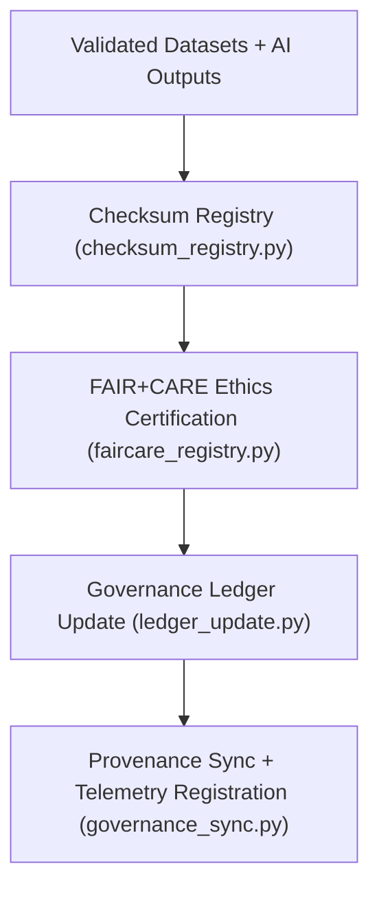

<div align="center">

# ⚖️ Kansas Frontier Matrix — **Governance Tools**
`tools/governance/README.md`

**Purpose:**  
Centralized suite of FAIR+CARE-certified **governance utilities** for managing provenance, checksum validation, ethical compliance, and ledger synchronization within the Kansas Frontier Matrix (KFM).  
These tools form the backbone of KFM’s **data transparency, reproducibility, and ethics auditing system** under MCP-DL v6.3 compliance.

[](../../../docs/standards/faircare-validation.md)
[](../../../LICENSE)
[](../../../docs/architecture/repo-focus.md)

</div>

---

## 📚 Overview

The `tools/governance/` directory contains all **governance and provenance management scripts** used to enforce FAIR+CARE, ISO, and AI ethics compliance across KFM’s datasets, AI models, and metadata workflows.  
These utilities support automated synchronization of governance records, checksum validation, and blockchain-anchored ledger updates for transparent data stewardship.

### Core Responsibilities
- Manage provenance and ledger synchronization for all validated datasets.  
- Verify data lineage through checksum and metadata consistency audits.  
- Maintain FAIR+CARE ethics registry and certification records.  
- Enable reproducible governance tracking for all project domains.  

---

## 🗂️ Directory Layout

```plaintext
tools/governance/
├── README.md                              # This file — documentation for Governance Tools
│
├── governance_sync.py                     # Synchronizes datasets and validation reports with governance ledgers
├── checksum_registry.py                   # Manages SHA-256 checksum records and manifest updates
├── ledger_update.py                       # Updates blockchain-backed governance ledgers
├── faircare_registry.py                   # Maintains FAIR+CARE ethics certification records
├── metadata_linker.py                     # Links datasets, metadata, and ledger entries for provenance validation
└── metadata.json                          # Provenance and governance linkage record
```

---

## ⚙️ Governance Workflow



### Workflow Description
1. **Checksum Registration:**  
   Confirms dataset integrity and lineage via cryptographic hashing.  
2. **FAIR+CARE Certification:**  
   Validates ethical compliance and transparency for datasets and AI outputs.  
3. **Ledger Update:**  
   Synchronizes new validation and checksum data into blockchain-backed ledgers.  
4. **Provenance Sync:**  
   Links datasets, metadata, and AI models to their governance lineage records.  
5. **Telemetry Registration:**  
   Updates Focus Mode dashboards and governance metrics automatically.

---

## 🧩 Example Governance Metadata Record

```json
{
  "id": "governance_tools_v9.5.0_2025Q4",
  "tools_executed": [
    "checksum_registry.py",
    "ledger_update.py",
    "faircare_registry.py"
  ],
  "datasets_registered": 189,
  "checksum_verified": true,
  "fairstatus": "certified",
  "ledger_hash": "sha256:a15c9f80a34e9e56b1b2d182bcf7a921a8a2a6e3...",
  "governance_registered": true,
  "telemetry_ref": "releases/v9.5.0/focus-telemetry.json",
  "governance_ref": "reports/audit/ai_governance_ledger.json",
  "created": "2025-11-02T23:59:00Z",
  "validator": "@kfm-governance"
}
```

---

## 🧠 FAIR+CARE Governance Matrix

| Principle | Implementation |
|------------|----------------|
| **Findable** | Governance records indexed via checksum, dataset ID, and ledger hash. |
| **Accessible** | All governance reports and ethics audits stored in open JSON formats. |
| **Interoperable** | Aligns with DCAT 3.0, ISO 19115 lineage, and blockchain provenance standards. |
| **Reusable** | Governance data archived for reproducibility and open validation. |
| **Collective Benefit** | Enhances public trust through transparent governance infrastructure. |
| **Authority to Control** | FAIR+CARE Council oversees all ethics and ledger update processes. |
| **Responsibility** | Validators record checksum results and governance linkage metadata. |
| **Ethics** | Ledger entries ensure accountability and open data ethics compliance. |

Audit and registry results stored in:  
`reports/audit/ai_governance_ledger.json` • `reports/fair/governance_tools_summary.json`

---

## ⚙️ Governance Tools Summary

| Tool | Function | Output |
|------|-----------|--------|
| `governance_sync.py` | Synchronizes validation results and datasets with ledgers. | Governance JSON Log |
| `checksum_registry.py` | Generates and verifies cryptographic checksums. | Checksum Manifest |
| `ledger_update.py` | Registers datasets into blockchain-based provenance ledger. | Ledger Record |
| `faircare_registry.py` | Maintains FAIR+CARE ethics certification records. | FAIR+CARE Registry |
| `metadata_linker.py` | Links datasets, metadata, and ledger entries. | Provenance Map |
| `metadata.json` | Captures lineage, checksum, and provenance linkage. | JSON Metadata |

Automation managed via `governance_tools_sync.yml`.

---

## 🧾 Retention Policy

| File Type | Retention Duration | Policy |
|------------|--------------------|--------|
| Governance Logs | 365 days | Retained for validation and ethics reviews. |
| Checksum Records | Permanent | Archived in global manifest for reproducibility. |
| FAIR+CARE Certifications | Permanent | Maintained for ethics registry and re-audit reference. |
| Ledger Records | Permanent | Stored immutably within blockchain provenance archive. |
| Metadata | Permanent | Preserved under FAIR+CARE lineage framework. |

Cleanup automated via `governance_tools_cleanup.yml`.

---

## 🧾 Internal Use Citation

```text
Kansas Frontier Matrix (2025). Governance Tools (v9.5.0).
Central FAIR+CARE-certified suite for checksum validation, ledger synchronization, and ethics registry management.
Ensures transparent, traceable, and ethical data governance under MCP-DL v6.3 compliance.
```

---

## 🧾 Version Notes

| Version | Date | Notes |
|----------|------|--------|
| v9.5.0 | 2025-11-02 | Added blockchain ledger update utilities and FAIR+CARE ethics registry synchronization. |
| v9.3.2 | 2025-10-28 | Expanded checksum validation and provenance linkage logging. |
| v9.3.0 | 2025-10-26 | Established governance tools workspace for FAIR+CARE ledger synchronization. |

---

<div align="center">

**Kansas Frontier Matrix** · *Data Integrity × FAIR+CARE Governance × Provenance Accountability*  
[🔗 Repository](https://github.com/bartytime4life/Kansas-Frontier-Matrix) • [🧭 Docs Portal](../../../docs/) • [⚖️ Governance Ledger](../../../docs/standards/governance/)

</div>