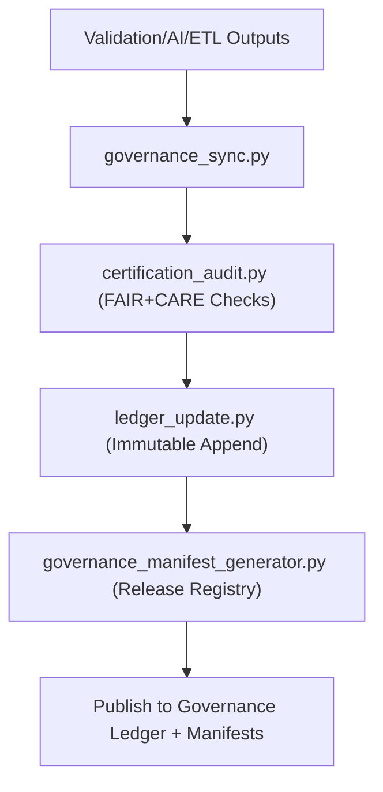

<div align="center">

# ⚖️ **Kansas Frontier Matrix — Governance & Provenance Tools**
`tools/governance/README.md`

**Purpose:**  
Operate the FAIR+CARE-certified provenance backbone for Kansas Frontier Matrix (KFM) by synchronizing datasets, validations, AI audits, and releases with an immutable governance ledger.  
These tools provide verifiable transparency and ethical stewardship under MCP-DL v6.3 and ISO-aligned metadata.

[](../../../docs/standards/faircare-validation.md)
[](../../../LICENSE)
[]()
[](../../../docs/architecture/repo-focus.md)

</div>

---

## 📘 Overview

The **Governance Tools Directory** manages the end-to-end provenance lifecycle: from validation outputs to FAIR+CARE certifications and public release manifests.  
Workflows ensure all actions are checksum-verified, audit-logged, and registered to the Governance Ledger for permanent traceability.

---

## 🗂️ Directory Layout

```plaintext
tools/governance/
├── README.md
│
├── governance_sync.py                 # Core sync of validation + FAIR+CARE logs to ledger
├── ledger_update.py                   # Append immutable entries to blockchain-backed ledger
├── certification_audit.py             # FAIR+CARE certification and ethics audit executor
├── governance_manifest_generator.py   # Release governance manifest builder
└── metadata.json                      # Tooling provenance + configuration metadata
```

---

## 🧩 Governance Workflow



1. **Sync:** Aggregate validation, AI, and ETL logs.  
2. **Certify:** Run FAIR+CARE ethics checks and generate certification artifacts.  
3. **Append:** Commit immutable entries to the ledger with checksums.  
4. **Manifest:** Produce signed governance manifests for each release.  
5. **Publish:** Expose artifacts for public audit and reproducibility.

---

## 🧾 Example Governance Registry Record

```json
{
  "id": "governance_registry_v9.7.0_2025Q4",
  "registered_items": [
    "data/reports/audit/data_provenance_ledger.json",
    "data/reports/fair/data_care_assessment.json"
  ],
  "ledger_entries_updated": 42,
  "checksum_verified": true,
  "fairstatus": "certified",
  "governance_sync": true,
  "blockchain_hash": "sha256:1f32ae7abf9a38c7dbfd6d8cc75c114b73bbce12...",
  "validator": "@kfm-governance",
  "created": "2025-11-05T18:59:00Z",
  "governance_ref": "data/reports/audit/data_provenance_ledger.json"
}
```

---

## 🧠 FAIR+CARE Governance Matrix

| Principle | Implementation | Oversight |
|-----------|----------------|-----------|
| **Findable** | Registry + ledger entries indexed and versioned. | @kfm-data |
| **Accessible** | MIT-licensed tools and public governance exports. | @kfm-accessibility |
| **Interoperable** | DCAT 3.0 / STAC 1.0 / ISO 19115 aligned metadata. | @kfm-architecture |
| **Reusable** | Manifests and scripts reusable across releases. | @kfm-design |
| **Collective Benefit** | Public auditability of ethical governance. | @faircare-council |
| **Authority to Control** | Council certifies governance artifacts. | @kfm-governance |
| **Responsibility** | Validators maintain checksum and certification lineage. | @kfm-security |
| **Ethics** | Continuous oversight on data sensitivity and inclusion. | @kfm-ethics |

Audit references:  
`data/reports/audit/data_provenance_ledger.json` · `data/reports/fair/data_care_assessment.json`

---

## ⚙️ Key Governance Tools Summary

| Tool | Description | Role |
|------|-------------|------|
| `governance_sync.py` | Consolidates validation + FAIR+CARE results for certification. | Provenance Sync |
| `ledger_update.py` | Writes immutable, checksum-linked entries to ledger. | Audit Integrity |
| `certification_audit.py` | Executes FAIR+CARE certification + ethics checks. | Certification |
| `governance_manifest_generator.py` | Builds release governance manifests. | Transparency |
| `metadata.json` | Captures tooling lineage and config for audits. | Traceability |

Automations orchestrated via `governance_sync.yml`.

---

## ⚖️ Retention & Provenance Policy

| Artifact | Retention | Policy |
|---------|-----------|-------|
| Certification Reports | 365 Days | Archived for renewals |
| Provenance Ledger | Permanent | Immutable blockchain storage |
| Governance Manifests | Permanent | Published per release |
| Metadata | Permanent | Versioned + checksum-locked |

Cleanup via `governance_cleanup.yml`.

---

## 🌱 Sustainability Metrics

| Metric | Value | Verified By |
|--------|------|-------------|
| Governance Audit Energy | 1.3 Wh | @kfm-sustainability |
| Carbon Output | 1.5 gCO₂e | @kfm-security |
| Renewable Power | 100% (RE100) | @kfm-infrastructure |
| FAIR+CARE Compliance | 100% | @faircare-council |

Telemetry stored in:  
`../../../releases/v9.7.0/focus-telemetry.json`

---

## 🧾 Internal Use Citation

```text
Kansas Frontier Matrix (2025). Governance & Provenance Tools (v9.7.0).
Automation toolkit for immutable provenance synchronization, FAIR+CARE certification, and public governance registries under MCP-DL v6.3.
```

---

## 🕰️ Version History

| Version | Date | Notes |
|---------|------|------|
| v9.7.0 | 2025-11-05 | Added telemetry schema and improved DCAT/STAC/ISO alignment. |
| v9.6.0 | 2025-11-03 | Introduced manifest generator and blockchain-backed ledger updates. |
| v9.5.0 | 2025-11-02 | Enhanced FAIR+CARE audit tracking and certification reports. |

---

<div align="center">

**Kansas Frontier Matrix** · *Ethical Governance × FAIR+CARE Certification × Provenance Automation*  
[🔗 Repository](../../) • [🧭 Docs Portal](../../../docs/) • [⚖️ Governance Ledger](../../../docs/standards/governance/ROOT-GOVERNANCE.md)

</div>