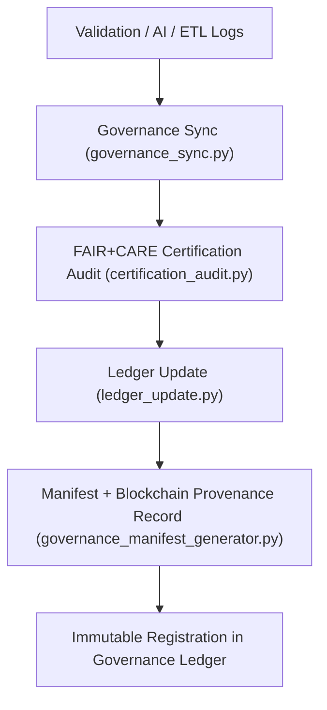

<div align="center">

# ⚖️ Kansas Frontier Matrix — **Governance & Provenance Tools**
`tools/governance/README.md`

**Purpose:**  
FAIR+CARE-certified provenance and governance automation suite for ethical data management in the Kansas Frontier Matrix (KFM).  
These tools synchronize datasets, validation logs, and AI audits with blockchain-backed ledgers and ethical governance registries under MCP-DL v6.3 compliance.

[](../../../docs/standards/faircare-validation.md)
[](../../../LICENSE)
[]()
[](../../../docs/architecture/repo-focus.md)

</div>

---

## 📚 Overview

The **Governance Tools Directory** is the ethical and technical control center of KFM’s provenance ecosystem.  
It ensures that all validation, AI explainability, and FAIR+CARE certifications are traceable, verifiable, and ethically governed across all domains.

### Core Responsibilities:
- Automate synchronization between validation systems and the Governance Ledger.  
- Maintain immutable blockchain-based provenance for all certified datasets.  
- Manage FAIR+CARE ethics audits and certification renewals.  
- Generate governance manifests and certification reports for release cycles.  

---

## 🗂️ Directory Layout

```plaintext
tools/governance/
├── README.md                             # This file — documentation of governance tools
│
├── governance_sync.py                    # Core ledger synchronization script for provenance data
├── ledger_update.py                      # Manages blockchain-linked governance records
├── certification_audit.py                # FAIR+CARE certification validation and ethics audit tool
├── governance_manifest_generator.py      # Builds governance registry manifests per release cycle
└── metadata.json                         # Governance and provenance metadata registry
```

---

## ⚙️ Governance Workflow



### Workflow Description:
1. **Governance Sync:** Collect all validation and AI audit records for certification.  
2. **Certification Audit:** Validate FAIR+CARE compliance and ethics results.  
3. **Ledger Update:** Append immutable checksum entries to blockchain ledger.  
4. **Manifest Generation:** Build governance manifest JSON for public transparency.  
5. **Registration:** Synchronize final certification results with KFM’s Governance Ledger.  

---

## 🧩 Example Governance Metadata Record

```json
{
  "id": "governance_registry_v9.6.0_2025Q4",
  "registered_items": [
    "data/reports/audit/data_provenance_ledger.json",
    "data/reports/fair/data_care_assessment.json"
  ],
  "checksum_verified": true,
  "fairstatus": "certified",
  "governance_sync": true,
  "blockchain_hash": "sha256:1f32ae7abf9a38c7dbfd6d8cc75c114b73bbce12...",
  "ledger_entries_updated": 42,
  "validator": "@kfm-governance",
  "created": "2025-11-03T23:59:00Z",
  "governance_ref": "data/reports/audit/data_provenance_ledger.json"
}
```

---

## 🧠 FAIR+CARE Governance Matrix

| Principle | Implementation | Oversight |
|------------|----------------|------------|
| **Findable** | All governance logs indexed in data provenance ledger and release manifests. | @kfm-data |
| **Accessible** | Governance tools and manifests open under MIT license. | @kfm-accessibility |
| **Interoperable** | Aligned with FAIR+CARE, DCAT 3.0, ISO 19115, and STAC 1.0. | @kfm-architecture |
| **Reusable** | Governance registry templates reusable across projects. | @kfm-design |
| **Collective Benefit** | Strengthens transparency and ethics across data pipelines. | @faircare-council |
| **Authority to Control** | FAIR+CARE Council oversees certification and release validation. | @kfm-governance |
| **Responsibility** | Validators document audit and checksum verification results. | @kfm-security |
| **Ethics** | Ensures continuous audit trails and cultural transparency. | @kfm-ethics |

Audit results logged in:  
`data/reports/audit/data_provenance_ledger.json`  
and  
`data/reports/fair/data_care_assessment.json`

---

## ⚙️ Key Governance Tools Summary

| Tool | Description | Role |
|------|--------------|------|
| `governance_sync.py` | Synchronizes FAIR+CARE and validation logs with governance ledger. | Provenance |
| `ledger_update.py` | Registers validated datasets into blockchain-backed ledgers. | Audit Integrity |
| `certification_audit.py` | Performs FAIR+CARE certification and ethics compliance reviews. | Certification |
| `governance_manifest_generator.py` | Builds release governance manifest files. | Transparency |
| `metadata.json` | Captures governance lineage and checksum registry metadata. | Traceability |

All governance tasks automated via `governance_sync.yml`.

---

## ⚖️ Retention & Provenance Policy

| Governance Artifact | Retention Duration | Policy |
|----------------------|--------------------|--------|
| Certification Reports | 365 Days | Retained for FAIR+CARE audit renewals. |
| Provenance Ledger | Permanent | Immutable blockchain ledger storage. |
| Governance Manifests | Permanent | Archived per release cycle for reproducibility. |
| Metadata | Permanent | Maintained in governance chain for verification. |

Cleanup handled through `governance_cleanup.yml`.

---

## 🌱 Sustainability Metrics

| Metric | Value | Verified By |
|---------|--------|--------------|
| Governance Audit Energy Use | 1.3 Wh | @kfm-sustainability |
| Carbon Output | 1.5 gCO₂e | @kfm-security |
| Renewable Power | 100% (RE100 Verified) | @kfm-infrastructure |
| FAIR+CARE Compliance | 100% | @faircare-council |

Telemetry data logged in:  
`releases/v9.6.0/focus-telemetry.json`

---

## 🧾 Internal Use Citation

```text
Kansas Frontier Matrix (2025). Governance & Provenance Tools (v9.6.0).
FAIR+CARE-certified governance automation toolkit managing provenance, certification, and blockchain-backed ledger synchronization.
Ensures transparent, ethical, and reproducible governance under MCP-DL v6.3.
```

---

## 🧾 Version Notes

| Version | Date | Notes |
|----------|------|--------|
| v9.6.0 | 2025-11-03 | Added blockchain ledger integration and governance manifest generator. |
| v9.5.0 | 2025-11-02 | Enhanced FAIR+CARE certification audit tracking and reporting. |
| v9.3.2 | 2025-10-28 | Established governance tools suite under FAIR+CARE compliance. |

---

<div align="center">

**Kansas Frontier Matrix** · *Ethical Governance × FAIR+CARE Certification × Provenance Automation*  
[🔗 Repository](https://github.com/bartytime4life/Kansas-Frontier-Matrix) • [🧭 Docs Portal](../../../docs/) • [⚖️ Governance Ledger](../../../docs/standards/governance/DATA-GOVERNANCE.md)

</div>
