<div align="center">

# ⚖️ **Kansas Frontier Matrix — Governance & Provenance Tools (v11)**  
`tools/governance/README.md`

**Purpose**  
Define the **v11 governance and provenance tooling architecture** for KFM.  
These tools maintain the **immutable, ethics-governed provenance backbone** of the Kansas Frontier Matrix —  
synchronizing datasets, validations, AI audits, and releases with FAIR+CARE-led governance ledgers,  
ensuring verifiable transparency, signed traceability, and sustainability accountability under  
**MCP-DL v6.3**, **DCAT 3.0 / ISO 19115**, **SLSA/SPDX**, and **Diamond⁹ Ω / Crown∞Ω** standards.

[]() ·
[]() ·
[]() ·
[]()

</div>

---

## 📘 1. Overview

The **Governance Tools** module is KFM’s **provenance engine**. It:

- Aggregates validation, FAIR+CARE, and AI audit results  
- Writes **append-only, signed ledger entries** capturing provenance and certification state  
- Produces **governance manifests** for releases, linked to SBOMs and manifest bundles  
- Populates the **governance ledger** used by the FAIR+CARE Council and auditors  
- Attaches **sustainability telemetry** (energy, carbon) to governance events  
- Enforces **CARE and sovereignty policies** at the tools-platform level  

These tools run in:

- CI/CD pipelines  
- Release workflows  
- Governance review cycles  
- Backfill/repair jobs for provenance gaps  

---

## 🗂️ 2. Directory Layout (Emoji Style A)

```text
tools/governance/
├── 📄 README.md                        # This file — overview & usage
│
├── 🔄 governance_sync.py               # Aggregate logs + validation outputs → governance staging
├── 📒 ledger_update.py                 # Append immutable, signed entries to ledgers
├── ✅ certification_audit.py           # FAIR+CARE + ethics certification checker
├── 📦 governance_manifest_generator.py # Build signed governance manifest per release
└── 📑 metadata.json                    # JSON-LD configuration & provenance metadata
```

> ✅ Note: `checksum_audit.py` is **not** in this directory.  
> Checksum lineage is validated via `tools/validation/checksum_audit.py` and linked here via governance manifests.

---

## 🧬 3. Position in Tools Platform

Context relative to other tools:

```text
tools/cli
   ↓
tools/validation
   ↓
tools/governance
   ↓
tools/telemetry
   ↓
tools/ai
   ↓
Release Artifacts
(STAC/DCAT · Ledgers · Telemetry · SBOM · Manifests)
```

The governance tools sit at the **center** of:

- Validation results  
- AI assurance outcomes  
- Telemetry & sustainability data  
- Release manifests & SBOMs  

All governance workflows must route through this **controlled, auditable toolkit**.

---

## ⚙️ 4. Governance Workflow (v11 · Mermaid Safe)

```mermaid
flowchart TD
    A["Validation / AI / ETL Outputs\n(Reports · Telemetry · Contracts)"]
      --> B["🔄 governance_sync.py\nAggregate & Normalize Logs"]
    B --> C["✅ certification_audit.py\nFAIR+CARE · Ethics · Sovereignty"]
    C --> D["📒 ledger_update.py\nSigned Append-Only Governance Ledger"]
    D --> E["📦 governance_manifest_generator.py\nRelease Governance Manifest"]
    E --> F["📊 Publication\n(Manifests · Ledgers · Dashboards)"]
```



### 4.1 `governance_sync.py`

- Inputs:
  - `data/reports/self-validation/**`  
  - `data/reports/fair/**`  
  - `data/reports/audit/**`  
  - `releases/*/focus-telemetry.json`  

- Outputs:
  - A **staging bundle** containing normalized governance signals.

### 4.2 `certification_audit.py`

- Evaluates:
  - FAIR+CARE criteria  
  - Ethics & A11y checklists  
  - Sovereignty and license constraints  

- Produces:
  - `certification_status` (`"certified"`, `"provisional"`, `"blocked"`)  
  - Detailed reasons (for governance transparency)  

### 4.3 `ledger_update.py`

- Writes **append-only** entries into:
  - `data/reports/audit/data_provenance_ledger.json`  
  - `data/reports/audit/archive_integrity_log.json`  

- Records:
  - `prov:Activity` (audit run, decision event)  
  - `prov:used` (all reports & inputs)  
  - `prov:generated` (governance records, manifests)  
  - `prov:wasAssociatedWith` (user/service account)  

### 4.4 `governance_manifest_generator.py`

- Produces a **governance manifest** for each release that bundles:

  - STAC/DCAT governance slices  
  - Ledger excerpts (data + AI)  
  - FAIR+CARE summaries  
  - Telemetry slices (energy/carbon, validation run metrics)  

- The manifest is referenced from:
  - `manifest_ref`  
  - `sbom_ref`  
  - Governance dashboards  

---

## 🧾 5. Example Governance Ledger Record (v11)

```json
{
  "governance_id": "kfm_gov_record_2025Q4_042",
  "entity_type": "dataset",
  "dataset_id": "processed_hazards_v11.0.0",
  "stac_item": "data/stac/items/hazards_v11_2025Q4.json",
  "dcat_dataset": "urn:kfm:data:processed:hazards:v11",
  "certification_status": "certified",
  "faircare": {
    "fair_score": 97,
    "care_score": 100,
    "decision": "approved",
    "reviewers": ["@kfm-governance", "@faircare-council"],
    "decision_at": "2025-11-24T20:14:33Z"
  },
  "integrity": {
    "sha256": "sha256-f5a3e28d94e4b721b03c1f8d9236d6b4a88efab9deadbeef...",
    "manifest": "releases/v11.0.0/manifest.zip",
    "sbom": "releases/v11.0.0/sbom.spdx.json",
    "checksum_verified": true
  },
  "sustainability": {
    "energy_wh": 4.3,
    "carbon_gco2e": 5.9
  },
  "prov:wasAssociatedWith": "@kfm-governance-bot",
  "prov:generatedAtTime": "2025-11-24T20:14:34Z",
  "governance_ref": "data/reports/audit/data_provenance_ledger.json",
  "notes": "Meets hazard data publication criteria; no PII; H3 masking not required."
}
```

---

## 🧠 6. FAIR+CARE Governance Matrix for Tools

| Principle             | Implementation in `tools/governance`                                 | Oversight            |
|-----------------------|-----------------------------------------------------------------------|----------------------|
| **Findable**          | IDs + JSON-LD + DCAT linking spectral governance artifacts           | @kfm-data            |
| **Accessible**        | MIT-licensed tools; structured JSON outputs for dashboards           | @kfm-accessibility   |
| **Interoperable**     | Uses DCAT 3.0, PROV-O, STAC 1.x, JSON-LD for governance metadata     | @kfm-architecture    |
| **Reusable**          | Versioned tools; deterministic log formats; hash-based linking       | @kfm-design          |
| **Collective Benefit**| Public governance transparency supports community and stakeholders   | @faircare-council    |
| **Authority to Control** | Council defines classification & publication rules                | @kfm-governance      |
| **Responsibility**    | Telemetry & ledgers document who did what, when, and why             | @kfm-security        |
| **Ethics**            | Ethics & sovereignty policies integrated into certification audits    | @kfm-ethics          |

---

## 🧰 7. Governance Tools Summary

| Tool                           | Purpose                                                     | Primary Consumers      |
|--------------------------------|-------------------------------------------------------------|------------------------|
| `governance_sync.py`           | Collect + normalize validation & telemetry into bundles     | CI/CD, Governance jobs |
| `ledger_update.py`             | Append signed governance/provenance entries                | Governance ledgers     |
| `certification_audit.py`       | Run FAIR+CARE/ethics/A11y checks for datasets/models       | FAIR+CARE Council      |
| `governance_manifest_generator.py` | Build governance manifest for each release             | Release pipelines      |
| `metadata.json`                | Configure JSON-LD contexts and PROV/DCAT mappings          | All of the above       |

---

## 🧬 8. Security, Privacy & Sovereignty

Governance tools must:

- Not leak secrets or internal-only identifiers.  
- Use H3 generalization & CARE labels to **describe**, not expose, sensitive site-level details.  
- Honor sovereignty policies when referencing Indigenous-related datasets.  
- Avoid including raw PII in governance logs; only refer to dataset IDs and hashed forms.  

Security scans in CI must include:

- `tools/governance/**` for static analysis  
- Dependency checking for governance-related libraries  

---

## 🗃 9. Retention & Rotation

| Artifact Type           | Retention  | Notes                                        |
|-------------------------|-----------:|----------------------------------------------|
| Governance Ledger       | Permanent  | Canonical provenance; append-only            |
| Governance Manifests    | Permanent  | Release-level governance view                |
| Governance Staging Bundles | ≥ 1 year | Rotated once fully manifested and archived   |

Rotation is handled by CI jobs (e.g. `governance_cleanup.yml`) that:

- Archive old staging bundles  
- Preserve only the canonical ledger + manifests in active paths  

---

## 🕰 10. Version History

| Version | Date       | Summary                                                                                                     |
|--------:|-----------:|-------------------------------------------------------------------------------------------------------------|
| v11.2.2 | 2025-11-27 | Updated to KFM-MDP v11.2.2; emoji layout applied; clarified tool roles; deepened FAIR+CARE & sustainability integration. |
| v11.0.0 | 2025-11-24 | v11 governance platform alignment; removed checksum audit from this dir; anchored checksum to validation tools.      |
| v10.2.2 | 2025-11-12 | JSON-LD exports, STAC/DCAT parity, signed ledger entries, integration with telemetry.                       |
| v10.0.0 | 2025-11-10 | Initial governance tools documentation; described ledger mechanics and certification flows.                 |

---

<div align="center">

© 2025 Kansas Frontier Matrix — MIT License  
**Governance & Provenance Tools v11**  
FAIR+CARE Certified · MCP-DL v6.3 · KFM-MDP v11.2.2 · Diamond⁹ Ω / Crown∞Ω  

[⬅️ Back to Tools Index](../README.md) · [🧱 Tools Architecture](../ARCHITECTURE.md) · [🛡 Governance Charter](../../../docs/standards/governance/ROOT-GOVERNANCE.md)

</div>