<div align="center">

# ⚖️ **Kansas Frontier Matrix — Governance & Provenance Tools**  
`tools/governance/README.md`

**Purpose:**  
Operate the FAIR+CARE-certified provenance backbone of the Kansas Frontier Matrix (KFM) by synchronizing datasets, validations, AI audits, and releases with an immutable governance ledger.  
These tools guarantee verifiable transparency, ethical compliance, and blockchain-backed traceability under **MCP-DL v6.3** and **ISO 19115 / DCAT 3.0** frameworks.

[](../../../docs/standards/faircare-validation.md)
[](../../../LICENSE)
[]()
[](../../../docs/architecture/repo-focus.md)

</div>

---

## 📘 Overview

The **Governance Tools Directory** manages the complete lifecycle of provenance, certification, and validation records in KFM.  
All actions — from checksum verification to FAIR+CARE certification — are logged immutably within the **Governance Ledger**, ensuring transparent, auditable, and sustainable stewardship of Kansas Frontier Matrix datasets.

---

## 🗂️ Directory Layout

```plaintext
tools/governance/
├── README.md
│
├── governance_sync.py                 # Core sync of validation + FAIR+CARE results to ledger
├── ledger_update.py                   # Append immutable entries to blockchain-backed ledger
├── certification_audit.py             # FAIR+CARE certification and ethics auditing executor
├── governance_manifest_generator.py   # Release governance manifest builder
└── metadata.json                      # Tool provenance, configuration, and lineage metadata
```

---

## ⚙️ Governance Workflow

```mermaid
flowchart TD
    A["Validation / AI / ETL Outputs"] --> B["governance_sync.py (Aggregate Logs)"]
    B --> C["certification_audit.py (FAIR+CARE Ethics Checks)"]
    C --> D["ledger_update.py (Immutable Append to Ledger)"]
    D --> E["governance_manifest_generator.py (Build Manifest)"]
    E --> F["Public Release · Governance Ledger Publication"]
```



1. **Sync:** Aggregate validation, FAIR+CARE, and AI audit logs.  
2. **Certify:** Execute ethics + accessibility audits and certification routines.  
3. **Ledger Update:** Append immutable entries with hash validation.  
4. **Manifest Build:** Generate governance manifests for official releases.  
5. **Publish:** Expose signed provenance for public verification and reproducibility.

---

## 🧾 Example Governance Registry Record

```json
{
  "id": "governance_registry_v10.0.0_2025Q4",
  "registered_items": [
    "data/reports/audit/data_provenance_ledger.json",
    "data/reports/fair/data_care_assessment.json"
  ],
  "ledger_entries_updated": 56,
  "checksum_verified": true,
  "fairstatus": "certified",
  "governance_sync": true,
  "blockchain_hash": "sha256:6f31b5adcb78f0a3d9e91d882c4dcd6e0e7a1fa3...",
  "validator": "@kfm-governance",
  "created": "2025-11-10T18:59:00Z",
  "governance_ref": "data/reports/audit/data_provenance_ledger.json"
}
```

---

## 🧠 FAIR+CARE Governance Matrix

| Principle | Implementation | Oversight |
|-----------|----------------|-----------|
| **Findable** | Governance artifacts indexed in ledger and manifests. | @kfm-data |
| **Accessible** | MIT-licensed source and governance exports. | @kfm-accessibility |
| **Interoperable** | Conforms to DCAT 3.0, STAC 1.0, and ISO 19115. | @kfm-architecture |
| **Reusable** | Scripts and manifests versioned for reuse. | @kfm-design |
| **Collective Benefit** | Public auditability strengthens ethical governance. | @faircare-council |
| **Authority to Control** | Council validates and certifies governance artifacts. | @kfm-governance |
| **Responsibility** | Validators maintain checksum and audit continuity. | @kfm-security |
| **Ethics** | Sensitive data filtered, ethical provenance enforced. | @kfm-ethics |

References:  
`data/reports/audit/data_provenance_ledger.json` · `data/reports/fair/data_care_assessment.json`

---

## ⚙️ Key Governance Tools Summary

| Tool | Description | Role |
|------|-------------|------|
| `governance_sync.py` | Consolidates validation and FAIR+CARE logs for certification. | Provenance Sync |
| `ledger_update.py` | Commits immutable, checksum-linked entries to the ledger. | Integrity |
| `certification_audit.py` | Executes FAIR+CARE certification and ethics validation. | Certification |
| `governance_manifest_generator.py` | Builds signed release governance manifests. | Transparency |
| `metadata.json` | Captures tooling lineage and audit metadata. | Traceability |

Automations coordinated via `governance_sync.yml`.

---

## ⚖️ Retention & Provenance Policy

| Artifact | Retention | Policy |
|-----------|-----------|--------|
| Certification Reports | 365 Days | Archived for re-certification |
| Provenance Ledger | Permanent | Immutable blockchain-based storage |
| Governance Manifests | Permanent | Published with each release |
| Metadata | Permanent | Versioned + checksum-secured |

Cleanup managed via `governance_cleanup.yml`.

---

## 🌱 Sustainability Metrics

| Metric | Value | Verified By |
|---------|--------|--------------|
| Governance Audit Energy | 1.2 Wh | @kfm-sustainability |
| Carbon Output | 1.4 gCO₂e | @kfm-security |
| Renewable Power | 100% (RE100 Certified) | @kfm-infrastructure |
| FAIR+CARE Compliance | 100% | @faircare-council |

Telemetry data logged in:  
`../../../releases/v10.0.0/focus-telemetry.json`

---

## 🧾 Citation

```text
Kansas Frontier Matrix (2025). Governance & Provenance Tools (v10.0.0).
Immutable provenance and FAIR+CARE certification toolkit enabling verifiable data lineage and ethical automation under MCP-DL v6.3.
```

---

## 🕰️ Version History

| Version | Date | Notes |
|----------|------|-------|
| v10.0.0 | 2025-11-10 | Upgraded to telemetry schema v2; enhanced blockchain ledger logic + FAIR+CARE certification transparency. |
| v9.7.0 | 2025-11-05 | Added telemetry schema and improved DCAT/STAC/ISO alignment. |
| v9.6.0 | 2025-11-03 | Introduced manifest generator and blockchain-backed ledger automation. |
| v9.5.0 | 2025-11-02 | Enhanced FAIR+CARE audit tracking and certification governance. |

---

<div align="center">

**Kansas Frontier Matrix**  
*Ethical Governance × FAIR+CARE Certification × Provenance Automation*  
© 2025 Kansas Frontier Matrix — MIT License  

[Back to Tools Index](../README.md) · [Governance Charter](../../../docs/standards/governance/ROOT-GOVERNANCE.md)

</div>
