<div align="center">

# ⚖️ **Kansas Frontier Matrix — Governance & Provenance Tools**  
`tools/governance/README.md`

**Purpose:**  
Operate the FAIR+CARE-certified provenance backbone of the Kansas Frontier Matrix (KFM) by synchronizing datasets, validations, AI audits, and releases with an immutable governance ledger.  
These tools guarantee verifiable transparency, ethical compliance, and signed traceability under **MCP-DL v6.3**, **DCAT 3.0 / ISO 19115**, and **SLSA/SPDX** frameworks.

[](../../../docs/standards/faircare.md)
[](../../../LICENSE)
[](../../../docs/README.md)
[]()

</div>

---

## 📘 Overview

The **Governance Tools Directory** manages the complete lifecycle of provenance, certification, and validation records in KFM.  
All actions — from checksum verification to FAIR+CARE certification — are logged immutably within the **Governance Ledger**, ensuring transparent, auditable, and sustainable stewardship.

**v10.2.2 Enhancements**
- JSON-LD contexts on all governance exports for one-hop linkage to catalogs and citations.  
- Stronger parity checks between **STAC/DCAT** and governance manifests.  
- Signed ledger entries referenced by **SPDX SBOM** and release **manifest.zip**.  
- Energy/CO₂e metrics appended to governance events (ISO 50001/14064 telemetry).

---

## 🗂️ Directory Layout

```plaintext
tools/governance/
├── README.md
│
├── governance_sync.py                 # Aggregate validation/FAIR+CARE/AI logs → staging
├── ledger_update.py                   # Append immutable, signed entries to ledger
├── certification_audit.py             # FAIR+CARE certification + ethics/a11y checks
├── governance_manifest_generator.py   # Build signed release governance manifest
└── metadata.json                      # Tool provenance + configuration (JSON-LD)
```

---

## ⚙️ Governance Workflow

```mermaid
flowchart TD
    A["Validation / AI / ETL Outputs"] --> B["governance_sync.py (Aggregate Logs)"]
    B --> C["certification_audit.py (FAIR+CARE Ethics Checks)"]
    C --> D["ledger_update.py (Signed Immutable Append)"]
    D --> E["governance_manifest_generator.py (Build Manifest)"]
    E --> F["Public Release · Governance Ledger Publication"]
```



1. **Sync** — Aggregate validation, FAIR+CARE, and AI audit logs.  
2. **Certify** — Execute ethics + accessibility audits and certification routines.  
3. **Ledger Update** — Append immutable entries with SHA-256, timestamp, and signer.  
4. **Manifest Build** — Generate signed governance manifests for releases.  
5. **Publish** — Expose provenance for public verification and reproducibility.

---

## 🧾 Example Governance Registry Record

```json
{
  "@context": "https://schema.org/",
  "@type": "Dataset",
  "id": "governance_registry_v10.2.2_2025Q4",
  "registered_items": [
    "docs/reports/audit/data_provenance_ledger.json",
    "docs/reports/fair/data_care_assessment.json"
  ],
  "ledger_entries_updated": 84,
  "checksum_verified": true,
  "fairstatus": "certified",
  "governance_sync": true,
  "signing_fingerprint": "SHA256:6f31b5adcb78f0a3d9e91d882c4dcd6e0e7a1fa3",
  "validator": "@kfm-governance",
  "created": "2025-11-12T18:59:00Z",
  "governance_ref": "docs/reports/audit/data_provenance_ledger.json"
}
```

---

## 🧠 FAIR+CARE Governance Matrix

| Principle | Implementation | Oversight |
|-----------|----------------|-----------|
| **Findable** | Governance artifacts indexed in ledgers & manifests; JSON-LD export. | @kfm-data |
| **Accessible** | MIT-licensed sources; human & machine-readable records. | @kfm-accessibility |
| **Interoperable** | Conforms to **DCAT 3.0**, **STAC 1.0**, **ISO 19115**; SPDX links. | @kfm-architecture |
| **Reusable** | Versioned scripts & signed manifests; pinned deps. | @kfm-design |
| **Collective Benefit** | Public auditability strengthens trust in civic science. | @faircare-council |
| **Authority to Control** | Council certifies governance artifacts and release criteria. | @kfm-governance |
| **Responsibility** | Validators preserve checksums and audit continuity. | @kfm-security |
| **Ethics** | Sensitive content filtered; consent and context enforced. | @kfm-ethics |

**References:**  
`docs/reports/audit/data_provenance_ledger.json` · `docs/reports/fair/data_care_assessment.json`

---

## 🧰 Key Governance Tools Summary

| Tool | Description | Role |
|------|-------------|------|
| `governance_sync.py` | Consolidates validation and FAIR+CARE logs for certification. | Provenance Sync |
| `ledger_update.py` | Commits immutable, signed entries to the ledger. | Integrity |
| `certification_audit.py` | Executes FAIR+CARE certification and ethics validation. | Certification |
| `governance_manifest_generator.py` | Builds signed release governance manifests. | Transparency |
| `metadata.json` | Captures tooling lineage and audit metadata (JSON-LD). | Traceability |

Automations coordinated via **`governance_sync.yml`**.

---

## ⚖️ Retention & Provenance Policy

| Artifact | Retention | Policy |
|-----------|-----------:|-------|
| Certification Reports | 365 days | Archived for re-certification |
| Provenance Ledger | Permanent | Append-only, signed JSON-LD |
| Governance Manifests | Permanent | Published with each release |
| Metadata | Permanent | Versioned + checksum-secured |

Cleanup handled via **`governance_cleanup.yml`**.

---

## 🌱 Sustainability Metrics

| Metric | Target | Verified By |
|---------|-------:|-------------|
| Governance Audit Energy | ≤ 1.2 Wh | Telemetry hooks |
| Carbon Output | ≤ 1.4 gCO₂e | Telemetry hooks |
| Renewable Power | 100% (RE100) | Infra audit |
| FAIR+CARE Compliance | 100% | `certification_audit.py` |

Telemetry stored in:  
`../../../releases/v10.2.0/focus-telemetry.json`

---

## 🧾 Citation

```text
Kansas Frontier Matrix (2025). Governance & Provenance Tools (v10.2.2).
Immutable provenance and FAIR+CARE certification toolkit enabling verifiable data lineage and ethical automation under MCP-DL v6.3, DCAT/ISO 19115, and SLSA/SPDX.
```

---

## 🕰️ Version History

| Version | Date | Notes |
|----------|------|-------|
| v10.2.2 | 2025-11-12 | Aligned to v10.2: JSON-LD exports, signed ledger entries, STAC/DCAT parity checks, energy/CO₂e telemetry. |
| v10.0.0 | 2025-11-10 | Telemetry schema v2; enhanced ledger logic; clearer certification outputs. |
| v9.7.0 | 2025-11-05 | Added telemetry schema and improved DCAT/STAC/ISO alignment. |
| v9.6.0 | 2025-11-03 | Introduced manifest generator and ledger automation. |
| v9.5.0 | 2025-11-02 | Enhanced FAIR+CARE audit tracking and certification governance. |

---

<div align="center">

**Kansas Frontier Matrix**  
*Ethical Governance × FAIR+CARE Certification × Provenance Automation*  
© 2025 Kansas Frontier Matrix — MIT License  

[Back to Tools Index](../README.md) · [Governance Charter](../../../docs/standards/governance/ROOT-GOVERNANCE.md)

</div>