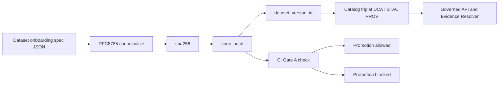

<!-- [KFM_META_BLOCK_V2]
doc_id: kfm://doc/4d4b83f1-3b5c-4d50-8c68-6b4ef0ad3fbf
title: tools/hash — Spec hashing + digest tooling
type: standard
version: v1
status: draft
owners: kfm-maintainers (TODO: set real owners)
created: 2026-02-26
updated: 2026-02-26
policy_label: public
related:
  - kfm://concept/spec_hash
  - kfm://contract/promotion-gates
tags: [kfm]
notes:
  - This README documents the hashing invariants used for DatasetVersion identity and artifact digests.
[/KFM_META_BLOCK_V2] -->

# tools/hash — spec_hash + digest tooling
Governed hashing utilities for **deterministic identity** (DatasetVersion `spec_hash`) and **content digests** (artifacts/bundles).

**Status:** `draft` • **Owners:** `kfm-maintainers (TODO)` • **Policy:** `public`  
**Badges (TODO):** `CI: required` · `SpecHash: RFC8785+sha256` · `PromotionGate: A`

---

## Quick nav
- [What this is](#what-this-is)
- [Contracts (non-negotiable)](#contracts-non-negotiable)
- [How spec_hash works](#how-spec_hash-works)
- [Directory layout](#directory-layout)
- [Usage](#usage)
- [Hash drift prevention](#hash-drift-prevention)
- [What must NOT go here](#what-must-not-go-here)
- [Repo reality checks (unknowns)](#repo-reality-checks-unknowns)

---

## What this is
KFM treats identity as infrastructure: **without stable identity, you cannot cache, cite, or reproduce**.

This folder provides tooling to:
- Compute a stable `spec_hash` from a canonical dataset spec.
- Verify that stored `spec_hash` values **do not drift** (CI gate).
- Enforce/standardize digest conventions (sha256) for artifacts and bundles.

---

## Contracts (non-negotiable)
These are the behaviors CI should enforce. If any are broken, promotion should fail closed.

1) **Promotion Gate A (Identity + Versioning)**
- Dataset ID is stable.
- DatasetVersion ID is **immutable** and derived from a stable `spec_hash`.

2) **Canonical spec is the source of truth for spec_hash**
A DatasetVersion is derived from a canonical specification document that includes:
- upstream source config (endpoints, parameters)
- normalization rules
- validation rules
- output artifact plan
- policy label intent
- cadence

3) **sha256 everywhere**
- `sha256` is mandatory for artifacts and bundles.
- `spec_hash` uses sha256 too.
- Algorithm name stays embedded in IDs (e.g., `sha256:<hex>`) to support future migrations.

---

## How spec_hash works
### Definition
`spec_hash` is a deterministic hash derived from the canonical dataset spec; it identifies DatasetVersions.

### Required algorithm
```
spec_hash = sha256( RFC8785_canonical_json(spec) )
```

Key rule: **do not hash “pretty printed” JSON**. Always canonicalize first.

### Why RFC 8785?
RFC 8785 canonical JSON removes variability in whitespace, key order, and number formatting so the same spec produces the same hash across platforms.

---

## Diagram (identity + gates)


---

## Directory layout
> This is the **recommended** shape. Verify against the actual repo and update this list.

```text
tools/hash/
  README.md              # this document
  check_spec_hash.js      # CI gate: recompute spec_hash and fail if drift
  # (optional) lib/       # shared canonicalization + hashing helpers
  # (optional) fixtures/  # golden test vectors for canonicalization + hashing
```

---

## Usage
### CI (required)
The pipeline should run a spec-hash drift check as part of promotion gates:

```bash
node tools/hash/check_spec_hash.js
```

### Local workflows (typical)
> Interface below is **PROPOSED** (adjust to match actual script flags).

1) Recompute a hash from a spec file:
```bash
node tools/hash/check_spec_hash.js --spec data/catalog/<dataset>/spec.json
```

2) Assert an expected hash (useful for PR review):
```bash
node tools/hash/check_spec_hash.js --spec data/catalog/<dataset>/spec.json --expect sha256:<hex>
```

3) Print canonical JSON (debugging canonicalization issues):
```bash
node tools/hash/check_spec_hash.js --spec data/catalog/<dataset>/spec.json --print-canonical
```

---

## Hash drift prevention
Drift is a governance failure: it breaks caching, citations, and reproducibility.

**Checklist (must enforce):**
- Store the canonical spec used for hashing next to the computed `spec_hash`.
- Unit-test that recomputing `spec_hash` from the stored spec yields the same value.
- Treat `spec_hash` changes as **breaking changes that require review** (“what changed in the spec?”).
- Never compute `spec_hash` from data that depends on system clocks, random seeds, or nondeterministic ordering.

> Determinism is a feature, not overhead.

---

## What must NOT go here
This folder is narrowly scoped.

**Out of scope / exclusions**
- Password hashing, credential storage, key derivation, or auth-related hashing.
- “Fast” hashes for performance tricks (ad-hoc caching keys, etc.) that aren’t part of the governed identity/digest contracts.
- Hashing of nondeterministic inputs (timestamps, unordered maps without canonicalization, randomized transforms).
- Introducing new algorithms without an explicit migration plan and ID-scheme support.

---

## Repo reality checks (unknowns)
Because this README can be generated before code lands, **verify**:
- That `tools/hash/check_spec_hash.js` exists and its CLI flags match the examples above.
- Where canonical dataset specs live (paths and naming).
- How `dataset_version_id` is formatted from `spec_hash` in your implementation.

If any mismatch is found, update this README to reflect the repo truth.

---

[Back to top](#tools-hash--spec_hash--digest-tooling)
