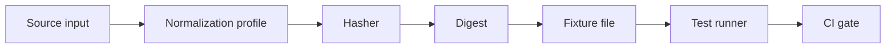

<!-- [KFM_META_BLOCK_V2]
doc_id: kfm://doc/6bca01e1-c7e6-4c65-9dcb-1d8b1a9107da
title: tools/hash/fixtures — Hash Fixtures
type: standard
version: v1
status: draft
owners: TODO
created: 2026-02-26
updated: 2026-02-26
policy_label: public
related:
  - tools/hash/
tags: [kfm, hash, fixtures, test-vectors, determinism]
notes:
  - Golden test vectors for deterministic hashing & canonicalization.
  - Keep fixtures small and non-sensitive.
[/KFM_META_BLOCK_V2] -->

<a id="top"></a>

# tools/hash/fixtures

**Golden hashing fixtures (test vectors) for deterministic, cross-platform hashing behavior.**  
Status: **draft** • Owners: **TODO** • Policy: **public**


## Quick links

- [Purpose](#purpose)
- [Where this fits](#where-this-fits)
- [Fixture workflow](#fixture-workflow)
- [What belongs here](#what-belongs-here)
- [What must not go here](#what-must-not-go-here)
- [Fixture contract](#fixture-contract)
- [Directory layout](#directory-layout)
- [Add or update a fixture](#add-or-update-a-fixture)
- [Governance and safety](#governance-and-safety)
- [Troubleshooting](#troubleshooting)
- [Contributing checklist](#contributing-checklist)

---

## Purpose

This directory contains **fixtures** (a.k.a. **golden test vectors**) that lock down hashing behavior as:

- **Input → normalization/canonicalization → hash → expected digest**
- Regression coverage for past bugs (the smallest failing input should live forever)
- Cross-platform determinism (newline, encoding, path, JSON key-order, etc.)

> NOTE  
> Fixtures exist so tests can detect **accidental behavior changes** (including “harmless” refactors) that would change derived identifiers.

---

## Where this fits

This folder is intended to be paired with the hashing implementation and its test runner in the surrounding `tools/hash/` area.

Common companion paths (verify in your repo):

- `tools/hash/` — hashing + canonicalization tool/package
- `tools/hash/fixtures/` — this folder (golden inputs + expected digests)
- `tools/hash/tests/` or `tools/hash/__tests__/` — fixture-driven unit tests

If those paths don’t match your actual layout, update this README to reflect reality.

---

## Fixture workflow



---

## What belongs here

### Acceptable inputs

Keep fixtures small, readable, and minimal.

- **Text** (UTF-8)
- **Binary** payloads encoded as base64 or hex
- **Structured text** meant for canonicalization tests (e.g., JSON objects)
- Edge cases:
  - empty input
  - trailing whitespace/newlines
  - mixed newline styles (LF vs CRLF)
  - Unicode (normalization forms, combining marks, emoji, etc.)
  - platform-specific path cases (when relevant and safe)

### Good fixture characteristics

- Minimal reproducer (smallest input that proves the behavior)
- Clear intent (a short note describing what it protects)
- Stable ID naming (fixture IDs should survive refactors)

---

## What must not go here

> WARNING  
> Fixtures get copied widely (CI caches, forks, local clones). Treat them as **public**.

Do **not** add:

- Secrets (tokens, API keys, private keys, passwords)
- PII, sensitive site coordinates, or culturally restricted data
- Large binaries (keep fixtures lightweight; synthesize instead)
- Production datasets (fixtures are for *behavior*, not “real data”)

---

## Fixture contract

Because fixture formats vary by language/tooling, this contract describes the **minimum semantics** your fixtures must express.

### Required fields

Each fixture MUST capture:

- `id` — stable identifier (`snake_case` recommended)
- `algorithm` — hash algorithm identifier used by the tool (e.g., `sha256`, `blake3`)
- `input` — the payload
- `input_encoding` — how to interpret `input` (e.g., `utf8`, `base64`, `hex`)
- `expected` — expected digest
- `expected_encoding` — encoding of `expected` (e.g., `hex`, `base64`)
- `notes` — short rationale / what edge case it covers

### Optional (recommended) fields

- `normalization` — named normalization/canonicalization profile (e.g., `none`, `lf`, `json_c14n`)
- `tags` — grouping labels (e.g., `regression`, `unicode`, `windows`)
- `source` — link or reference to issue/PR that introduced it

> TIP  
> When possible, derive `expected` in **two independent ways** (e.g., tool CLI + a reference implementation) before committing.

### Example fixture (JSON)

```json
{
  "id": "sha256_empty_utf8",
  "algorithm": "sha256",
  "input": "",
  "input_encoding": "utf8",
  "normalization": "none",
  "expected": "e3b0c44298fc1c149afbf4c8996fb92427ae41e4649b934ca495991b7852b855",
  "expected_encoding": "hex",
  "notes": "Standard vector: SHA-256 of empty string."
}
```

<details>
  <summary><strong>Normalization profiles (example catalog)</strong></summary>

If your hash tool supports “profiles,” keep them few and explicit. Typical examples:

- <code>none</code>: use input bytes exactly as provided
- <code>lf</code>: normalize newlines to LF (<code>\n</code>)
- <code>trim_eof_newlines</code>: remove trailing newline(s)
- <code>json_c14n</code>: canonicalize JSON (stable key ordering, stable encoding, no insignificant whitespace)
- <code>path_posix</code>: normalize path separators to <code>/</code>

If your tool doesn’t support profiles, omit <code>normalization</code> and encode the transformation explicitly in the fixture’s input and notes.

</details>

---

## Directory layout

This folder should remain boring and predictable.

A typical layout (example—follow the actual repo conventions):

```text
tools/hash/fixtures/
  README.md
  fixtures.json              # or fixtures.yaml / fixtures.ndjson, depending on tooling
  cases/
    sha256/
      sha256_empty_utf8.json
      sha256_crlf_normalization.json
    blake3/
      blake3_empty_utf8.json
```

If you introduce subfolders, prefer grouping by algorithm or profile.

---

## Add or update a fixture

1. **Decide what you’re locking down**
   - raw algorithm output, or
   - normalization/canonicalization behavior, or
   - a higher-level “content identity” helper that wraps both
2. **Create the minimal input** that demonstrates the behavior.
3. **Add the fixture**
   - create a new file OR add to the fixture manifest (whichever your repo uses)
4. **Compute `expected`**
   - Prefer the project’s own hash CLI/API if available
   - Cross-check independently when feasible
5. **Run the tests locally** and ensure they pass.
6. **Document the intent**
   - what changed, why it’s correct, and whether identifiers downstream could change

### Suggested commands (replace with repo-truth)

Because this repo’s runner is not confirmed here, treat these as placeholders:

```bash
# Example patterns (pick the real one for your repo):
./tools/hash/test.sh
make test tools/hash
npm test --workspace tools/hash
pytest tools/hash
```

TODO: Replace with the canonical commands once verified.

---

## Governance and safety

- Fixtures MUST remain non-sensitive and safe to publish.
- If you need realism, prefer **synthetic** or **redacted** inputs.
- If fixtures are derived from external sources, record **license/provenance** in `notes` or adjacent metadata.

---

## Troubleshooting

- **Mismatch only on Windows**
  - newline normalization and path separators are the first suspects
- **Mismatch only on one CPU architecture**
  - look for endianness assumptions and binary encoding differences
- **Mismatch after dependency bump**
  - confirm whether the dependency changed behavior and decide whether to pin or intentionally update fixtures

---

## Contributing checklist

- [ ] Fixture inputs are minimal and non-sensitive
- [ ] `id` is stable, unique, and descriptive
- [ ] `expected` was derived and (ideally) cross-checked
- [ ] Tests cover the new/updated fixture
- [ ] Any behavior change is documented in the PR
- [ ] No large binaries were added

---

[Back to top](#top)
