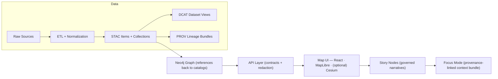

# 🧰 tools/ingest — KFM Ingest Toolkit


> 🧭 **Purpose:** Turn heterogeneous Kansas data (historical + scientific + spatiotemporal) into **governed evidence artifacts** that downstream systems can trust: catalogs → graph → API → UI → narratives.  
> 🔒 **Rule of thumb:** If it isn’t in **STAC/DCAT/PROV**, it doesn’t ship.

---

## 📌 What lives in `tools/ingest/`

This directory is the home for **ingestion utilities**: scripts and small libraries that help bring new datasets into KFM’s canonical pipeline (fetch → normalize → publish catalogs → validate → optionally graph-load).

It complements (not replaces) domain pipelines, which are expected to live under `src/pipelines/`.:contentReference[oaicite:0]{index=0}

✅ Typical responsibilities:
- 🧲 **Acquire** external sources (downloaders, API pullers, archive extractors)
- 🧼 **Normalize** formats (vector/raster/doc/time-series), reproject, clean, dedupe
- 🧾 **Publish catalogs** (STAC/DCAT/PROV) as first-class outputs
- 🧪 **Validate** metadata + content (CI-friendly)
- 📦 **Version** large artifacts (DVC-friendly patterns for rasters/models)

🚫 Not the place for:
- One-off analysis notebooks (belongs in `notebooks/` / `mcp/`)
- UI-only transformations (the UI consumes **cataloged** outputs, not ad-hoc files)
- Untracked “mystery layers” (anything shown must have lineage)

---

## 🧱 Non‑negotiables (pipeline invariants)

1) **Contract‑first** 📜  
Schemas and API contracts are first-class repo artifacts; changes require strict versioning + compatibility checks.:contentReference[oaicite:1]{index=1}

2) **Deterministic / idempotent ETL** 🔁  
Transformations are config-driven and repeatable: same inputs + same config ⇒ same outputs, fully logged.:contentReference[oaicite:2]{index=2}

3) **Provenance‑first publishing** 🧬  
KFM treats lineage as fundamental; publish **STAC/DCAT/PROV** before anything reaches graph, APIs, UI, or story nodes.:contentReference[oaicite:3]{index=3}

4) **Catalog boundary artifacts are required** 🧾  
STAC + DCAT + PROV are required “interfaces” to downstream stages (graph/API/UI).:contentReference[oaicite:4]{index=4}

5) **Evidence artifacts are datasets** 🧠  
Any derived output (OCR, model predictions, simulations, change maps) must be stored + cataloged + traced like any other dataset.:contentReference[oaicite:5]{index=5}

---

## 🗺️ Canonical flow (data → catalogs → graph → API → UI → narrative)



(Flow adapted from the KFM Master Guide v13.):contentReference[oaicite:6]{index=6}

---

## 🗂️ Data staging + catalog outputs

### 📦 Expected staging (per domain)

KFM standardizes where “raw”, “work”, and “processed” live so it’s always obvious what stage a file is in.:contentReference[oaicite:7]{index=7}

```text
data/
├── 🛰️ stac/                     # STAC metadata layer (Collections + Items pointing to assets/artifacts)
│   ├── 🗂️ collections/          # STAC Collections (dataset-level metadata: extent/license/providers/links)
│   └── 🧷 items/                # STAC Items (time/run snapshots: assets, roles, hrefs, timestamps)
├── 🗂️ catalog/
│   └── 🗂️ dcat/                 # DCAT discovery records (dataset + distributions + access/license metadata)
├── 🧬 prov/                     # PROV lineage bundles (JSON-LD) linking raw→work→processed + agents/tools/params
├── 🗂️ <domain>/                 # Domain bucket (keeps related raw/work/processed together for a domain)
│   ├── 📥 raw/                  # Read-only originals (or DVC pointers); immutable evidence boundary
│   ├── 🧪 work/                 # Intermediate artifacts (scratch, checkpoints); rebuildable staging
│   └── ✅ processed/             # Publishable outputs (versioned artifacts promoted for UI/API/graph use)
└── ✅📄 README.md                # 👈 you are here 📌 Naming/versioning rules + promotion lanes + validation expectations
```

Catalog outputs locations (required):
- **STAC**: `data/stac/collections/` + `data/stac/items/`:contentReference[oaicite:8]{index=8}
- **DCAT**: `data/catalog/dcat/`:contentReference[oaicite:9]{index=9}
- **PROV**: `data/prov/`:contentReference[oaicite:10]{index=10}

---

## 🧾 Ingest run contract (what every ingest must produce)

A typical pipeline/ingest job is expected to:
1) **Fetch** source data (often using `data/sources` manifests for URLs)  
2) **Transform** (format conversions, cleaning, joins, simulations)  
3) **Output standardized results** to `data/processed/…` and **create/update metadata + provenance logs**:contentReference[oaicite:11]{index=11}

> Example from KFM design: a historical map pipeline may download an image, georeference it, output COG/tiles, and write STAC metadata for that layer.:contentReference[oaicite:12]{index=12}

---

## 🚀 Quick start (recommended CLI shape)

> ⚠️ This is a **spec** for how ingest tooling should feel. If your repo already has commands, map them to this mental model.

```bash
# 1) Fetch raw inputs
python -m tools.ingest fetch <dataset_id>

# 2) Transform → produce publishable artifacts
python -m tools.ingest transform <dataset_id>

# 3) Publish catalogs (STAC/DCAT/PROV) for the outputs
python -m tools.ingest publish <dataset_id>

# 4) Validate everything (local + CI)
python -m tools.ingest validate <dataset_id|all>

# 5) (Optional) Load/refresh graph exports
python -m tools.ingest graph-export <dataset_id>
```

### 🧷 Dataset IDs (naming convention)

Use a stable, grep-friendly ID:
- `kfm.<domain>.<topic>.<source>.<version_or_year>`
- Example: `kfm.historical.maps.usgs_topo.1890`

---

## 🧩 Adding a new dataset (the “happy path”)

1) 📝 **Register the source**
   - Add/extend a source manifest (e.g., `data/sources/<domain>/<dataset_id>.json|yaml`)
   - Include license + citation + source URL(s) + known caveats

2) 🧱 **Create the ingest adapter**
   - Implement `fetch → normalize → publish` steps
   - Keep it config-driven (no hard-coded paths beyond the canonical layout)

3) 🗺️ **Write outputs**
   - Put publishable files in `data/<domain>/processed/<dataset_id>/…`
   - If large: use DVC patterns to avoid bloating git (version data separately).:contentReference[oaicite:13]{index=13}

4) 🧾 **Generate catalog artifacts**
   - STAC Collection + Items
   - DCAT dataset entry (JSON-LD)
   - PROV bundle describing inputs, steps, agents, parameters

5) 🧪 **Run validators**
   - Ensure metadata is schema-valid and file references resolve
   - Confirm geometry validity, expected ranges, etc.

6) 🔁 **Make it repeatable**
   - Re-run from scratch and verify identical outputs for same inputs/config (determinism)

---

## 🛰️ Special handling: large remote sensing + rasters

KFM expects big rasters to be optimized for interactive use:
- **Cloud-Optimized GeoTIFFs (COGs)** for partial HTTP reads (range requests) so clients fetch only what they need.:contentReference[oaicite:14]{index=14}
- Optional **pre-tiling** (XYZ / MBTiles) for heavy base layers to trade storage for speed.:contentReference[oaicite:15]{index=15}
- Optional integration with **Google Earth Engine (GEE)** for at-scale remote sensing access/compute; ingest results back into KFM as cataloged assets.:contentReference[oaicite:16]{index=16}

---

## 🧬 Evidence artifacts (AI / analysis / simulation outputs)

Anything derived is still a dataset:
- Store as `data/<domain>/processed/…`
- Catalog in STAC/DCAT (mark as derived/AI-generated when appropriate)
- Trace in PROV (inputs, method/model, parameters, confidence):contentReference[oaicite:17]{index=17}

Think: OCR corpora, regression outputs, Bayesian posteriors, land-cover change rasters, simulation outputs, topology optimization results — all “evidence artifacts”.

---

## 🧪 Validation & QA (must be CI-friendly)

KFM tooling includes catalog QA concepts:
- A validator can scan catalog JSON files for required fields (license, spatial extent, etc.)
- Check for broken links/file references
- Run basic data checks (geometry validity, value ranges)
- CI should fail merges on incomplete/inconsistent data:contentReference[oaicite:18]{index=18}

> 🎛️ GIS note: validation should support both **query-by-attribute** and **query-by-geography** expectations (SQL + spatial predicates are fundamental to GIS workflows).:contentReference[oaicite:19]{index=19}

---

## ⚡ Performance & scaling notes (ingest at “Kansas scale”)

KFM ingest needs to handle **mixed spatiotemporal sources** (vector + raster + streams) that often require visualization and cross-source fusion (e.g., join trajectories with remote sensing).:contentReference[oaicite:20]{index=20}

Practical guidance:
- 🧱 Prefer chunked processing (tile-based rasters, batch vector ops)
- 🧵 Parallelize safely (bounded workers, deterministic output ordering)
- 🗄️ Index intelligently (PostGIS spatial + temporal indexes; avoid full rescans)
- 🧊 Cache intermediate steps in `data/<domain>/work/` to support restartability

---

## 🛡️ Security, governance, and ethics

- 🔐 Never commit secrets (API keys, DB passwords). Use env vars / secret stores.
- 🧾 Respect licenses: every dataset must declare terms before publication.
- 🧭 Governance: follow FAIR/CARE + sovereignty guardrails (especially for sensitive cultural sites or personal data).:contentReference[oaicite:21]{index=21}
- 🧽 If redaction is required, enforce it **at the API boundary** and record it in provenance.

---

## ✅ Ingest “Definition of Done” checklist

- [ ] Raw inputs stored (or referenced) under `data/<domain>/raw/…`
- [ ] Processed outputs written under `data/<domain>/processed/…`
- [ ] STAC Collection + Items created
- [ ] DCAT entry created (JSON-LD)
- [ ] PROV bundle created (inputs, activity, agent, params)
- [ ] Validator passes locally and in CI
- [ ] Re-run is deterministic (same inputs/config ⇒ same outputs)
- [ ] License + attribution is complete

---

## 📚 Project library (how each file informs ingest)

> 🧠 This repo’s ingest approach is intentionally “over-documented”: we keep a living technical library so contributors can implement pipelines with shared assumptions.

### 🧱 Core KFM governance & architecture
- **Kansas Frontier Matrix (KFM) – Comprehensive Technical Documentation** — architecture + pipelines + contract/provenance rules. :contentReference[oaicite:22]{index=22} :contentReference[oaicite:23]{index=23}
- **MARKDOWN_GUIDE_v13.md.gdoc** — canonical pipeline ordering + directory layout + STAC/DCAT/PROV policy. :contentReference[oaicite:24]{index=24}
- **Kansas-Frontier-Matrix_ Open-Source Geospatial Historical Mapping Hub Design** — DVC strategy, reproducibility focus, repo structure ideas. :contentReference[oaicite:25]{index=25}

### 🗺️ GIS, mapping, and spatial data engineering
- **python-geospatial-analysis-cookbook.pdf** — practical PostGIS/GeoPython patterns for ingest + analysis. :contentReference[oaicite:26]{index=26}
- **making-maps-a-visual-guide-to-map-design-for-gis.pdf** — cartographic constraints that inform what “processed” should look like (symbology-ready layers).
- **Mobile Mapping_ Space, Cartography and the Digital - 9789048535217.pdf** — field/mobile data realities (GPS noise, human capture workflows).
- **Archaeological 3D GIS_26_01_12_17_53_09.pdf** — 3D assets + spatial archaeology considerations. :contentReference[oaicite:27]{index=27}

### 🛰️ Remote sensing & large rasters
- **Cloud-Based Remote Sensing with Google Earth Engine-Fundamentals and Applications.pdf** — GEE-based ingest patterns.
- **compressed-image-file-formats-jpeg-png-gif-xbm-bmp.pdf** — scanned maps & imagery format handling.
- **Scalable Data Management for Future Hardware.pdf** — spatiotemporal pipelines + performance + robustness ideas. :contentReference[oaicite:28]{index=28}

### 🗄️ Databases, storage, and performance
- **PostgreSQL Notes for Professionals - PostgreSQLNotesForProfessionals.pdf** — Postgres/PostGIS operational notes.
- **Database Performance at Scale.pdf** — scaling + indexing + workload-aware design. :contentReference[oaicite:29]{index=29}
- **Data Spaces.pdf** — federation/interoperability mindset (catalog-first discovery).

### 🧮 Statistics, analytics, and “evidence artifact” outputs
- **Understanding Statistics & Experimental Design.pdf** — QA logic for derived layers (experimental rigor).
- **think-bayes-bayesian-statistics-in-python.pdf** — Bayesian evidence artifacts (posteriors as datasets).
- **regression-analysis-with-python.pdf** — regression workflows that can produce publishable evidence layers.
- **Regression analysis using Python - slides-linear-regression.pdf** — quick reference for regression-based evidence outputs. :contentReference[oaicite:30]{index=30}
- **graphical-data-analysis-with-r.pdf** — EDA practices (helps define sanity checks).

### 🧠 Machine learning & deep learning
- **Deep Learning for Coders with fastai and PyTorch - …** — model training/inference patterns (treat outputs as evidence artifacts; keep model cards). *(Note: file may be restricted in some tooling views.)*
- **Understanding Machine Learning: From Theory to Algorithms** — theoretical grounding for model governance. :contentReference[oaicite:31]{index=31}

### 🧬 Systems, graphs, and simulation
- **Spectral Geometry of Graphs.pdf** — graph thinking relevant to Neo4j layer design.
- **Scientific Modeling and Simulation_ A Comprehensive NASA-Grade Guide.pdf** — simulation outputs as governed evidence.
- **Generalized Topology Optimization for Structural Design.pdf** — example of computational evidence pipelines.
- **Principles of Biological Autonomy - book_9780262381833.pdf** — autonomy & systems framing (useful for designing resilient pipelines).

### 🌐 Web + visualization constraints (ingest must support UI)
- **webgl-programming-guide-interactive-3d-graphics-programming-with-webgl.pdf** — 3D asset formats + performance constraints.
- **responsive-web-design-with-html5-and-css3.pdf** — front-end constraints that shape what “processed” should deliver.

### 🧵 Concurrency & distributed execution references
- **concurrent-real-time-and-distributed-programming-in-java-threads-rtsj-and-rmi.pdf** — worker patterns, real-time considerations.
- **B-C programming Books.pdf** — concurrency primitives + thread lifecycle patterns.
- **A programming Books.pdf**, **D-E programming Books.pdf**, **F-H programming Books.pdf**, **I-L programming Books.pdf**, **M-N programming Books.pdf**, **O-R programming Books.pdf**, **S-T programming Books.pdf**, **U-X programming Books.pdf** — language/tooling references across the stack (ETL, APIs, infra).

### 🛡️ Security & governance context
- **ethical-hacking-and-countermeasures-secure-network-infrastructures.pdf** — threat modeling for data pipelines.
- **Gray Hat Python - Python Programming for Hackers and Reverse Engineers (2009).pdf** — secure coding awareness.
- **Introduction to Digital Humanism.pdf** — human-centered governance lens.
- **On the path to AI Law’s prophecies and the conceptual foundations of the machine learning age.pdf** — legal/ethical framing for ML evidence artifacts.
- **Flexible Software Design** — modularity + change resilience in ingest architecture. :contentReference[oaicite:32]{index=32}

---

## 🧭 Next upgrades (recommended)

- 🧪 Add `tools/ingest/validate_all.py` that runs:
  - metadata schema validation (STAC/DCAT/PROV)
  - file existence checks
  - geometry validity checks
  - raster sanity checks (bounds/CRS)
- 🧾 Add `tools/ingest/prov/` helpers to generate consistent PROV bundles per run
- 📦 Add DVC recipes (`.dvc` patterns) for COGs, tilesets, and model artifacts
- 🧰 Add “starter adapters” (templates) for:
  - 🗺️ historical scanned maps → georeference → COG
  - 🛰️ GEE raster exports → COG/tiles
  - 🧾 CSV time-series → Parquet + catalog
  - 🧬 OCR text corpora → indexed evidence artifact

---

