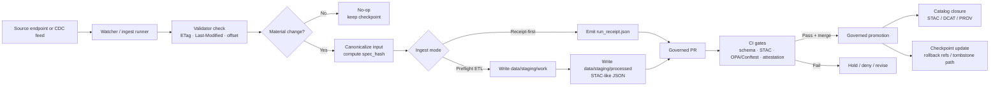

<!-- [KFM_META_BLOCK_V2]
doc_id: kfm://doc/NEEDS-VERIFICATION-tools-ingest-readme
title: tools/ingest
type: standard
version: v1
status: draft
owners: @bartytime4life — NEEDS VERIFICATION against CODEOWNERS
created: YYYY-MM-DD
updated: YYYY-MM-DD
policy_label: NEEDS VERIFICATION
related: [../../.github/workflows/ingest-watch.yml, ../../.github/workflows/ingest-gates.yml, ../../policy/konstraint/kfm.rego, ../../docs/patterns/ingest-blueprint.md, ../../data/staging/, ../../data/catalog/]
tags: [kfm, ingest, stac, dcat, prov, promotion]
notes: [Source-bounded draft. Current-session evidence confirms ingest doctrine and source-backed starter paths, but mounted repo tree, CODEOWNERS, and live workflow filenames NEED VERIFICATION before merge.]
[/KFM_META_BLOCK_V2] -->

<a id="top"></a>

# `tools/ingest`

Deterministic watcher, receipt, and preflight ETL surface for moving upstream change into KFM’s governed truth path.

> [!NOTE]
> **Status:** experimental  
> **Owners:** `@bartytime4life` *(named in a draft ingest blueprint)* · live CODEOWNERS **NEEDS VERIFICATION**  
>      
> **Quick jumps:** [Scope](#scope) · [Repo fit](#repo-fit) · [Accepted inputs](#accepted-inputs) · [Exclusions](#exclusions) · [Directory tree](#directory-tree) · [Quickstart](#quickstart) · [Usage](#usage) · [Diagram](#diagram) · [Reference tables](#reference-tables) · [Definition of done](#task-list--definition-of-done) · [FAQ](#faq) · [Appendix](#appendix)  
> **Repo fit:** `tools/ingest/` → upstream / adjacent surfaces documented in the corpus include [`../../docs/patterns/ingest-blueprint.md`](../../docs/patterns/ingest-blueprint.md), [`../../policy/konstraint/kfm.rego`](../../policy/konstraint/kfm.rego), [`../../.github/workflows/ingest-watch.yml`](../../.github/workflows/ingest-watch.yml), and [`../../.github/workflows/ingest-gates.yml`](../../.github/workflows/ingest-gates.yml); downstream targets include [`../../data/staging/`](../../data/staging/), [`../../data/catalog/`](../../data/catalog/), and [`../../.state/ingest/`](../../.state/ingest/). All adjacent paths are **source-backed but live-tree existence still NEEDS VERIFICATION**.

> [!IMPORTANT]
> This README is intentionally **source-bounded**. Current-session evidence confirmed KFM ingest doctrine, proof-object expectations, and multiple source-backed starter layouts, but did **not** directly surface a mounted repository checkout, existing `tools/ingest/README.md`, actual CODEOWNERS, or an in-tree workflow inventory. Treat every concrete filename here as **PROPOSED unless directly verified in the live tree**.

> [!WARNING]
> `tools/ingest/` is **not** a direct publish lane. In KFM, promotion is a governed state change, not a convenience file move. Catalog closure, review state, proof packs, and public-safe publication remain downstream responsibilities.

## Scope

`tools/ingest/` is the **ingest edge** for KFM’s source-onboarding flow.

Its job is to make upstream change:

1. detectable,
2. reviewable,
3. machine-checkable, and
4. promotable only through governed gates.

In practice, that means this directory is where KFM should keep the smallest useful machinery for:

- watcher-style source change detection,
- deterministic preflight ETL,
- checkpoint state,
- typed receipts,
- local/CI policy parity,
- and optional supply-chain attachments for ingest proof.

### Truth posture used in this README

- **CONFIRMED doctrine**: truth path, fail-closed posture, PR-first promotion pressure, typed proof objects, source descriptors, and STAC/DCAT/PROV closure as part of the evidence system.
- **PROPOSED wiring**: the starter file layout under `tools/ingest/`, the exact workflow names, and the local command examples below.
- **NEEDS VERIFICATION**: mounted repo paths, existing files, active owners, live CI enforcement, and whether this subtree already exists exactly as drafted.

[Back to top](#top)

## Repo fit

| Path | Relationship | Why it touches ingest | Current posture |
| --- | --- | --- | --- |
| `tools/ingest/` | this directory | watcher, receipt, checkpoint, and preflight ETL surface | target file |
| `../../.github/workflows/ingest-watch.yml` | adjacent workflow surface | scheduled or manual watch → PR entrypoint | **PROPOSED path** |
| `../../.github/workflows/ingest-gates.yml` | adjacent workflow surface | promotion-time validation and policy checks | **PROPOSED path** |
| `../../policy/konstraint/kfm.rego` | adjacent policy surface | OPA / Conftest policy bundle example for ingest gates | **PROPOSED path** |
| `../../data/staging/` | downstream staging surface | preflight work / processed outputs for PR review | **PROPOSED path** |
| `../../data/catalog/` | downstream governed metadata surface | post-merge catalog materialization target | **PROPOSED path** |
| `../../.state/ingest/` | local state surface | idempotency markers and checkpoint files | **PROPOSED path** |
| `../../docs/patterns/ingest-blueprint.md` | adjacent design note | longer-form ingest doctrine / choreography | **PROPOSED path** |

### How this directory fits the larger KFM system

`tools/ingest/` belongs to the **source and intake plane**. It should help connectors discover, fetch, checkpoint, validate, and land source-native material plus receipts. It should not own canonical truth, public-safe release, runtime answers, or UI-facing authority.

[Back to top](#top)

## Accepted inputs

This directory is the right place for **ingest mechanics** and **ingest proof objects**, not for the whole downstream stack.

| Input family | What belongs here | Typical examples |
| --- | --- | --- |
| Source change detectors | code that decides whether upstream change is material enough to review | HTTP validator watcher, CDC offset watcher |
| Deterministic preflight runners | code that normalizes inputs into reviewable staging outputs | `ingest.py`-style feed → STAC preflight |
| Checkpoint state | minimal persisted state needed to avoid duplicate work | ETag / `Last-Modified`, CDC offsets, idempotency markers |
| Typed receipts and schemas | machine-checkable proof that a fetch or preflight happened | `run_receipt.v1.json`, schema fixtures |
| Policy / validation helpers | parity checks that run the same way locally and in CI | Conftest bundles, JSON Schema, STAC validators |
| Supply-chain helpers | optional attachments that harden trust without changing ingest meaning | `cosign.pub`, `in_toto.layout` |
| Pinned ingest dependencies | small runtime-specific requirements for this subtree | `requests`, `jsonschema`, `jcs`, `stac-validator`, `tenacity` |

### What “accepted input” means here

This section is about **what should live in the directory**, not only what the code consumes at runtime. Runtime input URLs, logical windows, rights defaults, and kill-switch values belong here only as configuration or CLI/env entrypoints—not as hidden behavior.

[Back to top](#top)

## Exclusions

Just because a change starts here does not mean it should stay here.

| Keep out of `tools/ingest/` | Why it does not belong here | Where it should go instead |
| --- | --- | --- |
| Canonical dataset versions | ingest detects and prepares; it does not become authoritative truth by itself | canonical data / processed artifact lanes |
| Public-safe catalog closure | STAC/DCAT/PROV closure belongs after validation and promotion | catalog compiler / `data/catalog/`-style surfaces |
| Review decisions and release manifests | publication decisions are a control-plane concern | policy / review / release surfaces |
| Derived delivery artifacts | maps, tiles, exports, graph projections, search indexes, scenes are downstream | packaging / projection workers |
| Public or steward UI code | ingest should not own shells or runtime trust surfaces | governed API and UI applications |
| Long-lived secrets or direct publish credentials | least-privilege and short-lived credentials should stay outside repo paths | CI secret store / runtime secret manager |
| Domain-deep interpretation logic | source onboarding should not quietly become domain authority | domain pipelines and reviewed transformation code |

> [!TIP]
> A good ingest folder is narrow on purpose. It should make source movement **legible** and **governable**, then hand off to later planes.

[Back to top](#top)

## Directory tree

The tree below is a **source-backed starter layout**, not a claim that the mounted repository already contains every file.

```text
tools/ingest/
├── README.md
├── requirements.txt                 # PROPOSED: pinned ingest runtime deps
├── ingest.py                        # PROPOSED: deterministic feed → STAC → PR preflight
├── watchers/
│   ├── http_stac_watcher.py         # PROPOSED: HTTP validator / JCS watcher
│   └── db_cdc_watcher.py            # PROPOSED: CDC parity watcher
├── state/
│   └── checkpoints.sqlite           # PROPOSED: ETag / Last-Modified / offset state
├── receipts/
│   └── schema/
│       └── run_receipt.v1.json      # PROPOSED: minimal typed PR artifact schema
├── ci/
│   └── conftest/
│       └── policies/*.rego          # PROPOSED: ingest-specific gates
└── supplychain/
    ├── in_toto.layout               # OPTIONAL / PROPOSED
    └── cosign.pub                   # OPTIONAL / PROPOSED
```

### Adjacent surfaces outside this tree

```text
.github/workflows/ingest-watch.yml   # PROPOSED: watch → PR
.github/workflows/ingest-gates.yml   # PROPOSED: PR / promotion gates
policy/konstraint/kfm.rego           # PROPOSED: policy bundle example
data/staging/                        # PROPOSED: preflight outputs
data/catalog/                        # PROPOSED: post-merge catalog target
.state/ingest/                       # PROPOSED: idempotency markers
```

[Back to top](#top)

## Quickstart

> [!NOTE]
> The commands below are **source-backed starter commands**. Verify actual filenames before relying on them in CI or local developer docs.

### 1) Smallest credible slice: emit only a typed run receipt

Use this when the safest first move is a **receipt-first watcher**.

```bash
python -m pip install requests jcs jsonschema

python tools/ingest/watchers/http_stac_watcher.py \
  https://example.com/stac/catalog.json
```

Expected outcome:

- no-op if validators did not change,
- or one `*.run_receipt.json` file under `tools/ingest/receipts/`.

### 2) Deterministic preflight: stage reviewable outputs before PR

Use this when you need a small ETL preflight that writes into staging, validates structure, and prepares a governed PR.

```bash
export KFM_SOURCE_URL="https://example.com/feed.json"
export KFM_LOGICAL_WINDOW="2026-01-07"
export KFM_KILL_SWITCH="1"   # dry-run until verified

python -m pip install -r tools/ingest/requirements.txt
python tools/ingest/ingest.py
```

Expected outcome:

- deterministic idempotency key,
- staged work / processed outputs,
- STAC-like JSON ready for validation,
- and a state marker only if writes are enabled.

### 3) Run policy parity locally

```bash
conftest test tools/ingest/receipts --policy tools/ingest/ci/conftest
```

### 4) Validate staged STAC JSON quickly

```bash
find data/staging/processed -type f -name "*.json" -maxdepth 4 -print0 \
  | xargs -0 -n1 stac-validator
```

[Back to top](#top)

## Usage

Two ingest patterns are clearly supported by the source corpus. This README keeps both visible because they solve different risk levels.

### Mode A — receipt-first watcher

This is the **smallest safe thin slice**.

1. Probe an upstream endpoint with HTTP validators or CDC offset checks.
2. Fetch payload only when validators changed.
3. Canonicalize payload with JCS.
4. Compute `spec_hash`.
5. Emit a typed `run_receipt`.
6. Open a governed PR containing the receipt.
7. Let merge trigger the heavier downstream materialization.

Best when:

- the source is volatile,
- you want maximum auditability with minimum side effects,
- or you need a source-admission proof before building a full ETL.

### Mode B — deterministic feed → STAC preflight

This is the **next heavier slice**.

1. Fetch the upstream feed.
2. Normalize timestamps and keys deterministically.
3. Write work / processed staging outputs.
4. Validate STAC structure.
5. Run OPA / Conftest policy.
6. Open a governed PR with staged outputs.
7. Let post-merge workflows assemble catalog closure and provenance snapshots.

Best when:

- reviewers need to inspect staged metadata before merge,
- the feed is already close to a STAC-shaped output,
- or a domain lane is ready for a small governed artifact proof.

### What both modes must preserve

- fail-closed behavior,
- explicit rights posture,
- typed receipts,
- idempotency,
- and no silent bypass of later promotion gates.

[Back to top](#top)

## Diagram


```mermaid
flowchart LR
    A[Source endpoint or CDC feed] --> B[Watcher / ingest runner]
    B --> C[Validator check<br/>ETag · Last-Modified · offset]
    C --> D{Material change?}

    D -->|No| E[No-op<br/>keep checkpoint]
    D -->|Yes| F[Canonicalize input<br/>compute spec_hash]

    F --> G{Ingest mode}
    G -->|Receipt-first| H[Emit run_receipt.json]
    G -->|Preflight ETL| I[Write data/staging/work]
    I --> J[Write data/staging/processed<br/>STAC-like JSON]

    H --> K[Governed PR]
    J --> K

    K --> L[CI gates<br/>schema · STAC · OPA/Conftest · attestation]
    L -->|Pass + merge| M[Governed promotion]
    M --> N[Catalog closure<br/>STAC / DCAT / PROV]
    M --> O[Checkpoint update<br/>rollback refs / tombstone path]

    L -->|Fail| P[Hold / deny / revise]
```

[Back to top](#top)

## Reference tables

### Component registry

| Surface | Primary role | Typical output | Posture |
| --- | --- | --- | --- |
| `watchers/` | detect upstream change safely | receipt candidate or no-op | **PROPOSED file layout** |
| `state/` | persist minimal replay / checkpoint data | validators, offsets, `.done` markers | **PROPOSED file layout** |
| `receipts/schema/` | define the typed proof object used at ingest edge | `run_receipt.v1.json` | **PROPOSED file layout** |
| `ci/conftest/` | keep local and CI policy behavior aligned | Rego / Conftest decisions | **PROPOSED file layout** |
| `supplychain/` | attach optional trust hardening | attestation layout / public key | **PROPOSED file layout** |
| `ingest.py` | run deterministic preflight into staging | staged JSON / STAC / state markers | **PROPOSED file layout** |
| downstream catalog compiler | turn promoted candidates into outward closure | STAC / DCAT / PROV | **CONFIRMED role, path NEEDS VERIFICATION** |

### Proof objects and gates

| Object / gate | What it proves or blocks | Minimum expectation |
| --- | --- | --- |
| `SourceDescriptor` | source admission contract | identity, cadence, rights, validation plan, publication intent |
| `run_receipt` / `IngestReceipt` | a fetch or preflight event happened | source ref, fetch time, validators, `spec_hash`, rights |
| `ValidationReport` | checks passed / failed / quarantined | check list, severity, reason codes |
| STAC validation | malformed asset metadata does not advance | valid Item / Collection shape |
| OPA / Conftest | rights, lineage, embargo, or policy failures block merge | deny by default |
| attestation / signature | receipt or artifact can be tied to a verifiable run | signed predicate or verified bundle |
| tombstone / rollback reference | revert remains visible instead of silent | prior run linkage, reason, preserved lineage |

### Gate matrix

| Gate | Runs before merge? | Runs after merge? | Why it exists |
| --- | --- | --- | --- |
| Receipt schema validation | yes | optional | malformed proof objects should never promote |
| STAC structural validation | yes (preflight mode) | yes | catch outward metadata breakage early |
| Policy bundle | yes | yes | rights / sensitivity / lineage rules stay fail-closed |
| Supply-chain verification | yes | yes | signed or attested receipts remain checkable |
| Catalog closure | no | yes | outward metadata belongs after governed promotion |
| Rollback / tombstone handling | no | yes | reversals should preserve auditability |

[Back to top](#top)

## Task list / Definition of done

### Merge-readiness checks for this README

- [ ] Meta block placeholders resolved from mounted repo evidence.
- [ ] Live subtree verified: `tools/ingest/` exists and the tree matches this README or the README is trimmed to match reality.
- [ ] Owners confirmed against CODEOWNERS or equivalent steward register.
- [ ] At least one `run_receipt` example or fixture committed.
- [ ] At least one local smoke path verified.
- [ ] Workflow filenames in this README match actual `.github/workflows/` files.
- [ ] Policy path and namespaces match actual repo policy bundle.
- [ ] README linked from an adjacent index or parent docs surface.

### Definition of done for the ingest lane itself

- [ ] One source can be watched without hidden side effects.
- [ ] Material change emits a typed proof object.
- [ ] Local and CI policy produce the same decision for the same input.
- [ ] Merge is the earliest point where promotion can happen.
- [ ] Post-merge path produces or links outward STAC/DCAT/PROV closure.
- [ ] Rollback leaves a visible lineage object rather than silent deletion.

[Back to top](#top)

## FAQ

### Is `tools/ingest/` the authoritative data store?

No. This directory belongs at the **source and intake edge**. Canonical truth and public-safe publication happen later.

### Does every watcher need to download the full payload?

No. The smallest safe pattern can compare validators, compute a canonical hash when needed, and emit only a typed receipt for PR review.

### Can ingest publish directly to users?

No. In KFM, ingest may stage or prepare, but promotion remains governed and downstream.

### What is the minimum acceptable proof object?

A typed receipt is the minimum credible start. Over time, that should connect cleanly to validation reports, catalog closure, and release proof objects.

[Back to top](#top)

## Appendix

<details>
<summary>Illustrative <code>run_receipt.v1</code> starter object</summary>

```json
{
  "run_id": "00000000-0000-0000-0000-000000000000",
  "fetch_time": "YYYY-MM-DDTHH:MM:SSZ",
  "source_url": "https://example.org/catalog.json",
  "http_validators": {
    "etag": "\"abc123\"",
    "last_modified": "Wed, 01 Jan 2026 00:00:00 GMT"
  },
  "spec_hash": "0123456789abcdef0123456789abcdef0123456789abcdef0123456789abcdef",
  "rights_spdx": "CC-BY-4.0"
}
```

This shape reflects the smallest typed receipt surfaced in the ingest working notes. Extend it only when the repo’s real promotion contract demands more fields.

</details>

<details>
<summary>Status legend used in this README</summary>

| Label | Meaning here |
| --- | --- |
| **CONFIRMED** | directly supported by the attached KFM corpus |
| **PROPOSED** | source-backed starter wiring, not directly verified in the mounted repo |
| **NEEDS VERIFICATION** | current-session repo tree or owner/path proof was not directly surfaced |

</details>

[Back to top](#top)
