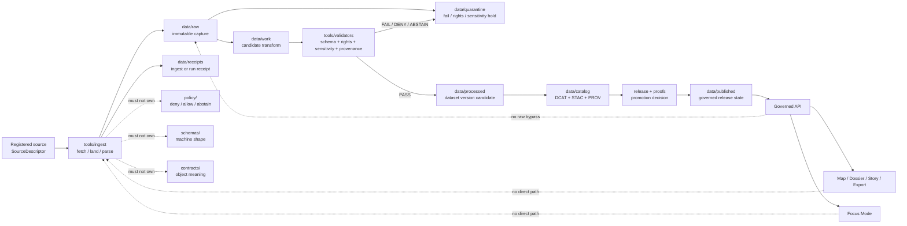

<!-- [KFM_META_BLOCK_V2]
doc_id: kfm://doc/TODO-VERIFY-UUID
title: tools/ingest/
type: standard
version: v1
status: draft
owners: TODO(verify CODEOWNERS / ingest maintainers)
created: TODO(verify-created-date-or-set-on-first-commit)
updated: 2026-04-22
policy_label: TODO(verify-policy-label; README likely public-facing)
related: [
  ../../README.md,
  ../README.md,
  ../validators/README.md,
  ../probes/README.md,
  ../attest/README.md,
  ../../docs/README.md,
  ../../docs/runbooks/README.md,
  ../../data/README.md,
  ../../data/registry/README.md,
  ../../data/raw/README.md,
  ../../data/work/README.md,
  ../../data/quarantine/README.md,
  ../../data/processed/README.md,
  ../../data/catalog/README.md,
  ../../data/receipts/README.md,
  ../../data/proofs/README.md,
  ../../data/published/README.md,
  ../../contracts/README.md,
  ../../schemas/README.md,
  ../../policy/README.md,
  ../../pipelines/README.md,
  ../../tests/README.md,
  ../../release/README.md,
  ../../.github/workflows/README.md
]
tags: [kfm, tools, ingest, source-edge, source-admission, raw-landing, receipts, validation, fail-closed]
notes: [
  doc_id, owner, created date, policy_label, and adjacent link availability remain NEEDS VERIFICATION until checked in the mounted repository.
  This README treats tools/ingest/ as the source-edge tooling lane and does not claim current script inventory, package manager, CI wiring, or runtime maturity.
  Ingest tools must remain subordinate to source descriptors, schemas/contracts, policy, validators, receipts, catalog closure, and promotion gates.
]
[/KFM_META_BLOCK_V2] -->

<a id="top"></a>

# `tools/ingest/`

Source-edge ingest tooling for moving admissible upstream material into KFM lifecycle zones without bypassing source, policy, validation, or evidence controls.

> [!NOTE]
> **Status:** experimental — NEEDS VERIFICATION against the mounted repository  
> **Document status:** draft  
> **Owners:** `TODO(verify CODEOWNERS / ingest maintainers)`  
> **Path:** [`tools/ingest/README.md`](./README.md)  
> **Repo fit:** child lane under [`../README.md`](../README.md); upstream authority from [`../../data/registry/README.md`](../../data/registry/README.md), [`../../contracts/README.md`](../../contracts/README.md), [`../../schemas/README.md`](../../schemas/README.md), and [`../../policy/README.md`](../../policy/README.md); downstream handoff to [`../../data/raw/README.md`](../../data/raw/README.md), [`../../data/work/README.md`](../../data/work/README.md), [`../../data/quarantine/README.md`](../../data/quarantine/README.md), [`../../data/receipts/README.md`](../../data/receipts/README.md), and later promotion surfaces.
>
> 
> 
> 
> 
> 
> 
> 
>
> **Quick jumps:** [Scope](#scope) · [Repo fit](#repo-fit) · [Accepted inputs](#accepted-inputs) · [Exclusions](#exclusions) · [Directory tree](#directory-tree) · [Quickstart](#quickstart) · [Usage](#usage) · [Diagram](#diagram) · [Reference tables](#reference-tables) · [Task list](#task-list) · [FAQ](#faq) · [Appendix](#appendix)

> [!IMPORTANT]
> `tools/ingest/` is a **tooling lane**, not a source of truth. It may help acquire, parse, fingerprint, normalize, and hand off source material, but it does not own canonical schemas, policy meaning, release authority, EvidenceBundles, public runtime responses, or publication state.

---

## Scope

`tools/ingest/` contains repo-local ingest helpers for **source-edge acquisition and first-pass normalization**.

It exists at the seam where KFM moves from:

1. source admission and source descriptor review,
2. fetch/probe/landing decisions,
3. immutable RAW capture,
4. WORK or QUARANTINE handoff,
5. receipt and validation report emission,

toward later processing, catalog closure, proof assembly, review, promotion, and governed publication.

### Evidence posture used here

| Marker | Meaning in this README |
|---|---|
| **CONFIRMED** | Direct KFM doctrine or current-session evidence supports the statement. |
| **INFERRED** | Conservative repo-fit interpretation from KFM documentation patterns, but not yet verified in this target path. |
| **PROPOSED** | Suggested structure, command shape, or maintenance rule that must be verified before implementation. |
| **UNKNOWN / NEEDS VERIFICATION** | Current file inventory, script names, owners, CI wiring, package manager, runtime behavior, and emitted artifacts not proven from a mounted checkout. |

### Working rule

An ingest tool should do the smallest safe thing:

```text
SourceDescriptor + request context
  -> fetch or land source payload
  -> compute digests and capture RAW manifest
  -> emit receipt / run metadata
  -> hand off to WORK or QUARANTINE
  -> never publish directly
```

[Back to top](#top)

---

## Repo fit

**Path:** `tools/ingest/README.md`  
**Role:** directory README for source-edge ingest tooling.

### Upstream, adjacent, and downstream anchors

| Relation | Surface | Status | Why it matters |
|---|---|---:|---|
| Parent tooling lane | [`../README.md`](../README.md) | **NEEDS VERIFICATION** | Defines the broader `tools/` boundary if present. |
| Source registry | [`../../data/registry/README.md`](../../data/registry/README.md) | **CONFIRMED doctrine / NEEDS VERIFICATION path** | Ingest should begin from registered sources, source role, cadence, rights, sensitivity, and citation requirements. |
| Contracts | [`../../contracts/README.md`](../../contracts/README.md) | **CONFIRMED doctrine / NEEDS VERIFICATION path** | Human-readable object meaning belongs in contracts, not ad hoc ingest code. |
| Schemas | [`../../schemas/README.md`](../../schemas/README.md) | **CONFIRMED doctrine / NEEDS VERIFICATION path** | Machine-checkable shape and valid/invalid fixtures belong in schema/test lanes. |
| Policy | [`../../policy/README.md`](../../policy/README.md) | **CONFIRMED doctrine / NEEDS VERIFICATION path** | Rights, sensitivity, deny/allow/abstain behavior, and promotion obligations must stay policy-owned. |
| Probes / watchers | [`../probes/README.md`](../probes/README.md) · [`../../pipelines/README.md`](../../pipelines/README.md) | **PROPOSED / NEEDS VERIFICATION** | Watchers may trigger ingest, but source refresh is not the same as publication. |
| Validators | [`../validators/README.md`](../validators/README.md) | **CONFIRMED doctrine / NEEDS VERIFICATION path** | Ingest tools may call validators, but validators own pass/fail semantics. |
| RAW | [`../../data/raw/README.md`](../../data/raw/README.md) | **CONFIRMED doctrine / NEEDS VERIFICATION path** | Immutable source captures, manifests, checksums, and upstream payload copies land here. |
| WORK / QUARANTINE | [`../../data/work/README.md`](../../data/work/README.md) · [`../../data/quarantine/README.md`](../../data/quarantine/README.md) | **CONFIRMED doctrine / NEEDS VERIFICATION path** | Temporary transforms, normalization candidates, failures, rights holds, and sensitivity holds belong downstream of ingest. |
| Receipts | [`../../data/receipts/README.md`](../../data/receipts/README.md) | **CONFIRMED doctrine / NEEDS VERIFICATION path** | Process memory and run receipts stay queryable for replay, correction, and release review. |
| Catalog / proofs / release | [`../../data/catalog/README.md`](../../data/catalog/README.md) · [`../../data/proofs/README.md`](../../data/proofs/README.md) · [`../../release/README.md`](../../release/README.md) | **CONFIRMED doctrine / NEEDS VERIFICATION path** | These are later trust surfaces. Ingest must not silently become them. |

> [!CAUTION]
> If an ingest command writes directly to `data/published/`, bypasses policy, skips validation, or emits UI-ready claims without EvidenceBundle resolution, it is outside this lane.

[Back to top](#top)

---

## Accepted inputs

Use `tools/ingest/` for source-edge commands that consume **reviewable source context** and produce **auditable lifecycle handoff artifacts**.

| Input | Belongs here? | Required posture |
|---|---:|---|
| Source descriptor references | ✅ | Read from `data/registry/` or contract/schema-approved registry inputs; do not redefine source truth here. |
| Fetch or landing parameters | ✅ | Deterministic, replayable, logged, and safe to dry-run. |
| Upstream payload references | ✅ | URLs, object keys, local fixture paths, or API parameters may be referenced; secrets must not be committed. |
| Capability metadata snapshots | ✅ | Useful for source drift detection; store durable outputs in RAW/receipts as policy allows. |
| RAW manifest emitters | ✅ | Must include digests, source identity, retrieval time, and enough context for replay. |
| First-pass parsers and normalizers | ✅ | May produce WORK candidates; must preserve raw source identity and original identifiers where policy allows. |
| Ingest receipts / run receipts | ✅ handoff | May be emitted by tools; persistent storage belongs in `data/receipts/` or the repo’s audited equivalent. |
| Tiny synthetic examples | ⚠️ | Prefer `tests/fixtures/`; only keep local examples here when repo convention explicitly allows. |
| Live credentials | ❌ | Use vault, environment injection, or local-only config ignored by Git. Never commit secrets. |

### Minimum source-edge fields

Every implemented ingest flow should be able to surface or derive these fields before anything leaves the source edge:

| Field | Why it matters |
|---|---|
| `source_id` | Connects the run to source registry authority. |
| `source_role` | Prevents treating contextual sources as authoritative truth. |
| `retrieved_at` / `observed_at` | Separates fetch time from event or observation time. |
| `upstream_ref` | Supports citation and replay. |
| `content_digest` | Supports deterministic identity and tamper detection. |
| `spec_hash` | Links run behavior to the declared ingest specification or source descriptor. |
| `rights_status` | Blocks publication when rights are missing or incompatible. |
| `sensitivity_class` | Enables fail-closed handling before geometry or identifiers leak. |
| `receipt_ref` / `audit_ref` | Makes the ingest action traceable without turning the tool into a proof store. |

[Back to top](#top)

---

## Exclusions

These do **not** belong in `tools/ingest/`.

| Excluded material | Put it here instead | Why |
|---|---|---|
| Raw source payloads or downloaded archives | `../../data/raw/` | RAW must remain immutable, auditable, and lifecycle-governed. |
| Temporary repair, reprojection, deduplication, or QA outputs | `../../data/work/` | WORK is the bounded transform zone. |
| Invalid, rights-unclear, sensitive, stale, or failed artifacts | `../../data/quarantine/` | Failures must stay visible, not disappear or silently promote. |
| Stable processed dataset versions | `../../data/processed/` | Processed artifacts are downstream candidates, not source-edge tools. |
| Catalog triplets, STAC/DCAT/PROV closure, or EvidenceBundle payloads | `../../data/catalog/` and evidence surfaces | Catalog and evidence closure are later authority surfaces. |
| Release proofs, attestations, manifests, rollback records | `../../data/proofs/` and `../../release/` | Proofs are stronger trust objects than ingest logs. |
| Normative object semantics | `../../contracts/` | Ingest code must not become hidden doctrine. |
| Machine schemas and canonical fixtures | `../../schemas/` and `../../tests/fixtures/` | Executable shape and test cases need independent review. |
| Deny/allow/abstain policy rules | `../../policy/` | Policy must remain centralized and testable. |
| Runtime API responses, Focus Mode envelopes, or map layer payloads | governed API / UI contract surfaces | Public clients must not consume ingest outputs directly. |
| Model prompts, AI traces, or generated narratives | governed AI/runtime receipt surfaces | AI is downstream and evidence-subordinate. |
| Secrets, tokens, cookies, signed URLs, `.env` files, or machine-local dumps | vault / ignored local config | Ingest traceability is not permission to leak credentials. |

[Back to top](#top)

---

## Directory tree

### Current implementation snapshot

**NEEDS VERIFICATION:** the target repository was not mounted during this drafting pass, so the current `tools/ingest/` file inventory is unknown.

Run this before updating the README status:

```bash
find tools/ingest -maxdepth 4 \( -type f -o -type d \) | sort
```

### Minimum intended landing shape

```text
tools/
└── ingest/
    └── README.md
```

### Proposed target shape

> [!NOTE]
> This is a **starter shape**, not a claim that these files exist.

```text
tools/
└── ingest/
    ├── README.md
    ├── _shared/                         # PROPOSED: small reusable helpers only
    │   ├── README.md
    │   └── <repo-native helper files>
    └── <source-family>/                 # PROPOSED: one bounded source or domain family
        ├── README.md
        ├── fetch.<repo-native-ext>
        ├── normalize.<repo-native-ext>
        └── emit_receipt.<repo-native-ext>
```

### Keep fixture-heavy work out of this tree

```text
tests/
└── fixtures/
    └── <source-family>/
        ├── valid/
        └── invalid/
```

[Back to top](#top)

---

## Quickstart

All commands in this section are safe inspection commands unless explicitly labeled **PROPOSED pattern**.

### 1) Verify the branch and local tree

```bash
git status --short
git branch --show-current
find tools/ingest -maxdepth 4 \( -type f -o -type d \) | sort
```

### 2) Inspect the authority surfaces before adding an ingest command

```bash
for p in \
  tools/README.md \
  tools/ingest/README.md \
  tools/validators/README.md \
  data/registry/README.md \
  data/raw/README.md \
  data/work/README.md \
  data/quarantine/README.md \
  data/receipts/README.md \
  contracts/README.md \
  schemas/README.md \
  policy/README.md \
  tests/README.md \
  .github/workflows/README.md
do
  echo
  echo "== $p =="
  sed -n '1,220p' "$p" 2>/dev/null || true
done
```

### 3) Search for existing object names and avoid duplicates

```bash
grep -RIn \
  "SourceDescriptor\|IngestReceipt\|RunReceipt\|ValidationReport\|DatasetVersion\|EvidenceBundle\|ReleaseManifest\|spec_hash\|PolicyDecision" \
  contracts schemas data policy tools tests docs 2>/dev/null || true
```

### 4) Dry-run a new ingest command

> [!IMPORTANT]
> The command below is a **PROPOSED pattern**. Do not paste it into CI until the script exists, the source descriptor is registered, and policy/validator behavior is verified.

```bash
python tools/ingest/<source-family>/fetch.py \
  --source-descriptor data/registry/<source-family>/<source-id>.yaml \
  --raw-out data/raw/<source-family>/ \
  --receipt-out data/receipts/<source-family>/ \
  --dry-run
```

### 5) Validate before handoff

```bash
# PROPOSED pattern — use the repo-native validator when verified.
python tools/validators/validate_json_schema.py \
  --schema schemas/contracts/v1/source/ingest_receipt.schema.json \
  --input data/receipts/<source-family>/<receipt-id>.json
```

[Back to top](#top)

---

## Usage

### Ingest commands should be boring on purpose

A good ingest command is deterministic, narrow, and easy to replay. It should:

1. read source descriptor or source registry context;
2. confirm source role, rights posture, sensitivity class, and citation requirements are present;
3. fetch or land the upstream payload;
4. compute digests before mutation;
5. write immutable RAW capture or manifest references;
6. emit an ingest/run receipt with `spec_hash` and input/output references;
7. hand candidate transforms to WORK or failures to QUARANTINE;
8. call validators or produce a validator-ready report;
9. stop before promotion unless a separate governed promotion command takes over.

### Fail-closed outcomes

| Outcome | Meaning | Required behavior |
|---|---|---|
| `ALLOW` | Source-edge run can continue to RAW or WORK. | Emit receipt and validation context. |
| `ABSTAIN` | Ingest cannot determine safe handling. | Stop, emit reason, send to review or quarantine. |
| `DENY` | Rights, sensitivity, source role, schema, or policy blocks the run. | Do not fetch further or publish; emit denial receipt where safe. |
| `ERROR` | Tool failure or unexpected condition. | Fail visibly; preserve logs/receipts without leaking secrets. |

### Required logging discipline

Ingest logs should be useful for replay, but safe for public or semi-public review.

| Log item | Allowed? | Notes |
|---|---:|---|
| Source ID, source role, request window | ✅ | Keep deterministic and easy to inspect. |
| Content digest and manifest digest | ✅ | Required for replay and proof chains. |
| Upstream response headers | ⚠️ | Redact tokens, cookies, signed URLs, and sensitive identifiers. |
| Provider error body | ⚠️ | Redact credentials and private payload snippets. |
| Exact sensitive coordinates | ❌ | Route through policy and geoprivacy/redaction handling. |
| Secret values | ❌ | Never log or commit. |

[Back to top](#top)

---

## Diagram


```mermaid
flowchart LR
    SRC[Registered source<br/>SourceDescriptor] --> ING[tools/ingest<br/>fetch / land / parse]
    ING --> RAW[data/raw<br/>immutable capture]
    ING --> REC[data/receipts<br/>ingest or run receipt]
    RAW --> WORK[data/work<br/>candidate transform]
    RAW --> QUAR[data/quarantine<br/>fail / rights / sensitivity hold]
    WORK --> VAL[tools/validators<br/>schema + rights + sensitivity + provenance]
    VAL -->|PASS| PROC[data/processed<br/>dataset version candidate]
    VAL -->|FAIL / DENY / ABSTAIN| QUAR
    PROC --> CAT[data/catalog<br/>DCAT + STAC + PROV]
    CAT --> REL[release + proofs<br/>promotion decision]
    REL --> PUB[data/published<br/>governed release state]
    PUB --> API[Governed API]
    API --> UI[Map / Dossier / Story / Export]
    API --> FOCUS[Focus Mode]

    ING -. must not own .-> POL[policy/<br/>deny / allow / abstain]
    ING -. must not own .-> SCH[schemas/<br/>machine shape]
    ING -. must not own .-> CON[contracts/<br/>object meaning]
    UI -. no direct path .-> ING
    FOCUS -. no direct path .-> ING
    API -. no raw bypass .-> RAW
```

[Back to top](#top)

---

## Reference tables

### Responsibility matrix

| Surface | Owns | Must not silently own |
|---|---|---|
| `tools/ingest/` | Source-edge fetch, landing, parsing, first-pass normalization, receipt emission hooks. | Policy meaning, canonical schema definitions, promotion authority, public runtime payloads. |
| `data/registry/` | Source admission records and source descriptors. | Tool implementation. |
| `data/raw/` | Immutable source captures, manifests, checksums, upstream snapshots. | Normalized canonical truth or UI-ready payloads. |
| `data/work/` | Intermediate transform and QA state. | Public or canonical authority. |
| `data/quarantine/` | Held failures, rights/sensitivity blocks, invalid outputs. | Silent deletion or hidden suppression. |
| `data/receipts/` | Queryable process memory and run receipts. | Release proofs or canonical source truth. |
| `contracts/` | Human-readable object meaning and lifecycle semantics. | Executable validation as the only authority. |
| `schemas/` | Machine-checkable shape, enums, fragments, and schema fixtures. | Doctrinal explanation as the only authority. |
| `policy/` | Allow/deny/abstain, rights, sensitivity, obligations, publication rules. | Generic object semantics or source fetching. |
| `tools/validators/` | Deterministic checks and validation reports. | Source acquisition or publication by itself. |
| `release/` / `data/proofs/` | Promotion decisions, release manifests, proof packs, rollback links. | Raw acquisition or unreviewed processing. |

### Source-edge checklist by object family

| Object family | Typical source-edge role | Storage / authority |
|---|---|---|
| `SourceDescriptor` | Declares source role, cadence, rights, sensitivity, support, and intent. | Registry + contracts/schemas. |
| `IngestReceipt` | Records fetch or landing event. | Receipts lane or audited equivalent. |
| `RunReceipt` | Records execution metadata, inputs, tools, hashes, and outputs. | Receipts lane or audited equivalent. |
| `ValidationReport` | Records pass/fail/warn/error with reason codes. | Validator output; later receipt/proof linkage. |
| `DatasetVersion` | Stable processed identity after validation. | Processed/catalog/release lanes. |
| `EvidenceBundle` | Claim drilldown support pack. | Evidence/catalog/runtime surfaces, not ingest tools. |
| `ReleaseManifest` | Records what actually left the system. | Release/proofs, not ingest tools. |

### Review gates for new ingest tools

| Gate | Pass condition |
|---|---|
| Source authority | Source descriptor exists or is proposed in the right registry/contract/schema home. |
| Rights | License, terms, attribution, and redistribution posture are recorded or run fails closed. |
| Sensitivity | Exact locations, identifiers, living-person data, restricted cultural material, and other sensitive fields are handled by policy before release. |
| Determinism | Same input + same spec produces same digests and `spec_hash`. |
| Quarantine | Invalid, ambiguous, or blocked material routes to QUARANTINE with reason codes. |
| Receipts | The run emits enough process memory for replay and audit without leaking secrets. |
| Validators | Schema, source-role, rights, sensitivity, temporal, geospatial, and provenance checks exist or are tracked as blockers. |
| Catalog handoff | Promotion is blocked until catalog closure can resolve DCAT/STAC/PROV links where applicable. |
| No public bypass | No UI, Focus Mode, API client, or public export reads directly from ingest outputs. |

[Back to top](#top)

---

## Task list

Use this checklist when creating or revising an ingest sublane.

### Definition of done

- [ ] Current `tools/ingest/` inventory was inspected on the target branch.
- [ ] CODEOWNERS or maintainer ownership was verified.
- [ ] Source descriptor home was checked before adding new source-specific code.
- [ ] Rights, attribution, sensitivity, and citation fields are present or the run fails closed.
- [ ] RAW output is immutable or append-only by repo convention.
- [ ] WORK outputs are clearly marked as candidates, not public truth.
- [ ] QUARANTINE path and reason codes are implemented for invalid or blocked material.
- [ ] Ingest/run receipts include source ID, source role, time, digests, `spec_hash`, tool version, and audit reference.
- [ ] Validator outputs use finite statuses such as `PASS`, `FAIL`, `WARN`, and `ERROR`.
- [ ] Tests include at least one valid fixture and one invalid fixture.
- [ ] No secrets, signed URLs, cookies, tokens, exact sensitive locations, or restricted identifiers are committed.
- [ ] Documentation changed with behavior, or the PR explains why documentation did not change.
- [ ] Promotion remains a governed state transition outside this directory.

### Pre-merge review

- [ ] Confirm links in this README resolve from `tools/ingest/`.
- [ ] Replace `TODO(verify...)` values in the meta block when repo evidence exists.
- [ ] Update the directory tree from a real branch scan.
- [ ] Add child README files for any source-family subdirectories.
- [ ] Add or link runbook coverage under `docs/runbooks/` when the ingest tool is operational.
- [ ] Add CI coverage only after scripts, fixtures, and policy/validator expectations are real.

[Back to top](#top)

---

## FAQ

### Can an ingest command write to `data/processed/`?

Usually no. `tools/ingest/` should stop at RAW, WORK, QUARANTINE, and receipt handoff. A pipeline may call ingest and then call separate validation and promotion tooling, but promotion must stay governed and reviewable.

### Can source-specific tools live here?

Yes, when they are narrow, tested, and documented. Each source-family subdirectory should have its own README that states source role, accepted inputs, exclusions, dry-run behavior, receipts, validators, and policy dependencies.

### Can this directory contain shared helpers?

Yes, but keep them small. Shared helpers must not become a hidden framework, policy engine, schema authority, or alternate pipeline system.

### Where do credentials go?

Not here. Use the repo-approved vault, deployment secret, or local ignored configuration pattern. Logs and receipts must redact secrets and signed URLs.

### What happens when a source changes its API or schema?

Fail closed. Emit a source-refresh or drift receipt where safe, route invalid outputs to QUARANTINE, and require source descriptor, schema, validator, and policy review before promotion resumes.

### What should the first real ingest tool prove?

A minimal proof should show one registered source entering RAW, producing deterministic digests and receipt metadata, creating a WORK candidate or QUARANTINE record, passing or failing validators predictably, and stopping before publication unless a separate promotion gate approves it.

[Back to top](#top)

---

## Appendix

<details>
<summary>Maintainer inspection script</summary>

```bash
#!/usr/bin/env bash
set -euo pipefail

echo "== branch =="
git status --short
git branch --show-current

echo
echo "== tools/ingest tree =="
find tools/ingest -maxdepth 5 \( -type f -o -type d \) | sort

echo
echo "== adjacent authority surfaces =="
for p in \
  data/registry \
  data/raw \
  data/work \
  data/quarantine \
  data/receipts \
  contracts \
  schemas \
  policy \
  tools/validators \
  tests \
  release
do
  echo
  echo "-- $p --"
  find "$p" -maxdepth 2 \( -type f -o -type d \) 2>/dev/null | sort | sed -n '1,80p' || true
done

echo
echo "== KFM object family mentions =="
grep -RIn \
  "SourceDescriptor\|IngestReceipt\|RunReceipt\|ValidationReport\|DatasetVersion\|EvidenceBundle\|ReleaseManifest\|spec_hash" \
  contracts schemas data policy tools tests docs 2>/dev/null || true
```

</details>

<details>
<summary>Glossary</summary>

| Term | Meaning in this README |
|---|---|
| Source edge | The boundary where KFM first encounters an upstream source, request, payload, or source-derived file. |
| RAW | Immutable acquisition copy and manifest surface. |
| WORK | Temporary transform, repair, normalization, QA, and candidate-output surface. |
| QUARANTINE | Explicit hold state for invalid, rights-unclear, sensitive, stale, low-confidence, or policy-blocked material. |
| PROCESSED | Validated publishable candidate artifacts with stable identity. |
| CATALOG / TRIPLET | DCAT + STAC + PROV closure and cross-linking surface. |
| PUBLISHED | Governed release state served through policy-aware interfaces. |
| Receipt | Process memory for a run or event; not the same as a release proof. |
| Proof | Release-significant evidence such as manifests, attestations, rollback links, and promotion decisions. |
| EvidenceBundle | Claim-support package used by runtime and UI surfaces; not an ingest artifact by itself. |
| `spec_hash` | Deterministic hash of declared source, processing, or artifact specification used for identity and replay. |
| Fail closed | Stop and record the reason rather than guessing, silently skipping, or publishing weakly supported output. |

</details>

[Back to top](#top)
