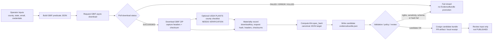

<!-- [KFM_META_BLOCK_V2]
doc_id: kfm://doc/TODO-verify-county-connector-readme-uuid
title: County Connector
type: standard
version: v1
status: draft
owners: TODO-verify-owner
created: TODO-verify-created-date-on-commit
updated: 2026-05-06
policy_label: TODO-verify-policy-label
related: [../../../README.md, ../../../contracts/source/kansas_flora/gbif.md, ../../../docs/domains/fauna/sources/gbif/GBIF_OCCURRENCE_INGESTION.md, ../../../pipelines/kansas_biodiversity_etl/README.md, ../../../schemas/evidence/gbif_evidencebundle.schema.json, ../../../policy/fauna/gbif_publication.rego, ../../validators/ecology/README.md]
tags: [kfm, tools, ingest, county, gbif, flora, fauna, usda-plants, evidencebundle, cosign, source-edge]
notes: [README-like directory doc for an existing but previously empty target path. run.sh, evidencebundle.schema.json, workflow path, owners, policy label, USDA PLANTS exact download file, and CI enforcement remain NEEDS VERIFICATION. This helper emits candidate evidence and receipts only; it does not publish truth.]
[/KFM_META_BLOCK_V2] -->

# County Connector

Source-edge helper for producing county-scoped GBIF / USDA PLANTS candidate evidence, materiality receipts, and a tiny KFM EvidenceBundle without asserting public truth.

<a id="top"></a>

> [!IMPORTANT]
> **Status:** `experimental` / `draft`  
> **Owners:** `TODO-verify-owner`  
> **Path:** `tools/ingest/county-connector/README.md`  
> **Truth posture:** `CONFIRMED` empty target README path / `CONFIRMED` KFM GBIF doctrine / `PROPOSED` helper implementation  
> **Review burden:** maintainers must verify owners, credentials handling, USDA PLANTS source file, schema alignment, policy label, signing identity, CI path, and promotion boundaries before treating this helper as active.
>
> 
> 
> 
> 
> 
> 
>
> **Quick jumps:** [Scope](#scope) · [Repo fit](#repo-fit) · [Accepted inputs](#accepted-inputs) · [Exclusions](#exclusions) · [Directory tree](#directory-tree) · [Flow](#flow) · [Quickstart](#quickstart-proposed) · [EvidenceBundle](#evidencebundle-contract) · [CI signing](#ci-signing-proposed) · [Validation](#validation-gates) · [Rights](#rights-sensitivity-and-citation) · [Definition of done](#definition-of-done) · [Open verification](#open-verification)

---

## Scope

`tools/ingest/county-connector/` is a **source-edge helper lane** for county-scoped ecology intake experiments.

It may help operators request a GBIF occurrence download, capture materiality receipts, optionally crosswalk local USDA PLANTS county membership, compute a deterministic `kfm:spec_hash`, and emit a small candidate `EvidenceBundle`.

It must not become a hidden publication lane.

```text
RAW source request -> candidate receipt -> candidate EvidenceBundle -> validation / policy / signing -> review
```

This helper is intentionally bounded:

| It may do | It must not do |
|---|---|
| Build a reviewed GBIF occurrence download predicate. | Scrape GBIF web pages or bypass official download/API paths. |
| Request and poll a GBIF async occurrence download. | Treat a completed download as public truth. |
| Capture `downloadKey`, request JSON, response metadata, headers, checksums, and optional USDA checklist digests. | Commit credentials, live source zips, raw sensitive data, or private steward material. |
| Emit a candidate `evidencebundle.json` for review and signing. | Promote artifacts to `PUBLISHED`, MapLibre layers, Focus Mode answers, or public APIs. |
| Support fixture-backed CI and local review. | Replace source contracts, schemas, policy, catalog closure, release manifests, or steward review. |

> [!WARNING]
> A signed `evidencebundle.json` is process memory and integrity support. It is **not** a release manifest, source-rights approval, sensitivity approval, or public publication decision.

[Back to top](#top)

---

## Repo fit

This README sits under `tools/`, which KFM treats as a governed helper surface. Durable truth remains with source contracts, schemas, policy, receipts, catalog/proof closure, release manifests, and review records.

| Relationship | Path | Role | Status |
|---|---|---|---|
| This document | `tools/ingest/county-connector/README.md` | Directory README for the county connector helper | `CONFIRMED` target path; previous content effectively empty |
| Root doctrine | [`../../../README.md`](../../../README.md) | KFM trust law and lifecycle posture | `CONFIRMED` |
| GBIF flora source contract | [`../../../contracts/source/kansas_flora/gbif.md`](../../../contracts/source/kansas_flora/gbif.md) | GBIF authority boundary for Kansas Flora | `CONFIRMED` |
| GBIF fauna ingestion slice | [`../../../docs/domains/fauna/sources/gbif/GBIF_OCCURRENCE_INGESTION.md`](../../../docs/domains/fauna/sources/gbif/GBIF_OCCURRENCE_INGESTION.md) | Fixture-backed GBIF normalization and EvidenceBundle doctrine | `CONFIRMED` |
| Biodiversity ETL lane | [`../../../pipelines/kansas_biodiversity_etl/README.md`](../../../pipelines/kansas_biodiversity_etl/README.md) | Broader occurrence pipeline lifecycle pattern | `CONFIRMED` |
| GBIF EvidenceBundle schema | [`../../../schemas/evidence/gbif_evidencebundle.schema.json`](../../../schemas/evidence/gbif_evidencebundle.schema.json) | Existing schema surface for GBIF EvidenceBundle validation | `CONFIRMED` by repo search; field alignment still `NEEDS VERIFICATION` |
| GBIF publication policy | [`../../../policy/fauna/gbif_publication.rego`](../../../policy/fauna/gbif_publication.rego) | Existing Rego publication-policy surface | `CONFIRMED` by repo search; connector use still `NEEDS VERIFICATION` |
| Ecology validators | [`../../validators/ecology/README.md`](../../validators/ecology/README.md) | Adjacent validator lane for ecology tooling | `CONFIRMED` by repo search; direct integration `NEEDS VERIFICATION` |
| Proposed run script | `tools/ingest/county-connector/run.sh` | Local/operator entrypoint | `PROPOSED` |
| Proposed evidence schema | `tools/ingest/county-connector/evidencebundle.schema.json` | Tiny local shape guard for helper output, if needed | `PROPOSED` |
| Proposed CI workflow | `.github/workflows/county-connector-evidencebundle.yml` | PR-time signature bundle generation for candidate evidence | `PROPOSED` |

### Boundary rule

`tools/ingest/county-connector/` may prepare evidence for review. It does not own:

- source authority;
- source terms;
- schema law;
- public policy;
- geoprivacy decisions;
- catalog closure;
- release promotion;
- correction lineage;
- public API behavior;
- MapLibre layer exposure;
- Focus Mode answers.

[Back to top](#top)

---

## Accepted inputs

The helper accepts inputs only when they can be recorded, replayed, checked, and reviewed.

| Input | Required? | Notes |
|---|---:|---|
| `COUNTY` | yes | County name as source-facing text. Example: `Sedgwick`. Validate casing and provider behavior before relying on counts. |
| `STATE_PROVINCE` | yes | Prefer source-facing value such as `Kansas` unless a reviewed predicate proves an abbreviation is intended. |
| `COUNTRY` | yes | Default `US`. |
| `EMAIL` | yes for GBIF download requests | GBIF download requests include notification email metadata. |
| `GBIF_USER` | yes for live download request | Store in environment or secret manager only. |
| `GBIF_PASSWORD` | yes for live download request | Never commit. Never echo in logs. |
| GBIF predicate JSON | yes | Store exact request JSON and hash it. |
| GBIF `downloadKey` | yes after request | Required receipt field for async download traceability. |
| GBIF download status | yes | `SUCCEEDED` is required before artifact download. |
| GBIF archive artifact | yes after success | Store outside tracked source unless fixture policy explicitly permits a tiny synthetic sample. |
| Artifact checksum | yes | Required for materiality and replay. |
| Headers / materiality metadata | preferred | Capture `ETag`, `Last-Modified`, and response headers when provided. |
| GBIF citation / DOI context | required before publication | Candidate evidence can exist without publication; public release needs citable download context. |
| USDA PLANTS checklist CSV | optional / `NEEDS VERIFICATION` | Exact file, source URL, date, fields, and rights posture must be verified before activation. |
| Local fixture CSV | allowed | Use for no-network tests and negative fixtures. |
| Run profile | preferred | Record retry, poll, batch, and timeout behavior. |

> [!NOTE]
> USDA PLANTS handling is optional in this helper. If the official checklist file or county-membership fields cannot be verified for the run, omit the USDA branch and mark the EvidenceBundle `usda_plants.status = "NEEDS_VERIFICATION"`.

[Back to top](#top)

---

## Exclusions

Do **not** put these in this directory or produce them from this helper as if they were released KFM truth.

| Excluded item | Why | Prefer |
|---|---|---|
| GBIF usernames, passwords, tokens, cookies, or private credentials | Secret material must not live in repo docs or generated artifacts | Environment variables, GitHub secrets, secret manager |
| Live GBIF ZIP downloads committed to source | Bulk source data belongs in lifecycle stores or external artifact storage, not helper code | `data/raw/` or artifact store after repo policy verification |
| RAW / WORK / QUARANTINE data exposed to public clients | Violates KFM trust membrane | Governed API over released artifacts only |
| Public exact sensitive species locations | Ecology and biodiversity data carry geoprivacy burden | Generalized, aggregated, restricted, denied, or steward-reviewed derivatives |
| GBIF occurrence records used as legal protected-status authority | GBIF is an occurrence aggregator, not Kansas legal-status authority | Steward/status source contracts |
| USDA images or third-party materials without rights review | USDA pages may include non-public-domain third-party content | Rights review and source descriptor |
| AI-generated county summaries without EvidenceBundle resolution | KFM AI is interpretive only | Cite-or-abstain runtime over released evidence |
| Publication manifests | This helper is not a release lane | `release/` or verified release-manifest home |
| Source contracts or source-role registry entries | This README does not define source authority | `contracts/`, `data/registry/`, or verified registry home |
| Schema authority | Local shape checks cannot override canonical schemas | `schemas/` / `schemas/contracts/v1/` after ADR verification |

[Back to top](#top)

---

## Directory tree

### Current state

```text
tools/ingest/county-connector/
└── README.md        # CONFIRMED target path; previous content was effectively empty
```

### Proposed helper shape

```text
tools/ingest/county-connector/
├── README.md                    # this file
├── run.sh                       # PROPOSED local/operator wrapper
├── evidencebundle.schema.json   # PROPOSED tiny local guard, if canonical schema does not already cover helper output
├── .env.example                 # PROPOSED safe variable names only; no values
└── .gitignore                   # PROPOSED ignores out/, *.zip, credentials, and local receipts
```

### Proposed generated outputs

Generated outputs should default to an ignored local directory unless repository lifecycle paths are explicitly verified.

```text
tools/ingest/county-connector/out/
└── Kansas/
    └── Sedgwick/
        └── 20260506T000000Z/
            ├── query.json
            ├── query.sha256
            ├── downloadKey.txt
            ├── gbif_head.meta
            ├── gbif_<downloadKey>.zip
            ├── gbif_<downloadKey>.zip.sha256
            ├── plants_checklist.meta.json          # optional / NEEDS VERIFICATION
            ├── evidencebundle.json
            └── evidencebundle.json.sigstore.json   # CI/local signing output
```

> [!CAUTION]
> The generated-output tree is `PROPOSED`. Confirm repository data-lifecycle conventions before moving any artifact into `data/raw/`, `data/work/`, `data/receipts/`, `data/proofs/`, or a CI artifact store.

[Back to top](#top)

---

## Flow



### KFM lifecycle placement

```text
SOURCE EDGE HELPER
  -> candidate receipt
  -> candidate EvidenceBundle
  -> validation / policy / signing
  -> steward or maintainer review

NOT:
  -> public truth
  -> released layer
  -> Focus Mode answer
  -> publication manifest
```

[Back to top](#top)

---

## Quickstart PROPOSED

These commands describe the intended local flow. They are `PROPOSED` until `run.sh`, `.env.example`, output rules, and canonical schema integration are committed and reviewed.

### 1. Prepare local environment

```bash
cd "$(git rev-parse --show-toplevel)"

cd tools/ingest/county-connector

export COUNTY="Sedgwick"
export STATE_PROVINCE="Kansas"
export COUNTRY="US"
export EMAIL="you@example.org"

# Store these in your shell, password manager, or CI secret store.
# Do not commit them.
export GBIF_USER="your_gbif_username"
export GBIF_PASSWORD="your_gbif_password"

RUN_ID="$(date -u +%Y%m%dT%H%M%SZ)"
OUT_DIR="out/${STATE_PROVINCE// /_}/${COUNTY// /_}/${RUN_ID}"
mkdir -p "${OUT_DIR}"
```

### 2. Build a GBIF download predicate

```bash
jq -n \
  --arg creator "${GBIF_USER}" \
  --arg email "${EMAIL}" \
  --arg country "${COUNTRY}" \
  --arg stateProvince "${STATE_PROVINCE}" \
  --arg county "${COUNTY}" \
  '{
    creator: $creator,
    notificationAddresses: [$email],
    sendNotification: true,
    format: "SIMPLE_CSV",
    predicate: {
      type: "and",
      predicates: [
        {type: "equals", key: "COUNTRY", value: $country},
        {type: "equals", key: "STATE_PROVINCE", value: $stateProvince},
        {type: "equals", key: "COUNTY", value: $county}
      ]
    }
  }' > "${OUT_DIR}/query.json"

sha256sum "${OUT_DIR}/query.json" > "${OUT_DIR}/query.sha256"
```

> [!NOTE]
> GBIF download predicates use uppercase enum-like keys such as `STATE_PROVINCE`. Predicate values are source-facing data values. Confirm whether `Kansas`, `KS`, or another value is correct for the run before interpreting zero counts.

### 3. Request the GBIF async download

```bash
DOWNLOAD_KEY="$(
  curl -fsS \
    --user "${GBIF_USER}:${GBIF_PASSWORD}" \
    -H "Content-Type: application/json" \
    --data @"${OUT_DIR}/query.json" \
    "https://api.gbif.org/v1/occurrence/download/request" \
  | tr -d '"' \
  | tr -d '[:space:]'
)"

printf '%s\n' "${DOWNLOAD_KEY}" > "${OUT_DIR}/downloadKey.txt"
```

### 4. Poll until the download succeeds or fails closed

```bash
while true; do
  status="$(
    curl -fsS "https://api.gbif.org/v1/occurrence/download/${DOWNLOAD_KEY}" \
    | jq -r '.status'
  )"

  printf 'GBIF download %s status=%s\n' "${DOWNLOAD_KEY}" "${status}"

  case "${status}" in
    SUCCEEDED)
      break
      ;;
    KILLED|FAILED|CANCELLED|ERROR)
      echo "GBIF download failed closed: ${status}" >&2
      exit 2
      ;;
    *)
      sleep 20
      ;;
  esac
done
```

### 5. Download the artifact and capture materiality metadata

```bash
GBIF_ZIP_URL="https://api.gbif.org/occurrence/download/request/${DOWNLOAD_KEY}.zip"
GBIF_ZIP_PATH="${OUT_DIR}/gbif_${DOWNLOAD_KEY}.zip"

curl -fsSI "${GBIF_ZIP_URL}" | tee "${OUT_DIR}/gbif_head.meta"
curl -fL "${GBIF_ZIP_URL}" -o "${GBIF_ZIP_PATH}"

sha256sum "${GBIF_ZIP_PATH}" | tee "${GBIF_ZIP_PATH}.sha256"
```

### 6. Optional USDA PLANTS crosswalk

```bash
# NEEDS VERIFICATION:
# Save the reviewed USDA PLANTS county checklist CSV as a local, ignored artifact.
# Exact source URL, file name, fields, and date must be recorded before activation.

PLANTS_CSV="${OUT_DIR}/plants_checklist.csv"

if [ -f "${PLANTS_CSV}" ]; then
  sha256sum "${PLANTS_CSV}" | tee "${PLANTS_CSV}.sha256"
  jq -n \
    --arg status "operator_supplied_needs_review" \
    --arg file "$(basename "${PLANTS_CSV}")" \
    --arg sha256 "$(cut -d ' ' -f1 "${PLANTS_CSV}.sha256")" \
    '{status: $status, file: $file, sha256: $sha256}' \
    > "${OUT_DIR}/plants_checklist.meta.json"
else
  jq -n \
    '{status: "omitted_needs_verification", reason: "USDA PLANTS checklist CSV was not supplied for this run"}' \
    > "${OUT_DIR}/plants_checklist.meta.json"
fi
```

### 7. Write a tiny candidate EvidenceBundle

```bash
python3 - "${OUT_DIR}" "${DOWNLOAD_KEY}" <<'PY'
import datetime
import hashlib
import json
import pathlib
import sys

out_dir = pathlib.Path(sys.argv[1])
download_key = sys.argv[2]

def sha256_file(path: pathlib.Path) -> str:
    h = hashlib.sha256()
    with path.open("rb") as f:
        for chunk in iter(lambda: f.read(1024 * 1024), b""):
            h.update(chunk)
    return h.hexdigest()

def read_text(path: pathlib.Path) -> str:
    return path.read_text(encoding="utf-8") if path.exists() else ""

query_path = out_dir / "query.json"
zip_path = out_dir / f"gbif_{download_key}.zip"
plants_meta_path = out_dir / "plants_checklist.meta.json"

plants_meta = json.loads(read_text(plants_meta_path) or '{"status":"omitted"}')

spec = {
    "bundle_type": "kfm.county_connector.candidate.v1",
    "source_edge": "tools/ingest/county-connector",
    "public_release": False,
    "promotion_required": True,
    "gbif": {
        "download_key": download_key,
        "request_sha256": sha256_file(query_path),
        "artifact_file": zip_path.name,
        "artifact_sha256": sha256_file(zip_path),
        "head_meta_file": "gbif_head.meta"
    },
    "usda_plants": plants_meta,
    "policy": {
        "rights_review_required": True,
        "sensitivity_review_required": True,
        "exact_sensitive_geometry_publication": "deny_until_policy_review",
        "runtime_truth": "candidate_only"
    }
}

# Minimal stable JSON canonicalization for this tiny helper.
# Replace with the repo-approved RFC 8785 / JCS implementation before production use.
canonical = json.dumps(spec, sort_keys=True, separators=(",", ":"), ensure_ascii=False).encode("utf-8")
spec_hash = hashlib.sha256(canonical).hexdigest()

bundle = {
    "kfm:spec_hash": spec_hash,
    "generated_at": datetime.datetime.now(datetime.timezone.utc).isoformat().replace("+00:00", "Z"),
    **spec
}

bundle_path = out_dir / "evidencebundle.json"
bundle_path.write_text(
    json.dumps(bundle, indent=2, sort_keys=True, ensure_ascii=False) + "\n",
    encoding="utf-8"
)

print(bundle_path)
print(spec_hash)
PY
```

[Back to top](#top)

---

## EvidenceBundle contract

The helper’s output is intentionally small. It should be enough for review, signing, and replay, not enough to claim publication readiness.

| Field family | Required? | Purpose |
|---|---:|---|
| `kfm:spec_hash` | yes | Stable digest over source-edge materiality fields. |
| `bundle_type` | yes | Distinguishes this candidate helper bundle from canonical production EvidenceBundles. |
| `source_edge` | yes | Records the helper path that emitted the candidate. |
| `public_release` | yes | Must be `false` for this helper. |
| `promotion_required` | yes | Must be `true`; publication remains a separate transition. |
| `gbif.download_key` | yes | Links candidate bundle to GBIF async download. |
| `gbif.request_sha256` | yes | Records exact predicate materiality. |
| `gbif.artifact_sha256` | yes | Records downloaded artifact materiality. |
| `gbif.head_meta_file` | preferred | Captures materiality headers when available. |
| `usda_plants.status` | yes when USDA branch is omitted or included | Avoids silently implying USDA crosswalk was performed. |
| `policy.rights_review_required` | yes | Prevents license columns/source terms from being bypassed. |
| `policy.sensitivity_review_required` | yes | Prevents exact sensitive locality publication by helper output. |
| `generated_at` | yes | Process memory; not part of stable `spec_hash`. |

### Example candidate bundle shape

```json
{
  "bundle_type": "kfm.county_connector.candidate.v1",
  "generated_at": "2026-05-06T00:00:00Z",
  "gbif": {
    "artifact_file": "gbif_0000000-000000000000000.zip",
    "artifact_sha256": "sha256-hex",
    "download_key": "0000000-000000000000000",
    "head_meta_file": "gbif_head.meta",
    "request_sha256": "sha256-hex"
  },
  "kfm:spec_hash": "sha256-hex",
  "policy": {
    "exact_sensitive_geometry_publication": "deny_until_policy_review",
    "rights_review_required": true,
    "runtime_truth": "candidate_only",
    "sensitivity_review_required": true
  },
  "promotion_required": true,
  "public_release": false,
  "source_edge": "tools/ingest/county-connector",
  "usda_plants": {
    "status": "omitted_needs_verification",
    "reason": "USDA PLANTS checklist CSV was not supplied for this run"
  }
}
```

[Back to top](#top)

---

## CI signing PROPOSED

Copy this into `.github/workflows/county-connector-evidencebundle.yml` only after maintainers approve PR-time signing behavior.

```yaml
name: county-connector-evidencebundle

on:
  pull_request:
    paths:
      - "tools/ingest/county-connector/**"
  workflow_dispatch:

permissions:
  contents: read
  id-token: write

jobs:
  sign-evidencebundle:
    name: Sign candidate county connector EvidenceBundle
    runs-on: ubuntu-latest

    steps:
      - name: Check out repository
        uses: actions/checkout@v4

      - name: Install cosign
        uses: sigstore/cosign-installer@v4.1.0

      - name: Locate candidate EvidenceBundle
        id: bundle
        shell: bash
        run: |
          set -euo pipefail

          candidates=(
            "tools/ingest/county-connector/out/evidencebundle.json"
            "tools/ingest/county-connector/evidencebundle.json"
          )

          for path in "${candidates[@]}"; do
            if [ -f "${path}" ]; then
              echo "path=${path}" >> "${GITHUB_OUTPUT}"
              echo "Found candidate EvidenceBundle: ${path}"
              exit 0
            fi
          done

          echo "path=" >> "${GITHUB_OUTPUT}"
          echo "::notice::No candidate evidencebundle.json found; skipping signing."

      - name: Compute candidate digest
        if: ${{ steps.bundle.outputs.path != '' }}
        shell: bash
        run: |
          set -euo pipefail
          sha256sum "${{ steps.bundle.outputs.path }}" \
            | tee "${{ steps.bundle.outputs.path }}.sha256"

      - name: Sign candidate EvidenceBundle with GitHub OIDC
        if: ${{ steps.bundle.outputs.path != '' }}
        shell: bash
        run: |
          set -euo pipefail
          cosign sign-blob --yes \
            --bundle "${{ steps.bundle.outputs.path }}.sigstore.json" \
            "${{ steps.bundle.outputs.path }}"

      - name: Verify candidate signature
        if: ${{ steps.bundle.outputs.path != '' }}
        shell: bash
        run: |
          set -euo pipefail
          cosign verify-blob \
            --bundle "${{ steps.bundle.outputs.path }}.sigstore.json" \
            --certificate-identity-regexp "https://github.com/${GITHUB_REPOSITORY}/.github/workflows/.*" \
            --certificate-oidc-issuer "https://token.actions.githubusercontent.com" \
            "${{ steps.bundle.outputs.path }}"

      - name: Upload signed candidate artifacts
        if: ${{ steps.bundle.outputs.path != '' }}
        uses: actions/upload-artifact@v4
        with:
          name: county-connector-evidencebundle
          if-no-files-found: error
          path: |
            ${{ steps.bundle.outputs.path }}
            ${{ steps.bundle.outputs.path }}.sha256
            ${{ steps.bundle.outputs.path }}.sigstore.json
```

> [!CAUTION]
> PR-time signing is an integrity receipt for review. It is not release approval. Before using this workflow as a required check, tighten the certificate identity rule, decide how forked PRs are handled, and verify whether generated artifacts should be uploaded, retained, or moved into a lifecycle store.

[Back to top](#top)

---

## Validation gates

| Gate | Check | Pass condition | Fail behavior |
|---|---|---|---|
| G0 | Owner / policy label | `owners` and `policy_label` verified | Keep doc in draft |
| G1 | Credential hygiene | No GBIF credentials, tokens, cookies, or secrets committed | Fail CI / block merge |
| G2 | Predicate review | GBIF predicate JSON is present, hashed, scoped to county/state/country, and reviewable | Block live request |
| G3 | GBIF async status | Download status is `SUCCEEDED` before artifact retrieval | Fail closed |
| G4 | Materiality capture | `downloadKey`, request hash, artifact checksum, retrieval time, and headers are recorded | Block candidate bundle |
| G5 | GBIF citation readiness | Download DOI/citation plan is recorded before any publication step | Deny public release |
| G6 | License posture | GBIF row/dataset license handling is explicit | Quarantine / deny public release |
| G7 | USDA branch | USDA PLANTS exact source file, fields, date, and rights are verified or branch is marked omitted | Mark `NEEDS_VERIFICATION` |
| G8 | Sensitivity / geoprivacy | No exact sensitive location is made public by this helper | Deny exact public geometry |
| G9 | Hash determinism | `kfm:spec_hash` recomputes over stable materiality fields | Fail candidate bundle |
| G10 | Schema alignment | Candidate bundle validates against local or canonical schema | Fail candidate bundle |
| G11 | Signature | Cosign bundle exists and verifies under approved OIDC identity | Review required |
| G12 | Promotion boundary | No output is moved to `PUBLISHED` or public API/layer paths by this helper | Block merge |

### Negative fixtures to add

Add fixture cases before treating the helper as stable:

- missing GBIF license metadata;
- failed GBIF download status;
- missing `downloadKey`;
- stale or mismatched `kfm:spec_hash`;
- missing artifact checksum;
- USDA checklist supplied without source metadata;
- exact sensitive coordinate attempting public posture;
- malformed predicate key such as `stateProvince` instead of `STATE_PROVINCE`;
- generated bundle with `public_release = true`.

[Back to top](#top)

---

## Rights, sensitivity, and citation

### GBIF

GBIF-mediated occurrence outputs must preserve dataset/source rights and citation obligations. The helper should record enough metadata to support later citation and rights review, but it should not decide public release by itself.

Minimum posture:

| Topic | Helper behavior |
|---|---|
| Download citation | Record `downloadKey`; require DOI/citation context before publication. |
| Licenses | Preserve license fields and block public posture when missing, unknown, or incompatible. |
| Dataset attribution | Preserve dataset key, publisher, rights holder, and citation metadata when available. |
| Sensitive geometry | Deny exact public sensitive coordinates until policy/steward review explicitly allows a safe derivative. |
| Media | Do not reuse GBIF-linked media without separate media-license review. |

### USDA PLANTS

USDA PLANTS data may be useful for county-level plant membership checks, but this helper does not currently verify the exact official bulk-download file or field layout.

Minimum posture:

| Topic | Helper behavior |
|---|---|
| Official file | `NEEDS VERIFICATION` before automation. |
| County membership fields | `NEEDS VERIFICATION` before crosswalk claims. |
| Rights | Treat USDA public-domain posture as a starting point only; verify exceptions and non-USDA materials. |
| Images / third-party materials | Excluded unless separately rights-reviewed. |
| Publication | USDA crosswalk support does not replace EvidenceBundle, policy, review, or release. |

[Back to top](#top)

---

## Maintainer workflow

Use this helper in three modes.

| Mode | Network? | Intended use | Publication posture |
|---|---:|---|---|
| Fixture mode | no | CI-safe tests, negative fixtures, schema/hash determinism | no publication |
| Candidate mode | yes, operator-approved | GBIF async download request and candidate bundle generation | no publication |
| Review handoff | no | Signed `evidencebundle.json` and receipt artifacts for maintainer/steward review | no publication |

### Recommended local checks

```bash
# Confirm no secrets were accidentally added.
grep -RInE '(GBIF_PASSWORD|api[_-]?key|secret|token|password=)' . \
  --exclude-dir=.git \
  --exclude='README.md' && {
    echo "Possible secret-like text found." >&2
    exit 1
  } || true

# Confirm generated heavyweight artifacts are ignored.
git status --short
git check-ignore -v tools/ingest/county-connector/out 2>/dev/null || {
  echo "out/ ignore rule is not verified." >&2
  exit 1
}

# Recompute candidate bundle digest if present.
test ! -f tools/ingest/county-connector/out/evidencebundle.json || \
  sha256sum tools/ingest/county-connector/out/evidencebundle.json
```

[Back to top](#top)

---

## Definition of done

Before this README or helper is promoted from `draft` to `review`, complete:

- [ ] Assign a real `doc_id`.
- [ ] Verify owner / CODEOWNERS responsibility.
- [ ] Verify `policy_label`.
- [ ] Add or verify `.gitignore` for `out/`, `*.zip`, local credentials, and generated receipts.
- [ ] Add `run.sh` or adjust this README to the actual entrypoint.
- [ ] Add `.env.example` with safe variable names only.
- [ ] Verify GBIF predicate values for Kansas county use.
- [ ] Capture GBIF request JSON, `downloadKey`, status, headers, artifact checksum, and citation context.
- [ ] Verify exact USDA PLANTS source file, field names, date, and rights posture or keep USDA branch omitted.
- [ ] Align candidate `evidencebundle.json` with canonical KFM EvidenceBundle schema expectations.
- [ ] Add valid and negative fixtures.
- [ ] Add no-network CI for fixture validation.
- [ ] Add or approve the proposed cosign workflow.
- [ ] Verify signature identity rules and artifact retention.
- [ ] Confirm this helper cannot publish, promote, or expose public exact sensitive locations.
- [ ] Link neighboring docs if maintainers accept this helper as part of the ecology/fauna/flora intake surface.

[Back to top](#top)

---

## Open verification

| Item | Status | Why it matters |
|---|---:|---|
| Target file existed before this draft | `CONFIRMED` | It was effectively empty, so this is a substantive fill rather than a revision of existing content. |
| `run.sh` existence | `NEEDS VERIFICATION` | README quickstart is proposed until the script exists. |
| Local `evidencebundle.schema.json` | `PROPOSED` | Canonical schema may already cover helper output. Avoid duplicate schema authority. |
| Owner | `NEEDS VERIFICATION` | Required for review and meta block. |
| `policy_label` | `NEEDS VERIFICATION` | Required for document classification. |
| USDA PLANTS bulk download file | `NEEDS VERIFICATION` | Official page/file and current availability must be checked before automation. |
| GBIF state/county predicate values | `NEEDS VERIFICATION` | `Kansas` vs `KS` and county casing can affect query results. |
| GBIF DOI / citation capture path | `NEEDS VERIFICATION` | Required before publication. |
| RFC 8785 / JCS implementation | `NEEDS VERIFICATION` | The quickstart uses a minimal stable JSON fallback, not audited canonical JSON. |
| CI workflow path | `PROPOSED` | Needs maintainer approval before commit. |
| Cosign version pin | `NEEDS VERIFICATION` | Pin should follow repo dependency policy. |
| Fork PR signing behavior | `NEEDS VERIFICATION` | GitHub OIDC behavior and security posture must be reviewed. |
| Lifecycle storage path | `NEEDS VERIFICATION` | Generated outputs should remain ignored until lifecycle homes are confirmed. |

[Back to top](#top)

---

## References

<details>
<summary>External implementation references</summary>

- [GBIF API downloads](https://techdocs.gbif.org/en/data-use/api-downloads)
- [GBIF occurrence download formats](https://techdocs.gbif.org/en/data-use/download-formats)
- [GBIF citation guidelines](https://www.gbif.org/citation-guidelines)
- [Sigstore quickstart with cosign](https://docs.sigstore.dev/quickstart/quickstart-cosign/)
- [cosign-installer GitHub Action](https://github.com/sigstore/cosign-installer)
- [RFC 8785 — JSON Canonicalization Scheme](https://www.rfc-editor.org/rfc/rfc8785)
- [USDA policies and links](https://www.usda.gov/policies-and-links)

</details>

[Back to top](#top)
