<!-- [KFM_META_BLOCK_V2]
doc_id: kfm://doc/NEEDS-VERIFICATION-tools-ingest-genealogy-readme
title: Genealogy Ingest Tools
type: standard
version: v1
status: draft
owners: <NEEDS_VERIFICATION: tools/genealogy owner>
created: <NEEDS_VERIFICATION: YYYY-MM-DD>
updated: 2026-04-23
policy_label: restricted
related: [../README.md, ../../README.md, ../../../README.md, ../../validators/genealogy/README.md, ../../derivations/genealogy/README.md, ../../../docs/runbooks/genealogy_thin_slice.md, ../../../schemas/genealogy/README.md, ../../../contracts/source/genealogy/README.md, ../../../policy/genealogy/README.md, ../../../tests/fixtures/genealogy/README.md]
tags: [kfm, tools, ingest, genealogy, gedcom, evidence-bundle, consent, revocation, privacy, thin-slice]
notes: [Drafted from KFM genealogy and pipeline doctrine; target repository was not mounted in the authoring session, so file presence, command inventory, owner, created date, and adjacent README links remain NEEDS VERIFICATION before merge.]
[/KFM_META_BLOCK_V2] -->

<a id="top"></a>

# Genealogy Ingest Tools

Evidence-bounded parsing and canonical-event construction for governed genealogy thin slices.

> [!IMPORTANT]
> **Status:** experimental  
> **Owners:** `<NEEDS_VERIFICATION: tools/genealogy owner>`  
> **Path:** `tools/ingest/genealogy/README.md`  
> **Repo fit:** execution-facing ingest lane under `tools/`, upstream of genealogy validators, derivations, fixtures, policy gates, and any public-safe publication artifacts.  
> **Quick jumps:** [Scope](#scope) · [Repo fit](#repo-fit) · [Accepted inputs](#accepted-inputs) · [Exclusions](#exclusions) · [Directory tree](#directory-tree) · [Quickstart](#quickstart) · [Usage](#usage) · [Diagram](#diagram) · [Reference tables](#reference-tables) · [Task list](#task-list--definition-of-done) · [FAQ](#faq) · [Appendix](#appendix)


> [!WARNING]
> **NEEDS VERIFICATION:** this README is repo-ready but source-bounded. It is drafted from the attached KFM corpus and genealogy thin-slice planning materials. The active repository tree, command files, package manager, test runner, `CODEOWNERS`, and adjacent README paths must be verified before merge.

---

## Scope

`tools/ingest/genealogy/` is the ingest-side utility lane for **genealogy evidence intake**.

Its job is to turn source-bound genealogy payloads into reviewable, evidence-referenced intermediate and processed records without leaking direct identifiers, bypassing consent, or treating derived events as published truth.

This lane is responsible for:

- verifying that an input payload is attached to an admissible `EvidenceBundle`;
- parsing GEDCOM-style genealogy material into raw event rows;
- constructing canonical event rows with pseudonymous keys and explicit `evidence_ref`;
- emitting restricted sidecar mappings only for controlled review/debug use;
- preserving fail-closed behavior for consent, revocation, living-person exposure, and source-rights uncertainty.

This lane is **not** the source of public truth. In KFM terms, genealogy ingest supports the governed path:

```text
SOURCE EDGE
  -> RAW
  -> WORK / QUARANTINE
  -> PROCESSED
  -> CATALOG / TRIPLET
  -> PUBLISHED
```

A genealogy event becomes public-facing only after evidence closure, policy checks, review state, release state, and public-safe transformation are satisfied.

[Back to top](#top)

---

## Repo fit

| Relationship | Path | Role | Status |
|---|---|---|---|
| This directory | `tools/ingest/genealogy/` | Genealogy ingest command home | `NEEDS VERIFICATION` |
| This README | `tools/ingest/genealogy/README.md` | Directory orientation and operating contract | `draft` |
| Parent ingest lane | [`../README.md`](../README.md) | Shared ingest conventions | `NEEDS VERIFICATION` |
| Parent tools lane | [`../../README.md`](../../README.md) | Cross-tooling rules and ownership | `NEEDS VERIFICATION` |
| Root README | [`../../../README.md`](../../../README.md) | KFM project orientation | `NEEDS VERIFICATION` |
| Downstream validators | [`../../validators/genealogy/README.md`](../../validators/genealogy/README.md) | Policy, schema, consent, revocation, and promotion checks | `PROPOSED / NEEDS VERIFICATION` |
| Downstream derivations | [`../../derivations/genealogy/README.md`](../../derivations/genealogy/README.md) | Place normalization and public-safe map artifact derivation | `PROPOSED / NEEDS VERIFICATION` |
| Runbook | [`../../../docs/runbooks/genealogy_thin_slice.md`](../../../docs/runbooks/genealogy_thin_slice.md) | End-to-end proof-lane command sequence | `PROPOSED / NEEDS VERIFICATION` |
| Schema lane | [`../../../schemas/genealogy/README.md`](../../../schemas/genealogy/README.md) | Event, sidecar, trust-key, and fixture schema notes | `PROPOSED / NEEDS VERIFICATION` |
| Source contracts | [`../../../contracts/source/genealogy/README.md`](../../../contracts/source/genealogy/README.md) | EvidenceBundle and source descriptor contracts | `PROPOSED / NEEDS VERIFICATION` |
| Policy lane | [`../../../policy/genealogy/README.md`](../../../policy/genealogy/README.md) | Consent, living-person, DNA-publication, and revocation policy | `PROPOSED / NEEDS VERIFICATION` |
| Fixtures | [`../../../tests/fixtures/genealogy/README.md`](../../../tests/fixtures/genealogy/README.md) | Valid, invalid, redacted, and revocation fixtures | `PROPOSED / NEEDS VERIFICATION` |

> [!NOTE]
> Paths above are written as repo-relative expectations from this README location. Verify every linked path on the target branch before treating them as stable navigation.

[Back to top](#top)

---

## Accepted inputs

Material belongs in this lane only when it can be handled without weakening the KFM trust membrane.

| Input | Belongs here when… | Required guardrail |
|---|---|---|
| GEDCOM payload | The source is hashable, evidence-bound, and intended for genealogy event parsing | Must be paired with an `EvidenceBundle` or equivalent source evidence record |
| GEDZip-style manifest | The manifest describes genealogy evidence and does not smuggle raw DNA or unrelated land/title material | Must keep evidence, consent, and source-rights fields inspectable |
| Historical redacted fixture | It is synthetic, historical, or safely redacted for tests | Must not contain living-person direct identifiers |
| Trusted-key fixture | Used to prove DSSE/trust-boundary behavior in tests | Must not be confused with production trust roots |
| Revocation manifest | Used to deny or withdraw use of affected source material | Must be checked before publication or controlled lookup |
| Consent fixture | Used to verify scope, expiration, subject token, and allowed output | Missing, expired, or out-of-scope consent must deny restricted outputs |
| Source hash note | Captures content digest and source identity during intake | Must not substitute for a full source descriptor or EvidenceBundle |

### Minimum intake posture

Every accepted input should be able to answer:

1. **What source is this?**
2. **What evidence supports using it?**
3. **What rights, consent, sensitivity, or revocation limits apply?**
4. **What output classes are allowed?**
5. **What validator will fail closed if the answer is unknown?**

[Back to top](#top)

---

## Exclusions

| Does not belong here | Send it instead to… | Reason |
|---|---|---|
| Raw VCF files, DNA segment coordinates, kit IDs, vendor match IDs | `tools/ingest/dna/` | DNA is restricted by default and needs its own consent/publication boundary |
| Land instruments, deeds, assessor rows, legal descriptions | `tools/ingest/land_ownership/` | Land ownership assertions and title/source-role rules are a separate lane |
| Policy definitions | `policy/genealogy/` | Ingest tools consume policy results; they do not define policy law |
| Validator-only scripts | `tools/validators/genealogy/` | Validation behavior must remain inspectable and separately testable |
| Public map artifacts | `data/published/genealogy/` or a release-specific published path | Publication is a governed state, not an ingest side effect |
| Sidecar mappings in public paths | Nowhere public | Sidecars are restricted lookup material, not public evidence |
| Raw identifiers in processed or published outputs | Nowhere public | Public surfaces must not expose direct identifiers without explicit reviewed policy support |
| Unpublished candidate records | `data/work/genealogy/` or `data/quarantine/genealogy/` | Candidate material must not bypass validation, policy, or review |
| Secrets, production keys, KMS credentials | Secret manager / infra boundary | Never store secrets in repo Markdown, fixtures, logs, receipts, or sidecars |

> [!CAUTION]
> `write_sidecar.py` may be used in the thin slice to prove encrypted sidecar shape. Production use still requires verified key custody, KMS/HSM or approved equivalent, and reviewable access controls.

[Back to top](#top)

---

## Directory tree

The target directory shape is intentionally small. Treat this tree as **PROPOSED** until the active branch is inspected.

```text
tools/ingest/genealogy/
├── README.md
├── verify_evidence_bundle.py        # EvidenceBundle hash, DSSE/trust, and consent gate
├── parse_gedcom.py                  # GEDCOM -> raw event rows
├── build_canonical_events.py        # normalized rows -> evidence-referenced canonical events
├── write_sidecar.py                 # restricted encrypted sidecar writer
└── read_sidecar.py                  # controlled review/debug sidecar reader
```

Expected adjacent surfaces:

```text
tools/validators/genealogy/
├── validate_json.py
├── verify_dsse.py
├── verify_consent.py
└── promotion_gate.py

tools/derivations/genealogy/
├── normalize_place.py
├── build_tiles.py
└── build_pmtiles_manifest.py

tests/fixtures/genealogy/
├── sample.ged
├── sample_bundle.json
├── trusted_keys.json
└── revocations.allow.json
```

[Back to top](#top)

---

## Quickstart

> [!IMPORTANT]
> Quickstart commands are for fixture-backed proof work only. Verify dependency management, import paths, and actual filenames before running them against the target branch.

### 1. Verify the evidence bundle

```bash
python tools/ingest/genealogy/verify_evidence_bundle.py \
  --bundle tests/fixtures/genealogy/sample_bundle.json \
  --content tests/fixtures/genealogy/sample.ged \
  --trusted-keys tests/fixtures/genealogy/trusted_keys.json
```

Expected posture:

```text
PASS: evidence bundle verification
```

Failure should stop the flow. Do not parse, normalize, publish, or create sidecars from an unverified bundle.

### 2. Parse the GEDCOM payload

```bash
python tools/ingest/genealogy/parse_gedcom.py \
  --input tests/fixtures/genealogy/sample.ged \
  --output data/work/genealogy/raw_events.ndjson
```

### 3. Normalize place/event rows downstream

```bash
python tools/derivations/genealogy/normalize_place.py \
  --input data/work/genealogy/raw_events.ndjson \
  --output data/work/genealogy/normalized.ndjson
```

### 4. Build canonical processed events

```bash
python tools/ingest/genealogy/build_canonical_events.py \
  --input data/work/genealogy/normalized.ndjson \
  --output data/processed/genealogy/events.ndjson \
  --bundle-id bundle-demo-001 \
  --evidence-ref urn:sha256:demo-evidence-ref \
  --repo-salt demo-salt
```

### 5. Emit restricted sidecar mappings

```bash
python tools/ingest/genealogy/write_sidecar.py \
  --input data/work/genealogy/normalized.ndjson \
  --output data/work/genealogy/sidecar.ndjson \
  --repo-salt demo-salt \
  --kek-id local-dev-kek
```

> [!WARNING]
> A sidecar is restricted process material. It must not be copied into `data/published/`, release bundles, public tiles, public API responses, screenshots, logs, or Markdown examples.

[Back to top](#top)

---

## Usage

### Command responsibilities

| Command | Primary responsibility | Expected output | Truth label |
|---|---|---|---|
| `verify_evidence_bundle.py` | Verify payload hash, trust envelope, and consent obligations before ingest | PASS/ERROR plus no parsed data on failure | `PROPOSED / NEEDS VERIFICATION` |
| `parse_gedcom.py` | Extract source event rows from GEDCOM | `data/work/genealogy/raw_events.ndjson` | `PROPOSED / NEEDS VERIFICATION` |
| `build_canonical_events.py` | Attach pseudonymous key, `bundle_id`, `evidence_ref`, and canonical event fields | `data/processed/genealogy/events.ndjson` | `PROPOSED / NEEDS VERIFICATION` |
| `write_sidecar.py` | Emit encrypted sidecar mappings for restricted lookup | `data/work/genealogy/sidecar.ndjson` | `PROPOSED / NEEDS VERIFICATION` |
| `read_sidecar.py` | Resolve one sidecar row for controlled review/debug | JSON to stdout for authorized local review | `PROPOSED / NEEDS VERIFICATION` |

### Operating rules

- Do **not** parse genealogy material unless the bundle hash matches the payload.
- Do **not** emit canonical rows without `evidence_ref`.
- Do **not** publish or tile raw identifiers.
- Do **not** treat a GEDCOM relationship as a confirmed public claim without evidence and review.
- Do **not** use this lane for raw DNA or land-title parsing.
- Do **not** allow `read_sidecar.py` to become a public or routine API pathway.

### Output classes

| Output | Stage | Allowed? | Notes |
|---|---:|---|---|
| `raw_events.ndjson` | WORK | Yes, fixture/proof lane | Temporary parsing output; not public |
| `normalized.ndjson` | WORK | Yes, downstream derivation | Place/event normalization remains candidate until processed |
| `events.ndjson` | PROCESSED | Yes, if evidence-referenced | Must carry pseudonymous keys and `evidence_ref` |
| `sidecar.ndjson` | WORK / restricted | Yes, controlled only | Must be encrypted and excluded from public artifacts |
| `events.geojson` | PUBLISHED candidate | Only after policy and promotion | Must be generalized and identifier-safe |
| `events.pmtiles` or manifest | PUBLISHED candidate | Only after artifact integrity checks | Manifest is not itself proof of publication |

[Back to top](#top)

---

## Diagram

The diagram shows the intended thin-slice flow and responsibility boundaries. It is meaningful only after the active branch confirms the command inventory.

```mermaid
flowchart LR
    EB[EvidenceBundle] --> V[verify_evidence_bundle.py]
    GED[GEDCOM payload] --> V

    V -->|PASS| P[parse_gedcom.py]
    V -->|DENY / ERROR| Q[QUARANTINE or stop]

    P --> RAW[data/work/genealogy/raw_events.ndjson]
    RAW --> N[normalize_place.py<br/>tools/derivations/genealogy]

    N --> WN[data/work/genealogy/normalized.ndjson]
    WN --> C[build_canonical_events.py]
    WN --> S[write_sidecar.py<br/>restricted sidecar]

    C --> PROC[data/processed/genealogy/events.ndjson]
    PROC --> GATE[promotion_gate.py<br/>policy + evidence + identifier checks]
    S --> GATE

    GATE -->|PASS| PUB[data/published/genealogy/<br/>generalized artifacts]
    GATE -->|DENY / ABSTAIN / ERROR| HOLD[review / quarantine / correction]

    PUB --> API[Governed API]
    API --> UI[MapLibre / Evidence Drawer / Focus Mode]
```



[Back to top](#top)

---

## Reference tables

### Gate behavior

| Case | Expected outcome | Why |
|---|---|---|
| Missing `EvidenceBundle` | `DENY` | Source evidence is required before parsing can become meaningful |
| `EvidenceRef` does not resolve | `DENY` | Public claims must resolve back to evidence |
| Schema validation tool fails | `ERROR` | Tool failure is not a policy decision |
| Canonical row lacks `evidence_ref` | `DENY` | Ingest must not create orphaned assertions |
| Relationship claim has weak/candidate evidence only | `ABSTAIN` | KFM should avoid overstating uncertain genealogy hypotheses |
| Living person lacks consent | `DENY` | Living-person exposure fails closed |
| Recent record has unknown living status | `DENY` | Unknown living status remains privacy-sensitive |
| Source terms prohibit publication | `DENY` | Rights control public release |
| Raw kit ID, vendor match ID, or DNA segment appears in public output | `DENY` | DNA-derived identifiers are restricted by default |
| Sidecar is plaintext or malformed | `DENY` | Restricted lookup material must not leak direct identifiers |
| Revocation manifest blocks use | `DENY` | Revocation state controls downstream use |

### Lifecycle placement

| Lifecycle stage | Genealogy example | Public? | Notes |
|---|---|---:|---|
| SOURCE EDGE | Source descriptor, source hash, EvidenceBundle | No | Defines authority, rights, and sensitivity before ingest |
| RAW | Original GEDCOM payload | No | Immutable source capture; never public by default |
| WORK | `raw_events.ndjson`, `normalized.ndjson`, `sidecar.ndjson` | No | Temporary or restricted processing material |
| QUARANTINE | Invalid bundle, denied source, ambiguous claim | No | Reviewable blocked material |
| PROCESSED | `events.ndjson` with pseudonymous keys and evidence refs | No, unless promoted | Validated records still require catalog/release path |
| CATALOG / TRIPLET | Catalog records, graph projection edges | Not by themselves | Derived discovery/explanation surfaces |
| PUBLISHED | Generalized GeoJSON/PMTiles, release-backed artifacts | Yes, after gates | Must be identifier-safe and evidence-resolvable |

### Naming and placement rules

| Rule | Applies to | Required behavior |
|---|---|---|
| Keep source and claim separate | GEDCOM rows, EvidenceBundle, event records | Do not flatten evidence into parsed rows |
| Keep sidecars restricted | `write_sidecar.py`, `read_sidecar.py` | Never publish sidecar mappings |
| Keep validators separate | Promotion and policy gates | Put reusable validation behavior in `tools/validators/genealogy/` |
| Keep derivations separate | Place normalization, tile generation | Put map/public-safe transformations in `tools/derivations/genealogy/` |
| Keep policy authoritative elsewhere | Consent, living-person, revocation | This lane consumes policy outcomes; it does not define them |
| Keep outputs reversible and auditable | All commands | Emit deterministic artifacts and receipts where the repo pattern supports them |

[Back to top](#top)

---

## Task list — definition of done

Before this README is treated as merged guidance:

- [ ] Confirm `tools/ingest/genealogy/` exists on the target branch.
- [ ] Confirm or update owner metadata and `CODEOWNERS` coverage.
- [ ] Confirm parent and downstream README links.
- [ ] Confirm command inventory: `verify_evidence_bundle.py`, `parse_gedcom.py`, `build_canonical_events.py`, `write_sidecar.py`, and `read_sidecar.py`.
- [ ] Confirm dependency management for DSSE verification, JSON schema validation, and encryption helpers.
- [ ] Confirm fixtures exist for valid GEDCOM, invalid bundle, missing consent, revoked consent, recent unknown living status, and raw identifier leakage.
- [ ] Confirm canonical rows require `evidence_ref`.
- [ ] Confirm sidecar rows are encrypted and excluded from published paths.
- [ ] Confirm public artifact generation cannot access RAW, WORK, QUARANTINE, or sidecar material directly.
- [ ] Confirm policy tests deny living-person exposure without consent.
- [ ] Confirm promotion gate denies raw identifiers in published artifacts.
- [ ] Confirm failed validation returns `DENY`, `ABSTAIN`, or `ERROR` with reason codes instead of silently continuing.
- [ ] Record any schema-home or command-path mismatch in an ADR before changing paths.

[Back to top](#top)

---

## FAQ

### Is a GEDCOM file evidence?

A GEDCOM file can be a source payload, but it is not automatically public truth. In KFM, public-facing genealogy claims need source evidence, `EvidenceRef` resolution, source role, policy posture, review state, and release state.

### Can this lane ingest DNA files?

No. Raw DNA, VCF files, segment coordinates, kit IDs, and vendor match IDs belong in the restricted DNA lane. Genealogy ingest may consume policy-safe genealogy context, but it must not become a DNA-publication shortcut.

### Why are sidecars written to `data/work/`?

Sidecars are reversible lookup material for controlled review/debug. They are not public claims, not release artifacts, and not Evidence Drawer payloads.

### Why does place normalization live outside this directory?

Place normalization is a derivation step, not raw genealogy ingest. Keeping it in `tools/derivations/genealogy/` helps prevent parser behavior from silently becoming spatial authority.

### What happens when the bundle fails verification?

Stop the flow. The payload should not be parsed into canonical rows. Depending on the failure class, the material should be denied, quarantined, or marked for review.

### What is the safest first PR?

A fixture-backed PR that confirms this directory, command inventory, schemas, policy-deny fixtures, and no-public-identifier checks without activating live sources or public publication.

[Back to top](#top)

---

## Appendix

<details>
<summary>Glossary</summary>

| Term | Meaning in this README |
|---|---|
| `EvidenceBundle` | Evidence-bearing object that supports a claim or source payload |
| `EvidenceRef` | Reference from a record or claim back to an evidence object |
| GEDCOM | Genealogy source payload format used here as the thin-slice parser target |
| canonical event | Processed genealogy event row with pseudonymous identity, evidence reference, and normalized fields |
| sidecar | Restricted mapping between pseudonymous keys and sensitive/direct source identifiers |
| DSSE | Envelope/signature boundary used to verify trust material in the thin slice |
| AEAD | Authenticated encryption shape used for restricted sidecar records |
| consent gate | Policy/validation check proving a record may be used for the requested output class |
| revocation gate | Policy/validation check denying use after consent or source permission is revoked |
| promotion gate | Fail-closed validator that blocks unsafe publication |
| public-safe artifact | Generalized, evidence-resolvable, policy-approved output suitable for governed public surfaces |

</details>

<details>
<summary>Illustrative end-to-end fixture command sequence</summary>

```bash
python tools/ingest/genealogy/verify_evidence_bundle.py \
  --bundle tests/fixtures/genealogy/sample_bundle.json \
  --content tests/fixtures/genealogy/sample.ged \
  --trusted-keys tests/fixtures/genealogy/trusted_keys.json

python tools/ingest/genealogy/parse_gedcom.py \
  --input tests/fixtures/genealogy/sample.ged \
  --output data/work/genealogy/raw_events.ndjson

python tools/derivations/genealogy/normalize_place.py \
  --input data/work/genealogy/raw_events.ndjson \
  --output data/work/genealogy/normalized.ndjson

python tools/ingest/genealogy/write_sidecar.py \
  --input data/work/genealogy/normalized.ndjson \
  --output data/work/genealogy/sidecar.ndjson \
  --repo-salt demo-salt \
  --kek-id local-dev-kek

python tools/ingest/genealogy/build_canonical_events.py \
  --input data/work/genealogy/normalized.ndjson \
  --output data/processed/genealogy/events.ndjson \
  --bundle-id bundle-demo-001 \
  --evidence-ref urn:sha256:demo-evidence-ref \
  --repo-salt demo-salt

python tools/validators/genealogy/promotion_gate.py \
  --canonical data/processed/genealogy/events.ndjson \
  --published data/published/genealogy/events.geojson \
  --revocations tests/fixtures/genealogy/revocations.allow.json \
  --sidecar data/work/genealogy/sidecar.ndjson
```

</details>

<details>
<summary>Pre-merge verification notes</summary>

- `CONFIRMED`: KFM doctrine requires evidence-first, policy-aware, fail-closed behavior.
- `PROPOSED`: this exact README, command inventory, related paths, and directory tree.
- `UNKNOWN`: current repo package manager, schema home, CI workflow, live command files, and owner assignment.
- `NEEDS VERIFICATION`: DSSE trust root, sidecar key custody, KMS/HSM production boundary, fixture hashes, and all links.

</details>

[Back to top](#top)
