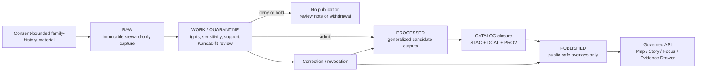

<!-- [KFM_META_BLOCK_V2]
doc_id: kfm://doc/<UUID-NEEDS-VERIFICATION>
title: Genealogy / Family-History Ingestion (Proposed Lane)
type: standard
version: v1
status: draft
owners: <NEEDS-VERIFICATION>
created: YYYY-MM-DD
updated: YYYY-MM-DD
policy_label: <NEEDS-VERIFICATION>
related: [<NEEDS-VERIFICATION: adjacent repo docs or kfm:// ids>]
tags: [kfm, genealogy, family-history, historical-mobility, archives, proposed-lane]
notes: [Target path is inferred from the uploaded draft; mounted repo path, owners, code, schemas, and workflows were not directly verified in the current session.]
[/KFM_META_BLOCK_V2] -->

# Genealogy / Family-History Ingestion (Proposed Lane)

Proposed README for a consent-bound genealogy or family-history lane that stays subordinate to KFM evidence, rights, review, and publication rules.

| Status | Owners | Badges | Quick jump |
| --- | --- | --- | --- |
| Experimental · **PROPOSED extension lane** | `<NEEDS-VERIFICATION>` |     | [Scope](#scope) · [Repo fit](#repo-fit) · [Inputs](#inputs) · [Diagram](#diagram-governed-lifecycle) · [Tables](#tables-governed-objects-and-publication-state) · [Task list](#task-list-definition-of-done) |

> [!WARNING]
> This README is intentionally staged. The attached KFM corpus confirms the governance model, truth path, Evidence Drawer, Kansas-first operating lanes, and contract-first direction. It does **not** directly verify a mounted genealogy module, exact repo path, adapters, workflows, or release receipts in the current session.

---

## Scope

This document does **not** claim that a live genealogy pipeline already exists in the visible repo.

Instead, it describes how a genealogy or family-history lane **should** be framed if KFM later admits it as a governed extension. The closest **CONFIRMED** KFM fits are:

- historical boundaries, census, settlement geography, and migration/mobility
- archives, newspapers, oral histories, public memory, and heritage

That means genealogy should be treated as a **review-heavy extension** under those lane families, not as a separate sovereign truth surface.

### Status snapshot

| Topic | Status | Why it is labeled this way |
| --- | --- | --- |
| KFM truth path, trust membrane, map-first shell, Evidence Drawer | **CONFIRMED** | Strongly repeated in the attached KFM corpus |
| Genealogy as a mounted repo lane | **UNKNOWN** | No directly visible repo tree, code, schemas, workflows, or receipts confirmed it |
| `tools/ingest/genealogy/README.md` as the target path | **INFERRED** | It appears in the uploaded draft, not in directly verified repo evidence |
| Public release posture for family-history material | **PROPOSED** | KFM doctrine supports generalized, policy-safe publication, but no genealogy-specific publication class was directly surfaced |
| Vendor-specific OAuth/export adapters | **NEEDS VERIFICATION** | Named in the uploaded draft, but not directly confirmed in the visible KFM corpus |

### What this README is for

Use this file to decide:

1. whether a family-history source is admissible at all
2. what must remain steward-only
3. what could become a public-safe generalized overlay
4. which proof objects must exist before anything is promoted

[Back to top](#genealogy--family-history-ingestion-proposed-lane)

---

## Repo fit

**Path:** `tools/ingest/genealogy/README.md` **(INFERRED from the uploaded draft; needs repo confirmation)**

### Upstream / downstream fit

| Direction | Family or surface | Status | Role here |
| --- | --- | --- | --- |
| Upstream | `contracts/source/*` | **PROPOSED** | Source descriptors, access posture, rights, cadence, review intent |
| Upstream | `policy/*` | **PROPOSED** | Rights, sensitivity, public-safe publication classes, reviewer obligations |
| Upstream | steward review / correction runbooks | **PROPOSED** | Consent review, revocation, generalization, withdrawal, correction |
| Downstream | `data/work/` and `WORK / QUARANTINE` lifecycle behavior | **CONFIRMED doctrine** | Family-history intake should remain review-bearing before publication |
| Downstream | catalog closure (`STAC` / `DCAT` / `PROV`) | **CONFIRMED doctrine** | Generalized outputs still need outward metadata and lineage |
| Downstream | governed API, Map Explorer, Story, Focus, Evidence Drawer | **CONFIRMED doctrine / UNKNOWN module fit** | Public surfaces may only receive public-safe generalized outputs, never raw person-level records |

### Lane placement

This lane should be treated as a bridge across two confirmed KFM domain families:

- **Historical / migration / mobility:** where place-of-birth, origin-destination, and time-aware population movement already fit KFM’s Kansas-first worldview.
- **Archives / public memory / heritage:** where rights, reuse constraints, context preservation, and culturally sensitive material are already first-class concerns.

That makes this lane structurally plausible, but still later and riskier than the corpus’s preferred hydrology-first thin slice.

---

## Inputs

### Accepted inputs

| Input class | What belongs here | Source role | Status | Notes |
| --- | --- | --- | --- | --- |
| Kansas-relevant family-history interchange export | Candidate examples named in the draft: `GEDCOM-7`, `GEDZIP` | community-contributed / documentary | **NEEDS VERIFICATION** | Treat as stewarded intake only, not as public artifact |
| Kansas-anchored place/time assertions | Normalized records that retain source linkage and evidence state | derived from reviewed source | **PROPOSED** | Preferred bridge into KFM because they can be generalized |
| Archival or family-history evidence objects | scans, transcripts, captions, memoir fragments, oral-history excerpts, descriptive metadata | documentary / archival | **INFERRED fit** | Must remain context-linked; narrative convenience is not enough |
| Contract fixtures | source descriptor, ingest receipt, validation report, dataset version, evidence bundle examples | governance object | **PROPOSED** | Best first move if this lane is admitted |

### Illustrative intake descriptor

```json
{
  "object_type": "SourceDescriptor",
  "lane": "genealogy",
  "status": "PROPOSED",
  "jurisdiction_anchor": "Kansas",
  "source_role": "community-contributed",
  "material_class": "family-history export",
  "rights_posture": "needs_review",
  "public_release_class": "generalized_only"
}
```

> [!IMPORTANT]
> The safest default is: **raw family-history material may enter stewarded intake, but public release is generalized-only unless a stricter, directly verified policy says otherwise.**

---

## Exclusions

This directory should **not** be used for:

- direct public publication of raw GEDCOM-like or person-level genealogical files
- HTML scraping, UI automation, or undocumented vendor access
- exact household, grave, residence, or homestead point exposure on public surfaces
- unsupported claims that a live module, parser, adapter, or workflow already exists
- non-Kansas-relevant bulk tree import with no place/time anchor
- narrative claims that cannot route back to inspectable evidence and review state

---

## Directory tree (proposed starter layout)

The original draft asserted a code-first tree with parsers, OAuth adapters, and receipts. The current session does not directly verify those files. A more truthful **contract-first** starter layout is below.

```text
tools/ingest/genealogy/
├── README.md
├── contracts/
│   ├── source_descriptor.example.json
│   ├── ingest_receipt.example.json
│   ├── validation_report.example.json
│   ├── dataset_version.example.json
│   └── generalized_overlay_item.example.json
├── policy/
│   ├── publication_classes.md
│   ├── obligations.md
│   └── reviewer_checklist.md
├── examples/
│   ├── normalized_place_time_record.json
│   ├── generalized_overlay_fragment.json
│   └── evidence_bundle_fragment.json
└── runbooks/
    ├── consent_review.md
    ├── generalized_vs_precise_review.md
    └── revocation_and_withdrawal.md
```

**Reading rule:** every path above is **PROPOSED** starter structure, not a claim about mounted repo state.

[Back to top](#genealogy--family-history-ingestion-proposed-lane)

---

## Quickstart

### 1. Confirm lane admission before code

Do **not** start with a parser. Start by deciding whether the source belongs in KFM at all.

Questions to answer first:

1. Is the material Kansas-relevant in place and time?
2. Is the rights posture known enough to admit intake?
3. Can the public surface be generalized without exposing person-level truth?
4. Is there a correction and revocation path?

### 2. Declare the source before fetching it

Produce a minimal source descriptor and reviewer note before any sustained ingest work.

### 3. Route intake through steward-only stages first

Family-history source material should be treated as review-bearing from the beginning:

- `RAW` for immutable capture
- `WORK / QUARANTINE` for review, redaction, normalization, and rejection
- `PROCESSED` only for generalized candidate outputs
- `CATALOG` only after metadata and lineage closure
- `PUBLISHED` only for public-safe overlays, never raw person-level records

### 4. Build one thin slice, not a whole subsystem

A realistic first slice would be one Kansas-anchored source family, one source descriptor, one ingest receipt, one validation report, one generalized overlay example, and one correction or revocation drill.

---

## Usage

This README is meant to support three kinds of work.

**Design use:** define what a family-history lane is allowed to mean inside KFM.

**Review use:** determine whether a source can be admitted, generalized, denied, or held in quarantine.

**Implementation use:** provide enough contract language that future code, fixtures, tests, and runbooks can be added without inventing new doctrine.

A good mental model is:

> sensitive family-history material enters as evidence-bearing intake, remains steward-reviewable during transformation, and only emerges publicly as generalized place/time signal with visible provenance, rights posture, and correction behavior.

---

## Diagram (governed lifecycle)



### Public-safe reading rule

What becomes public should be things like:

- decade-bucket migration corridors
- county- or region-level origin/destination summaries
- place dossiers that explain settlement or movement context
- evidence-linked story material with visible dates, caveats, and lineage

What should **not** become public by default:

- raw person records
- household-level maps
- unreviewed family trees
- exact residential or burial coordinates
- “confidence” scores that imply person-level truth without an explicit support model

---

## Tables (governed objects and publication state)

### KFM object families this lane would need

| Object family | Minimum purpose in this lane | Status |
| --- | --- | --- |
| `SourceDescriptor` | declare source role, rights posture, Kansas fit, publication intent | **PROPOSED** |
| `IngestReceipt` | prove that one fetch or handoff occurred | **PROPOSED** |
| `ValidationReport` | record what passed, failed, generalized, denied, or quarantined | **PROPOSED** |
| `DatasetVersion` | carry an authoritative candidate version for generalized outputs | **PROPOSED** |
| `CatalogClosure` | publish outward metadata and lineage for any public-safe artifact | **PROPOSED** |
| `EvidenceBundle` | package support for a claim, story excerpt, or exported overlay preview | **CONFIRMED family / PROPOSED lane fit** |
| `DecisionEnvelope` / `ReviewRecord` | capture policy result, obligations, and steward review | **PROPOSED** |
| `ReleaseManifest` / `CorrectionNotice` | make publication, replacement, withdrawal, and rollback visible | **PROPOSED** |

### Publication state model

| State | What may exist here | Public? | Notes |
| --- | --- | --- | --- |
| `RAW` | immutable source capture, checksums, source note | No | steward-only |
| `WORK / QUARANTINE` | normalization attempts, rights review, redaction tests, rejection notes | No | review-bearing |
| `PROCESSED` | generalized candidate outputs with stable IDs | Not yet | candidate only |
| `CATALOG` | outward `STAC` / `DCAT` / `PROV` closure | Not by itself | required before public-safe delivery |
| `PUBLISHED` | generalized overlays, story excerpts, evidence route, correction linkage | Yes, if policy-safe | never raw family-history truth |

### Source-role mapping

| Source role | Best fit in this lane | Main caution |
| --- | --- | --- |
| documentary / archival | memoirs, archival transcripts, captions, descriptive records | preserve context; do not flatten interpretive material |
| community-contributed | steward-submitted family exports or private research contributions | moderation, consent, and revocation matter |
| modeled / derived | generalized movement summaries or place/time overlays | never let derivative surfaces masquerade as person-level truth |
| mirror / discovery | third-party or discovery copies of another authority | provenance anchor, not sovereign truth |

[Back to top](#genealogy--family-history-ingestion-proposed-lane)

---

## Task list (definition of done)

This lane is not ready for promotion until the following are true:

- [ ] a Kansas-anchored `SourceDescriptor` exists for at least one admitted source family
- [ ] a reviewer can distinguish **generalized public-safe output** from **steward-only precise material**
- [ ] at least one `IngestReceipt` and one `ValidationReport` example exist
- [ ] at least one `DatasetVersion` and one `CatalogClosure` example exist
- [ ] an `EvidenceBundle` example exists for a public-safe claim or place dossier
- [ ] one correction or revocation drill is documented end to end
- [ ] public surfaces show provenance, review state, and correction behavior
- [ ] no raw person-level family-history export appears on a public surface
- [ ] target path, owners, adjacent docs, and any existing code are directly verified in the repo

---

## FAQ

### Is genealogy a confirmed baseline KFM lane?

No. In the currently visible corpus, the nearest confirmed fits are historical/migration and archives/heritage. A dedicated genealogy lane remains **UNKNOWN** as mounted implementation and **PROPOSED** as extension framing.

### Can raw family-history exports be published directly?

This README assumes **no**. Public delivery should be generalized-only unless a stricter, directly verified policy and review flow says otherwise.

### Why not keep the original code-first tree from the uploaded draft?

Because the current session did not directly verify those files, adapters, or workflows. A contract-first tree is more truthful and still useful.

### Where would Focus Mode fit?

Only downstream of governed evidence resolution. Focus may summarize public-safe outputs with citations and evidence drill-through, but it should never become a detached family-history assistant.

---

## Appendix

<details>
<summary><strong>Appendix A — Evidence posture used in this README</strong></summary>

| Area | Status | Reading rule |
| --- | --- | --- |
| KFM governance doctrine | **CONFIRMED** | may anchor the file confidently |
| Genealogy lane existence in mounted repo | **UNKNOWN** | do not write as if implemented |
| Target path from uploaded draft | **INFERRED** | useful as a reviewable placeholder |
| Candidate interchange terms from the draft | **NEEDS VERIFICATION** | keep as draft input candidates, not confirmed KFM support |
| Public-safe generalized overlay pattern | **PROPOSED** | consistent with KFM doctrine, but still needs lane-specific review rules |

</details>

<details>
<summary><strong>Appendix B — Candidate public-safe outputs</strong></summary>

These are examples of outputs that fit KFM better than raw family trees:

- county-to-county migration corridor summaries by decade
- place dossiers that synthesize settlement, origin, and movement context
- region-level “family movement” overlays with explicit time/support semantics
- story excerpts that remain linked to archival or documentary evidence bundles
- steward-reviewed generalized comparisons that preserve correction and withdrawal paths

</details>

<details>
<summary><strong>Appendix C — Open verification backlog</strong></summary>

1. Confirm whether `tools/ingest/genealogy/README.md` is the real target path.
2. Surface any existing repo modules, schemas, tests, or workflows touching genealogy, archives, or family-history intake.
3. Confirm owners, policy label, and adjacent documentation links for the KFM meta block.
4. Confirm whether `GEDCOM-7` / `GEDZIP` are actually desired interchange targets for KFM.
5. Surface one generalized-vs-precise review example.
6. Surface one revocation, withdrawal, or correction drill for rights-sensitive historical material.
7. Confirm whether this lane should be admitted at all before or after hydrology-first proof work.

</details>

[Back to top](#genealogy--family-history-ingestion-proposed-lane)
